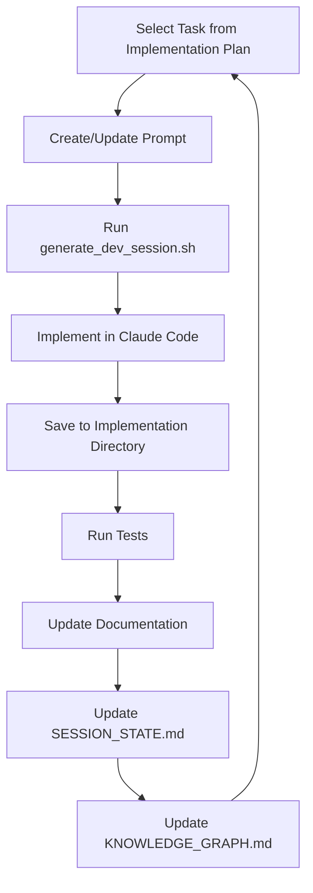

# VANTA-ALPHA Essential Context Files

This guide identifies all critical documentation files needed to maintain full context for the VANTA-ALPHA project. Reference these files in the recommended order when starting a new session.

## VISTA Framework Documentation

| Document | Purpose | When to Access |
|----------|---------|----------------|
| `/CLAUDE.md` | Core VISTA methodology and VANTA project overview | **Always read first** for every session |
| `/INSTRUCTIONS.md` | VISTA workflow and session continuity protocols | For understanding session protocols |
| `/SESSION_STATE.md` | Current project state, decisions, and action items | **Always read** to understand current progress |
| `/KNOWLEDGE_GRAPH.md` | Concepts and relationships | For understanding technical concepts |
| `/METADATA.json` | Document versions, cross-references, and session history | For tracking document relationships |

**How to dive deeper:** If you need more information about the VISTA methodology, consult the reference VISTA documentation at `/Users/vigil-313/workplace/VISTA/`, particularly `README.md` and `VISTA_TEMPLATE.md`. These files contain comprehensive information about the document structure, implementation phases, and workflow patterns.

## LangGraph Research

| Document | Purpose | When to Access |
|----------|---------|----------------|
| `/research/langgraph/integration_notes/LANGGRAPH_VANTA_INTEGRATION.md` | Integration strategy for LangGraph and VANTA | For LangGraph architecture questions |
| `/research/langgraph/examples/vanta_simplified_example.py` | Code example of VANTA implementation with LangGraph | For implementation reference |
| `/research/INTEGRATION_FINDINGS_SUMMARY.md` | Summary of framework evaluation research | For high-level integration strategy |

**How to dive deeper:** For more detailed LangGraph understanding, analyze the graph structure in the example code. The integration notes document should contain links to external LangGraph resources. Pay particular attention to the graph nodes and state management approach as these will be critical for implementation.

## MCP Research

| Document | Purpose | When to Access |
|----------|---------|----------------|
| `/Technical/MCP_REFERENCE.md` | Core MCP concepts and capabilities | For MCP fundamentals |
| `/research/mcp/integration_patterns/MCP_LANGGRAPH_INTEGRATION.md` | How to integrate MCP with LangGraph | For combined architecture questions |
| `/research/mcp/server_designs/VANTA_MCP_SERVERS.md` | Custom MCP server specifications for VANTA | For MCP server implementation details |

**How to dive deeper:** The MCP reference document should contain links to external MCP documentation. The server designs document will include details about each server type, their APIs, and data models. If you need to understand how MCP servers exchange information, focus on the integration patterns document.

## Hybrid Voice Architecture

| Document | Purpose | When to Access |
|----------|---------|----------------|
| `/research/hybrid_voice_architecture/README.md` | Overview of the hybrid voice architecture | For introduction to the architecture |
| `/research/hybrid_voice_architecture/design/HYBRID_COGNITIVE_MODEL.md` | Theoretical basis for the dual-process architecture | For understanding the cognitive model |
| `/research/hybrid_voice_architecture/design/DUAL_PROCESSING_ARCHITECTURE.md` | System design for local+API model integration | For technical architecture details |
| `/research/hybrid_voice_architecture/design/SPEECH_NATURALIZATION.md` | Techniques for natural speech patterns | For speech output system questions |
| `/research/hybrid_voice_architecture/implementation_notes/IMPLEMENTATION_CONSIDERATIONS.md` | Hardware and implementation guidance | For implementation planning |
| `/research/hybrid_voice_architecture/diagrams/HYBRID_ARCHITECTURE_DIAGRAM.md` | Visual architecture diagrams | For visual understanding of system |

**How to dive deeper:** Each document contains detailed sections that can be explored based on the specific area of interest. For voice processing, focus on the speech naturalization document. For understanding state management, examine the dual processing architecture document. The diagrams file contains visualizations that show the relationships between components.

## Implementation Planning

| Document | Purpose | When to Access |
|----------|---------|----------------|
| `/Development/IMPLEMENTATION_PLAN.md` | Detailed implementation phases and tasks | **Essential reference** for implementation planning |
| `/Development/Roadmap/LONG_TERM_ROADMAP.md` | Long-term phased implementation approach | For strategic implementation planning |
| `/Development/Roadmap/PHASED_APPROACH.md` | Detailed breakdown of implementation phases | For understanding phase capabilities and dependencies |
| `/Development/Roadmap/RESOURCE_PLANNING.md` | Hardware, software and personnel resources | For resource allocation planning |
| `/Development/TEST_STRATEGY.md` | Testing approaches and validation criteria | For testing considerations |
| `/Development/PROMPT_SEQUENCES.md` | Templates for implementation tasks | For implementation task structure |

## Technical Architecture Documentation

| Document | Purpose | When to Access |
|----------|---------|----------------|
| `/Development/Architecture/V0_ARCHITECTURE_OVERVIEW.md` | High-level V0 architecture | **Essential reference** for technical design |
| `/Development/Architecture/DATA_MODELS.md` | Core data structures and schemas | For state and data model understanding |
| `/Development/Architecture/INTEGRATION_PATTERNS.md` | Patterns for component integration | For inter-component communication design |
| `/Development/Architecture/ARCHITECTURE_DIAGRAMS.md` | Visual architecture diagrams | For visual understanding of system architecture |
| `/Development/Architecture/COMPONENT_SPECIFICATIONS/VOICE_PIPELINE.md` | Voice Pipeline component spec | For voice processing implementation details |
| `/Development/Architecture/COMPONENT_SPECIFICATIONS/DUAL_TRACK_PROCESSING.md` | Dual-track processing spec | For hybrid model implementation details |

**How to dive deeper:** Start with the overview document, then focus on specific component specifications based on implementation needs. Data models provide cross-cutting context for all components. The integration patterns document explains how components work together within the system.

## Implementation Task Templates

| Document | Purpose | When to Access |
|----------|---------|----------------|
| `/Development/Tasks/TEMPLATES/README.md` | Guide for task template usage | For understanding task template structure |
| `/Development/Tasks/TEMPLATES/TASK_TEMPLATE.md` | Base template for implementation tasks | **Essential reference** when creating new tasks |
| `/Development/Tasks/TEMPLATES/EXAMPLE_VOICE_PIPELINE_TASK.md` | Example STT implementation task | For reference on voice pipeline tasks |
| `/Development/Tasks/TEMPLATES/EXAMPLE_DUAL_TRACK_TASK.md` | Example Processing Router task | For reference on dual-track processing tasks |

**How to dive deeper:** The README file explains the structure and usage of task templates. The base template provides a comprehensive structure for all implementation tasks. The example tasks demonstrate how to apply the template to specific components and scenarios.

## Implementation Prompts

| Document | Purpose | When to Access |
|----------|---------|----------------|
| `/Development/Prompts/README.md` | Guide for prompt organization and usage | **Essential reference** before creating new prompts |

**Prompt Directory Structure:**
```
/Development/Prompts/
├── Phase0_Setup/              # Environment and setup tasks
├── Phase1_Core/               # Core component implementation
│   ├── VoicePipeline/         # Audio processing, STT, TTS
│   ├── LocalModel/            # Local LLM integration
│   ├── APIModel/              # API model integration
│   └── Memory/                # Memory and storage systems
├── Phase2_Workflow/           # Workflow and orchestration
│   ├── LangGraph/             # LangGraph implementation
│   ├── DualTrack/             # Dual-track processing
│   └── StateManagement/       # Configuration and state
├── Phase3_Integration/        # System integration
│   ├── Integration/           # Component integration
│   ├── Testing/               # Testing implementation
│   └── Optimization/          # Performance optimization
└── Phase4_Release/            # Release preparation
```

**How to dive deeper:** The README in the Prompts directory explains the naming convention and content requirements for implementation prompts. Each phase directory will contain prompts for specific implementation tasks as detailed in the Implementation Plan.

## Visual Implementation Planning

The KNOWLEDGE_GRAPH.md file now contains comprehensive diagrams for implementation planning, including:

1. **Implementation Planning Framework** - Visual overview of the phased approach, task organization, integration patterns, and resource planning
2. **Task Organization Breakdown** - Hierarchical structure of tasks organized by functional area

These visual representations provide a clear understanding of the implementation structure and relationships between different components of the system.

## Pending Development Tasks

For the next session (SES-V0-007), the following high-priority tasks are planned:

1. **Complete VISTA implementation task templates** - Finalize any remaining template structures and create example tasks for all major components
2. **Create task template examples for key implementation tasks** - Develop specific examples for priority Foundation phase tasks
3. **Begin environment configuration for development setup** - Set up Docker environment and development tooling
4. **Prepare for implementation of foundation phase tasks** - Ready the development environment for actual implementation

## Development Workflow

The implementation process follows this workflow:

1. **Task Selection**: Choose next task from IMPLEMENTATION_PLAN.md based on dependencies
2. **Prompt Creation**: Create or update prompt in appropriate subdirectory of Development/Prompts/
3. **Implementation Session**: Use generate_dev_session.sh to create Claude Code session
4. **Code Creation**: Implement in Development/Implementation/ following the project structure
5. **Post-Implementation**: Update documentation with update_documentation.sh



## Session Management

For effective session management:

1. **Begin each session by reviewing:**
   - Current session state in SESSION_STATE.md, focusing on the Handoff section
   - Recent decisions and questions that need addressing
   - The progress snapshot to understand overall project status
   - This CONTEXT_FILES.md document for orientation

2. **When creating new documentation:**
   - Follow VISTA document formatting with unique identifiers (DOC-XX-YY, CON-XX-YY, DEC-XX-YY)
   - Use appropriate audience-level directories (Executive/, Management/, Technical/, Development/)
   - Maintain visual progress indicators with emoji status markers (🟢 Complete, 🟡 In Progress, 🔴 Not Started, ⚪ Not Applicable)
   - Use Mermaid for diagrams where appropriate

3. **When ending a session:**
   - Update SESSION_STATE.md with new decisions, questions, and action items
   - Update KNOWLEDGE_GRAPH.md with new concepts and relationships
   - Update METADATA.json with document versions and cross-references
   - Ensure all new documents are properly referenced in their parent directories

## Implementation Artifacts Location Guide

To assist with locating the appropriate places for different implementation artifacts:

1. **Technical Architecture Docs**: `/Development/Architecture/`
   - Component specs: `/Development/Architecture/COMPONENT_SPECIFICATIONS/`
   - Data models: `/Development/Architecture/DATA_MODELS.md`
   - Visual diagrams: `/Development/Architecture/ARCHITECTURE_DIAGRAMS.md`

2. **Implementation Planning Docs**: `/Development/Roadmap/`
   - Long-term planning: `/Development/Roadmap/LONG_TERM_ROADMAP.md`
   - Phased approach: `/Development/Roadmap/PHASED_APPROACH.md`
   - Resource planning: `/Development/Roadmap/RESOURCE_PLANNING.md`

3. **Implementation Tasks**: `/Development/Tasks/`
   - Task templates: `/Development/Tasks/TEMPLATES/`
   - Task registry: `/Development/Tasks/TASK_REGISTRY.md` (to be created)
   - Module-specific tasks: `/Development/Tasks/MODULE_TASKS/` (to be populated)

4. **Implementation Prompts**: `/Development/Prompts/`
   - Phase-specific directories: `/Development/Prompts/Phase{N}_{PhaseName}/`
   - Component-specific directories: `/Development/Prompts/Phase1_Core/{ComponentName}/`
   - Prompt files: `{COMPONENT_ID}_{TASK_NAME}.md`

5. **Code Implementation**: `/Development/Implementation/v0/`
   - Voice pipeline: `/Development/Implementation/v0/voice_pipeline/` (to be created)
   - Memory engine: `/Development/Implementation/v0/memory_engine/` (to be created)
   - Core components: `/Development/Implementation/v0/core/` (to be created)
   - Environment setup: `/Development/Implementation/v0/environment/` (to be created)

## Task Definition Guidelines

When defining implementation tasks:

1. **Task IDs**: Follow the ID assignment convention defined in `/Development/Tasks/TEMPLATES/README.md`
   - Voice Pipeline: TSK-V0-001 to TSK-V0-099
   - Memory Engine: TSK-V0-100 to TSK-V0-199
   - Dual-Track Processing: TSK-V0-200 to TSK-V0-299
   - Integration: TSK-V0-300 to TSK-V0-399
   - Core Architecture: TSK-V0-400 to TSK-V0-499
   - Testing: TSK-V0-500 to TSK-V0-599

2. **Task Structure**: Each task should include these essential sections:
   - Task Identification (ID, component, phase, priority)
   - Task Description (objective, success criteria)
   - Implementation Context (dependencies, requirements)
   - Implementation Details (interfaces, algorithm, error handling)
   - Validation Criteria (testable success criteria)
   - Testing Approach (unit, integration, performance tests)

3. **Task Dependencies**: Clearly identify dependencies between tasks to enable proper scheduling and parallel work where possible

## Continuous Updates

To ensure this context guide remains current:

1. After creating significant new documentation, add the file paths to this guide under the appropriate section
2. When discovering new resources that provide valuable context, document them here
3. At the end of each major project phase, review and update this guide with relevant new information
4. Whenever new implementation details are finalized, add them to the Implementation Planning section

## Version History

- v0.4.0 - 2025-05-18 - Updated with reorganized implementation prompt directory structure
- v0.3.0 - 2025-05-18 - Updated with implementation task templates and visual diagrams from SES-V0-006
- v0.2.0 - 2025-05-17 - Updated with implementation planning and architecture documents from SES-V0-005
- v0.1.0 - 2025-05-17 - Initial creation based on project structure and VISTA framework