# Architecture Diagrams [DOC-DEV-ARCH-4]

## Overview

This document contains visual representations of the VANTA system architecture. These diagrams illustrate different aspects of the system from various perspectives to aid in understanding the overall design.

## System Overview

The following diagram shows the high-level components of the VANTA system and their relationships:

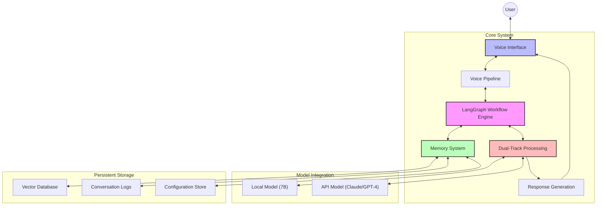

## Voice Pipeline Architecture

The voice processing pipeline includes components for audio input/output and speech processing:

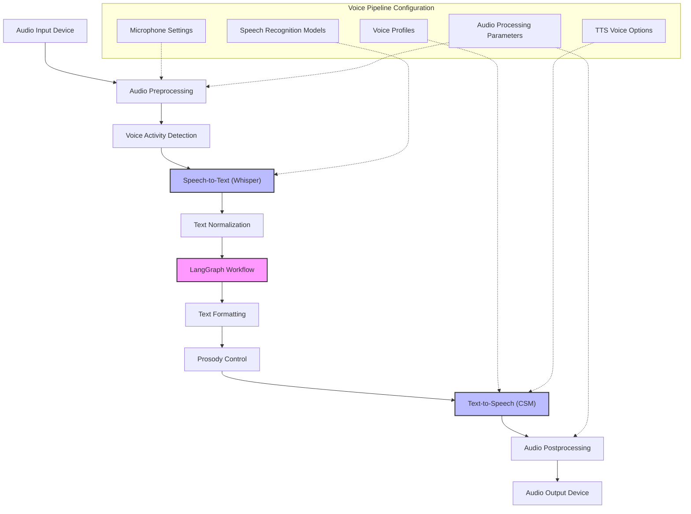

## LangGraph Workflow Architecture

The core processing workflow implemented using LangGraph:

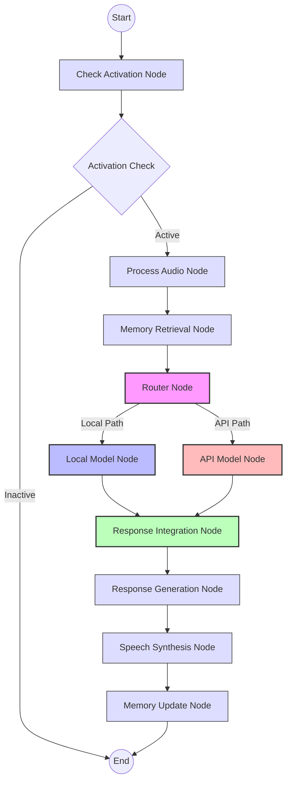

## Dual-Track Processing Architecture

The dual-track processing system that combines local and API models:

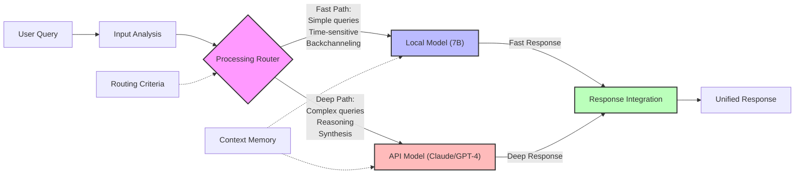

## Memory System Architecture

The layered memory architecture for short and long-term storage:

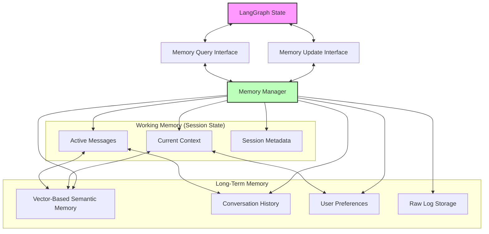

## State Flow Diagram

The flow of state through the LangGraph components:

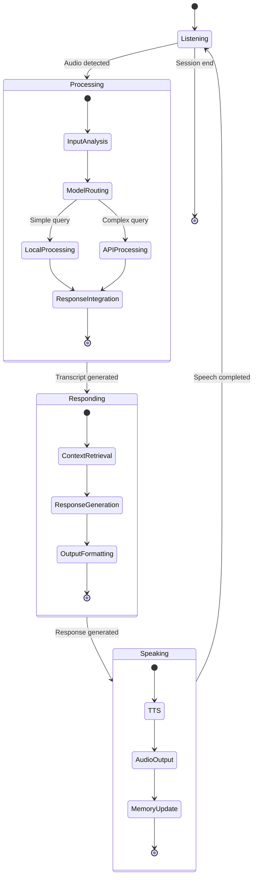

## Component Dependency Diagram

The dependencies between major system components:

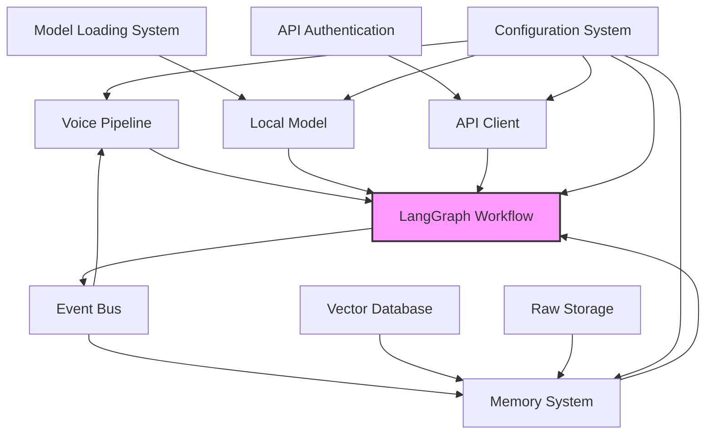

## Deployment Diagram

The deployment architecture for the VANTA system:

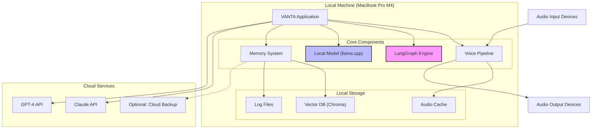

## Data Flow Diagram

The flow of data through the system:

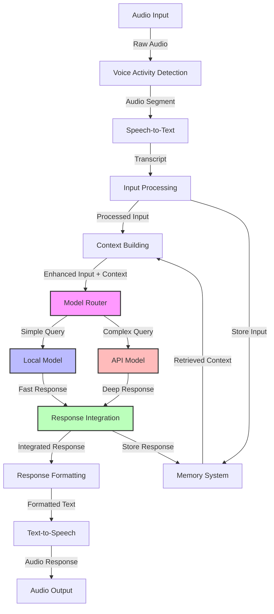

## Class Diagram (Core Components)

The relationships between core classes in the system:

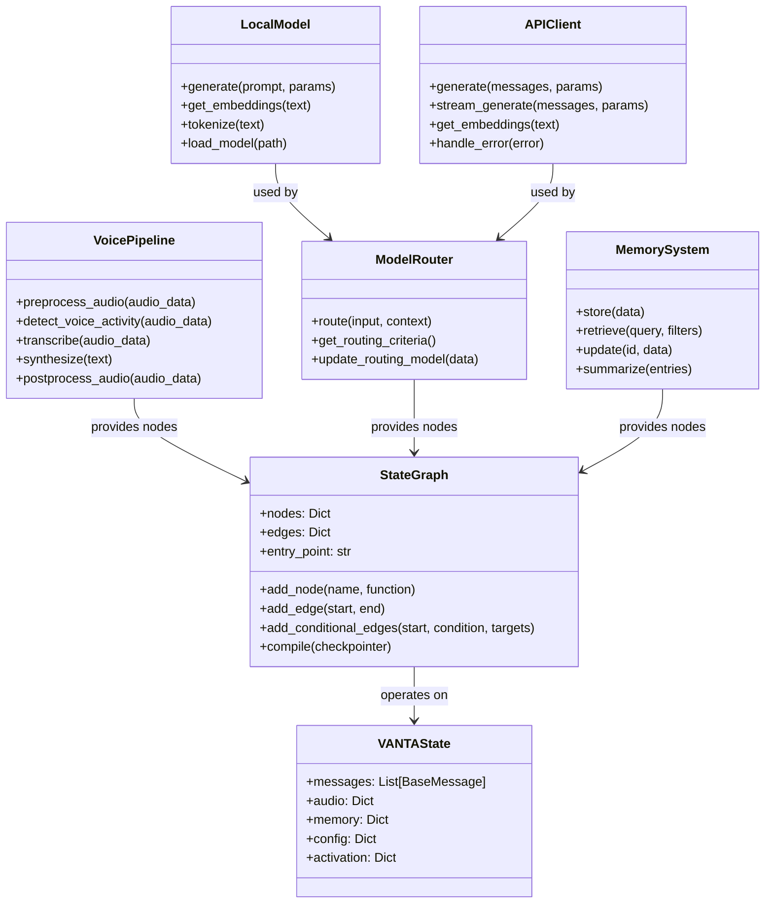

## Sequence Diagram (Processing Flow)

The sequence of operations for processing a user query:

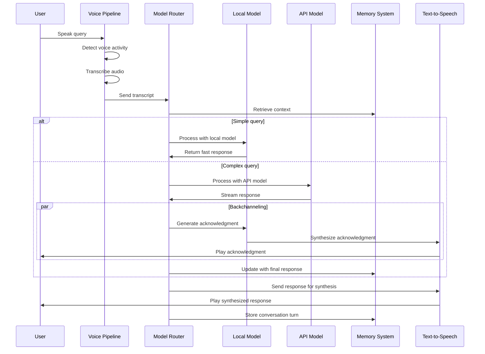

## State Transition Diagram

The transitions between system states:

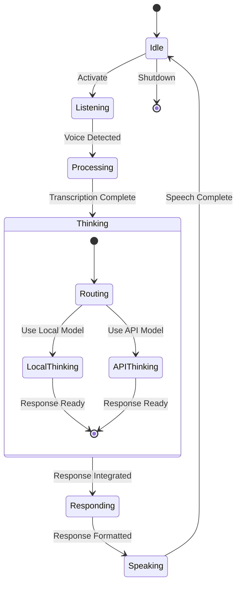

## Resource Utilization Diagram

The allocation of system resources:

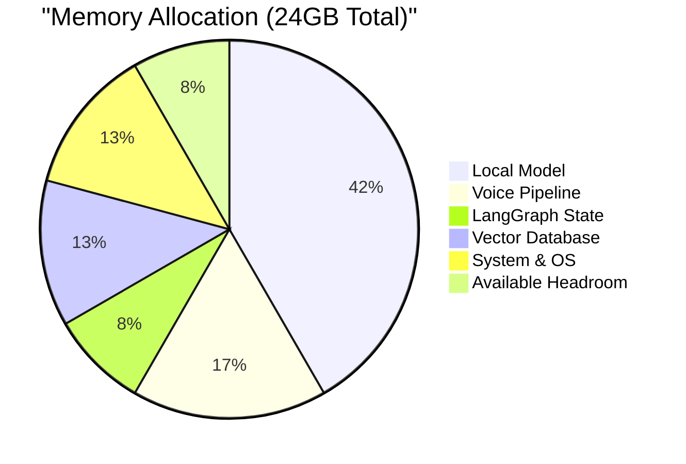

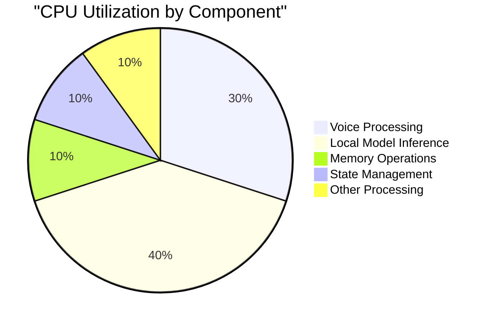

## Error Handling Flow

The flow of error handling in the system:

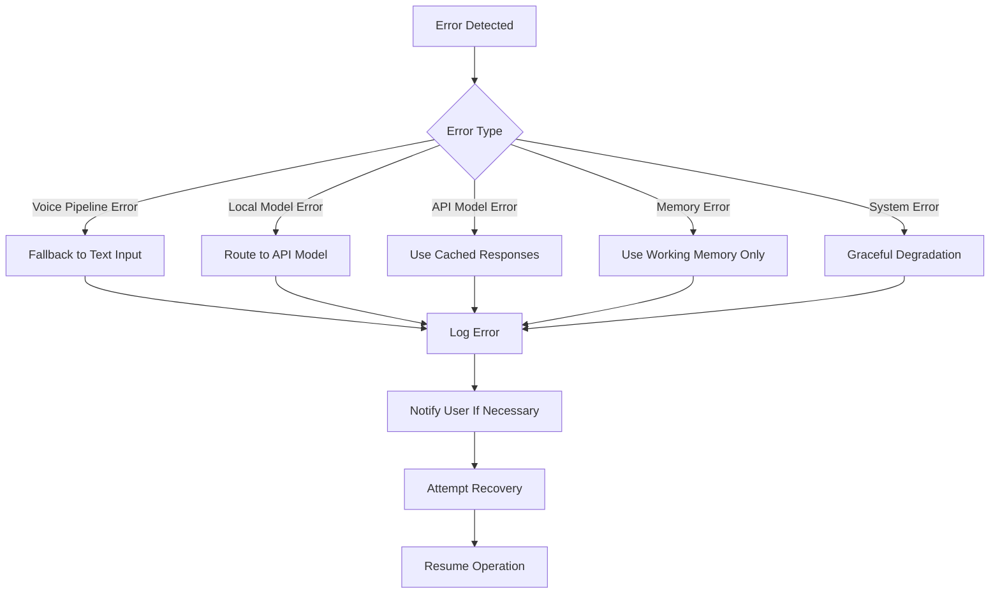

## Version Evolution Diagram

The planned evolution of the system through versions:

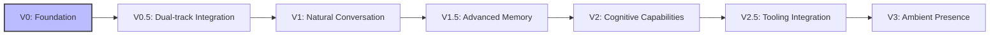

## Version History

- v0.1.0 - 2025-05-17 - Initial creation [SES-V0-005]