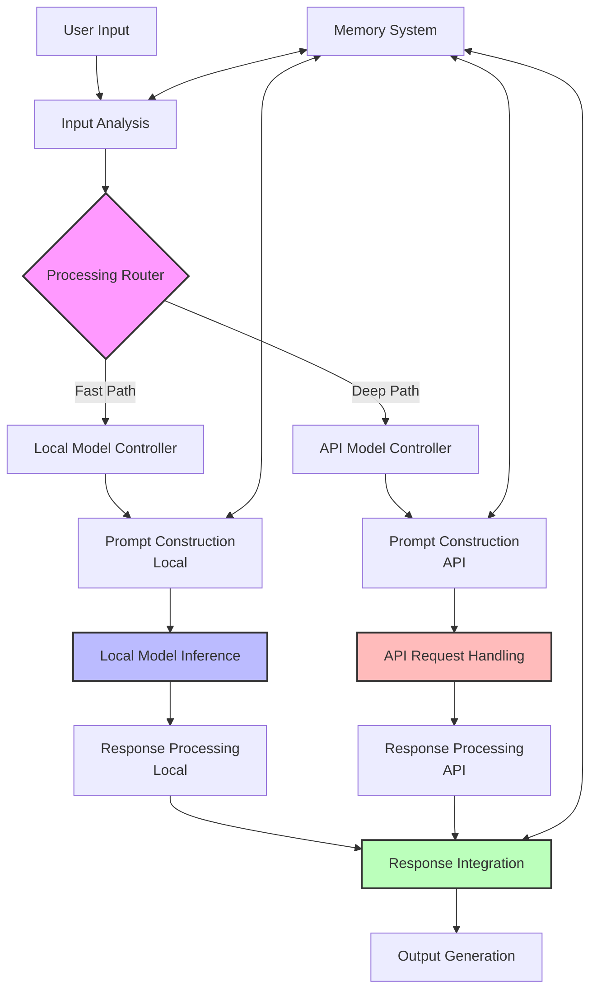

# Dual-Track Processing Component Specification [DOC-DEV-ARCH-COMP-2]

## Overview

The Dual-Track Processing component is central to VANTA's hybrid voice architecture. It implements the simultaneous use of local and cloud-based language models to achieve both fast responses and deep reasoning capabilities. This component is responsible for routing queries to appropriate models, coordinating their execution, and integrating their responses into a coherent conversation.

## Component Responsibilities

1. **Query Analysis and Routing**
   - Analyze user inputs to determine complexity and appropriate processing path
   - Route simple queries to local models for fast response
   - Route complex queries to API models for deeper processing
   - Handle mixed queries with parallel processing

2. **Local Model Management**
   - Load and manage local language models optimized for M4 hardware
   - Handle prompt construction for local inference
   - Manage context limitations and constraints
   - Optimize for low-latency responses

3. **API Model Integration**
   - Manage API requests to cloud language models
   - Handle streaming responses and partial updates
   - Implement error handling and fallback strategies
   - Optimize prompt construction for API models

4. **Response Integration**
   - Combine outputs from both processing tracks
   - Handle timing and interruption patterns
   - Ensure conversational coherence
   - Implement natural language transitions between responses

5. **Resource Optimization**
   - Balance processing load between local and cloud resources
   - Implement adaptive strategies based on performance metrics
   - Monitor and respond to resource constraints
   - Optimize for battery life and thermal management

## Architecture



## Subcomponent Specifications

### Processing Router

- **Implementation**: ML-enhanced decision tree for query classification
- **Input**: Processed user query and context
- **Output**: Routing decision with path selection and confidence
- **Decision Factors**:
  - Query complexity (estimated tokens, entities, reasoning steps)
  - Time sensitivity (user expectations for response speed)
  - Context requirements (amount of context needed)
  - Privacy considerations (sensitive information handling)
- **Routing Options**:
  - Fast path only: Simple queries handled entirely by local model
  - Deep path only: Complex queries handled entirely by API model
  - Parallel processing: Both models process with integration
  - Staged processing: Local model first, API model if needed

### Local Model Controller

- **Implementation**: Interface to llama.cpp or equivalent
- **Models**: 
  - Primary: Llama-3 or Mistral 7B (4-bit quantized)
  - Specialized: Small task-specific models for common functions
- **Input**: User query and relevant context
- **Output**: Generated text response
- **Performance Targets**:
  - Latency: <1.5s for typical queries
  - Memory usage: <10GB RAM
  - Response quality: Acceptable for common interactions

### API Model Controller

- **Implementation**: API clients for Claude and/or GPT-4
- **Models**:
  - Primary: Claude-3 Sonnet or Opus
  - Alternate: GPT-4 or equivalent
- **Input**: User query with enhanced context
- **Output**: High-quality response text (potentially streaming)
- **Features**:
  - Streaming response handling
  - Fallback between providers
  - Cost monitoring and optimization
  - Response caching where appropriate

### Response Integration

- **Implementation**: Custom module for response coordination
- **Input**: Responses from both processing tracks
- **Output**: Unified, coherent response
- **Integration Strategies**:
  - Immediate local response while waiting for API
  - Local backchanneling during API processing
  - API response can interrupt local response
  - Smooth transitions between response segments
  - Contradiction resolution between different sources

## Integration with LangGraph

The Dual-Track Processing integrates with LangGraph through defined nodes:

```python
def router_node(state: VANTAState) -> Dict:
    """Analyze input and determine processing path."""
    # Skip if not processing or no messages
    if state["activation"]["status"] != ActivationStatus.PROCESSING:
        return {}
    
    if not state["messages"] or not isinstance(state["messages"][-1], HumanMessage):
        return {}
    
    # Get user query and context
    query = state["messages"][-1].content
    context = state["memory"].get("retrieved_context", {})
    
    # Determine processing path
    routing = router.determine_path(query, context)
    
    return {
        "memory": {
            "processing": {
                "path": routing["path"],
                "confidence": routing["confidence"],
                "reasoning": routing["reasoning"]
            }
        }
    }

def local_model_node(state: VANTAState) -> Dict:
    """Process with local model if appropriate."""
    # Skip if not processing or not using local path
    processing = state["memory"].get("processing", {})
    if not processing or processing.get("path") not in ["local", "parallel"]:
        return {}
    
    # Get user query and context
    query = state["messages"][-1].content
    context = state["memory"].get("retrieved_context", {})
    
    # Process with local model
    response = local_model.generate(query, context)
    
    # Save in processing metadata, but don't update messages yet
    return {
        "memory": {
            "processing": {
                "local_response": response,
                "local_completed": True,
                "local_time": response["generation_time"]
            }
        }
    }

def api_model_node(state: VANTAState) -> Dict:
    """Process with API model if appropriate."""
    # Skip if not processing or not using API path
    processing = state["memory"].get("processing", {})
    if not processing or processing.get("path") not in ["api", "parallel"]:
        return {}
    
    # Get conversation history and context
    messages = state["messages"]
    context = state["memory"].get("retrieved_context", {})
    
    # Process with API model
    response = api_client.generate(messages, context)
    
    # Save in processing metadata, but don't update messages yet
    return {
        "memory": {
            "processing": {
                "api_response": response,
                "api_completed": True,
                "api_time": response["usage"]["completion_time"]
            }
        }
    }

def integration_node(state: VANTAState) -> Dict:
    """Integrate responses from both tracks."""
    # Get processing results
    processing = state["memory"].get("processing", {})
    
    # Check if processing is complete
    local_done = processing.get("local_completed", False)
    api_done = processing.get("api_completed", False)
    
    # Handle based on routing path
    path = processing.get("path")
    
    if path == "local" and local_done:
        final_response = processing["local_response"]["text"]
    elif path == "api" and api_done:
        final_response = processing["api_response"]["content"]
    elif path == "parallel" and (local_done or api_done):
        # Use available response or combine them
        if local_done and api_done:
            final_response = integrator.combine_responses(
                processing["local_response"]["text"],
                processing["api_response"]["content"]
            )
        elif local_done:
            final_response = processing["local_response"]["text"]
        else:
            final_response = processing["api_response"]["content"]
    else:
        # Not enough data to generate a response yet
        return {}
    
    # Update with final response
    return {
        "messages": [AIMessage(content=final_response)],
        "activation": {"status": ActivationStatus.SPEAKING}
    }
```

## Routing Logic

The routing logic uses several factors to determine the appropriate processing path:

```python
def determine_path(query, context):
    """Determine which processing path to use for a query."""
    # Calculate complexity features
    features = {
        "token_count": estimate_tokens(query),
        "entity_count": count_entities(query),
        "reasoning_steps": estimate_reasoning_steps(query),
        "context_dependency": estimate_context_dependency(query, context),
        "time_sensitivity": estimate_time_sensitivity(query),
        "factual_retrieval": is_factual_retrieval(query),
        "creativity_required": requires_creativity(query),
        "social_chat": is_social_chat(query)
    }
    
    # Apply decision rules
    if features["token_count"] < 20 and features["social_chat"]:
        # Short social interactions go to local model
        return {
            "path": "local",
            "confidence": 0.9,
            "reasoning": "Short social interaction"
        }
    
    if features["factual_retrieval"] and features["token_count"] < 30:
        # Simple fact retrieval goes to local model
        return {
            "path": "local",
            "confidence": 0.8,
            "reasoning": "Simple fact retrieval"
        }
    
    if features["reasoning_steps"] > 2 or features["creativity_required"]:
        # Complex reasoning or creative tasks go to API
        return {
            "path": "api",
            "confidence": 0.85,
            "reasoning": "Complex reasoning or creativity required"
        }
    
    if features["context_dependency"] > 0.7:
        # Highly context-dependent queries go to API
        return {
            "path": "api",
            "confidence": 0.75,
            "reasoning": "Highly context-dependent"
        }
    
    # Use parallel processing for moderate complexity with fast initial response
    return {
        "path": "parallel",
        "confidence": 0.7,
        "reasoning": "Moderate complexity, fast initial response needed"
    }
```

## Local Model Implementation

The local model component uses optimized inference for fast responses:

```python
class LocalModel:
    """Interface to local language model."""
    
    def __init__(self, model_path, config):
        self.config = config
        self.model = load_model(model_path, config)
        
    def generate(self, query, context=None):
        """Generate a response to the given query."""
        start_time = time.time()
        
        # Construct prompt with context
        prompt = self._build_prompt(query, context)
        
        # Set generation parameters
        params = {
            "max_tokens": self.config.get("max_tokens", 512),
            "temperature": self.config.get("temperature", 0.7),
            "top_p": self.config.get("top_p", 0.9),
            "top_k": self.config.get("top_k", 40),
            "repeat_penalty": self.config.get("repeat_penalty", 1.1)
        }
        
        # Generate response
        result = self.model.generate(prompt, **params)
        
        end_time = time.time()
        generation_time = end_time - start_time
        
        return {
            "text": result.text,
            "tokens_used": result.tokens,
            "generation_time": generation_time,
            "finish_reason": result.finish_reason
        }
    
    def _build_prompt(self, query, context=None):
        """Build a prompt with query and optional context."""
        if not context:
            return f"USER: {query}\nASSISTANT: "
        
        # Include relevant context
        context_str = "\n".join([f"- {k}: {v}" for k, v in context.items()])
        return f"Context information:\n{context_str}\n\nUSER: {query}\nASSISTANT: "
```

## API Model Implementation

The API model component handles cloud model interaction:

```python
class APIClient:
    """Client for API-based language models."""
    
    def __init__(self, config):
        self.config = config
        self.provider = config.get("provider", "anthropic")
        self.api_key = config.get("api_key")
        
        if self.provider == "anthropic":
            self.client = AnthropicClient(self.api_key)
        elif self.provider == "openai":
            self.client = OpenAIClient(self.api_key)
        else:
            raise ValueError(f"Unsupported provider: {self.provider}")
    
    def generate(self, messages, context=None):
        """Generate a response using the API model."""
        # Prepare messages with context
        prepared_messages = self._prepare_messages(messages, context)
        
        # Set generation parameters
        params = {
            "model": self.config.get("model", "claude-3-sonnet-20240229"),
            "max_tokens": self.config.get("max_tokens", 1024),
            "temperature": self.config.get("temperature", 0.7),
            "stream": self.config.get("stream", False)
        }
        
        # Send request to API
        try:
            if params["stream"]:
                return self._stream_generate(prepared_messages, params)
            else:
                start_time = time.time()
                response = self.client.generate(prepared_messages, **params)
                end_time = time.time()
                
                # Add completion time to usage stats
                if "usage" in response:
                    response["usage"]["completion_time"] = end_time - start_time
                else:
                    response["usage"] = {"completion_time": end_time - start_time}
                
                return response
        except Exception as e:
            return {
                "error": str(e),
                "content": "I apologize, but I encountered an issue while processing your request.",
                "usage": {"completion_time": 0, "total_tokens": 0}
            }
    
    def _prepare_messages(self, messages, context=None):
        """Prepare messages with context for API request."""
        prepared = []
        
        # Add system message with context if available
        if context:
            context_str = "\n".join([f"- {k}: {v}" for k, v in context.items()])
            system_message = f"Context information:\n{context_str}\n\nRespond to the user's queries based on this context."
            prepared.append({"role": "system", "content": system_message})
        
        # Add conversation messages
        for msg in messages:
            if isinstance(msg, HumanMessage):
                prepared.append({"role": "user", "content": msg.content})
            elif isinstance(msg, AIMessage):
                prepared.append({"role": "assistant", "content": msg.content})
            elif isinstance(msg, SystemMessage):
                prepared.append({"role": "system", "content": msg.content})
        
        return prepared
    
    def _stream_generate(self, messages, params):
        """Generate a streaming response."""
        # Implementation depends on API client capabilities
        pass
```

## Response Integration

The response integration component manages the combination of responses:

```python
class ResponseIntegrator:
    """Integrates responses from multiple sources."""
    
    def __init__(self, config):
        self.config = config
    
    def combine_responses(self, local_response, api_response):
        """Combine local and API responses into a coherent response."""
        # Simple strategy: prefer API response if available
        if not api_response:
            return local_response
        
        if not local_response:
            return api_response
        
        # Check if responses are similar
        similarity = self._calculate_similarity(local_response, api_response)
        
        if similarity > 0.8:
            # Responses are similar, use the more comprehensive one
            if len(api_response) > len(local_response) * 1.2:
                return api_response
            return local_response
        
        # Responses differ, implement a transition
        transition = self._generate_transition(local_response, api_response)
        
        if self.config.get("interrupt_style", "smooth") == "abrupt":
            # Use abrupt interruption
            return f"{local_response[:50]}... Actually, {api_response}"
        else:
            # Use smoother transition
            return f"{local_response} {transition} {api_response}"
    
    def _calculate_similarity(self, text1, text2):
        """Calculate semantic similarity between texts."""
        # Implementation would use embeddings or simpler techniques
        pass
    
    def _generate_transition(self, local_response, api_response):
        """Generate a natural transition between responses."""
        transitions = [
            "On second thought,",
            "Actually, I have more information:",
            "Let me elaborate further.",
            "To give you a more complete answer,",
            "I'd like to refine my response:"
        ]
        return random.choice(transitions)
```

## Interface Contracts

### Inputs to Dual-Track Processing

1. **User Query**
   - Text transcription from Voice Pipeline
   - Query context (conversation history, retrieved information)
   - Current session state

2. **Configuration**
   - Model selection parameters
   - Routing preferences
   - Performance vs. quality settings
   - Resource allocation guidelines

3. **Memory Context**
   - Relevant conversation history
   - Retrieved information from long-term memory
   - User preferences and personalization data

### Outputs from Dual-Track Processing

1. **Response Text**
   - Generated response ready for synthesis
   - Source information (which model(s) generated it)
   - Confidence metrics

2. **Processing Metadata**
   - Path used for processing
   - Processing time metrics
   - Token usage statistics
   - Error information if applicable

## Error Handling

The Dual-Track Processing implements comprehensive error handling:

1. **Local Model Errors**
   - Model loading failure → Fall back to smaller model or API
   - Context overflow → Truncate context or route to API
   - Generation timeout → Interrupt and route to API
   - Resource constraints → Reduce batch size or simplify parameters

2. **API Model Errors**
   - Connection failure → Retry with exponential backoff
   - API timeout → Fall back to local model
   - Rate limiting → Queue requests or switch providers
   - Invalid response → Filter or regenerate

3. **Integration Errors**
   - Conflicting responses → Apply resolution strategy
   - Incomplete generation → Use partial response with disclaimer
   - Failed integration → Fall back to most reliable source

## Performance Considerations

1. **Latency Optimization**
   - Preload local models during initialization
   - Use streaming API responses
   - Implement adaptive time budgets
   - Process in parallel when possible

2. **Memory Management**
   - Monitor memory usage of local models
   - Implement model swapping for different queries
   - Use progressive loading for model components
   - Unload unused models under memory pressure

3. **Battery and Thermal Management**
   - Track power consumption patterns
   - Adjust model complexity based on battery state
   - Implement cooldown periods during heavy usage
   - Use power-efficient models when on battery

## Configuration Options

The Dual-Track Processing is highly configurable:

```yaml
dual_track:
  # Routing configuration
  router:
    default_path: "parallel"  # "local", "api", or "parallel"
    threshold_simple: 20      # Token threshold for simple queries
    threshold_complex: 50     # Token threshold for complex queries
    time_sensitivity: 0.7     # Priority for fast responses (0-1)
    quality_priority: 0.6     # Priority for response quality (0-1)
  
  # Local model configuration
  local_model:
    model_path: "models/llama2-7b-chat-q4_k_m.gguf"
    max_tokens: 512
    temperature: 0.7
    top_p: 0.9
    top_k: 40
    repeat_penalty: 1.1
    context_window: 2048
    preload: true
  
  # API model configuration
  api_model:
    provider: "anthropic"  # or "openai"
    model: "claude-3-sonnet-20240229"  # or "gpt-4"
    max_tokens: 1024
    temperature: 0.7
    stream: true
    timeout: 30  # seconds
    retry_attempts: 3
  
  # Integration configuration
  integration:
    strategy: "preference"  # "preference", "combine", or "interrupt"
    interrupt_style: "smooth"  # "smooth" or "abrupt"
    similarity_threshold: 0.8
    api_preference_weight: 0.7
```

## Testing Strategy

1. **Unit Testing**
   - Test routing logic with various query types
   - Verify local model functionality in isolation
   - Test API client with mock responses
   - Validate integration strategies with sample responses

2. **Integration Testing**
   - Test end-to-end flow with real models
   - Verify correct state transitions in LangGraph
   - Test error handling and recovery
   - Measure response coherence for integrated outputs

3. **Performance Testing**
   - Benchmark latency for different query types
   - Measure memory usage during operation
   - Test under resource constraints
   - Evaluate battery impact

4. **Quality Testing**
   - Evaluate response quality for different routing paths
   - Compare integrated responses to single-source responses
   - Assess naturalness of transitions
   - Test with diverse query scenarios

## Implementation Plan

Phase 1: Basic Functionality
- Implement simple rule-based router
- Integrate local model with llama.cpp
- Set up API client for Claude/GPT
- Create basic response integration

Phase 2: Enhanced Functionality
- Implement ML-based router for better decisions
- Add streaming API response handling
- Implement sophisticated integration strategies
- Add caching and optimization

Phase 3: Advanced Features
- Implement parallel processing for both tracks
- Add adaptive resource management
- Develop contextual format adapters
- Create personalized routing preferences

## Version History

- v0.1.0 - 2025-05-17 - Initial specification [SES-V0-005]