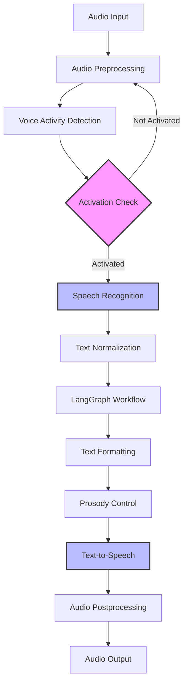

# Voice Pipeline Component Specification [DOC-DEV-ARCH-COMP-1]

## Overview

The Voice Pipeline is responsible for audio input/output processing, speech recognition, and speech synthesis in the VANTA system. It handles the conversion between audio and text in both directions, forming the interface between the user and the core processing system.

## Component Responsibilities

1. **Audio Preprocessing**
   - Capture and buffer audio input from the microphone
   - Perform noise reduction and audio normalization
   - Segment continuous audio into processable chunks
   - Filter out non-speech audio when possible

2. **Voice Activity Detection (VAD)**
   - Detect when a user is speaking
   - Determine the beginning and end of utterances
   - Filter out background noise and non-speech sounds
   - Support different activation modes (wake word, continuous, scheduled)

3. **Speech-to-Text (STT)**
   - Convert speech audio to text transcriptions
   - Provide confidence scores for transcriptions
   - Handle various accents and speaking styles
   - Support real-time transcription for responsive interaction

4. **Text-to-Speech (TTS)**
   - Convert text responses to natural-sounding speech
   - Apply appropriate prosody and emphasis
   - Support different voices and speaking styles
   - Generate audio in a streaming fashion for responsiveness

5. **Audio Output Management**
   - Manage the audio output queue
   - Handle interruptions and priority speech
   - Control volume and playback characteristics
   - Ensure smooth audio playback without gaps or glitches

## Architecture



## Subcomponent Specifications

### Audio Preprocessing

- **Implementation**: Custom Python module using PyAudio or similar library
- **Input**: Raw audio stream from microphone
- **Output**: Normalized audio chunks ready for processing
- **Parameters**:
  - Sample rate: 16000 Hz (configurable)
  - Bit depth: 16-bit
  - Channels: Mono (1 channel)
  - Chunk size: 4096 samples (configurable)
  - Normalization target: -3dB

### Voice Activity Detection

- **Implementation**: Fast local ML model optimized for M4 hardware
- **Input**: Preprocessed audio chunks
- **Output**: 
  - Boolean activation decision
  - Confidence score (0-1)
  - Activation type (wake word, continuous speech, scheduled)
- **Wake Word Options**: "Hey Vanta" (default), configurable
- **Latency Target**: <100ms from speech to detection

### Speech-to-Text (Whisper Integration)

- **Implementation**: Whisper.cpp optimized for M4 architecture
- **Models**:
  - Primary: Whisper small (low resource usage)
  - Optional: Whisper medium (higher accuracy)
- **Input**: Activated audio segments
- **Output**:
  - Transcribed text
  - Confidence scores
  - Word timestamps (if available)
- **Performance Targets**:
  - Latency: <500ms for typical utterance
  - Accuracy: >90% Word Error Rate (WER) in quiet environments
  - Memory usage: <2GB RAM

### Text-to-Speech (CSM Integration)

- **Implementation**: CSM (or Apple TTS as fallback)
- **Input**: Formatted text with optional SSML markup
- **Output**: Synthesized speech audio
- **Voice Profiles**:
  - Default: Warm, gender-neutral voice
  - Alternative voices configurable
- **Performance Targets**:
  - Latency: <200ms to begin speaking
  - Quality: Human-like prosody and clarity
  - Memory usage: <2GB RAM

### Audio Output Management

- **Implementation**: Custom Python module using PyAudio or similar
- **Input**: Synthesized audio from TTS
- **Output**: Audio playback to speakers
- **Features**:
  - Priority queue for urgent messages
  - Ability to interrupt current playback
  - Smooth transitions between audio segments
  - Volume normalization

## Integration with LangGraph

The Voice Pipeline integrates with LangGraph through defined nodes:

```python
def process_audio_node(state: VANTAState) -> Dict:
    """Process audio input and generate transcription."""
    audio_data = state["audio"].get("current_audio")
    
    # Skip if no audio or already processed
    if not audio_data or "last_transcription" in state["audio"]:
        return {}
    
    # Voice activity detection
    activation = vad.detect_activity(audio_data)
    if not activation["detected"]:
        return {"activation": {"status": ActivationStatus.LISTENING}}
    
    # Transcribe with Whisper
    transcription = whisper.transcribe(audio_data)
    
    # Update state with transcription
    return {
        "messages": [HumanMessage(content=transcription["text"])],
        "audio": {
            "last_transcription": transcription["text"],
            "transcription_metadata": transcription
        },
        "activation": {"status": ActivationStatus.PROCESSING}
    }

def synthesize_speech_node(state: VANTAState) -> Dict:
    """Convert response text to speech."""
    # Skip if not in speaking mode or no response
    if state["activation"]["status"] != ActivationStatus.SPEAKING:
        return {}
    
    if not state["messages"] or not isinstance(state["messages"][-1], AIMessage):
        return {}
    
    # Get response text
    response_text = state["messages"][-1].content
    
    # Apply prosody controls based on context
    formatted_text = prosody.format_for_speech(
        response_text, 
        context=state["memory"].get("retrieved_context", {})
    )
    
    # Synthesize speech
    audio_data = tts.synthesize(formatted_text)
    
    # Update state with synthesis result
    return {
        "audio": {
            "last_synthesis": {
                "text": response_text,
                "formatted_text": formatted_text,
                "audio_data": audio_data,
                "timestamp": datetime.now().isoformat()
            }
        }
    }
```

## Interface Contracts

### Inputs to Voice Pipeline

1. **Audio Input**
   - Raw audio data from microphone
   - Format: PCM audio (16-bit, mono, 16kHz)
   - Delivery: Continuous stream or chunked buffers

2. **Configuration**
   - Activation mode settings
   - Voice profile selection
   - Model selection (STT/TTS)
   - Performance vs. quality preferences

3. **Response Text**
   - Formatted text for speech synthesis
   - Optional SSML markup for prosody control
   - Metadata for context-appropriate delivery

### Outputs from Voice Pipeline

1. **Transcription Results**
   - Transcribed text from user speech
   - Confidence scores for transcription
   - Metadata (timestamps, alternative transcriptions)

2. **Synthesized Speech**
   - Audio data for playback
   - Format: WAV audio (16-bit, mono, 24kHz)
   - Metadata for playback control

3. **Status Information**
   - Current pipeline state (listening, processing, speaking)
   - Activation status and confidence
   - Error conditions and diagnostics

## Error Handling

The Voice Pipeline implements robust error handling:

1. **Audio Input Errors**
   - Missing or unavailable audio device → Fallback to text input mode
   - Corrupted audio data → Discard and wait for clean input
   - Low audio levels → Automatic gain adjustment

2. **Speech Recognition Errors**
   - Transcription failure → Notify user and request repetition
   - Low confidence transcription → Request clarification
   - Model loading failure → Fall back to simpler model

3. **Speech Synthesis Errors**
   - TTS engine failure → Fall back to alternative TTS
   - Audio output device unavailable → Cache synthesis for later, notify user
   - Synthesis taking too long → Generate interim acknowledgment

## Performance Considerations

1. **Latency Optimization**
   - Use optimized models for M4 architecture
   - Implement streaming processing where possible
   - Prioritize critical path operations
   - Use hardware acceleration for DSP operations

2. **Memory Management**
   - Limit concurrent model loading
   - Implement model unloading during inactivity
   - Use shared model instances when possible
   - Monitor and respond to memory pressure

3. **Battery Impact**
   - Implement VAD to reduce continuous processing
   - Scale processing based on battery status
   - Optimize audio buffer sizes for efficiency
   - Implement power-aware mode switching

## Configuration Options

The Voice Pipeline is highly configurable:

```yaml
voice_pipeline:
  # Audio processing configuration
  audio:
    sample_rate: 16000
    bit_depth: 16
    channels: 1
    chunk_size: 4096
    normalization_target: -3
  
  # Voice activity detection
  vad:
    model: "whisper_vad"  # or "silero_vad"
    threshold: 0.5
    window_size: 1024
    wake_word: "hey vanta"
    wake_word_threshold: 0.7
  
  # Speech recognition
  stt:
    model: "whisper_small"  # or "whisper_medium"
    language: "en"
    beam_size: 5
    best_of: 5
    temperature: 0
    compression_ratio_threshold: 2.4
    logprob_threshold: -1.0
    no_speech_threshold: 0.6
  
  # Text-to-speech
  tts:
    engine: "csm"  # or "apple_tts"
    voice_id: "warm_neutral"
    speaking_rate: 1.0
    pitch_multiplier: 1.0
    volume_gain: 0
```

## Testing Strategy

1. **Unit Testing**
   - Test each subcomponent in isolation
   - Mock dependencies for controlled testing
   - Verify correct state transitions

2. **Integration Testing**
   - Test STT and TTS pipeline integration
   - Verify correct handling of LangGraph state
   - Test activation mode transitions

3. **Performance Testing**
   - Measure latency under various conditions
   - Profile memory usage during operation
   - Test recovery from resource constraints

4. **Quality Testing**
   - Evaluate transcription accuracy with standardized datasets
   - Assess speech quality and naturalness
   - Test with various accents and speech patterns

## Implementation Plan

Phase 1: Core Functionality
- Implement basic audio capture and playback
- Integrate Whisper.cpp for STT
- Implement basic TTS functionality
- Create LangGraph nodes for pipeline integration

Phase 2: Enhanced Quality
- Implement improved VAD for accurate activation
- Add prosody controls for natural speech
- Optimize models for better performance
- Implement streaming processing for lower latency

Phase 3: Advanced Features
- Add voice profile capabilities
- Implement sophisticated error recovery
- Add adaptive processing based on context
- Support alternative voices and styles

## Version History

- v0.1.0 - 2025-05-17 - Initial specification [SES-V0-005]