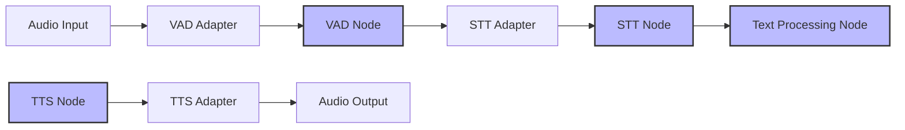
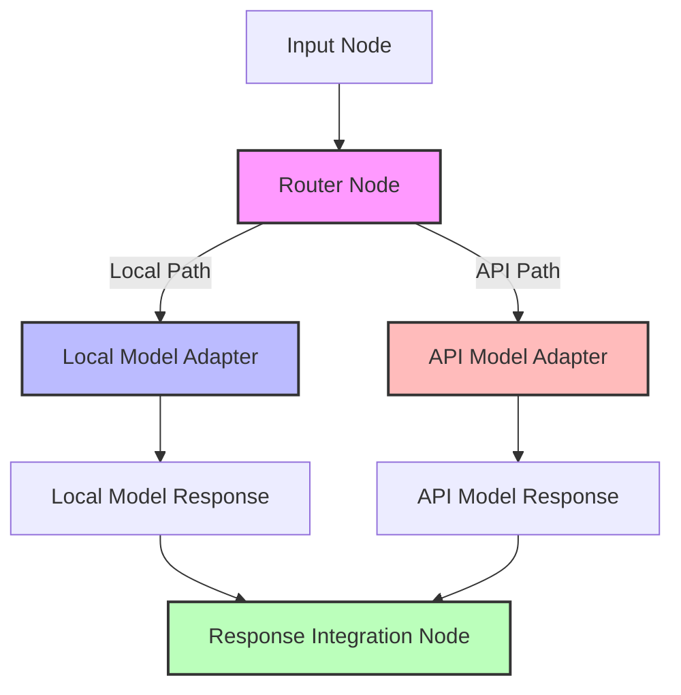
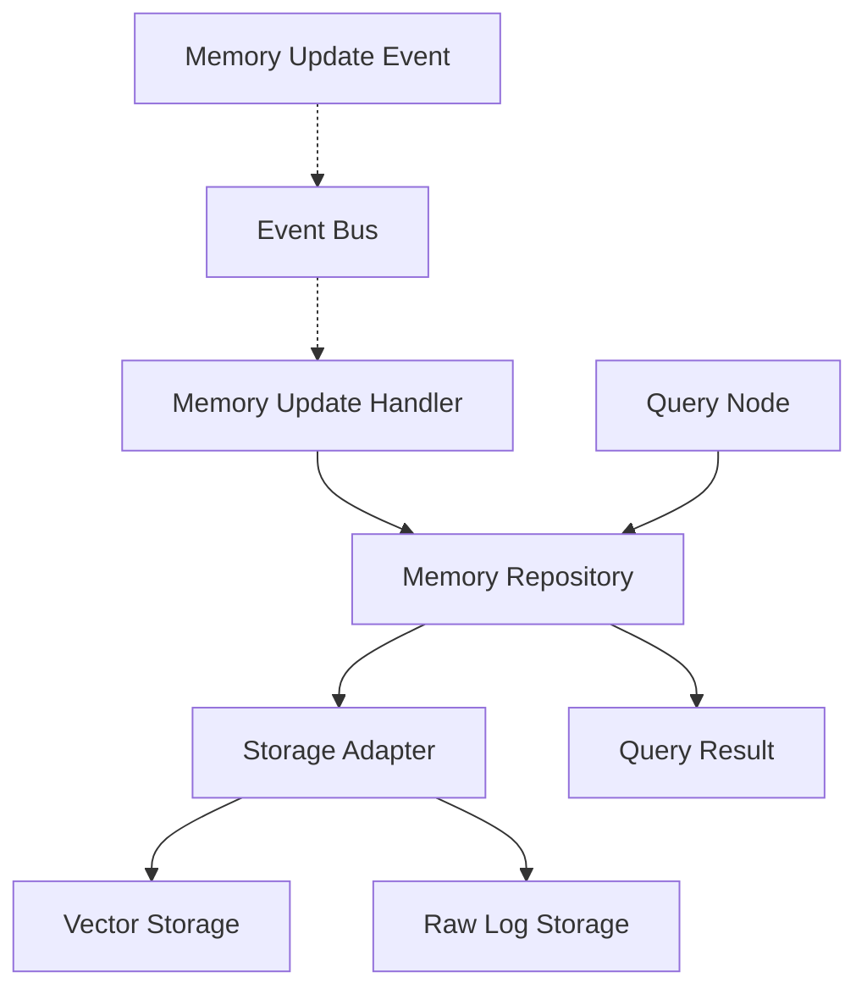

# Integration Patterns [DOC-DEV-ARCH-3]

## Overview

This document defines the standard integration patterns used throughout the VANTA system. These patterns enable loose coupling between components while maintaining clear communication flows and facilitating testing and replacement.

## Core Integration Patterns

### 1. LangGraph Node Pattern

The primary integration approach in VANTA uses LangGraph's node pattern, where each functional component is wrapped as a node in the state graph.

```python
def component_node(state: VANTAState) -> Dict:
    """LangGraph node for a specific component."""
    # Extract required data from state
    component_input = extract_from_state(state)
    
    # Process the input
    component_output = process_input(component_input)
    
    # Return state updates
    return {
        "key1": updated_value1,
        "key2": updated_value2,
        # Only return keys that should be updated
    }

# Add the node to the graph
workflow.add_node("component_name", component_node)
```

#### Key Characteristics

1. **Pure Function Design**: Nodes should be designed as pure functions that operate solely on their input state
2. **Isolated State Updates**: Nodes should only return the specific state keys they need to update
3. **Clear Input/Output Contract**: Each node should have a well-defined expectation of input state and output updates
4. **Error Handling**: Nodes should handle their own errors and return appropriate state updates

#### Benefits

- Explicit state flow throughout the system
- Independent testability of components
- Clear visualization of the processing flow
- Seamless persistence through LangGraph's checkpointing

### 2. Event Bus Pattern

For situations where LangGraph's direct flow is insufficient, VANTA implements an event bus pattern for asynchronous communication.

```python
class EventBus:
    """Simple event bus for asynchronous communication."""
    
    def __init__(self):
        self.subscribers = {}
        
    def subscribe(self, event_type: str, callback: Callable):
        """Subscribe to an event type."""
        if event_type not in self.subscribers:
            self.subscribers[event_type] = []
        self.subscribers[event_type].append(callback)
        
    def publish(self, event_type: str, data: Any):
        """Publish an event to all subscribers."""
        if event_type in self.subscribers:
            for callback in self.subscribers[event_type]:
                callback(data)

# Usage
event_bus = EventBus()
event_bus.subscribe("audio_detected", handle_audio)
event_bus.publish("audio_detected", audio_data)
```

#### Key Characteristics

1. **Decoupled Communication**: Publishers and subscribers are unaware of each other
2. **Topic-Based Routing**: Events are routed based on their type
3. **Asynchronous Processing**: Events can be processed asynchronously
4. **Many-to-Many Relationships**: Multiple publishers and subscribers can interact

#### Benefits

- Loose coupling between components
- Simplifies real-time event handling
- Easy addition of new subscribers without modifying publishers
- Facilitates cross-cutting concerns like logging and monitoring

### 3. Repository Pattern

For data access, VANTA uses the repository pattern to abstract storage details.

```python
class MemoryRepository:
    """Repository for memory storage and retrieval."""
    
    def __init__(self, storage_provider):
        self.storage = storage_provider
        
    def save_memory(self, memory: Dict):
        """Save a memory entry."""
        # Validation, preprocessing, etc.
        return self.storage.store(memory)
        
    def retrieve_by_id(self, memory_id: str) -> Dict:
        """Retrieve a memory by ID."""
        return self.storage.get(memory_id)
        
    def search_similar(self, query: str, limit: int = 5) -> List[Dict]:
        """Search for similar memories."""
        # Convert to embeddings, etc.
        return self.storage.search_vector(query_embedding, limit)

# Usage
memory_repo = MemoryRepository(ChromaDBStorage())
similar_memories = memory_repo.search_similar("weather in San Francisco")
```

#### Key Characteristics

1. **Storage Abstraction**: Hides implementation details of the storage mechanism
2. **Domain-Focused Interface**: Exposes methods aligned with domain concepts
3. **Swappable Backend**: Storage providers can be changed without affecting consumers
4. **Consistent Access Patterns**: Standardized access methods across the system

#### Benefits

- Simplifies testing with mock repositories
- Facilitates storage technology changes
- Centralizes data access logic
- Ensures consistent validation and preprocessing

### 4. Adapter Pattern

For integrating with external systems and libraries, VANTA uses the adapter pattern.

```python
class WhisperAdapter:
    """Adapter for the Whisper STT library."""
    
    def __init__(self, whisper_model, config):
        self.model = whisper_model
        self.config = config
        
    def transcribe(self, audio_data: bytes) -> TranscriptionResult:
        """Transcribe audio using Whisper."""
        # Convert to format expected by Whisper
        whisper_input = self._prepare_input(audio_data)
        
        # Process with Whisper
        whisper_output = self.model.transcribe(whisper_input)
        
        # Convert to standardized format
        return self._convert_output(whisper_output)
        
    def _prepare_input(self, audio_data):
        """Convert from standard format to Whisper format."""
        # ...
        
    def _convert_output(self, whisper_output):
        """Convert from Whisper format to standard format."""
        # ...

# Usage
whisper = WhisperAdapter(load_whisper_model(), config)
result = whisper.transcribe(audio_bytes)
```

#### Key Characteristics

1. **Unified Interface**: Provides a consistent interface regardless of the underlying implementation
2. **Conversion Logic**: Handles format transformations between systems
3. **Configuration Management**: Manages configuration specific to the external system
4. **Error Translation**: Converts external errors into application-specific errors

#### Benefits

- Simplifies replacement of external dependencies
- Isolates external system complexity
- Standardizes error handling
- Enables consistent testing approach

### 5. Factory Pattern

For creating complex objects and managing dependencies, VANTA uses the factory pattern.

```python
class ModelFactory:
    """Factory for creating language model instances."""
    
    @staticmethod
    def create_local_model(config: Dict):
        """Create a local language model."""
        model_type = config.get("model_type", "llama")
        
        if model_type == "llama":
            # Load Llama model
            return LlamaModel(config)
        elif model_type == "mistral":
            # Load Mistral model
            return MistralModel(config)
        else:
            raise ValueError(f"Unsupported model type: {model_type}")
    
    @staticmethod
    def create_api_model(config: Dict):
        """Create an API-based language model."""
        provider = config.get("provider", "anthropic")
        
        if provider == "anthropic":
            return ClaudeAPIModel(config)
        elif provider == "openai":
            return GPTAPIModel(config)
        else:
            raise ValueError(f"Unsupported API provider: {provider}")

# Usage
local_model = ModelFactory.create_local_model({"model_type": "llama"})
api_model = ModelFactory.create_api_model({"provider": "anthropic"})
```

#### Key Characteristics

1. **Centralized Creation Logic**: Consolidates object creation in one place
2. **Configuration-Driven**: Objects are created based on configuration
3. **Encapsulated Complexity**: Hides initialization details from consumers
4. **Type Selection**: Dynamically selects concrete types based on criteria

#### Benefits

- Simplifies object creation and configuration
- Facilitates A/B testing of different implementations
- Centralizes dependency management
- Enables runtime selection of implementations

## Application to VANTA Components

### Voice Pipeline Integration

The voice processing pipeline uses a combination of the adapter pattern and LangGraph nodes:



1. **Adapters**: Wrap specific implementations (Whisper, CSM, etc.)
2. **Nodes**: Process state and coordinate between components
3. **State Flow**: Clear path of state transformations
4. **Factory Creation**: Components created via factories for flexibility

### Model Integration

The language model integration uses the adapter pattern with the router pattern:



1. **Router**: Determines which model to use based on input characteristics
2. **Adapters**: Standardize interface to different model implementations
3. **Integration Node**: Combines responses from different sources
4. **Fallback Handling**: Manages errors and fallbacks between models

### Memory System Integration

The memory system uses the repository pattern with event-based updates:



1. **Repository**: Provides domain-specific interface to memory
2. **Storage Adapter**: Abstracts underlying storage mechanisms
3. **Event Bus**: Enables asynchronous updates to memory
4. **Query Interface**: Standardized access to memory content

## Implementation Guidelines

### Component Interface Design

When designing component interfaces, follow these guidelines:

1. **Clear Input/Output Contracts**:
   - Define explicit expectations for input data
   - Document all possible output states
   - Use type hints and validation

2. **Minimal Dependencies**:
   - Components should have minimal external dependencies
   - Dependencies should be injected, not imported directly
   - Use factories or dependency injection

3. **Error Handling**:
   - Define expected error conditions
   - Document error handling behavior
   - Return meaningful error states

4. **Configuration**:
   - Use configuration objects rather than direct parameters
   - Validate configuration at initialization
   - Provide sensible defaults

### State Management

For effective state management in the LangGraph framework:

1. **Granular Updates**:
   - Return only the state keys that have changed
   - Avoid copying the entire state
   - Use reducer functions for complex updates

2. **Immutable Patterns**:
   - Treat state as immutable within nodes
   - Create new objects rather than modifying existing ones
   - Use copy-on-write semantics

3. **State Validation**:
   - Validate state integrity after updates
   - Check for required fields
   - Verify type correctness

### Testing Approach

When testing integrated components:

1. **Isolation Testing**:
   - Test nodes in isolation with mock state
   - Verify state updates match expectations
   - Test error handling paths

2. **Integration Testing**:
   - Test connected components with realistic data
   - Verify end-to-end state flow
   - Test boundary conditions

3. **Mock Dependencies**:
   - Use mock implementations of adapters
   - Simulate external system behaviors
   - Test failure modes with controlled errors

## Migration Considerations

As components evolve, maintain backward compatibility:

1. **Interface Stability**:
   - Maintain stable public interfaces
   - Add new methods rather than changing existing ones
   - Use deprecation warnings for planned changes

2. **State Evolution**:
   - Support reading old state formats
   - Provide migration utilities
   - Document state format changes

3. **Versioned Components**:
   - Version component interfaces
   - Allow multiple versions to coexist during transition
   - Provide upgrade paths

## Version History

- v0.1.0 - 2025-05-17 - Initial creation [SES-V0-005]