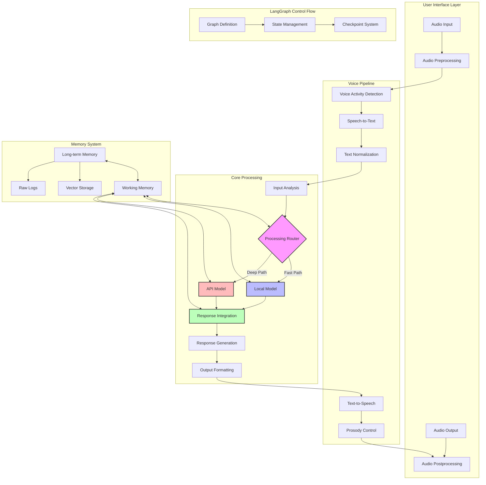
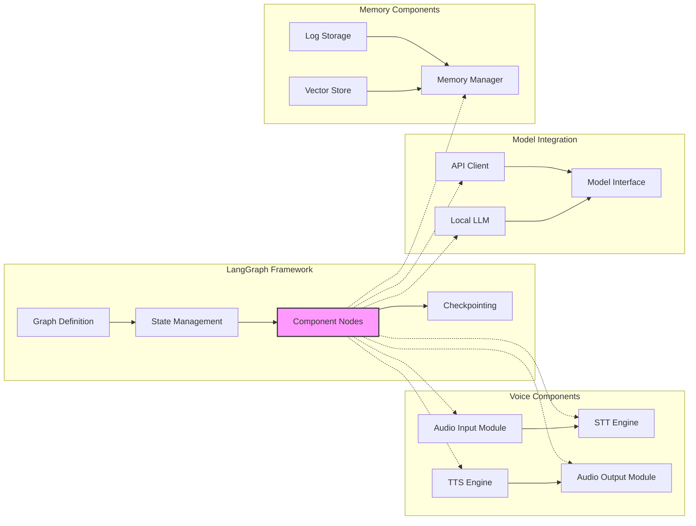

# V0 Architecture Overview [DOC-DEV-ARCH-1]

## Introduction

This document describes the technical architecture for the V0 implementation of VANTA, which focuses on establishing the core components and hybrid voice architecture. The design emphasizes modularity, extensibility, and the dual-track processing approach that combines local and API language models.

## Core Architecture Principles

1. **Hybrid Voice Processing**: Combining local and cloud-based language models to achieve both speed and depth
2. **Modular Components**: Clearly defined interfaces enabling component replacement and evolution
3. **Event-Driven Communication**: Loose coupling between components to enable flexible processing flows
4. **State-Based Workflow**: Using LangGraph for explicit state management and workflow control
5. **Resource-Aware Design**: Optimized for the target hardware (MacBook Pro M4 with 24GB RAM)
6. **Privacy-First Approach**: Local processing for sensitive operations, cloud for advanced capabilities

## System Architecture Diagram

## Component Descriptions

### Voice Pipeline

#### Audio Preprocessing
- **Purpose**: Prepare raw audio input for processing
- **Capabilities**: Noise reduction, normalization, segmentation
- **Implementation**: Custom Python module using audio processing libraries
- **Optimization**: M4 hardware acceleration for DSP operations

#### Voice Activity Detection
- **Purpose**: Detect human speech and filter non-speech audio
- **Capabilities**: Speech vs. non-speech classification, silence detection
- **Implementation**: Fast local model optimized for low latency
- **Optimization**: Minimal CPU footprint for continuous operation

#### Speech-to-Text (STT)
- **Purpose**: Convert speech audio to text for processing
- **Capabilities**: Accurate transcription, speaker differentiation
- **Implementation**: Whisper.cpp optimized for M4 architecture
- **Optimization**: Quantization and Metal acceleration

#### Text-to-Speech (TTS)
- **Purpose**: Convert response text to natural speech
- **Capabilities**: High-quality voice synthesis with emotional tones
- **Implementation**: CSM for initial V0, with Apple TTS as backup
- **Optimization**: Voice caching, partial synthesis for responsive output

#### Prosody Control
- **Purpose**: Add natural rhythm, pauses, and emphasis to speech
- **Capabilities**: Speech rate variation, emphasis markers, natural pauses
- **Implementation**: SSML generation or direct TTS control depending on engine
- **Optimization**: Pre-generated prosody patterns for common responses

### Core Processing

#### Input Analysis
- **Purpose**: Analyze user input for intent and content
- **Capabilities**: Intent classification, entity extraction, sentiment analysis
- **Implementation**: Small local model for fast classification
- **Optimization**: Feature-based classification for most common intents

#### Processing Router
- **Purpose**: Determine whether to use local or API model for response
- **Capabilities**: Query complexity assessment, contextual routing
- **Implementation**: Decision tree with ML-based enhancements
- **Optimization**: Progressive routing based on confidence thresholds

#### Local Model
- **Purpose**: Handle fast responses and common queries
- **Capabilities**: Small language model (7B parameters) for immediate responses
- **Implementation**: llama.cpp or equivalent with 4-bit quantization
- **Optimization**: M4 Neural Engine acceleration, prompt caching

#### API Model
- **Purpose**: Handle complex reasoning and deep insights
- **Capabilities**: Advanced language model (Claude/GPT-4) for nuanced responses
- **Implementation**: API clients with streaming support
- **Optimization**: Efficient prompt construction, caching where appropriate

#### Response Integration
- **Purpose**: Combine outputs from both processing paths
- **Capabilities**: Interleaving responses, handling interruptions, managing transitions
- **Implementation**: Priority queue with coherence checking
- **Optimization**: Low-latency state management for fast coordination

### Memory System

#### Working Memory
- **Purpose**: Maintain current conversation context
- **Capabilities**: Message history, short-term recall, immediate context
- **Implementation**: LangGraph state management
- **Optimization**: Token-efficient context representation

#### Long-term Memory
- **Purpose**: Store and retrieve past conversations and information
- **Capabilities**: Semantic search, temporal retrieval, importance-based retention
- **Implementation**: Hybrid storage (vector DB + raw logs)
- **Optimization**: Tiered storage with efficient retrieval indices

#### Vector Storage
- **Purpose**: Enable semantic retrieval of memories
- **Capabilities**: Embedding-based storage, similarity search
- **Implementation**: Chroma DB for V0, configurable for alternatives
- **Optimization**: Efficient indices and query optimization

### LangGraph Control Flow

#### Graph Definition
- **Purpose**: Define the processing workflow as a directed graph
- **Capabilities**: Node definition, edge conditions, entry/exit points
- **Implementation**: LangGraph StateGraph
- **Optimization**: Optimized graph structure for common paths

#### State Management
- **Purpose**: Maintain and update system state throughout processing
- **Capabilities**: Typed state, modular updates, validation
- **Implementation**: LangGraph state with typed reducers
- **Optimization**: Minimal state copying, efficient updates

#### Checkpoint System
- **Purpose**: Persist state across sessions and enable recovery
- **Capabilities**: State serialization, storage, and restoration
- **Implementation**: LangGraph checkpoint system
- **Optimization**: Incremental state updates, efficient serialization

## V0 Implementation Strategy

### Core Architecture Decisions

1. **LangGraph for Workflow Management**: 
   - We will use LangGraph as the primary framework for workflow orchestration
   - The entire conversational flow will be modeled as a typed state graph
   - This provides clear state transitions and checkpoint capability

2. **Hybrid Model Approach**:
   - Local Model: 7B parameter model with 4-bit quantization (llama.cpp)
   - API Model: Claude or GPT-4 via API with streaming support
   - Processing Router will direct traffic based on query characteristics

3. **Memory Architecture**:
   - Working Memory: Maintained in LangGraph state
   - Long-term Memory: Combination of vector DB (Chroma) and structured logs
   - Persistence: File-based for V0, with migration path to databases

4. **Voice Processing Pipeline**:
   - STT: Whisper.cpp optimized for M4
   - TTS: CSM (or Apple TTS as fallback)
   - Voice activity detection: Local lightweight model

### Component Integration Approach

The integration approach uses LangGraph nodes as the primary integration points. Each functional component will be wrapped as a node in the LangGraph workflow, with clear interfaces for state updates. This enables:

1. **Component Interchangeability**: Components can be replaced with alternative implementations
2. **Explicit State Flow**: All state changes are traced through the graph
3. **Testing Isolation**: Components can be tested independently
4. **Incremental Development**: The system can be built and tested piece by piece

## V0 Scope and Limitations

### Included in V0

1. **Basic Voice Interaction**:
   - Speech-to-text and text-to-speech pipeline
   - Voice activity detection
   - Basic prosody control

2. **Dual-Track Processing**:
   - Local model for fast responses
   - API model for complex queries
   - Basic routing between them

3. **Essential Memory**:
   - Conversation history within sessions
   - Basic semantic retrieval
   - Simple persistence between sessions

4. **Core Workflow**:
   - LangGraph-based processing flow
   - Typed state management
   - Basic checkpoint functionality

### Not Included in V0

1. **Advanced Naturalization**:
   - Sophisticated prosody and emotional tone
   - Complex backchanneling behavior
   - Fine-grained conversation repair

2. **Enhanced Memory**:
   - Advanced semantic relationships
   - Memory summarization
   - Memory importance ranking

3. **MCP Integration**:
   - Full MCP server ecosystem
   - Standardized tool usage
   - Cross-platform synchronization

4. **Ambient Features**:
   - Proactive suggestions
   - Environmental awareness
   - Context-aware interruptions

## Implementation Considerations

### Performance Targets

| Component | Metric | Target |
|-----------|--------|--------|
| Voice Activity Detection | Latency | <100ms |
| STT | Transcription Time | <500ms for typical utterance |
| Local Model | Response Time | <1.5s from query to response |
| API Model | First Token Time | <3.0s from query to first token |
| TTS | Synthesis Time | <200ms to begin speaking |
| Memory Retrieval | Lookup Time | <200ms for semantic query |
| Overall | Turn-taking | <2.0s for simple interactions |

### Resource Utilization

| Resource | Typical Usage | Peak Usage |
|----------|---------------|------------|
| RAM | 12-15GB | 18-20GB |
| CPU | 30-40% | 70-80% |
| Neural Engine | 20-30% | 60-70% |
| Disk I/O | Low | Moderate |
| Network | <50KB/s avg | ~1MB/s peak |
| Battery Impact | 10% per hour | 15-20% per hour |

### Error Handling and Resilience

1. **Voice Processing Errors**:
   - Fallback to text input if STT fails
   - Error detection and recovery for audio issues
   - Redundant audio buffering for recovery

2. **Model Failures**:
   - API model timeouts trigger local model fallback
   - Local model errors escalate to API with context
   - Graceful degradation of capabilities

3. **Memory Issues**:
   - Context overflow detection and management
   - Vector store query timeout handling
   - Database connection recovery

4. **System Resource Management**:
   - Memory pressure detection and adaptive resource usage
   - Thermal monitoring and performance scaling
   - Battery state awareness for mobile operation

## Development and Deployment

### Development Environment

- Docker-based development environment
- Containerized components for consistent testing
- Development-specific configuration profiles
- Local development tools with hot reloading

### Testing Strategy

- Component-level unit tests
- Integration tests for component combinations
- End-to-end workflow tests
- Performance benchmarking suite
- Conversation quality evaluation framework

### Deployment Approach

- Local application deployment for V0
- Configuration-driven environment setup
- Structured logging for debugging
- Feature flag system for gradual rollout

## Next Steps

1. Develop detailed component specifications
2. Create interface contracts between components
3. Implement core LangGraph structure
4. Build minimal viable components for each area
5. Integrate components into working prototype
6. Test and refine the basic workflow
7. Optimize for target hardware

## Version History

- v0.1.0 - 2025-05-17 - Initial creation [SES-V0-005]