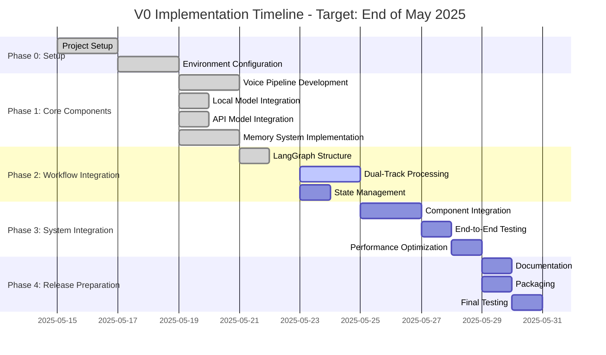
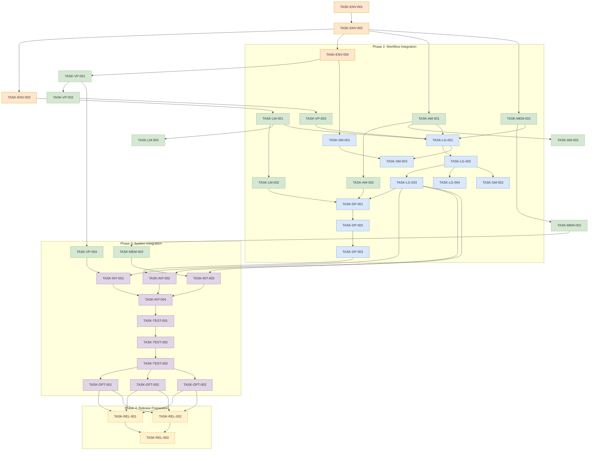

# VANTA Implementation Plan [DOC-DEV-IMPL-1]

## Overview

This document outlines the detailed implementation plan for the V0 version of VANTA. It breaks down the development process into specific tasks with VISTA identifiers, dependencies, and validation criteria.

**🎯 Target Completion: May 31, 2025**  
*This aggressive timeline focuses on core functionality to achieve a working V0 system by end of May 2025.*

## Implementation Philosophy

The V0 implementation follows these guiding principles:

1. **Component-First Development**: Each component is developed and tested in isolation before integration
2. **Incremental Integration**: Components are integrated gradually to ensure compatibility
3. **Continuous Testing**: Each milestone includes thorough testing
4. **Prioritize Core Functionality**: Focus on essential features first, defer advanced capabilities
5. **Documentation-Driven**: Implementation tasks are guided by comprehensive specifications

## Implementation Phases

## Task Breakdown

### Phase 0: Setup

#### TASK-ENV-001: Project Structure Setup
- **Description**: Set up basic project directory structure and documentation
- **Dependencies**: None
- **Estimated Effort**: 1 day
- **Validation Criteria**: 
  - Project structure follows the design specifications
  - Documentation structure is in place
  - README provides clear guidance
- **Status**: Completed

#### TASK-ENV-002: Development Environment Configuration
- **Description**: Set up containerized development environment with required dependencies
- **Dependencies**: TASK-ENV-001
- **Estimated Effort**: 2 days
- **Validation Criteria**:
  - Docker configuration is complete
  - Environment includes all necessary dependencies
  - Development tools are configured
  - CI pipeline is set up
- **Status**: Completed

#### TASK-ENV-003: Model Preparation
- **Description**: Download and prepare local models for development
- **Dependencies**: TASK-ENV-002
- **Estimated Effort**: 1 day
- **Validation Criteria**:
  - Local models are downloaded and converted to appropriate format
  - Models are tested for basic functionality
  - Model loading process is documented
- **Status**: Completed

#### TASK-ENV-004: Test Framework Setup
- **Description**: Set up testing framework and test infrastructure
- **Dependencies**: TASK-ENV-002
- **Estimated Effort**: 1 day
- **Validation Criteria**:
  - Unit test framework is configured
  - Integration test framework is configured
  - Test utilities are implemented
  - Sample tests are running
- **Status**: Completed

### Phase 1: Core Components

#### TASK-VP-001: Audio Processing Infrastructure
- **Description**: Implement core audio input/output infrastructure
- **Dependencies**: TASK-ENV-004
- **Estimated Effort**: 2 days
- **Validation Criteria**:
  - Audio capture from microphone works correctly
  - Audio playback to speakers works correctly
  - Audio processing pipeline is correctly structured
  - Basic audio operations (recording, playback) have tests
- **Status**: Completed

#### TASK-VP-002: Voice Activity Detection
- **Description**: Implement voice activity detection for determining when someone is speaking
- **Dependencies**: TASK-VP-001
- **Estimated Effort**: 2 days
- **Validation Criteria**:
  - VAD correctly identifies speech vs. non-speech
  - Wake word detection functions correctly
  - Performance meets latency targets (<100ms)
  - Handles different background noise conditions
- **Status**: Completed

#### TASK-VP-003: Speech-to-Text Integration
- **Description**: Integrate Whisper for speech recognition
- **Dependencies**: TASK-VP-002
- **Estimated Effort**: 3 days
- **Validation Criteria**:
  - Whisper integration correctly transcribes speech
  - Model selection and configuration works properly
  - Transcription meets accuracy targets (>90% WER in quiet conditions)
  - Handles various accents and speech patterns
- **Status**: Completed

#### TASK-VP-004: Text-to-Speech Integration
- **Description**: Integrate TTS system for speech synthesis
- **Dependencies**: TASK-VP-001
- **Estimated Effort**: 3 days
- **Validation Criteria**:
  - TTS system produces clear, natural speech
  - Voice selection and configuration works properly
  - SSML or similar markup for prosody control functions
  - Performance meets latency targets (<200ms to begin speaking)
- **Status**: Completed

#### TASK-LM-001: Local Model Integration
- **Description**: Integrate local language model (llama.cpp) for fast responses
- **Dependencies**: TASK-ENV-003
- **Estimated Effort**: 3 days
- **Validation Criteria**:
  - Local model loads and runs correctly
  - Inference produces appropriate responses
  - Performance meets latency targets (<1.5s for simple queries)
  - Memory usage stays within constraints (<10GB)
- **Status**: Completed

#### TASK-LM-002: Local Model Optimization
- **Description**: Optimize local model for performance on target hardware
- **Dependencies**: TASK-LM-001
- **Estimated Effort**: 2 days
- **Validation Criteria**:
  - Model quantization is correctly applied
  - Metal acceleration is properly configured
  - Memory usage is optimized
  - Inference speed meets targets
- **Status**: Completed

#### TASK-LM-003: Prompt Engineering for Local Models
- **Description**: Develop and optimize prompts for local model
- **Dependencies**: TASK-LM-001
- **Estimated Effort**: 2 days
- **Validation Criteria**:
  - Prompts produce consistent, appropriate responses
  - Context handling is efficient
  - Response quality meets expectations
  - Different conversation scenarios are handled correctly
- **Status**: In Progress (25%)

#### TASK-AM-001: API Model Client Implementation
- **Description**: Implement client for API language models
- **Dependencies**: TASK-ENV-002
- **Estimated Effort**: 2 days
- **Validation Criteria**:
  - API clients connect to Claude and/or GPT-4 successfully
  - Request formatting is correct
  - Response parsing is correct
  - Error handling works as expected
- **Status**: Completed

#### TASK-AM-002: Streaming Response Handling
- **Description**: Implement streaming API response handling
- **Dependencies**: TASK-AM-001
- **Estimated Effort**: 2 days
- **Validation Criteria**:
  - Streaming responses are processed incrementally
  - Partial responses can be used for backchanneling
  - Performance meets latency targets
  - Handles interruptions and cancellations correctly
- **Status**: Completed

#### TASK-AM-003: API Fallback and Error Handling
- **Description**: Implement robust error handling and fallback strategies for API models
- **Dependencies**: TASK-AM-001
- **Estimated Effort**: 1 day
- **Validation Criteria**:
  - System gracefully handles API errors
  - Fallback between providers works correctly
  - Retry strategies operate as expected
  - Timeout handling works correctly
- **Status**: Not Started

#### TASK-MEM-001: Memory System Implementation
- **Description**: Implement working memory system for conversation context
- **Dependencies**: TASK-ENV-002
- **Estimated Effort**: 2 days
- **Validation Criteria**:
  - Working memory correctly stores conversation history
  - Memory structure follows the design specification
  - State updates work correctly
  - Memory operations are performant
- **Status**: Completed

#### TASK-MEM-002: Long-Term Memory Storage
- **Description**: Implement long-term memory storage system
- **Dependencies**: TASK-MEM-001
- **Estimated Effort**: 3 days
- **Validation Criteria**:
  - Long-term storage correctly persists information
  - File-based storage works efficiently
  - Memory organization follows the design specification
  - Retrieval operations work correctly
- **Status**: Completed

#### TASK-MEM-003: Vector Storage Integration
- **Description**: Integrate vector database for semantic memory retrieval
- **Dependencies**: TASK-MEM-002
- **Estimated Effort**: 3 days
- **Validation Criteria**:
  - Vector database (Chroma) is properly integrated
  - Embedding generation works correctly
  - Semantic search produces relevant results
  - Performance meets latency targets (<200ms for retrieval)
- **Status**: Completed

### Phase 2: Workflow Integration

#### TASK-LG-001: LangGraph State Definition
- **Description**: Define the LangGraph state structure and type definitions
- **Dependencies**: TASK-MEM-001, TASK-VP-003, TASK-LM-001, TASK-AM-001
- **Estimated Effort**: 1 day
- **Validation Criteria**:
  - State structure follows the design specification
  - Type definitions are correct and comprehensive
  - State reducers are properly implemented
  - Documentation clearly explains state structure
- **Status**: Completed

#### TASK-LG-002: LangGraph Node Implementation
- **Description**: Implement core LangGraph nodes for workflow
- **Dependencies**: TASK-LG-001
- **Estimated Effort**: 3 days
- **Validation Criteria**:
  - All required nodes are implemented
  - Nodes correctly update state
  - Error handling is robust
  - Performance meets expectations
- **Status**: Completed

#### TASK-LG-003: Conditional Routing Implementation
- **Description**: Implement conditional routing in LangGraph workflow
- **Dependencies**: TASK-LG-002
- **Estimated Effort**: 2 days
- **Validation Criteria**:
  - Conditional edges work as designed
  - Routing conditions are correctly evaluated
  - Control flow follows expected patterns
  - Edge cases are handled correctly
- **Status**: Completed

#### TASK-LG-004: LangGraph Checkpoint Integration
- **Description**: Implement checkpointing for persistence
- **Dependencies**: TASK-LG-002
- **Estimated Effort**: 1 day
- **Validation Criteria**:
  - Checkpointing correctly saves state
  - State restoration works properly
  - Persistence across sessions functions as expected
  - Serialization/deserialization is correct
- **Status**: Completed

#### TASK-DP-001: Processing Router Implementation
- **Description**: Implement the processing router for dual-track processing
- **Dependencies**: TASK-LG-003, TASK-LM-002, TASK-AM-002
- **Estimated Effort**: 3 days
- **Validation Criteria**:
  - Router correctly classifies queries
  - Routing decisions are appropriate
  - Performance metrics are collected
  - Different routing strategies work correctly
- **Status**: Completed

#### TASK-DP-002: Response Integration System
- **Description**: Implement the response integration system
- **Dependencies**: TASK-DP-001
- **Estimated Effort**: 3 days
- **Validation Criteria**:
  - Responses from different sources are correctly integrated
  - Transitions between response segments are natural
  - Timing of integration points is appropriate
  - Conflict resolution works correctly
- **Status**: Completed

#### TASK-DP-003: Dual-Track Optimization
- **Description**: Optimize the dual-track processing system
- **Dependencies**: TASK-DP-002
- **Estimated Effort**: 2 days
- **Validation Criteria**:
  - Parallel processing works efficiently
  - Resource allocation is balanced
  - Latency targets are met
  - Memory usage stays within constraints
- **Status**: Not Started

#### TASK-SM-001: Configuration System
- **Description**: Implement the system configuration management
- **Dependencies**: TASK-ENV-004
- **Estimated Effort**: 2 days
- **Validation Criteria**:
  - Configuration loading works correctly
  - Different configuration profiles are supported
  - Configuration validation is robust
  - Default values are appropriate
- **Status**: Not Started

#### TASK-SM-002: Event Bus Implementation
- **Description**: Implement event bus for asynchronous communication
- **Dependencies**: TASK-LG-002
- **Estimated Effort**: 2 days
- **Validation Criteria**:
  - Event publication and subscription works correctly
  - Event routing is efficient
  - Asynchronous processing works as expected
  - Error handling is robust
- **Status**: Not Started

#### TASK-SM-003: State Validation System
- **Description**: Implement state validation for robustness
- **Dependencies**: TASK-LG-001, TASK-SM-001
- **Estimated Effort**: 1 day
- **Validation Criteria**:
  - State validation correctly identifies issues
  - Validation is comprehensive
  - Performance impact is minimal
  - Error reporting is clear and actionable
- **Status**: Not Started

### Phase 3: System Integration

#### TASK-INT-001: Voice Pipeline Integration
- **Description**: Integrate voice pipeline with LangGraph workflow
- **Dependencies**: TASK-VP-004, TASK-LG-003
- **Estimated Effort**: 2 days
- **Validation Criteria**:
  - Voice pipeline correctly interfaces with LangGraph
  - Audio processing aligns with workflow state
  - State transitions work correctly
  - End-to-end flow from audio to text to audio works
- **Status**: Not Started

#### TASK-INT-002: Model Integration
- **Description**: Integrate local and API models with LangGraph workflow
- **Dependencies**: TASK-DP-003, TASK-LG-003
- **Estimated Effort**: 2 days
- **Validation Criteria**:
  - Models correctly interface with LangGraph
  - Model selection and routing work as expected
  - Response processing aligns with workflow state
  - End-to-end flow through models works correctly
- **Status**: Not Started

#### TASK-INT-003: Memory System Integration
- **Description**: Integrate memory system with LangGraph workflow
- **Dependencies**: TASK-MEM-003, TASK-LG-003
- **Estimated Effort**: 2 days
- **Validation Criteria**:
  - Memory system correctly interfaces with LangGraph
  - Memory operations align with workflow state
  - State transitions work correctly
  - End-to-end flow with memory retrieval works
- **Status**: Not Started

#### TASK-INT-004: System-Wide Error Handling
- **Description**: Implement comprehensive error handling across the system
- **Dependencies**: TASK-INT-001, TASK-INT-002, TASK-INT-003
- **Estimated Effort**: 2 days
- **Validation Criteria**:
  - Error handling is consistent across components
  - Recovery mechanisms work as expected
  - User experience is maintained during errors
  - Error reporting is comprehensive
- **Status**: Not Started

#### TASK-TEST-001: Component Testing
- **Description**: Conduct comprehensive component-level testing
- **Dependencies**: All component implementations
- **Estimated Effort**: 3 days
- **Validation Criteria**:
  - All components pass unit tests
  - Component interfaces are verified
  - Edge cases are tested
  - Performance meets targets
- **Status**: Not Started

#### TASK-TEST-002: Integration Testing
- **Description**: Conduct system integration testing
- **Dependencies**: TASK-INT-004, TASK-TEST-001
- **Estimated Effort**: 3 days
- **Validation Criteria**:
  - All integration points work correctly
  - End-to-end flows pass tests
  - State transitions work correctly
  - Error scenarios are handled correctly
- **Status**: Not Started

#### TASK-TEST-003: Performance Testing
- **Description**: Conduct performance testing and optimization
- **Dependencies**: TASK-TEST-002
- **Estimated Effort**: 3 days
- **Validation Criteria**:
  - System meets latency targets
  - Memory usage stays within constraints
  - Resource utilization is efficient
  - Performance is consistent across different usage patterns
- **Status**: Not Started

#### TASK-OPT-001: Memory Optimization
- **Description**: Optimize memory usage across the system
- **Dependencies**: TASK-TEST-003
- **Estimated Effort**: 2 days
- **Validation Criteria**:
  - Memory usage is reduced where possible
  - Peak memory usage stays below targets
  - Memory leaks are addressed
  - Long-running stability is verified
- **Status**: Not Started

#### TASK-OPT-002: Latency Optimization
- **Description**: Optimize latency across the system
- **Dependencies**: TASK-TEST-003
- **Estimated Effort**: 2 days
- **Validation Criteria**:
  - Response latency meets targets
  - Processing bottlenecks are addressed
  - End-to-end latency is minimized
  - Perception of responsiveness is improved
- **Status**: Not Started

#### TASK-OPT-003: Battery Impact Optimization
- **Description**: Optimize for battery efficiency
- **Dependencies**: TASK-TEST-003
- **Estimated Effort**: 2 days
- **Validation Criteria**:
  - Battery impact is minimized
  - Resource usage is efficient during idle periods
  - Power-intensive operations are optimized
  - Thermal impact is controlled
- **Status**: Not Started

### Phase 4: Release Preparation

#### TASK-REL-001: Documentation Finalization
- **Description**: Complete user and developer documentation
- **Dependencies**: All implementation tasks
- **Estimated Effort**: 3 days
- **Validation Criteria**:
  - User documentation is comprehensive
  - Developer documentation is complete
  - API documentation is accurate
  - Installation and setup instructions are clear
- **Status**: Not Started

#### TASK-REL-002: Packaging and Distribution
- **Description**: Prepare the system for distribution
- **Dependencies**: All implementation tasks
- **Estimated Effort**: 2 days
- **Validation Criteria**:
  - Installation package works correctly
  - Dependencies are correctly managed
  - Configuration is properly packaged
  - Installation process is smooth
- **Status**: Not Started

#### TASK-REL-003: Final Testing and Validation
- **Description**: Conduct final system testing and validation
- **Dependencies**: TASK-REL-001, TASK-REL-002
- **Estimated Effort**: 3 days
- **Validation Criteria**:
  - All acceptance criteria are met
  - System functions correctly in target environment
  - Performance meets requirements
  - User experience is satisfactory
- **Status**: Not Started

## Task Dependencies

## Implementation Milestones

### Milestone 1: Environment and Core Components
- **Tasks**: TASK-ENV-001 through TASK-MEM-003
- **Estimated Completion**: May 21, 2025
- **Success Criteria**:
  - Development environment is fully configured
  - Voice pipeline components work individually
  - Local and API models function correctly
  - Memory system stores and retrieves data correctly
  - All components pass individual tests
- **Status**: Completed

### Milestone 2: LangGraph Integration
- **Tasks**: TASK-LG-001 through TASK-SM-003
- **Estimated Completion**: May 25, 2025
- **Success Criteria**:
  - LangGraph workflow is fully defined ✅
  - State management works correctly ✅
  - Dual-track processing routes queries appropriately ✅
  - Response integration produces coherent outputs (Pending)
  - Configuration system manages settings correctly (Pending)
  - All workflow components pass tests ✅
- **Status**: Significantly Complete (LangGraph and dual-track router completed, response integration pending)

### Milestone 3: System Integration
- **Tasks**: TASK-INT-001 through TASK-OPT-003
- **Estimated Completion**: May 29, 2025
- **Success Criteria**:
  - Components are correctly integrated
  - End-to-end workflow functions as expected
  - Performance meets requirements
  - Error handling is robust
  - System passes all integration tests
  - Optimizations improve efficiency
- **Status**: Not Started

### Milestone 4: Release
- **Tasks**: TASK-REL-001 through TASK-REL-003
- **Estimated Completion**: May 31, 2025
- **Success Criteria**:
  - Documentation is complete
  - Packaging is ready for distribution
  - System passes all acceptance criteria
  - User experience is satisfactory
  - System is ready for deployment
- **Status**: Not Started

## Critical Path

The critical path for V0 implementation includes:

1. ~~Environment setup (TASK-ENV-001, TASK-ENV-002)~~ ✅
2. ~~Voice Pipeline core (TASK-VP-001, TASK-VP-002, TASK-VP-003)~~ ✅
3. ~~LangGraph structure (TASK-LG-001, TASK-LG-002, TASK-LG-003)~~ ✅
4. ~~Dual-Track Processing Router (TASK-DP-001)~~ ✅
5. **Response Integration System (TASK-DP-002, TASK-DP-003)** ⬅️ Current critical path
6. System Integration (TASK-INT-001, TASK-INT-002, TASK-INT-003, TASK-INT-004)
7. Testing and Optimization (TASK-TEST-001, TASK-TEST-002, TASK-TEST-003, TASK-OPT-002)
8. Release Preparation (TASK-REL-001, TASK-REL-002, TASK-REL-003)

## Risks and Mitigations

| Risk | Impact | Probability | Mitigation |
|------|--------|------------|------------|
| Local model performance issues | High | Medium | Early performance testing, fallback to smaller models, optimization focus |
| Voice recognition accuracy problems | High | Medium | Extensive testing with diverse speakers, alternative STT options, adaptive processing |
| Integration complexity | Medium | High | Phased integration approach, clear interface contracts, comprehensive testing |
| Resource constraints on target hardware | High | Medium | Continuous performance monitoring, adaptive resource allocation, feature toggling |
| API reliability issues | Medium | Low | Robust fallback mechanisms, caching strategies, multiple provider options |
| Conversational quality problems | High | Medium | Extensive prompt engineering, human evaluation, iterative improvement |

## Implementation Tracking

Progress will be tracked using the following mechanisms:

1. **Task Status Dashboard**: Visual representation of task status
2. **Milestone Tracking**: Regular milestone review meetings
3. **Issue Tracking**: Systematic tracking of bugs and issues
4. **Performance Metrics**: Ongoing monitoring of key performance indicators
5. **Test Coverage**: Tracking of test coverage and pass rates

## Last Updated
2025-05-22T11:45:00Z | SES-V0-042 | Timeline updated for end-of-May 2025 completion target