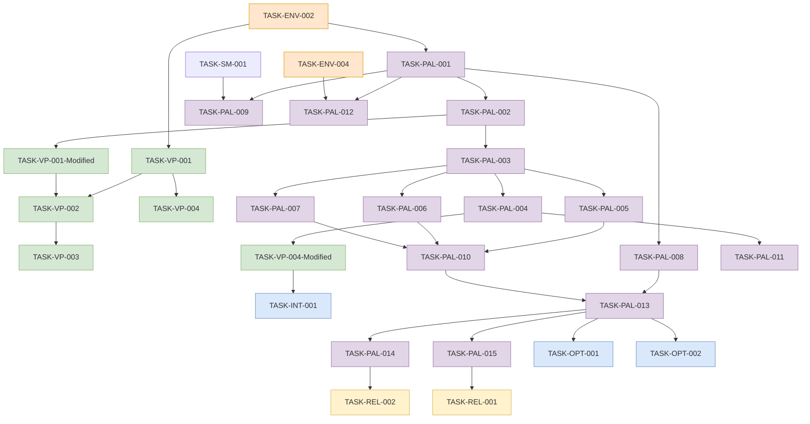

# Implementation Plan Addendum: Cross-Platform Support

This document serves as an addendum to the main IMPLEMENTATION_PLAN.md, updating the approach to support both macOS and Linux platforms. The original Docker-focused approach is being modified based on audio implementation challenges discovered during development.

## Changes to Development Approach

### 1. Platform Strategy Update

The updated implementation strategy transitions from a Docker-only approach to a platform-specific implementation with the following characteristics:

- **Development on macOS**: Native audio components with platform-specific optimizations
- **Deployment on Linux**: Full system with hardware-specific optimizations for Ryzen AI PC
- **Cross-Platform Compatibility**: Abstractions to maintain consistent codebase across platforms

### 2. Revised Task Dependencies

The following diagram shows how the new Platform Abstraction Layer (PAL) tasks integrate with the existing implementation plan:

## Modified Tasks from Original Implementation Plan

The following existing tasks from the main implementation plan will be modified to accommodate the platform abstraction approach:

### TASK-ENV-002: Development Environment Configuration (MODIFIED)
- **Additional Requirements**: 
  - Platform detection and configuration mechanisms
  - Separate configuration profiles for macOS and Linux
  - Documentation for platform-specific setup

### TASK-VP-001: Audio Processing Infrastructure (MODIFIED)
- **Additional Requirements**:
  - Implementation of platform abstraction interfaces
  - Factory pattern for component creation
  - Platform-specific audio capture/playback implementations

### TASK-VP-004: Text-to-Speech Integration (MODIFIED)
- **Additional Requirements**:
  - Platform-specific TTS engine integration
  - Unified interface across platforms
  - Fall-back mechanisms for platform compatibility

### TASK-LM-002: Local Model Optimization (MODIFIED)
- **Additional Requirements**:
  - Platform-specific acceleration (Metal for macOS, ROCm/CUDA for Linux)
  - Performance optimization for target hardware
  - Benchmarking across platforms

### TASK-INT-004: System-Wide Error Handling (MODIFIED)
- **Additional Requirements**:
  - Platform-specific error handling
  - Clear error messages for platform compatibility issues
  - Cross-platform error logging standardization

### TASK-OPT-002: Latency Optimization (MODIFIED)
- **Additional Requirements**:
  - Platform-specific performance profiling
  - Optimization techniques for each target platform
  - Platform parity goals for user experience

### TASK-REL-002: Packaging and Distribution (MODIFIED)
- **Additional Requirements**:
  - Platform-specific installation packages
  - Clear platform requirements in documentation
  - Platform-specific configuration files

## Timeline Integration

The platform abstraction tasks integrate into the main timeline as follows:

1. **PAL Phase 1** (Tasks PAL-001 to PAL-004) to be completed alongside VP-001 and VP-004 modifications
2. **PAL Phase 2** (Tasks PAL-005 to PAL-008) to be implemented when Ryzen AI PC arrives
3. **PAL Phase 3** (Tasks PAL-009 to PAL-012) to align with System Integration phase
4. **PAL Phase 4** (Tasks PAL-013 to PAL-015) to align with Optimization and Release phases

## Resource Requirements

Additional resources required for the cross-platform approach:

1. **Hardware**:
   - macOS development system (already available)
   - Ryzen AI PC for Linux development and testing (ordered, awaiting arrival)
   - CI/CD environment capable of testing both platforms

2. **Software**:
   - Development tools for both macOS and Linux
   - Platform-specific audio libraries and SDKs
   - Cross-platform testing frameworks

3. **Skills/Expertise**:
   - Experience with platform-specific audio APIs
   - Knowledge of hardware acceleration on both platforms
   - Cross-platform development expertise

## Updated Risks and Mitigations

| Risk | Impact | Probability | Mitigation |
|------|--------|------------|------------|
| Platform discrepancies in audio behavior | High | High | Extensive platform-specific testing, abstraction robustness |
| Development delays waiting for Ryzen AI PC | Medium | High | Progress with macOS implementation, design abstractions ready for Linux |
| Increased maintenance burden | Medium | Medium | Strong abstraction boundaries, comprehensive testing automation |
| Performance discrepancies between platforms | High | Medium | Platform-specific optimizations, clear minimum requirements |
| Integration complexity with existing codebase | Medium | Medium | Gradual refactoring, maintain backward compatibility |

## Conclusion

This revised approach maintains development momentum by continuing work on macOS while preparing for Linux deployment when the Ryzen AI PC arrives. The platform abstraction layer ensures that platform-specific code is properly isolated, allowing for platform-specific optimizations without sacrificing maintainability or code quality.

## Last Updated
2025-05-19T12:00:00Z | SES-V0-022 | Platform Abstraction Integration Planning