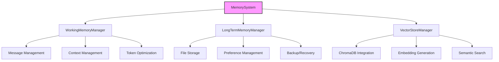

# Memory System Implementation

## Overview

The Memory System is a core component of VANTA responsible for maintaining conversation context, storing long-term memories, and enabling semantic retrieval of relevant information. It consists of three main components:

1. **Working Memory**: Manages in-session memory including conversation history, user profile, and active context
2. **Long-term Memory**: Persists conversations and user preferences between sessions using a file-based storage system
3. **Vector Storage**: Enables semantic search and retrieval using vector embeddings

This document describes the implementation details, usage patterns, and technical specifications of the Memory System.

## Architecture

The Memory System follows a layered architecture:



### Components

#### MemorySystem (`core.py`)

The central coordinator that provides a unified interface to all memory components. It handles:

- Initialization and configuration of all memory subsystems
- Coordination between working and long-term memory
- Context retrieval combining current and historical information
- Storage of complete interactions across all memory layers

#### WorkingMemoryManager (`models/working_memory.py`)

Manages the active session state including:

- Conversation history (messages)
- Current context for ongoing interactions
- User profile information
- Token management and context window optimization
- Memory pruning strategies when token limits are reached

#### LongTermMemoryManager (`storage/long_term_memory.py`)

Handles persistent storage of conversations and preferences:

- File-based storage organized by date
- User preference management by category
- Backup and recovery mechanisms
- Data retention policies and cleanup

#### VectorStoreManager (`storage/vector_storage.py`)

Enables semantic search and retrieval:

- ChromaDB integration for vector storage
- Embedding generation and similarity search
- Metadata filtering and query processing
- Collection management and optimization

### Data Directory Structure

The Memory System creates the following directory structure:

```
/data_path
  /memory
    /conversations      # Long-term conversation storage
      /YYYY-MM-DD/      # Organized by date
        {timestamp}_{id}.json  # Individual conversation files
    
    /preferences        # User preference storage
      /{category}/      # Organized by category
        {id}.json       # Individual preference files
    
    /vectors            # Vector storage
      /chroma/          # ChromaDB storage location
    
    /backups            # Backup storage
      /backup_{timestamp}/ # Backup directories
        /conversations  # Backed up conversations
        /preferences    # Backed up preferences
```

## Configuration

The Memory System is configured with a nested dictionary structure:

```python
config = {
    "data_path": "./data/memory",  # Base path for all memory data
    
    "working_memory": {
        "max_tokens": 8000,        # Maximum tokens in working memory
        "default_user": "user",    # Default user identifier
        "prune_strategy": "importance", # Strategy for pruning: recency, importance, hybrid
    },
    
    "long_term_memory": {
        "storage_path": "./data/memory/conversations", # Path for conversation storage
        "max_age_days": 30,        # Data retention period
        "backup_enabled": True,    # Enable automatic backups
        "backup_interval_days": 7, # Backup frequency
    },
    
    "vector_store": {
        "db_path": "./data/memory/vectors", # Path for vector storage
        "collection_name": "vanta_memories", # ChromaDB collection name
        "embedding_model": "all-MiniLM-L6-v2", # Embedding model
        "distance_metric": "cosine", # Similarity metric
    }
}
```

## Usage Examples

### Initializing the Memory System

```python
from src.memory.core import MemorySystem

# Create with default configuration
memory = MemorySystem()
memory.initialize()

# Create with custom configuration
config = {
    "data_path": "/custom/path/memory",
    "working_memory": {"max_tokens": 4000},
    "vector_store": {"embedding_model": "all-mpnet-base-v2"}
}
memory = MemorySystem(config)
memory.initialize()
```

### Storing and Retrieving Conversations

```python
# Store a complete interaction
memory.store_interaction({
    "user_message": "What's the weather like today?",
    "assistant_message": "It's sunny with a high of 75°F.",
    "timestamp": "2025-05-20T14:30:00Z",
    "metadata": {"category": "weather"}
})

# Get current context (combines working memory with relevant memories)
context = memory.get_context()

# Get context enhanced with relevant memories for a query
enhanced_context = memory.get_context(query="weather forecast")

# Retrieve memories semantically similar to a query
relevant_memories = memory.retrieve_relevant("weather patterns in California")
```

### Working with Working Memory Directly

```python
# Get the working memory component
working_memory = memory.working_memory

# Add messages
working_memory.add_message({
    "role": "user",
    "content": "Tell me about quantum physics"
})

working_memory.add_message({
    "role": "assistant",
    "content": "Quantum physics studies matter and energy at the smallest scales."
})

# Update context
working_memory.update_context({
    "user_interests": ["science", "physics"],
    "conversation_topic": "quantum physics"
})

# Update user profile
working_memory.update_user_profile({
    "expertise_level": "beginner",
    "preferred_detail": "high"
})

# Get formatted state for LLM
llm_state = working_memory.get_state_for_llm()

# Manage token usage
working_memory.prune_messages(max_tokens=4000)
```

### Working with Long-Term Memory Directly

```python
# Get the long-term memory component
long_term_memory = memory.long_term_memory

# Store a conversation
conversation_id = long_term_memory.store_conversation({
    "user_message": "What's 42 divided by 6?",
    "assistant_message": "42 divided by 6 is 7.",
    "metadata": {"category": "math"}
})

# Retrieve conversations
recent_conversations = long_term_memory.retrieve_conversations(limit=10)
math_conversations = long_term_memory.retrieve_conversations(
    filter={"metadata.category": "math"},
    limit=5
)
date_range_conversations = long_term_memory.retrieve_conversations(
    from_date="2025-05-01",
    to_date="2025-05-20"
)

# Store user preferences
long_term_memory.store_preference({
    "category": "display",
    "value": "dark_mode",
    "confidence": 0.9
})

# Get user preferences
all_preferences = long_term_memory.get_preferences()
display_preferences = long_term_memory.get_preferences(category="display")

# Backup and maintenance
backup_path = long_term_memory.create_backup()
removed_count = long_term_memory.cleanup_old_data(max_age_days=60)
```

### Working with Vector Storage Directly

```python
# Get the vector store component
vector_store = memory.vector_store

# Store text with embedding
text_id = vector_store.store_embedding(
    text="Artificial intelligence is transforming technology.",
    metadata={"category": "tech", "importance": "high"}
)

# Search for similar content
results = vector_store.search_similar(
    query="AI and machine learning advances",
    limit=5
)

# Search with metadata filter
filtered_results = vector_store.search_similar(
    query="AI advances",
    metadata_filter={"category": "tech", "importance": "high"},
    limit=3
)

# Update an existing embedding
vector_store.update_embedding(
    id=text_id,
    text="Updated text about artificial intelligence.",
    metadata={"updated": "true"}
)

# Delete an embedding
vector_store.delete_embedding(id=text_id)

# Get collection statistics
stats = vector_store.get_collection_stats()
```

## Implementation Details

### Token Management

The Memory System includes utilities for token management:

- **Token Counting**: Accurate token counting using tiktoken (with fallback to approximation)
- **Context Window Management**: Tools to truncate messages to fit within token limits
- **Pruning Strategies**:
  - **Recency**: Keep most recent messages, removing older ones first
  - **Importance**: Keep important messages based on metadata and recency
  - **Hybrid**: Balance between recency and importance

### Embedding Generation

Vector storage uses sentence-transformers for embedding generation:

- Default model: all-MiniLM-L6-v2 (384 dimensions)
- Support for alternative models via configuration
- Batch processing for efficiency
- Model caching to avoid reload overhead

### Error Handling

The system includes specialized exceptions:

- `MemoryError`: Base exception for all memory-related errors
- `StorageError`: For errors in the storage system
- `VectorStoreError`: For errors in the vector storage system
- `ResourceExceededError`: When a resource limit is exceeded
- `SerializationError`: For serialization/deserialization errors
- `ValidationError`: For data validation errors

## Dependencies

The Memory System has the following dependencies:

- **Required**:
  - Python 3.8+
  - NumPy
  - Typing extensions

- **Optional**:
  - sentence-transformers (for vector embeddings)
  - tiktoken (for accurate token counting)
  - chromadb (for vector storage)

## Future Enhancements

Planned enhancements for the Memory System:

1. **Memory Summarization**: Automatic summarization of conversation history
2. **Importance Ranking**: Improved algorithms for determining memory importance
3. **Database Migration**: Support for SQL/NoSQL databases for larger deployments
4. **Memory Compression**: Advanced techniques for token-efficient memory storage
5. **Multi-user Support**: Enhanced support for multiple users
6. **Memory Visualization**: Tools for visualizing and exploring stored memories

## Version History

- v0.1.0 - 2025-05-20 - Initial implementation [SES-V0-029]