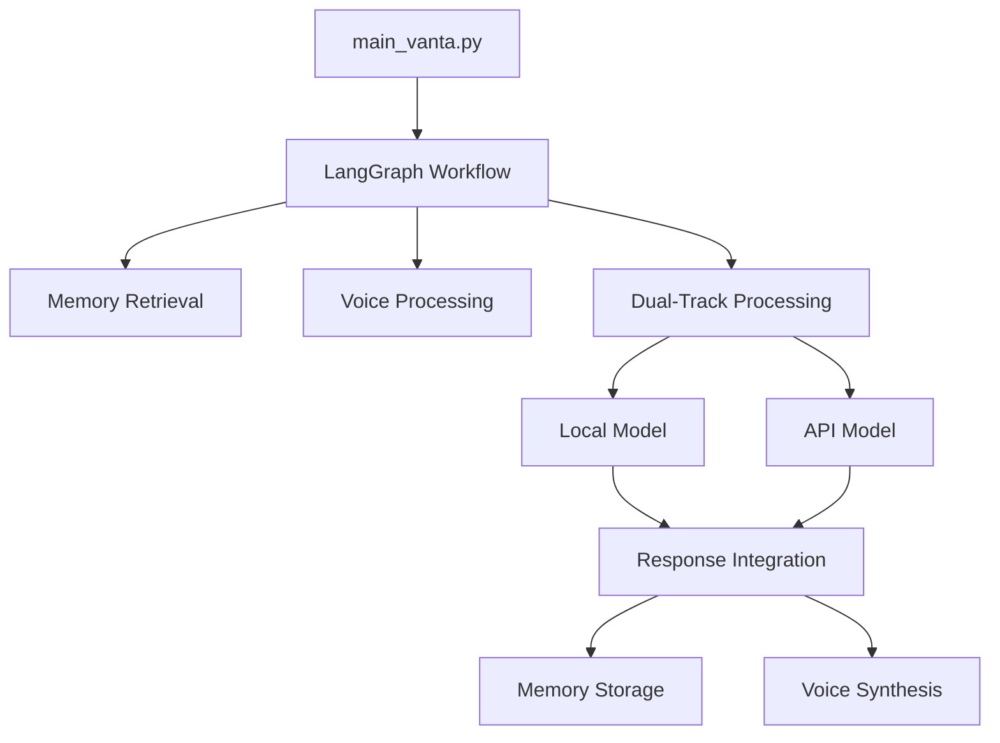

# VANTA Main Execution Directory

This directory contains the organized main entry points for running VANTA in different stages of development.

## Directory Structure

```
vanta-main/
├── README.md          # This file - overview and guidelines
├── v01/               # Version 01 - First full workflow attempt
│   ├── main_vanta.py  # Main entry point for v01
│   └── README.md      # v01 specific documentation
├── v02/               # Version 02 - (Future) Improved workflow
└── v03/               # Version 03 - (Future) Production ready
```

## Version Progression Strategy

Each version directory represents a milestone in VANTA development:

- **v01**: Fix import issues, get full LangGraph workflow running
- **v02**: Voice pipeline integration, end-to-end voice conversation
- **v03**: Production optimization, error handling, deployment ready

## Current Status: v01

**Goal**: Get the complete VANTA architecture working with proper LangGraph workflow

**Status**: 🔧 **Import Issues Being Fixed**

### Working Components ✅
- LangGraph workflow system
- Local models (Llama 2-7B)
- Platform detection (macOS audio capabilities)

### Issues to Fix ❌
- Memory system (relative import errors)
- Dual-track processing (relative import errors) 
- Voice pipeline (missing scipy dependency)

## Quick Start

```bash
# Navigate to current version
cd vanta-main/v01

# Activate environment
source ../../.venv/bin/activate

# Run VANTA
python main_vanta.py
```

## Development Guidelines

### Adding New Versions
1. Create new version directory: `mkdir v0X`
2. Copy previous version as starting point
3. Update README.md with specific goals and changes
4. Implement improvements incrementally
5. Test thoroughly before moving to next version

### Version Naming
- **v01, v02, v03**: Major milestone versions
- **v01a, v01b**: Minor iterations within a version
- Keep old versions as reference and fallback

### Documentation Requirements
Each version should have:
- Clear goals and objectives
- Current status and known issues
- Run instructions
- Component status tracking
- Next steps and TODOs

## Integration with Main Development

This directory integrates with the main VANTA codebase:
- **Source Code**: `../src/` - All VANTA modules and components
- **Dependencies**: `../.venv/` - Python virtual environment
- **Models**: `../models/` - Local AI models (Llama, etc.)
- **Tests**: `../tests/` - Test suite

## Architecture Overview

VANTA's complete architecture as planned:



## Troubleshooting

### Common Issues
1. **Import Errors**: Check that `src/` is in Python path
2. **Missing Dependencies**: Run `pip install -r requirements.txt`
3. **Model Not Found**: Ensure `.gguf` files are in `../models/`
4. **Memory Issues**: 24GB RAM recommended for full functionality

### Getting Help
- Check version-specific README for detailed status
- Review `../src/` for component documentation
- Run with verbose logging: `python main_vanta.py --verbose`

## Next Steps

1. **Fix v01 Import Issues** ⬅️ Current priority
2. **Complete LangGraph Integration**
3. **Add Voice Pipeline**
4. **Test End-to-End Workflow**
5. **Create v02 with Improvements**

---

*Last Updated: June 1, 2025 - v01 initialization*
