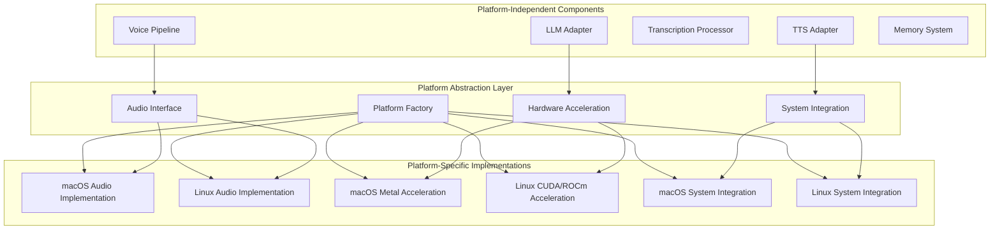

# VANTA Platform Abstraction Plan

## Overview

This document outlines the platform abstraction approach for VANTA to support both macOS and Linux environments. Based on the Docker audio implementation challenges, we're adopting a pragmatic approach that leverages the strengths of each platform while maintaining cross-platform compatibility.

## Platform Support Goals

1. **Primary Development Platforms**:
   - **macOS**: Development on MacBook Pro with M-series chips
   - **Linux**: Deployment on Ryzen AI PC with AMD hardware

2. **Feature Requirements**:
   - Real-time audio capture and playback
   - Low-latency speech processing
   - Local model acceleration using platform capabilities
   - Consistent user experience across platforms

## Architecture Changes

### 1. Platform Abstraction Layer

We'll implement a platform abstraction layer to isolate platform-specific code:



### 2. Factory Pattern Implementation

The factory pattern will be used to create platform-specific implementations:

```python
class PlatformFactory:
    @staticmethod
    def create_audio_capture(config: Dict[str, Any]) -> AudioCapture:
        platform_system = platform.system()
        if platform_system == "Darwin":
            return MacOSAudioCapture(**config)
        elif platform_system == "Linux":
            return LinuxAudioCapture(**config)
        else:
            logger.warning(f"Unsupported platform: {platform_system}, using fallback")
            return FallbackAudioCapture(**config)
    
    @staticmethod
    def create_audio_playback(config: Dict[str, Any]) -> AudioPlayback:
        platform_system = platform.system()
        if platform_system == "Darwin":
            return MacOSAudioPlayback(**config)
        elif platform_system == "Linux":
            return LinuxAudioPlayback(**config)
        else:
            logger.warning(f"Unsupported platform: {platform_system}, using fallback")
            return FallbackAudioPlayback(**config)
    
    # Other factory methods for platform-specific components
```

### 3. Deployment Strategies

#### macOS Development and Deployment
- Native audio I/O using PyAudio
- System TTS integration (already implemented)
- Metal acceleration for local models
- Optional Docker for non-audio components

#### Linux Deployment (Ryzen AI PC)
- Native audio I/O using PyAudio/ALSA
- Docker-based components with host device access
- ROCm/CUDA acceleration for AMD/NVIDIA hardware
- Full containerization option

### 4. Component Classification

| Component Type | Platform Dependency | Implementation Approach |
|----------------|---------------------|-------------------------|
| Audio Capture | High | Platform-specific implementation |
| Audio Playback | High | Platform-specific implementation |
| System TTS | High | Platform-specific implementation |
| Voice Activity Detection | Low | Common implementation with platform optimizations |
| Speech-to-Text | Medium | Common implementation with platform-specific acceleration |
| Local LLM | Medium | Common implementation with platform-specific acceleration |
| API Models | None | Common implementation |
| Memory System | None | Common implementation |
| LangGraph | None | Common implementation |

## Implementation Tasks

### Phase 1: Platform Abstraction Foundation

#### TASK-PAL-001: Platform Detection and Environment System
- **Description**: Implement platform detection and environment configuration
- **Dependencies**: TASK-ENV-002
- **Estimated Effort**: 1 day
- **Validation Criteria**:
  - Platform detection correctly identifies macOS and Linux
  - Environment-specific configurations are correctly loaded
  - Fallback mechanisms work for unsupported platforms
  - Clear logging of platform capabilities

#### TASK-PAL-002: Abstract Audio Base Classes
- **Description**: Refactor existing audio classes to create abstract base interfaces
- **Dependencies**: TASK-PAL-001
- **Estimated Effort**: 2 days
- **Validation Criteria**:
  - Clear separation between interface and implementation
  - Base classes define all required methods
  - Existing macOS code works with new abstractions
  - Test framework supports platform-specific tests

#### TASK-PAL-003: Factory Pattern Implementation
- **Description**: Implement factory classes for platform-specific component creation
- **Dependencies**: TASK-PAL-002
- **Estimated Effort**: 1 day
- **Validation Criteria**:
  - Factory correctly creates platform-specific implementations
  - Configuration is correctly passed to implementations
  - Error handling for unsupported platforms is robust
  - Factory is easily extensible for new components

#### TASK-PAL-004: macOS Implementation Refactoring
- **Description**: Refactor existing code as macOS-specific implementations
- **Dependencies**: TASK-PAL-003
- **Estimated Effort**: 2 days
- **Validation Criteria**:
  - All platform-specific code is properly isolated
  - macOS implementation passes all tests
  - No regression in functionality
  - Clear documentation of platform-specific code

### Phase 2: Linux Support

#### TASK-PAL-005: Linux Audio Capture Implementation
- **Description**: Implement Linux-specific audio capture
- **Dependencies**: TASK-PAL-002, TASK-PAL-003
- **Estimated Effort**: 2 days
- **Validation Criteria**:
  - ALSA/PulseAudio integration works correctly
  - Audio capture functions properly on Linux
  - Latency meets requirements
  - Robust error handling for hardware access

#### TASK-PAL-006: Linux Audio Playback Implementation
- **Description**: Implement Linux-specific audio playback
- **Dependencies**: TASK-PAL-002, TASK-PAL-003
- **Estimated Effort**: 2 days
- **Validation Criteria**:
  - ALSA/PulseAudio integration works correctly
  - Audio playback functions properly on Linux
  - Latency meets requirements
  - Robust error handling for hardware access

#### TASK-PAL-007: Linux System TTS Integration
- **Description**: Implement Linux-specific system TTS integration
- **Dependencies**: TASK-PAL-003
- **Estimated Effort**: 1 day
- **Validation Criteria**:
  - Integration with eSpeak/Festival/other Linux TTS engines
  - Voice selection and configuration works properly
  - Fallback mechanisms work correctly
  - Performance meets requirements

#### TASK-PAL-008: AMD Hardware Acceleration Support
- **Description**: Implement support for AMD hardware acceleration
- **Dependencies**: TASK-PAL-001
- **Estimated Effort**: 3 days
- **Validation Criteria**:
  - ROCm integration works correctly
  - Model acceleration meets performance targets
  - Fallback to CPU works when acceleration unavailable
  - Resource usage is optimized

### Phase 3: Integration and Cross-Platform Testing

#### TASK-PAL-009: Cross-Platform Configuration System
- **Description**: Enhance configuration system for platform-specific settings
- **Dependencies**: TASK-PAL-001, TASK-SM-001
- **Estimated Effort**: 1 day
- **Validation Criteria**:
  - Platform-specific configurations load correctly
  - Common settings are shared across platforms
  - Overrides for platform-specific optimizations work
  - Configuration validation is platform-aware

#### TASK-PAL-010: Docker Integration for Linux
- **Description**: Optimize Docker configuration for Linux deployment
- **Dependencies**: TASK-PAL-005, TASK-PAL-006, TASK-PAL-007
- **Estimated Effort**: 2 days
- **Validation Criteria**:
  - Docker containers access host audio devices correctly
  - Performance in Docker matches native performance
  - Resource usage is optimized
  - Deployment is simplified

#### TASK-PAL-011: macOS-Docker Communication Layer
- **Description**: Implement API for macOS-Docker communication
- **Dependencies**: TASK-PAL-004
- **Estimated Effort**: 2 days
- **Validation Criteria**:
  - API correctly bridges native audio and Docker components
  - Latency overhead is minimized
  - Error handling is robust
  - Security concerns are addressed

#### TASK-PAL-012: Cross-Platform Testing Framework
- **Description**: Enhance test framework for multi-platform testing
- **Dependencies**: TASK-PAL-001, TASK-ENV-004
- **Estimated Effort**: 2 days
- **Validation Criteria**:
  - Tests run correctly on both platforms
  - Platform-specific features are tested appropriately
  - Test coverage is comprehensive
  - CI/CD pipeline supports both platforms

### Phase 4: Optimization and Packaging

#### TASK-PAL-013: Platform-Specific Performance Optimization
- **Description**: Optimize performance for specific platforms
- **Dependencies**: TASK-PAL-008, TASK-PAL-010
- **Estimated Effort**: 3 days
- **Validation Criteria**:
  - MacOS performance meets targets
  - Linux performance meets targets
  - Resource usage is optimized for each platform
  - Consistent user experience across platforms

#### TASK-PAL-014: Platform-Specific Packaging
- **Description**: Create platform-specific packaging and distribution
- **Dependencies**: All PAL tasks
- **Estimated Effort**: 2 days
- **Validation Criteria**:
  - macOS package installs and runs correctly
  - Linux package installs and runs correctly
  - Dependencies are correctly managed
  - Installation instructions are clear and accurate

#### TASK-PAL-015: Platform Compatibility Documentation
- **Description**: Create detailed documentation for platform-specific features
- **Dependencies**: All PAL tasks
- **Estimated Effort**: 1 day
- **Validation Criteria**:
  - Platform requirements are clearly documented
  - Platform-specific features are explained
  - Troubleshooting guidance is provided
  - Installation and configuration instructions are comprehensive

## Timeline and Integration

The platform abstraction tasks will be integrated with the main implementation plan as follows:

1. **Phase 1** (Platform Abstraction Foundation) should be completed alongside the revisions to TASK-VP-001 and TASK-VP-004
2. **Phase 2** (Linux Support) can begin once the Ryzen AI PC is available
3. **Phase 3** (Integration and Cross-Platform Testing) should be integrated with TASK-INT-001 through TASK-INT-004
4. **Phase 4** (Optimization and Packaging) should be integrated with TASK-OPT-001 through TASK-REL-002

## Risk Assessment

| Risk | Impact | Probability | Mitigation |
|------|--------|------------|------------|
| Significant platform-specific audio issues | High | Medium | Dedicated testing on each platform, early prototyping |
| Hardware acceleration complexity | Medium | High | Fallback to CPU implementations, gradual acceleration integration |
| Performance divergence between platforms | Medium | Medium | Performance benchmarking suite, platform-specific optimizations |
| Maintenance complexity with multiple platforms | Medium | High | Strong abstraction boundaries, comprehensive testing |
| Dependency management across platforms | Medium | Medium | Containerization where appropriate, minimal native dependencies |

## Conclusion

This platform abstraction approach allows VANTA to run efficiently on both macOS for development and Linux for deployment on the Ryzen AI PC. By properly isolating platform-specific code through abstractions and factories, we minimize the maintenance burden while leveraging the strengths of each platform.

The implementation will start with refactoring the current audio components to support the abstraction layer, followed by adding Linux-specific implementations once the Ryzen AI PC is available. This approach ensures continued development progress while preparing for multi-platform support.

## Last Updated
2025-05-19T12:00:00Z | SES-V0-022 | Platform Abstraction Planning