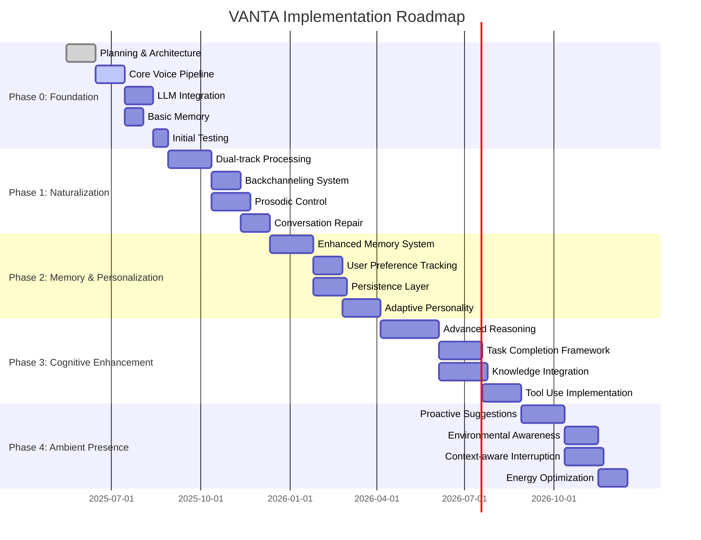

# Long-term Implementation Roadmap [DOC-DEV-ROAD-1]

## Introduction

This document outlines the long-term implementation roadmap for the VANTA (Voice-based Ambient Neural Thought Assistant) project. It describes a phased approach to development, with clear milestones and deliverables for each phase. The roadmap spans from initial prototype to a fully-featured ambient voice assistant.

## Implementation Philosophy

The VANTA implementation follows these guiding principles:

1. **Incremental Development**: Build core functionality first, then add capabilities iteratively
2. **Continuous Integration**: Maintain a working system at all times, even with limited features
3. **User-Centered Design**: Prioritize natural interaction and user experience over technical features
4. **Flexible Architecture**: Design components to be replaceable as technologies evolve
5. **Performance Focus**: Optimize for responsiveness over comprehensive capabilities

## Phased Implementation Approach

### Phase 0: Foundation (Current Phase)

**Focus**: Establish basic voice interaction with minimal intelligence.

**Timeline**: 2 months

**Key Deliverables**:
- Working voice pipeline (STT + TTS)
- Basic LLM integration (local and API)
- Simple conversation memory
- Core architecture implementation
- CI/CD pipeline

**Success Criteria**:
- System can reliably process speech input and generate speech output
- Local model responds within 1.5 seconds for simple queries
- API model integration works with < 3.0 second latency
- Conversation context is maintained across a single session
- System runs stably on target hardware (M4 MacBook Pro)

### Phase 1: Naturalization

**Focus**: Make conversations feel more natural and human-like.

**Timeline**: 3 months after Phase 0

**Key Deliverables**:
- Dual-track processing implementation (fast/slow paths)
- Backchanneling system ("uh-huh", "I see", etc.)
- Prosodic control (pauses, emphasis, intonation)
- Basic conversation repair mechanisms
- Improved voice activity detection

**Success Criteria**:
- System provides appropriate verbal feedback during user speech
- Speech output includes natural pauses and emphasis
- Turn-taking feels natural and not mechanical
- System can recover from common conversation breakdowns
- Voice detection accurately identifies when user is speaking

### Phase 2: Memory & Personalization

**Focus**: Enhance memory capabilities and adapt to individual users.

**Timeline**: 3 months after Phase 1

**Key Deliverables**:
- Enhanced semantic memory system
- User preference tracking
- Persistent memory across sessions
- Conversation summarization
- Adaptive personality system

**Success Criteria**:
- System recalls information from previous conversations
- User preferences are remembered and applied
- Long conversations are effectively summarized
- System adapts tone and style to match the user
- Memory retrieval remains fast even with extensive history

### Phase 3: Cognitive Enhancement

**Focus**: Improve reasoning capabilities and task handling.

**Timeline**: 4 months after Phase 2

**Key Deliverables**:
- Advanced reasoning engine
- Multi-turn task completion
- Knowledge integration framework
- Tool-use capabilities
- Improved disambiguation techniques

**Success Criteria**:
- System can reason through complex multi-step problems
- Tasks can be completed across multiple conversation turns
- External knowledge is appropriately integrated into responses
- System can use tools and APIs to complete tasks
- Ambiguous requests are handled gracefully with clarification

### Phase 4: Ambient Presence

**Focus**: Enable VANTA to function as an ambient presence.

**Timeline**: 3 months after Phase 3

**Key Deliverables**:
- Proactive suggestion system
- Environmental awareness
- Multi-modal interaction capabilities
- Context-aware interruption model
- Energy-efficient background operation

**Success Criteria**:
- System offers timely, relevant suggestions without being intrusive
- Awareness of time, location, and user activity affects interactions
- System can interact through multiple modalities appropriately
- Interruptions are context-sensitive and well-timed
- Battery impact is minimized during ambient operation

## Milestone Timeline

## Resource Requirements

| Phase | Development Resources | Hardware Requirements | External Dependencies |
|-------|----------------------|----------------------|------------------------|
| 0 | 1-2 ML Engineers, 1 Voice Specialist | M4 MacBook Pro (24GB) | Whisper API, LLM API access |
| 1 | 2 ML Engineers, 1 Voice Specialist, 1 UX Designer | M4 MacBook Pro (24GB) | Enhanced TTS capabilities |
| 2 | 2 ML Engineers, 1 Database Specialist | M4 MacBook Pro (24GB) | Vector database integration |
| 3 | 3 ML Engineers, 1 API Integration Specialist | M4 MacBook Pro (24GB), Optional GPU | Tool-use frameworks, API access |
| 4 | 2 ML Engineers, 1 Systems Engineer, 1 UX Designer | M4 MacBook Pro (24GB), Sensors | Environmental data sources |

## Alignment with Business Objectives

Each phase of implementation aligns with core business objectives:

1. **Phase 0**: Demonstrates technical feasibility and establishes platform
2. **Phase 1**: Improves user experience and satisfaction metrics
3. **Phase 2**: Enhances user retention through personalization
4. **Phase 3**: Expands utility and practical applications
5. **Phase 4**: Delivers the core vision of an ambient assistant

## Risk Management

| Risk Category | Mitigation Strategy |
|---------------|---------------------|
| Technical Performance | Continuous benchmarking, progressive feature enabling |
| User Adoption | Regular user testing, naturalization prioritization |
| Development Timeline | Modular approach allowing partial feature delivery |
| Resource Constraints | Cloud fallback options, adaptive resource usage |
| Integration Challenges | Standards-based interfaces, abstraction layers |

## Evaluation and Metrics

Each phase will be evaluated against the following metrics:

1. **Technical Performance**: Latency, resource usage, uptime
2. **User Experience**: Satisfaction ratings, task completion rates
3. **Conversation Quality**: Error rates, repair frequency, naturalness ratings
4. **Memory Effectiveness**: Recall accuracy, relevance of retrieved information
5. **Overall Value**: User retention, feature usage, new use cases enabled

## Next Steps

The immediate next steps are:

1. Complete detailed specifications for Phase 0 components
2. Establish development environment and toolchain
3. Implement core voice pipeline with STT/TTS integration
4. Develop and test local LLM integration
5. Create initial API integration with fallback mechanisms

## Version History

- v0.1.0 - 2025-05-17 - Initial creation [SES-V0-005]