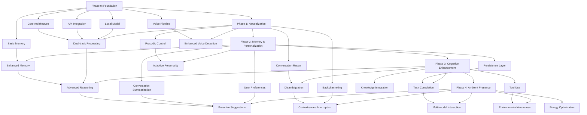

# Phased Implementation Approach [DOC-DEV-ROAD-2]

## Overview

This document provides a detailed breakdown of each implementation phase for the VANTA project. It describes the technical focus, component development priorities, and dependencies for each phase, serving as a guide for implementation planning.

## Phase 0: Foundation

### Focus Areas
- Establishing the core architecture and component interfaces
- Implementing basic voice input/output capabilities
- Creating local and API model integration
- Developing minimal conversation memory
- Setting up the development and testing environment

### Component Development

#### Voice Pipeline
- Speech-to-Text (Whisper) integration with M4 optimization
- Text-to-Speech basic integration with neutral voice
- Voice activity detection for conversation management
- Audio input/output stream handling and buffering
- Error handling for audio processing issues

#### Local Model Integration
- Quantized 7B model integration (llama.cpp or equivalent)
- Optimized inference for M4 architecture
- Context window management
- Simple prompt templates for conversation
- Performance monitoring and optimization

#### API Model Integration
- API client implementation for GPT/Claude
- Streaming response handling
- Error recovery and retry logic
- Cost monitoring and quota management
- Fallback mechanisms between API providers

#### Memory System (Basic)
- Conversation history storage
- Turn-based memory structure
- Basic serialization and persistence
- Memory pruning for context limits
- Simple retrieval by recency

#### Core Architecture
- LangGraph workflow implementation
- Component interface definitions
- Event-driven message passing
- State management system
- Configuration management

### Technical Considerations
- Focus on baseline performance over features
- Establish monitoring for all critical metrics
- Create clean interfaces between components
- Implement feature flags for progressive development
- Ensure robust error handling and recovery

### Exit Criteria
- Voice pipeline achieves <800ms latency for processing
- Local model responds within 1.5s for simple queries
- API integration works with <3.0s end-to-end latency
- System runs for 1+ hour without stability issues
- Memory correctly maintains context for a 10-turn conversation

## Phase 1: Naturalization

### Focus Areas
- Implementing dual-track processing architecture
- Adding backchanneling and active listening
- Enhancing speech prosody and naturalness
- Developing conversation repair mechanisms
- Improving voice detection and conversation flow

### Component Development

#### Dual-track Processing
- Router implementation for local/API path selection
- Parallel processing infrastructure
- Response integration system
- Prediction and preemption strategies
- State management across dual paths

#### Backchanneling System
- Conversational acknowledgment generation
- Context-appropriate feedback responses
- Timing control for natural insertion
- Non-verbal audio cues (mm-hmm, etc.)
- User speech monitoring for backchanneling triggers

#### Prosodic Control
- Speech rate variation implementation
- Emphasis and intonation markers
- Natural pausing patterns
- Emotional tone indicators
- Voice quality adjustments

#### Conversation Repair
- Error detection in conversation flow
- Clarification request generation
- Context recovery mechanisms
- Topic transition handling
- Misunderstanding management

#### Enhanced Voice Detection
- Improved voice activity detection accuracy
- Speaker recognition capabilities
- Background noise adaptation
- Interruption detection
- Low-latency activation response

### Technical Considerations
- Emphasize user testing for naturalness metrics
- Balance responsiveness with quality of interaction
- Ensure dual-track processing doesn't create inconsistent behavior
- Develop adaptive mechanisms based on conversation state
- Validate quality across different speaking styles and accents

### Exit Criteria
- System appropriately responds with backchannels during 90% of user pauses
- Speech output includes natural prosody judged as human-like in blind tests
- Conversation repair successfully recovers from 80% of common conversation issues
- Voice detection achieves 95% accuracy in normal environments
- Dual-track processing successfully routes 90% of queries to appropriate path

## Phase 2: Memory & Personalization

### Focus Areas
- Enhancing semantic memory capabilities
- Implementing user preference tracking
- Developing persistent memory across sessions
- Creating conversation summarization
- Building an adaptive personality system

### Component Development

#### Enhanced Memory System
- Vector database integration for semantic storage
- Hierarchical memory organization
- Importance-based memory retention
- Associative memory retrieval
- Cross-session memory context

#### User Preference Tracking
- Preference extraction from conversations
- Preference storage and schema
- Preference application to responses
- Uncertainty handling for preferences
- Progressive profile building

#### Persistence Layer
- Long-term storage architecture
- Memory compression and archiving
- Efficient loading and restoration
- Memory search and retrieval optimization
- Privacy controls and data management

#### Conversation Summarization
- Real-time conversation summarization
- Key point extraction
- Topic tracking and segmentation
- Entity and relationship tracking
- Reference resolution across conversations

#### Adaptive Personality
- Personality model implementation
- Style matching capabilities
- Mood and tone adaptation
- User relationship modeling
- Consistent personality representation

### Technical Considerations
- Balance memory richness with retrieval speed
- Ensure privacy and data security for persistent storage
- Develop efficient summarization that preserves critical details
- Create gradual personality adaptation that remains consistent
- Design for graceful degradation when memory load is high

### Exit Criteria
- System successfully recalls information from conversations 7+ days old
- User preferences are consistently applied across 90% of relevant interactions
- Memory retrieval maintains sub-500ms performance even with 100+ conversations
- Conversation summaries capture 90% of key points as judged by human evaluators
- Personality adaptation is noticed and rated positively by 80% of test users

## Phase 3: Cognitive Enhancement

### Focus Areas
- Improving reasoning capabilities
- Enabling multi-turn task completion
- Integrating knowledge sources
- Implementing tool-use capabilities
- Enhancing disambiguation techniques

### Component Development

#### Advanced Reasoning Engine
- Complex reasoning process implementation
- Multi-step thinking frameworks
- Uncertainty representation and management
- Explanation generation capabilities
- Cognitive bias mitigation

#### Task Completion Framework
- Task representation and tracking
- Progress monitoring and resumption
- Step decomposition and validation
- Resource allocation for tasks
- Task priority management

#### Knowledge Integration
- External knowledge source connections
- Knowledge retrieval and integration
- Source validation and conflict resolution
- Knowledge update mechanisms
- Domain-specific knowledge pluggability

#### Tool Use Implementation
- Tool interface definition framework
- Tool discovery and selection
- Parameter extraction and validation
- Result integration and explanation
- Tool execution monitoring

#### Disambiguation System
- Ambiguity detection in requests
- Clarification strategy selection
- Context-aware meaning resolution
- User intent prediction
- Conversational repair for ambiguity

### Technical Considerations
- Balance reasoning depth with response time
- Design task representation for persistence across sessions
- Implement safe and secure tool access
- Manage API usage for external knowledge sources
- Create smooth conversational flow despite complex reasoning

### Exit Criteria
- System successfully reasons through multi-step problems with 85% accuracy
- Tasks spanning multiple conversation turns complete successfully 80% of time
- Knowledge integration improves response quality in blind tests
- Tool usage successfully completes tasks in 90% of appropriate scenarios
- Ambiguous requests are correctly clarified in 85% of cases

## Phase 4: Ambient Presence

### Focus Areas
- Developing proactive suggestion capabilities
- Creating environmental awareness
- Implementing multi-modal interaction
- Building context-aware interruption model
- Optimizing for energy efficiency

### Component Development

#### Proactive Suggestion System
- Suggestion opportunity detection
- Relevance scoring algorithm
- Timing optimization for suggestions
- Non-intrusive delivery mechanisms
- User feedback incorporation

#### Environmental Awareness
- Time and schedule awareness
- Location context integration
- Device state monitoring
- Activity recognition integration
- Environmental condition sensing

#### Multi-modal Interaction
- Visual output capabilities
- Gestural input recognition
- Notification design system
- Modal context switching
- Degraded mode operation

#### Context-aware Interruption
- Interruption appropriateness modeling
- Urgency evaluation framework
- User attention state detection
- Graceful interruption techniques
- Recovery from interrupted state

#### Energy Optimization
- Tiered activation levels
- Selective component activation
- Background processing optimization
- Power state monitoring
- Adaptive resource allocation

### Technical Considerations
- Design proactive features to minimize annoyance
- Ensure privacy in environmental awareness
- Create coherent experience across interaction modes
- Develop interruption model that respects user focus
- Balance ambient functionality with battery impact

### Exit Criteria
- Proactive suggestions are rated as helpful by users 70% of time
- System appropriately adapts to time, location, and user activity
- Multi-modal interactions maintain context across mode switches
- Interruptions are rated as appropriate in 80% of instances
- Battery impact in ambient mode is less than 5% per hour

## Technical Dependencies

## Version History

- v0.1.0 - 2025-05-17 - Initial creation [SES-V0-005]