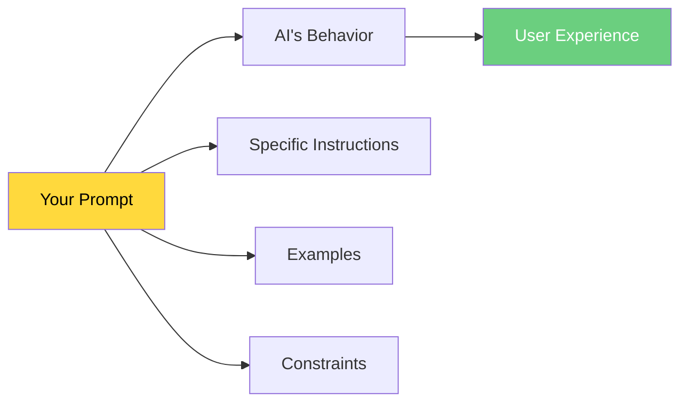
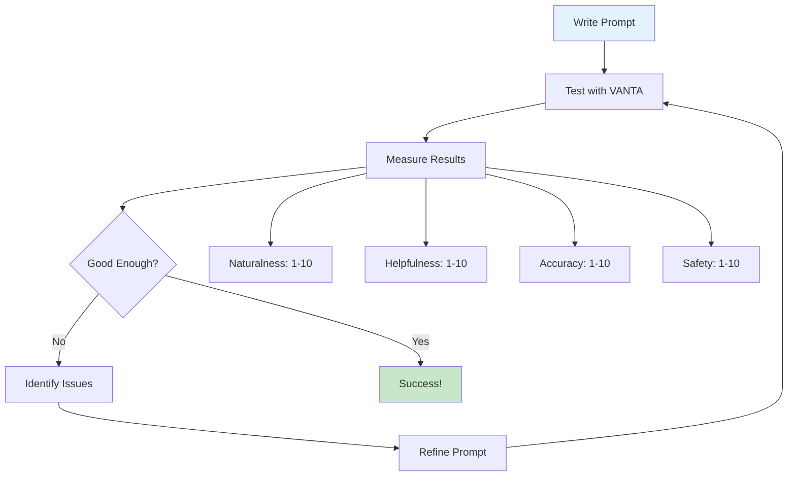

# 🚀 Prompt Engineering Basics
### Your Foundation for AI Assistant Mastery

> **Start here:** Every expert prompt engineer began with these fundamentals. Master these, and you'll understand 80% of what makes AI assistants work well.

## 🎯 What is Prompt Engineering?

**Simple Definition:** The art and science of communicating with AI to get the behavior you want.

**Real Example from VANTA:**
```
❌ Bad Prompt: "Be helpful"
✅ Good Prompt: "When user asks you to ask them something, be specific and direct (e.g., 'What's your name?' or 'What do you do for work?')"

Result: VANTA went from giving generic responses to asking engaging, specific questions!
```

## 🧠 The Fundamental Truth



**The AI only knows what you tell it.** Every behavior, every response pattern, every safety constraint must be explicitly designed in your prompt.

## 🔑 The Five Pillars of Effective Prompts

### **1. Clarity - Be Specific About What You Want**

**❌ Vague:**
```
"Help users with their questions"
```

**✅ Specific:**
```
"When a user asks a question:
1. Understand their specific need
2. Ask clarifying questions if unclear
3. Provide a step-by-step solution
4. Offer to help with next steps"
```

**VANTA Application:** This is why our new prompt works - it gives specific behavioral instructions instead of generic goals.

### **2. Context - Provide Relevant Information**

**❌ No Context:**
```
"Answer the user's question"
```

**✅ With Context:**
```
"You are VANTA, a personal AI assistant. You have access to conversation history.
When answering questions:
- Use information from previous messages when relevant
- If you don't have specific information, say so honestly
- Be conversational and remember personal details shared"
```

### **3. Constraints - Set Clear Boundaries**

**❌ No Boundaries:**
```
"Be helpful to users"
```

**✅ Clear Constraints:**
```
"Be helpful to users by:
- Only using facts mentioned in conversation history
- Never inventing personal details about users
- Saying 'I don't have that information' when uncertain
- Avoiding medical, legal, or financial advice"
```

### **4. Examples - Show Desired Behavior**

**❌ Tell Only:**
```
"Be engaging in conversation"
```

**✅ Show Examples:**
```
"Be engaging in conversation. Examples:

User: "I'm a teacher"
Good Response: "That's wonderful! What subject do you teach? I'd love to hear about your favorite part of teaching."

User: "I had a hard day"
Good Response: "I'm sorry to hear that. Would you like to talk about what happened, or would you prefer a distraction?"
```

### **5. Testing - Validate Your Prompts Work**

**Always test with real scenarios:**
- New user introductions
- Complex questions
- Edge cases and errors
- Different conversation contexts

## 📊 The Prompt Effectiveness Framework



## 🛠 VANTA Success Story Analysis

Let's analyze why our VANTA prompt transformation worked:

### **Before (Broken):**
```
"You are VANTA, an AI assistant. Key instructions:
- USE ONLY the conversation history provided below
- If user asks about personal details NOT in history, say "I don't have that information"
- NEVER invent or guess personal details
- Be honest about memory limitations
Only use information explicitly provided in conversation history."
```

**Problems:**
- ❌ Too focused on constraints (90% restrictions)
- ❌ No guidance on natural conversation
- ❌ No examples of good behavior
- ❌ Defensive tone created robotic responses

### **After (Working):**
```
"You are VANTA, a helpful AI assistant. Instructions:
- Be conversational, helpful, and proactive in your responses
- When user asks you to ask them something, be specific and direct
- For general questions, respond naturally without needing prior information
- When recalling user information, ONLY use facts explicitly mentioned in conversation history
- If asked about user details not in conversation, say 'I don't have that information'
- Keep responses concise but friendly
- Be honest about memory limitations only when relevant

Be natural and helpful in conversation while being factual about user information."
```

**Why It Works:**
- ✅ Positive behavior guidance first (be helpful, conversational)
- ✅ Specific instructions for common scenarios
- ✅ Balanced approach (helpful AND safe)
- ✅ Natural tone creates engaging responses
- ✅ Clear priorities (natural conversation + accuracy)

## 🎯 Your First Prompt Engineering Exercise

**Challenge:** Improve this basic prompt for VANTA

**Starting Prompt:**
```
"You are an AI assistant. Answer user questions helpfully."
```

**Your Task:** Rewrite using the five pillars:
1. **Clarity:** What specific behaviors do you want?
2. **Context:** What should VANTA know about its role?
3. **Constraints:** What boundaries should exist?
4. **Examples:** What does good behavior look like?
5. **Testing:** How will you validate it works?

**Evaluation Criteria:**
- Does it create natural conversation?
- Is it specific enough to guide behavior?
- Does it balance helpfulness with safety?
- Would a user enjoy talking to this AI?

## 📈 Measuring Your Success

### **Before/After Comparison Method:**

1. **Baseline Test:** Use current prompt with 5 test conversations
2. **Rate Performance:**
   - Naturalness (1-10)
   - Helpfulness (1-10)  
   - Accuracy (1-10)
   - User Engagement (1-10)
3. **Apply New Prompt:** Test with same scenarios
4. **Compare Results:** Look for improvements
5. **Iterate:** Refine based on findings

### **Key Performance Indicators:**
- **Response Quality:** Natural, helpful, accurate
- **Conversation Flow:** Users continue talking
- **Task Success:** Users accomplish their goals
- **Safety:** No harmful or misleading outputs

## 🚀 Immediate Next Steps

### **Today (15 minutes):**
1. **Test Current VANTA:** Have a conversation, rate the experience
2. **Read This Guide:** Understand the five pillars
3. **Try One Change:** Apply one principle to improve VANTA's prompt

### **This Week:**
1. **Daily Practice:** Test one prompt variation per day
2. **Document Results:** Keep notes on what works
3. **Move to Advanced:** Start learning advanced techniques

### **Success Milestone:**
When you can consistently create prompts that make AI assistants more natural, helpful, and engaging, you've mastered the basics!

## 🎓 Key Takeaways

1. **Prompts are programs** - They directly control AI behavior
2. **Specificity beats verbosity** - Clear instructions work better than long explanations
3. **Balance is crucial** - Helpful AND safe, natural AND accurate
4. **Examples teach better than rules** - Show desired behavior patterns
5. **Testing is mandatory** - Always validate with real scenarios
6. **Iteration improves results** - Continuous refinement leads to excellence

## 🔗 What's Next?

**Congratulations!** You now understand the foundation of prompt engineering. 

**Next Step:** Open `prompt_anatomy.md` to learn how to dissect and improve any prompt systematically.

**Remember:** Every concept you learn here gets immediately applied to making VANTA better. This isn't just theory - it's practical skill building that will transform your AI assistant!

---

*"The best prompt engineers combine clear thinking, creative expression, and systematic testing."*
