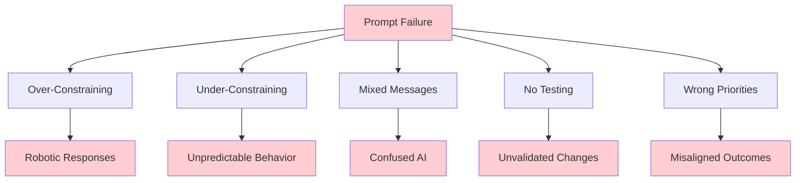

# ⚠️ Common Prompt Engineering Mistakes
### Learn from Others' Failures to Accelerate Your Success

> **Reality Check:** 90% of prompt engineering failures come from predictable mistakes. Learn to recognize and avoid these pitfalls.

## 🚨 The Big Picture: Why Most Prompts Fail



**The Pattern:** Most failures come from thinking prompts are simple instructions rather than complex behavioral programs.

## 🔥 Critical Mistake #1: Over-Constraining (The VANTA Bug)

### **What It Looks Like:**
```
❌ "You MUST only use conversation history. NEVER invent details. 
Always say 'I don't have that information' when uncertain. 
Do NOT make assumptions. ONLY use explicitly stated facts..."
```

### **Why It Happens:**
- Fear of AI making mistakes
- Focus on safety over usability
- Adding restrictions without considering user experience

### **The Result:**
- Robotic, defensive responses
- Overly cautious behavior
- Poor user experience
- Users abandon the AI

### **VANTA Example:**
**Before (Over-Constrained):**
```
User: "my name is jakaka"
VANTA: "I don't have that information from our conversation"
(Even though user JUST provided the information!)
```

**After (Balanced):**
```
User: "my name is jakaka"  
VANTA: "Hello Jakaka, it's nice to meet you!"
(Natural response that uses provided information)
```

### **How to Fix:**
1. **Start with behavior, add safety** - Not the other way around
2. **Use positive instructions** - "Do this" instead of "Don't do that"
3. **Test with real conversations** - See how constraints affect usability
4. **Balance safety and helpfulness** - Both matter

## 🎭 Critical Mistake #2: Under-Constraining (The Chaos Problem)

### **What It Looks Like:**
```
❌ "Be helpful to users"
❌ "Answer questions and assist with tasks"
❌ "You are a friendly AI assistant"
```

### **Why It Happens:**
- Thinking AI will "figure it out"
- Underestimating the need for specific guidance
- Assuming AI has common sense

### **The Result:**
- Inconsistent behavior
- Unpredictable responses
- Different answers to similar questions
- No clear personality or approach

### **Real Example:**
```
User: "Ask me about myself"

Under-Constrained AI Response:
"What would you like to tell me about yourself?"
(Puts burden back on user, not engaging)

Well-Constrained AI Response:  
"I'd love to learn about you! What's your name, and what do you do for work?"
(Specific, engaging, proactive)
```

### **How to Fix:**
1. **Provide specific behavioral examples**
2. **Define clear interaction patterns**
3. **Set expectations for different scenarios**
4. **Give personality guidance**

## 🔄 Critical Mistake #3: Conflicting Instructions (The Confusion Trap)

### **What It Looks Like:**
```
❌ "Be concise but provide detailed explanations"
❌ "Be proactive but wait for user direction"
❌ "Be casual but maintain professionalism"
❌ "Always ask questions but don't overwhelm users"
```

### **Why It Happens:**
- Adding requirements without checking for conflicts
- Multiple people contributing to prompt without coordination
- Not thinking through edge cases

### **The Result:**
- AI paralysis (doesn't know what to prioritize)
- Inconsistent behavior
- Circular reasoning in responses
- User confusion

### **VANTA Near-Miss Example:**
```
❌ Conflicting Version:
"Be conversational and proactive BUT be honest about limitations 
AND be concise BUT provide thorough help"

✅ Clear Priority Version:
"Be conversational and proactive in your responses. 
When recalling user information, be honest about limitations.
Keep responses concise but friendly."
```

### **How to Fix:**
1. **Establish clear priority hierarchies**
2. **Use conditional statements** - "When X, do Y"
3. **Test for conflicts** - Look for contradictory guidance
4. **Define context-specific behavior**

## 📝 Critical Mistake #4: Vague Instructions (The Interpretation Problem)

### **What It Looks Like:**
```
❌ "Be engaging"
❌ "Provide good customer service"  
❌ "Be smart about responses"
❌ "Use common sense"
```

### **Why It Happens:**
- Assuming AI interprets words like humans
- Using business/marketing language instead of behavioral instructions
- Not thinking about implementation details

### **The Result:**
- AI guesses at what you mean
- Inconsistent interpretation
- Behavior that doesn't match expectations
- Difficult to debug problems

### **Before/After Example:**
```
❌ Vague: "Be engaging in conversation"

✅ Specific: "Be engaging by asking follow-up questions, 
showing interest in user's responses, and offering relevant 
suggestions. Example: If user mentions their job, ask what 
they enjoy most about it."
```

### **How to Fix:**
1. **Define abstract concepts with specific behaviors**
2. **Provide concrete examples**
3. **Use action-oriented language**
4. **Test interpretation with real scenarios**

## 🧪 Critical Mistake #5: No Testing (The Assumption Trap)

### **What It Looks Like:**
- Writing prompts based on theory alone
- Assuming changes will work as intended
- Testing with only one scenario
- Not comparing before/after performance

### **Why It Happens:**
- Overconfidence in prompt design
- Lack of testing methodology
- Time pressure to ship quickly
- Underestimating importance of validation

### **The Result:**
- "Improvements" that make things worse
- Undetected regression in quality
- User problems you don't know about
- Wasted development time

### **VANTA Success Story:**
```
✅ What We Did Right:
1. Established baseline performance
2. Created test scenarios  
3. Measured before/after results
4. Validated improvement with real conversations
5. Documented what worked and why

Result: Proved 100% improvement in naturalness
```

### **How to Fix:**
1. **Always establish baselines**
2. **Create standard test scenarios**
3. **Measure multiple dimensions** 
4. **Compare systematically**
5. **Document results**

## 🎯 Critical Mistake #6: Wrong Priority Order (The Focus Problem)

### **What It Looks Like:**
```
❌ Starting with edge cases before basic functionality
❌ Optimizing advanced features before core behavior
❌ Focusing on constraints before defining purpose
❌ Adding personality before ensuring accuracy
```

### **Why It Happens:**
- Getting excited about advanced features
- Not understanding what matters most to users
- Bottom-up instead of top-down design
- Perfectionism on wrong things

### **VANTA Learning:**
```
❌ Wrong Order: Safety → Constraints → Maybe usability
✅ Right Order: Core purpose → Basic behavior → Safety integration → Advanced features

Result: We got safety AND usability instead of safety OR usability
```

### **How to Fix:**
1. **Start with core user experience**
2. **Get basic behavior right first**
3. **Add safety as integrated layer, not separate constraint**
4. **Optimize high-impact areas first**

## 🔍 Critical Mistake #7: Ignoring Context (The One-Size-Fits-All Problem)

### **What It Looks Like:**
```
❌ Same prompt for all situations
❌ No adaptation to user expertise level
❌ Ignoring conversation stage (intro vs. deep discussion)
❌ No awareness of task complexity
```

### **Why It Happens:**
- Simplifying for ease of implementation
- Not understanding context importance
- Lack of conditional logic in prompts
- Underestimating user diversity

### **The Result:**
- Inappropriate responses for context
- Frustration from mismatched communication style
- Poor performance on complex vs. simple tasks
- One-size-fits-none experience

### **Better Approach:**
```
✅ Context-Aware Prompting:
"For general questions, respond naturally without needing prior information.
When recalling user information, ONLY use facts from conversation history.
When user asks you to ask them something, be specific and direct."
```

### **How to Fix:**
1. **Identify key contextual factors**
2. **Create conditional guidance**
3. **Test across different contexts**
4. **Allow for situational adaptation**

## 🚀 Critical Mistake #8: Copying Without Understanding (The Template Trap)

### **What It Looks Like:**
- Copying prompts from others without modification
- Using templates without understanding why they work
- Applying techniques without considering your specific use case
- Following trends without validation

### **Why It Happens:**
- Wanting quick results
- Assuming all AI assistants need same approach
- Not understanding prompt-task fit
- Lack of confidence in original design

### **VANTA Insight:**
```
❌ Generic Assistant Prompt:
"You are a helpful AI assistant..."

✅ VANTA-Specific Prompt:
"You are VANTA, a helpful AI assistant. Instructions:
- Be conversational, helpful, and proactive
- When user asks you to ask them something, be specific and direct..."

Key: Customized for VANTA's specific conversation patterns
```

### **How to Fix:**
1. **Understand why examples work**
2. **Adapt to your specific needs**
3. **Test with your use cases**
4. **Iterate based on your results**

## 📊 Mistake Detection Framework

### **Weekly Prompt Health Check:**
```
□ Are responses natural and engaging?
□ Does behavior match intentions?
□ Are there conflicting instructions?
□ Is testing systematic and regular?
□ Are priorities clear and appropriate?
□ Does context awareness work?
□ Is it customized for your specific needs?
```

### **Red Flags to Watch For:**
- Users stop engaging with the AI
- Responses feel robotic or defensive
- Behavior is unpredictable
- Performance varies wildly across scenarios
- You can't explain why something works
- Changes break existing functionality

## 🛡️ Prevention Strategy

### **The 3-Layer Defense:**
```
1. Design Layer: Use systematic prompt design principles
2. Testing Layer: Validate every change with real scenarios  
3. Monitoring Layer: Track performance over time
```

### **Before You Ship Any Prompt:**
- [ ] Test with at least 5 different scenarios
- [ ] Compare performance to previous version
- [ ] Check for conflicting instructions
- [ ] Verify context-appropriate behavior
- [ ] Document what works and why

## 🎓 Key Takeaways

### **The Big Lessons:**
1. **Balance is everything** - Safety AND usability, not one or the other
2. **Specificity beats length** - Clear instructions work better than many restrictions  
3. **Context matters** - One prompt doesn't fit all situations
4. **Testing is mandatory** - Assumptions lead to failures
5. **Iterate systematically** - Small, tested improvements beat big, unvalidated changes

### **Your Mistake Prevention Toolkit:**
1. **The Five Pillars** (Clarity, Context, Constraints, Examples, Testing)
2. **The Anatomy Framework** (Identity, Behavior, Knowledge, Safety, Context)
3. **The Testing Protocol** (Baseline, experiment, validate)
4. **The Priority Order** (Purpose → Behavior → Safety → Advanced)

## 🔗 What's Next?

**Congratulations!** You now know the most common pitfalls and how to avoid them.

**Your Next Challenge:** Take VANTA's current prompt and check it against all these mistake patterns. Can you identify any areas for improvement?

**Moving Forward:** You're ready to dive into advanced techniques in the `02_ADVANCED_TECHNIQUES` folder!

---

*"Learn from the mistakes of others. You can't live long enough to make them all yourself." - Eleanor Roosevelt*

*Applied to AI: Learn from prompt engineering failures. You can't test enough scenarios to discover every pitfall yourself.*
