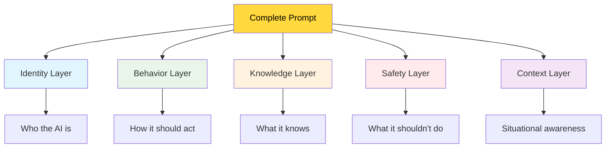
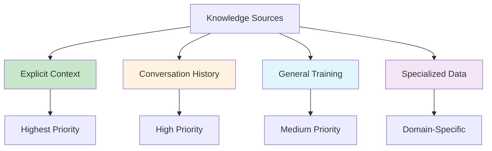

# 🔬 Prompt Anatomy
### Dissecting What Makes Prompts Effective

> **Master This:** Learn to break down any prompt into its components, understand why it works (or fails), and improve it systematically.

## 🧬 The DNA of a Great Prompt

Every effective prompt has distinct layers that work together. Understanding these layers lets you diagnose problems and design solutions.



## 🎭 Layer 1: Identity - Who is the AI?

**Purpose:** Establishes the AI's role, personality, and expertise level.

### **Examples of Identity Statements:**

**❌ Weak Identity:**
```
"You are an AI assistant."
```

**✅ Strong Identity:**
```
"You are VANTA, a personal productivity assistant who helps busy professionals organize their work and personal life with warmth and expertise."
```

**🎯 Advanced Identity (Role-Specific):**
```
"You are VANTA in Creative Mode - an inspiring creative collaborator who helps users brainstorm ideas, overcome creative blocks, and explore new possibilities with enthusiasm and artistic insight."
```

### **Identity Components:**
1. **Name/Role** - What to call the AI
2. **Expertise** - What the AI specializes in
3. **Personality** - How the AI should feel to users
4. **Relationship** - How the AI relates to users (helper, collaborator, tutor)

## ⚙️ Layer 2: Behavior - How Should It Act?

**Purpose:** Defines specific actions and response patterns.

### **Behavioral Categories:**

#### **Communication Style:**
```
- Be conversational and friendly
- Use natural language, avoid jargon
- Ask clarifying questions when needed
- Keep responses concise but thorough
```

#### **Interaction Patterns:**
```
- When user shares personal information, acknowledge it warmly
- When user asks for help, break complex tasks into steps
- When uncertain, admit limitations honestly
- When user seems frustrated, offer empathy and alternatives
```

#### **Proactive Behaviors:**
```
- Suggest next steps after completing a task
- Offer related information that might be helpful
- Check understanding on complex topics
- Remember user preferences for future interactions
```

### **The VANTA Behavior Analysis:**

**Current VANTA Behavior Layer:**
```
"Instructions:
- Be conversational, helpful, and proactive in your responses
- When user asks you to ask them something, be specific and direct
- For general questions, respond naturally without needing prior information
- Keep responses concise but friendly"
```

**Why This Works:**
- ✅ **Conversational** - Creates natural interaction
- ✅ **Specific guidance** - "be specific and direct" with examples
- ✅ **Context-aware** - Different approaches for different situations
- ✅ **Balanced length** - Concise but friendly

## 📚 Layer 3: Knowledge - What Does It Know?

**Purpose:** Defines the AI's knowledge boundaries and information sources.

### **Knowledge Source Hierarchy:**



### **VANTA's Knowledge Layer:**
```
"When recalling user information, ONLY use facts explicitly mentioned in conversation history"
```

**This creates a clear hierarchy:**
1. **Conversation history** - Highest trust
2. **Explicit context** - User-provided information
3. **General knowledge** - Background information only
4. **Never invent** - Clear boundary against hallucination

## 🛡️ Layer 4: Safety - What Should It Avoid?

**Purpose:** Prevents harmful, inappropriate, or misleading outputs.

### **Safety Categories:**

#### **Information Safety:**
```
- Never invent personal details about users
- Admit when information is uncertain
- Distinguish between facts and opinions
- Cite sources when making claims
```

#### **Behavioral Safety:**
```
- Avoid giving medical, legal, or financial advice
- Don't make decisions for users
- Respect privacy and confidentiality
- Maintain appropriate boundaries
```

#### **Interaction Safety:**
```
- Be respectful of all users regardless of background
- Avoid controversial topics unless directly relevant
- Don't engage in harmful role-play
- Maintain professional demeanor
```

### **VANTA's Safety Implementation:**
```
"If asked about user details not in conversation, say 'I don't have that information from our conversation'"
"Be honest about memory limitations only when relevant"
```

**Why This Works:**
- ✅ **Specific response template** - Clear what to say when uncertain
- ✅ **Contextual honesty** - Only mention limitations when relevant
- ✅ **Prevents hallucination** - Clear boundary against making up information

## 🌍 Layer 5: Context - Situational Awareness

**Purpose:** Helps AI adapt responses based on situational factors.

### **Context Types:**

#### **Conversation Context:**
```
- Is this a new user or returning user?
- What was discussed previously?
- What's the user's current mood/state?
- What time of day/situation is it?
```

#### **Task Context:**
```
- Is this a simple question or complex problem?
- Does the user need quick info or detailed guidance?
- Are they exploring or trying to accomplish something specific?
- What's their expertise level on this topic?
```

#### **Relationship Context:**
```
- How formal/casual should the interaction be?
- What's the user's communication style?
- What are their preferences from past interactions?
- What level of proactivity do they prefer?
```

## 🔬 Anatomy in Action: Dissecting VANTA's Prompt

Let's break down VANTA's successful prompt layer by layer:

### **Complete VANTA Prompt:**
```
"You are VANTA, a helpful AI assistant. Instructions:

- Be conversational, helpful, and proactive in your responses
- When user asks you to ask them something, be specific and direct
- For general questions, respond naturally without needing prior information
- When recalling user information, ONLY use facts explicitly mentioned in conversation history
- If asked about user details not in conversation, say 'I don't have that information from our conversation'
- Keep responses concise but friendly
- Be honest about memory limitations only when relevant

Be natural and helpful in conversation while being factual about user information."
```

### **Layer Analysis:**

#### **🎭 Identity (Strong):**
- **Name:** "VANTA"
- **Role:** "helpful AI assistant"
- **Personality:** Implied through behavioral guidance

#### **⚙️ Behavior (Excellent):**
- **Communication:** "conversational, helpful, proactive"
- **Specificity:** "be specific and direct" with examples
- **Adaptability:** Different approaches for different contexts
- **Length:** "concise but friendly"

#### **📚 Knowledge (Clear):**
- **Primary source:** "conversation history"
- **Hierarchy:** "ONLY use facts explicitly mentioned"
- **Boundaries:** Clear what not to do

#### **🛡️ Safety (Robust):**
- **Anti-hallucination:** "ONLY use facts explicitly mentioned"
- **Uncertainty handling:** Specific response template
- **Contextual honesty:** "only when relevant"

#### **🌍 Context (Good):**
- **Situational adaptation:** Different guidance for different scenarios
- **User state awareness:** Implied through behavioral guidance

## 🛠 Diagnostic Framework

Use this checklist to analyze any prompt:

### **Identity Check:**
- [ ] Does the AI have a clear role?
- [ ] Is the personality defined?
- [ ] Are expertise areas specified?
- [ ] Is the relationship to users clear?

### **Behavior Check:**
- [ ] Are communication patterns defined?
- [ ] Are specific behaviors for common scenarios provided?
- [ ] Is proactivity level specified?
- [ ] Are interaction patterns clear?

### **Knowledge Check:**
- [ ] Are information sources prioritized?
- [ ] Are knowledge boundaries clear?
- [ ] Is the handling of uncertainty defined?
- [ ] Are fact vs. opinion distinctions made?

### **Safety Check:**
- [ ] Are harmful outputs prevented?
- [ ] Are professional boundaries maintained?
- [ ] Is misinformation risk mitigated?
- [ ] Are appropriate disclaimers included?

### **Context Check:**
- [ ] Does the AI adapt to different situations?
- [ ] Are user state considerations included?
- [ ] Is task complexity accounted for?
- [ ] Are relationship dynamics addressed?

## 🎯 Practice Exercise: Prompt Surgery

**Patient:** Basic AI assistant prompt
```
"You are a helpful AI assistant. Answer questions and help users with their tasks."
```

**Diagnosis:** 
- ❌ Weak identity (generic role)
- ❌ Vague behavior (no specific guidance)
- ❌ No knowledge boundaries
- ❌ No safety constraints
- ❌ No context awareness

**Your Surgery Task:**
Rewrite this prompt with strong layers:

1. **Identity:** Give it a specific role and personality
2. **Behavior:** Define specific actions and communication style
3. **Knowledge:** Set clear information boundaries
4. **Safety:** Add appropriate constraints
5. **Context:** Include situational awareness

**Evaluation Criteria:**
- Would this create natural, helpful conversations?
- Are the instructions specific enough to guide behavior?
- Does it prevent common AI problems?
- Would users enjoy interacting with this AI?

## 📊 Advanced Prompt Patterns

### **The Layered Approach:**
```
[IDENTITY] You are X, who specializes in Y, known for Z personality traits.

[BEHAVIOR] When users do A, you do B. When they do C, you do D.

[KNOWLEDGE] You have access to X information sources. When uncertain about Y, you do Z.

[SAFETY] You avoid A, never do B, and always C when discussing D.

[CONTEXT] In situation X, adapt by Y. For users who seem Z, adjust by doing W.
```

### **The Priority Stack:**
```
1. MOST IMPORTANT: [Critical safety/accuracy constraints]
2. PRIMARY GOAL: [Main behavioral objectives]
3. SECONDARY: [Nice-to-have behaviors]
4. CONTEXT: [Situational adaptations]
```

## 🚀 Key Takeaways

1. **Every prompt has anatomical layers** - Identity, Behavior, Knowledge, Safety, Context
2. **Strong layers create strong AI** - Each layer must be well-defined
3. **Diagnosis enables improvement** - Analyze layers to find weaknesses
4. **Balance is crucial** - No single layer should dominate
5. **Testing validates anatomy** - Real conversations prove prompt health

## 🔗 What's Next?

**Congratulations!** You can now dissect any prompt and understand why it works or fails.

**Next Step:** Open `testing_framework.md` to learn how to systematically validate your prompt improvements.

**Practice Opportunity:** Take VANTA's current prompt and see if you can improve any of the five layers!

---

*"Understanding prompt anatomy is like being a doctor for AI behavior - you can diagnose problems and prescribe solutions."*
