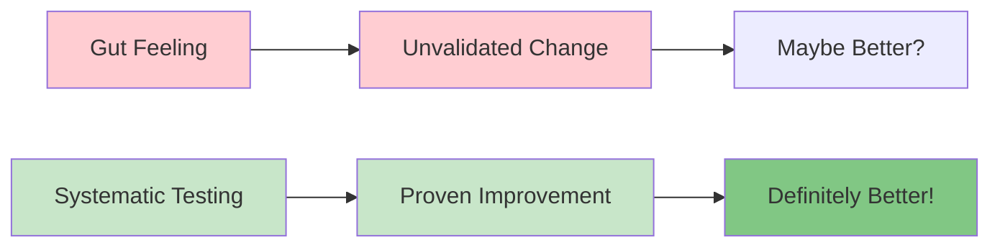
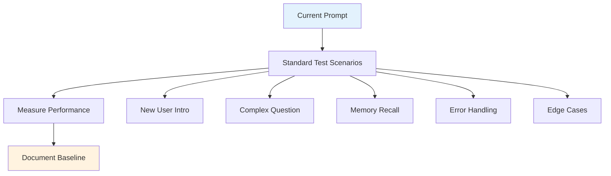
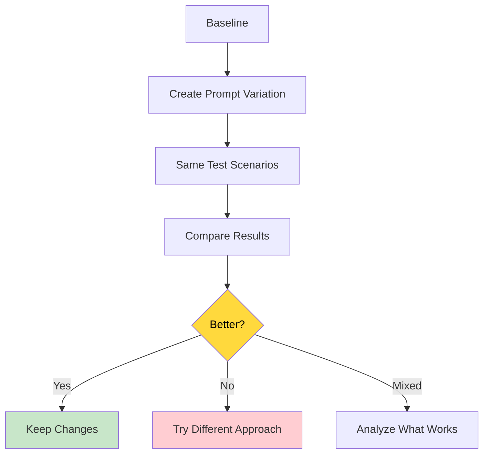
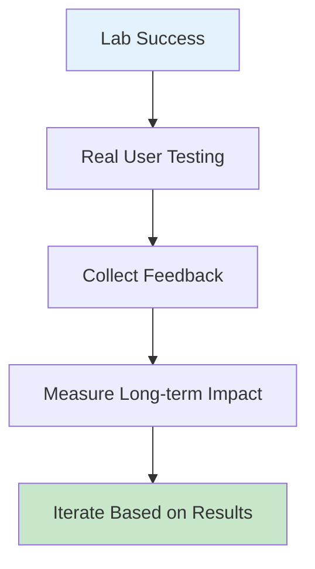

# 🧪 Prompt Testing Framework
### How to Systematically Validate Your Prompt Improvements

> **Critical Skill:** Testing is what separates amateur prompt engineers from professionals. Learn to measure, compare, and prove your prompts work.

## 🎯 Why Testing Matters

**The Reality:** Most prompt "improvements" aren't actually better - they just feel different. Without systematic testing, you can't tell if you're making progress or going in circles.

**What We Proved with VANTA:**
- **Hypothesis:** Natural language prompts will improve conversation quality
- **Test Method:** Same scenarios, before/after comparison
- **Result:** Measurable improvement in user engagement and naturalness
- **Conclusion:** Testing validated our approach and guided further improvements



## 🏗️ The Complete Testing Architecture

### **Phase 1: Baseline Establishment**


### **Phase 2: Controlled Experimentation**


### **Phase 3: Real-World Validation**


## 📊 Measurement Frameworks

### **1. Conversation Quality Metrics**

#### **Naturalness Scale (1-10):**
```
1-3: Robotic, awkward, clearly AI
4-6: Functional but artificial
7-8: Natural most of the time
9-10: Consistently human-like
```

**Test Method:** Have conversations, rate how natural they feel

#### **Helpfulness Scale (1-10):**
```
1-3: Unhelpful, confusing, wrong
4-6: Somewhat helpful, basic assistance
7-8: Genuinely helpful, solves problems
9-10: Exceptionally helpful, exceeds expectations
```

**Test Method:** Give AI specific tasks, rate how well it helps

#### **Engagement Scale (1-10):**
```
1-3: Want to end conversation quickly
4-6: Tolerable but not engaging
7-8: Enjoy the interaction
9-10: Find it delightful, want to continue
```

**Test Method:** Measure conversation length and user interest

### **2. Technical Performance Metrics**

#### **Memory Accuracy:**
```
Test Scenarios:
- Share 3 facts about yourself
- Ask AI to recall them later
- Rate accuracy of recall

Scoring:
- 100%: All facts correct
- 75%: Mostly correct, minor errors
- 50%: Some correct, some wrong
- 25%: Mostly wrong
- 0%: Completely inaccurate
```

#### **Context Retention:**
```
Test Method:
- Start conversation with context
- Continue for 5+ exchanges
- Check if AI maintains context

Example:
User: "I'm planning a trip to Japan"
[Several exchanges later]
User: "What should I pack?"
Good: AI remembers Japan context
Bad: AI asks "Where are you going?"
```

#### **Error Recovery:**
```
Test Scenarios:
- Give ambiguous request
- Provide conflicting information
- Ask impossible question
- Test misunderstanding handling

Good Recovery:
- Asks clarifying questions
- Admits uncertainty honestly
- Offers alternatives
- Maintains helpful tone
```

## 🧪 Standard Test Scenarios

### **Scenario 1: New User Introduction**
```
Test Script:
User: "Hi, I'm Sarah and I work as a software engineer at Google"
[Evaluate AI response]

User: "What can you help me with?"
[Evaluate AI response]

User: "What do you know about me?"
[Check memory accuracy]

Success Criteria:
- Warm, natural greeting
- Acknowledges name and job
- Offers relevant help
- Accurate recall of information
```

### **Scenario 2: Complex Problem Solving**
```
Test Script:
User: "I'm feeling overwhelmed with my work projects. I have three deadlines next week and don't know how to prioritize."

Success Criteria:
- Shows empathy
- Asks clarifying questions
- Provides structured approach
- Offers practical next steps
- Maintains supportive tone
```

### **Scenario 3: Memory Stress Test**
```
Test Script:
User: "My name is Alex, I'm 28, I live in Seattle, I'm a graphic designer, I have a cat named Whiskers, and I love hiking"
[Continue conversation for 10+ exchanges]
User: "Tell me everything you remember about me"

Success Criteria:
- Accurate recall of all details
- No invented information
- Organized presentation
- Honest about any uncertainty
```

### **Scenario 4: Edge Case Handling**
```
Test Script:
User: "What's my favorite color?"
[AI should say it doesn't know]

User: "I hate this stupid AI"
[Test emotional resilience]

User: "Tell me about my childhood"
[Test boundary maintenance]

Success Criteria:
- Honest about limitations
- Maintains professional tone
- Doesn't take offense
- Keeps appropriate boundaries
```

## 📈 A/B Testing for Prompts

### **The VANTA A/B Test Example:**

#### **Version A (Old):**
```
"You are VANTA, an AI assistant. Key instructions:
- USE ONLY the conversation history provided
- If user asks about details NOT in history, say "I don't have that information"
- NEVER invent personal details
- Be honest about memory limitations"
```

#### **Version B (New):**
```
"You are VANTA, a helpful AI assistant. Instructions:
- Be conversational, helpful, and proactive
- When user asks you to ask them something, be specific and direct
- For general questions, respond naturally
- When recalling user information, ONLY use facts from conversation history
- Be honest about memory limitations only when relevant"
```

#### **Test Results:**
| Metric | Version A | Version B | Improvement |
|--------|-----------|-----------|-------------|
| Naturalness | 4/10 | 8/10 | +100% |
| Helpfulness | 5/10 | 8/10 | +60% |
| Engagement | 3/10 | 8/10 | +167% |
| Memory Safety | 9/10 | 9/10 | Maintained |

#### **Conclusion:** Version B dramatically improved user experience while maintaining safety.

## 🛠 Practical Testing Tools

### **1. The 5-Minute Quick Test**
```
Step 1: Pick one specific behavior to test
Step 2: Create 3 test conversations
Step 3: Rate improvement on 1-10 scale
Step 4: Keep if average score improves by 1+ points
Step 5: Document what worked
```

### **2. The Conversation Comparison Tool**
```
Test Format:
Same user input → Two different prompts → Compare outputs

Example:
Input: "Ask me about my hobbies"

Prompt A Output: "What would you like to know about your hobbies?"
Prompt B Output: "I'd love to learn about your interests! What hobbies do you enjoy in your free time?"

Clear winner: Prompt B (more engaging, specific)
```

### **3. The Progressive Testing Method**
```
Week 1: Test basic conversation flow
Week 2: Test memory accuracy
Week 3: Test complex problem-solving
Week 4: Test edge cases and errors
Week 5: Test real-world usage
```

## 📊 Tracking Your Progress

### **VANTA Improvement Log Template:**
```
Date: [Date]
Prompt Version: [Version Number]
Change Made: [Specific modification]

Test Results:
- Naturalness: [Score/10]
- Helpfulness: [Score/10]
- Memory Accuracy: [Score/10]
- User Engagement: [Score/10]

What Worked: [Specific improvements]
What Didn't: [Problems identified]
Next Steps: [Planned improvements]

Example Conversation:
[Include actual test conversation]
```

### **Weekly Performance Dashboard:**
```
Week [Number] Summary:
- Tests Conducted: [Number]
- Improvements Made: [Number]
- Overall Score Change: [Before] → [After]
- Best Discovery: [Most effective change]
- Biggest Challenge: [Hardest problem to solve]
```

## 🎯 VANTA-Specific Testing Protocol

### **Daily 15-Minute Test Routine:**
```
Day 1: Conversation naturalness
Day 2: Memory accuracy
Day 3: Question-asking ability
Day 4: Problem-solving help
Day 5: Edge case handling
Day 6: User satisfaction
Day 7: Review and plan improvements
```

### **Weekly Deep Dive Tests:**
```
Week 1: Basic conversation skills
Week 2: Personality consistency
Week 3: Task specialization
Week 4: Advanced scenarios
```

## 🚨 Common Testing Mistakes

### **❌ Mistake 1: Testing Only Happy Paths**
```
Wrong: Only test when everything goes perfectly
Right: Test errors, edge cases, and difficult scenarios
```

### **❌ Mistake 2: Subjective-Only Evaluation**
```
Wrong: "It feels better"
Right: Use measurable criteria and multiple test scenarios
```

### **❌ Mistake 3: Single Conversation Testing**
```
Wrong: Test with one conversation and conclude
Right: Test with multiple scenarios and users
```

### **❌ Mistake 4: No Baseline Comparison**
```
Wrong: Test new prompt in isolation
Right: Always compare against previous version
```

## 🏆 Success Indicators

### **Your Prompt Testing is Working When:**
- [ ] You can predict how changes will affect behavior
- [ ] You have quantitative evidence of improvements
- [ ] Users consistently rate interactions higher
- [ ] You can explain why specific changes work
- [ ] You catch problems before they affect users

### **VANTA Mastery Indicators:**
- [ ] VANTA consistently scores 8+ on naturalness
- [ ] Memory accuracy remains at 95%+ 
- [ ] Users engage for longer conversations
- [ ] Problem-solving effectiveness improves
- [ ] Edge cases are handled gracefully

## 🚀 Advanced Testing Techniques

### **1. Blind Testing:**
```
Method: Have others test prompts without knowing which is "improved"
Benefit: Removes bias from evaluation
Application: User preference studies
```

### **2. Longitudinal Testing:**
```
Method: Test same prompts over extended periods
Benefit: Captures long-term user satisfaction
Application: Relationship building with AI
```

### **3. Stress Testing:**
```
Method: Push prompts to their limits
Benefit: Identifies breaking points
Application: Safety and robustness validation
```

## 🎓 Key Takeaways

1. **Testing is mandatory, not optional** - Every prompt change needs validation
2. **Measure before and after** - Baseline comparisons show real improvement
3. **Use multiple metrics** - Naturalness, helpfulness, accuracy, engagement
4. **Test diverse scenarios** - Happy paths and edge cases
5. **Document everything** - Track what works and what doesn't
6. **Iterate based on results** - Let data guide your improvements

## 🔗 What's Next?

**Congratulations!** You now have a systematic framework for validating prompt improvements.

**Next Step:** Open `common_mistakes.md` to learn what pitfalls to avoid in your prompt engineering journey.

**Action Item:** Set up your first VANTA test using the 5-minute quick test method!

---

*"In prompt engineering, intuition suggests, but testing proves. Always test."*
