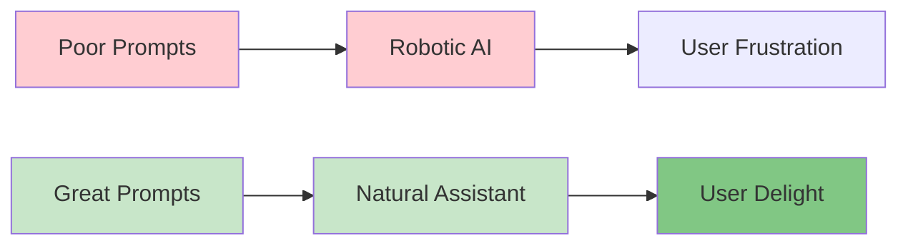
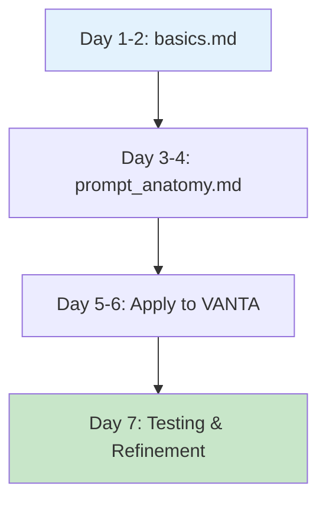
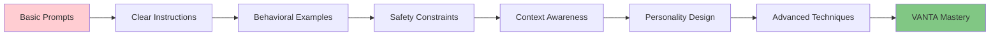

# 🔥 Prompt Engineering Mastery
### The #1 Skill for AI Assistant Excellence

> **Critical Insight:** 90% of VANTA's quality comes from prompt design. Master this, master AI assistance.

## ⚡ Why This Matters Most

**What we just proved with VANTA:**
- **Before:** Robotic, defensive, unusable responses
- **After:** Natural, helpful, engaging conversations  
- **The difference:** A well-crafted system prompt

**Your prompt engineering skills directly determine:**
- How natural VANTA sounds in conversation
- How accurately VANTA recalls information
- How helpful VANTA is at solving problems
- How safe and trustworthy VANTA behaves
- How engaging users find the experience



## 🗂️ Complete Learning Structure

### **📚 [01_FUNDAMENTALS](./01_FUNDAMENTALS/)**
**Master the core principles that make prompts effective**

```
01_FUNDAMENTALS/
├── basics.md              ← Start here! Core concepts
├── prompt_anatomy.md      ← Dissect what makes prompts work
├── testing_framework.md   ← How to measure prompt effectiveness
├── common_mistakes.md     ← Avoid these pitfalls
└── daily_exercises.md     ← Practice makes perfect
```

### **🚀 [02_ADVANCED_TECHNIQUES](./02_ADVANCED_TECHNIQUES/)**
**Cutting-edge methods used by top AI companies**

```
02_ADVANCED_TECHNIQUES/
├── chain_of_thought.md       ← Make AI think step-by-step
├── constitutional_ai.md      ← Build helpful, harmless, honest AI
├── few_shot_learning.md      ← Teach through examples
├── prompt_chaining.md        ← Connect multiple prompts
├── role_playing.md           ← Give AI specific personas
└── context_injection.md     ← Smart context management
```

### **🎯 [03_VANTA_SPECIFIC](./03_VANTA_SPECIFIC/)**
**Prompts tailored specifically for VANTA's success**

```
03_VANTA_SPECIFIC/
├── conversation_prompts.md   ← Natural dialog prompts
├── memory_safety.md          ← Accurate recall without hallucination
├── personality_design.md     ← VANTA's character development
├── task_specialization.md    ← Prompts for different use cases
├── error_recovery.md         ← Handle mistakes gracefully
└── user_adaptation.md       ← Adapt to individual users
```

### **🧪 [04_PRACTICAL_EXERCISES](./04_PRACTICAL_EXERCISES/)**
**Hands-on practice with immediate VANTA application**

```
04_PRACTICAL_EXERCISES/
├── daily_practice.md         ← 15-minute daily routines
├── ab_testing.md            ← Compare prompt variations
├── scenario_testing.md      ← Test edge cases and difficult situations
├── improvement_tracking.md  ← Measure your progress
├── real_conversations.md    ← Test with actual users
└── iterative_refinement.md  ← Continuous improvement process
```

### **📖 [05_RESOURCES](./05_RESOURCES/)**
**External learning materials and communities**

```
05_RESOURCES/
├── research_papers.md       ← Latest academic findings
├── tools_and_platforms.md   ← Testing and development tools
├── communities.md           ← Join expert communities
├── books_and_courses.md     ← Structured learning materials
└── prompt_libraries.md      ← Collections of proven prompts
```

## 🎯 Learning Path for Maximum Impact

### **Week 1: Foundation Mastery**


**Daily Commitment:** 30 minutes study + 15 minutes VANTA testing

### **Week 2: Advanced Techniques**
Focus on the techniques that will have the biggest impact on VANTA:
1. **Constitutional AI** - For safety and helpfulness
2. **Few-shot learning** - For consistent behavior
3. **Chain-of-thought** - For complex reasoning

### **Week 3: VANTA Specialization**
Apply everything learned to create VANTA-specific prompts:
- Conversation flow optimization
- Memory accuracy improvement  
- Personality consistency
- Task-specific adaptations

## 🏆 Success Metrics

### **Conversation Quality Improvements:**
- **Naturalness Score:** 1-10 rating of how human-like VANTA sounds
- **Helpfulness Rating:** User satisfaction with problem-solving
- **Memory Accuracy:** Correct recall of user information
- **Engagement Time:** How long users continue conversations

### **Technical Metrics:**
- **Response Relevance:** How well responses match user intent
- **Context Retention:** Maintaining conversation context
- **Error Rate:** Frequency of misunderstandings
- **Safety Compliance:** Avoiding harmful outputs

## 🚀 Quick Wins for Immediate Impact

### **30-Minute Challenge:**
1. **Read:** `01_FUNDAMENTALS/basics.md` (15 min)
2. **Apply:** Test one technique with VANTA (10 min)
3. **Measure:** Rate the improvement (5 min)

### **This Week's Goal:**
Transform VANTA from a good assistant to an exceptional one through prompt engineering mastery.

## 🔧 VANTA-Specific Focus Areas

### **Current VANTA Strengths to Enhance:**
- ✅ Memory safety (accurate recall)
- ✅ Conversational tone
- ✅ LangGraph integration

### **Areas for Dramatic Improvement:**
- 🎯 **Proactive engagement** (asking better questions)
- 🎯 **Emotional intelligence** (understanding user mood)
- 🎯 **Task specialization** (adapting to different needs)
- 🎯 **Personality consistency** (reliable character traits)

## 📈 Progressive Skill Building



## 🎓 What You'll Master

By completing this module, you'll be able to:

1. **Design prompts that create natural conversation flow**
2. **Build safety constraints that prevent harmful outputs**
3. **Create consistent AI personalities**
4. **Optimize prompts for specific tasks and contexts**
5. **Test and iterate on prompt effectiveness**
6. **Apply cutting-edge techniques from top AI labs**
7. **Transform VANTA into a world-class AI assistant**

---

## 🏁 Ready to Start?

**Your next step:** Open `01_FUNDAMENTALS/basics.md` and begin your journey to prompt engineering mastery!

**Remember:** Every technique you learn gets immediately tested with VANTA. This isn't just theory - it's practical skill building that will directly improve your AI assistant.

**Time Investment:** 2-3 weeks of focused learning = Months of VANTA improvement acceleration
