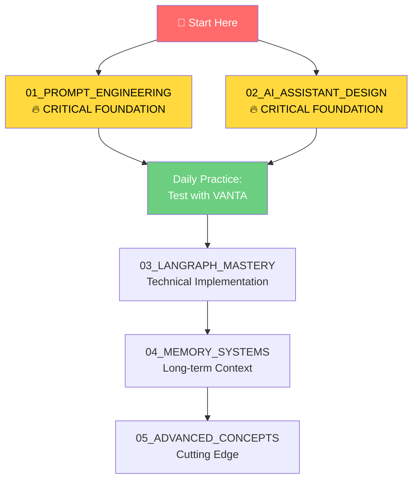

# 🎓 VANTA Education Library
### Complete Learning Path for AI Assistant Mastery

> **Your mission:** Transform VANTA from good to extraordinary through mastering the fundamental skills of AI assistant development.

## 🚀 Quick Start for Immediate Impact

**Week 1 Priority:** Focus entirely on these foundational areas:
- **[01_PROMPT_ENGINEERING](./01_PROMPT_ENGINEERING/)** - The #1 skill for AI assistant quality
- **[02_AI_ASSISTANT_DESIGN](./02_AI_ASSISTANT_DESIGN/)** - The art of creating engaging AI personalities



## 📚 Foundation-Heavy Learning Structure

### 🔥 **PHASE 1: CRITICAL FOUNDATIONS (Weeks 1-3)**

#### **[01_PROMPT_ENGINEERING](./01_PROMPT_ENGINEERING/)** 
**⚡ THE MOST IMPORTANT SKILL**
```
01_PROMPT_ENGINEERING/
├── 01_FUNDAMENTALS/
│   ├── basics.md
│   ├── prompt_anatomy.md
│   ├── testing_framework.md
│   └── common_mistakes.md
├── 02_ADVANCED_TECHNIQUES/
│   ├── chain_of_thought.md
│   ├── constitutional_ai.md
│   ├── few_shot_learning.md
│   └── prompt_chaining.md
├── 03_VANTA_SPECIFIC/
│   ├── conversation_prompts.md
│   ├── memory_safety.md
│   ├── personality_design.md
│   └── task_specialization.md
├── 04_PRACTICAL_EXERCISES/
│   ├── daily_practice.md
│   ├── ab_testing.md
│   ├── scenario_testing.md
│   └── improvement_tracking.md
└── 05_RESOURCES/
    ├── research_papers.md
    ├── tools_and_platforms.md
    └── communities.md
```

#### **[02_AI_ASSISTANT_DESIGN](./02_AI_ASSISTANT_DESIGN/)**
**🎭 THE ART OF AI PERSONALITY**
```
02_AI_ASSISTANT_DESIGN/
├── 01_PERSONALITY_DEVELOPMENT/
│   ├── character_design.md
│   ├── voice_and_tone.md
│   ├── behavioral_patterns.md
│   └── consistency_framework.md
├── 02_CONVERSATION_DESIGN/
│   ├── dialog_flow.md
│   ├── natural_patterns.md
│   ├── error_recovery.md
│   └── context_management.md
├── 03_USER_EXPERIENCE/
│   ├── interaction_principles.md
│   ├── engagement_strategies.md
│   ├── accessibility.md
│   └── multi_modal_design.md
├── 04_PSYCHOLOGY_PRINCIPLES/
│   ├── human_computer_interaction.md
│   ├── cognitive_load.md
│   ├── trust_building.md
│   └── emotional_intelligence.md
├── 05_VANTA_APPLICATION/
│   ├── current_analysis.md
│   ├── target_personality.md
│   ├── improvement_roadmap.md
│   └── implementation_guide.md
└── 06_CASE_STUDIES/
    ├── successful_assistants.md
    ├── failure_analysis.md
    └── lessons_learned.md
```

### ⚙️ **PHASE 2: TECHNICAL MASTERY (Weeks 4-6)**

- **[03_LANGRAPH_MASTERY](./03_LANGRAPH_MASTERY/)** - Advanced workflow systems
- **[04_MEMORY_SYSTEMS](./04_MEMORY_SYSTEMS/)** - Persistent conversation context
- **[05_MODEL_INTEGRATION](./05_MODEL_INTEGRATION/)** - Local + cloud model harmony

### 🧠 **PHASE 3: ADVANCED CONCEPTS (Weeks 7-8)**

- **[06_ADVANCED_CONCEPTS](./06_ADVANCED_CONCEPTS/)** - Constitutional AI, RLHF, multi-agent
- **[07_PRACTICAL_PROJECTS](./07_PRACTICAL_PROJECTS/)** - Build testing and analytics systems

## 🎯 Learning Philosophy

### **80/20 Rule Applied:**
- **80% of VANTA's improvement** comes from mastering prompts and personality design
- **20% comes from** advanced technical features

### **Immediate Application:**
- Every concept learned gets **immediately tested with VANTA**
- **Daily experimentation** with prompt variations
- **Weekly personality refinements** based on learnings

## 📊 Success Tracking

### **Week 1 Goals:**
- [ ] Complete `01_PROMPT_ENGINEERING/01_FUNDAMENTALS/`
- [ ] Test 5 different prompt variations with VANTA
- [ ] Measure conversation quality improvement
- [ ] Start `02_AI_ASSISTANT_DESIGN/01_PERSONALITY_DEVELOPMENT/`

### **Week 2 Goals:**
- [ ] Master advanced prompting techniques
- [ ] Design VANTA's target personality
- [ ] Implement conversation flow improvements
- [ ] Document what works vs. what doesn't

### **Week 3 Goals:**
- [ ] Build systematic testing framework
- [ ] Apply psychological principles to VANTA
- [ ] Create specialized prompts for different use cases
- [ ] Measure user satisfaction improvements

## 🔥 High-Impact Daily Practice

### **15-Minute Daily Routine:**
1. **5 min:** Read one education section
2. **5 min:** Test new prompt with VANTA
3. **5 min:** Document results and insights

### **Weekly Deep Dive:**
1. **Choose one major topic** (e.g., personality design)
2. **Read all related materials**
3. **Implement with VANTA**
4. **Test with real conversations**
5. **Refine based on results**

## 🚀 Getting Started RIGHT NOW

### **Your Next 30 Minutes:**
1. **[START HERE: 01_PROMPT_ENGINEERING/01_FUNDAMENTALS/basics.md](./01_PROMPT_ENGINEERING/01_FUNDAMENTALS/basics.md)**
2. **Test one prompt improvement with VANTA**
3. **See immediate results**

### **This Week's Focus:**
- Master the fundamentals of prompt engineering
- Apply every technique to VANTA immediately
- Build the habit of systematic testing and improvement

---

**🎯 Remember:** Every hour spent mastering prompts and personality design will multiply VANTA's effectiveness. Start with the foundations, apply immediately, and watch VANTA transform!

**Current Priority:** Focus 90% of your learning time on sections 01 and 02 for maximum impact.
