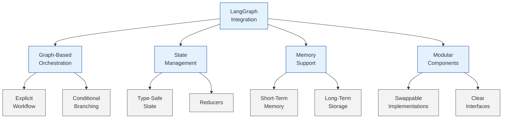
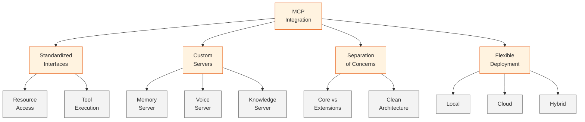
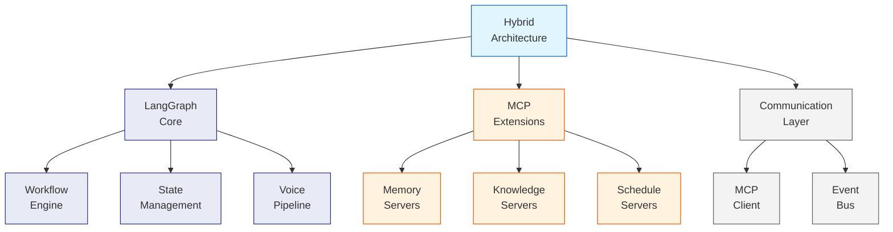
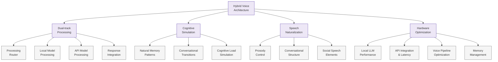
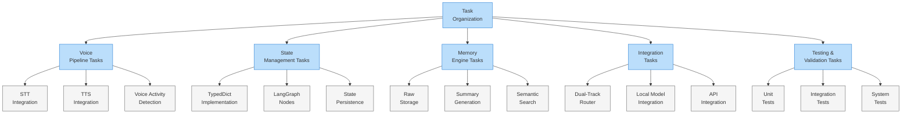
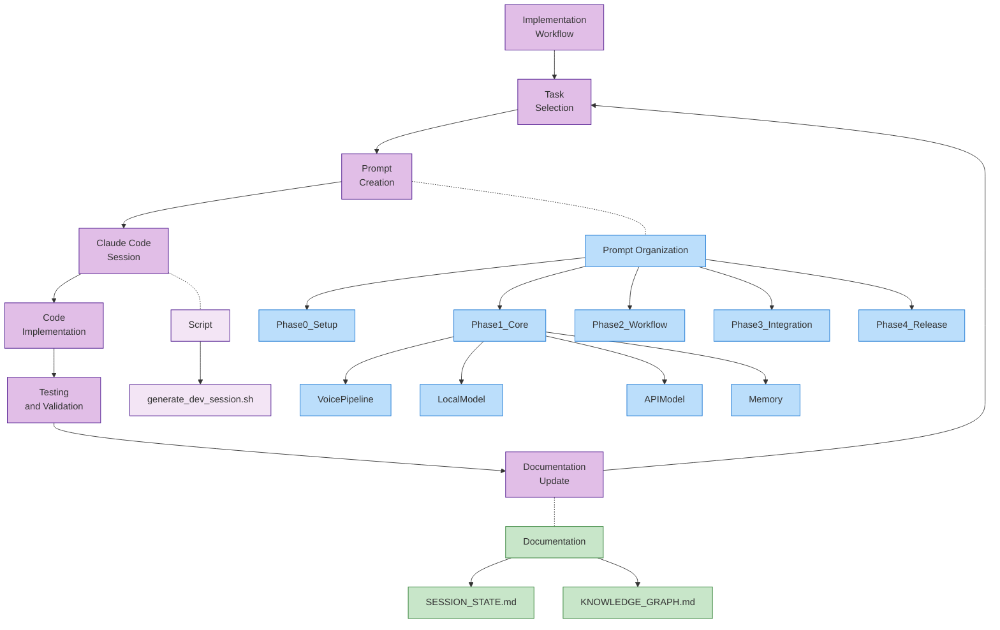
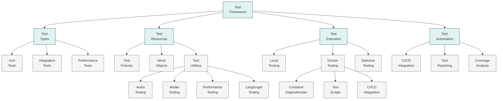

# Knowledge Graph

## Core Concepts

- CON-MET-001: **VISTA Methodology**
  - Definition: Versatile Intelligent System for Technical Acceleration - a comprehensive system for creating and managing hierarchical documentation across multiple sessions
  - Related: CON-MET-002, CON-MET-003, CON-MET-004
  - Documents: DOC-001

- CON-MET-002: **Documentation Hierarchy**
  - Definition: Structured documentation layers for different audience technical levels (Executive, Management, Technical, Development)
  - Related: CON-MET-001
  - Documents: Not yet created

- CON-MET-003: **Session Continuity**
  - Definition: Maintaining perfect knowledge transfer between planning sessions
  - Related: CON-MET-001
  - Documents: Not yet created

- CON-MET-004: **Implementation Planning**
  - Definition: Organizing development into discrete, manageable tasks
  - Related: CON-MET-001
  - Documents: DOC-IMP-001
  
- CON-MET-005: **Knowledge Persistence**
  - Definition: Maintaining SESSION_STATE.md and KNOWLEDGE_GRAPH.md across planning sessions
  - Related: CON-MET-001, CON-MET-003
  - Documents: Not yet created

- CON-PRJ-001: **VANTA Project**
  - Definition: Voice-based Ambient Neural Thought Assistant - project to be designed from scratch using VISTA methodology
  - Related: CON-MET-001, CON-TECH-001
  - Documents: DOC-TECH-VIS-1

- CON-TECH-001: **Model Context Protocol**
  - Definition: An open protocol that standardizes how applications provide context to LLMs, enabling two-way connections between data sources and AI-powered tools
  - Related: CON-TECH-002, CON-TECH-003, CON-TECH-004
  - Documents: DOC-TECH-MCP-1, DOC-RESEARCH-MCP-1, DOC-RESEARCH-MCP-2
  - External Reference: /Users/vigil-313/workplace/MCP_DOCS/

- CON-TECH-002: **MCP Architecture**
  - Definition: The overall system design of MCP showing how clients, servers, and LLMs interact
  - Related: CON-TECH-001, CON-TECH-003, CON-TECH-004
  - Documents: DOC-TECH-MCP-1
  - External Reference: /Users/vigil-313/workplace/MCP_DOCS/Concepts/Core Architecture.md

- CON-TECH-003: **MCP Clients**
  - Definition: Protocol clients that maintain 1:1 connections with MCP servers
  - Related: CON-TECH-001, CON-TECH-002, CON-TECH-004
  - Documents: DOC-TECH-MCP-1
  - External Reference: /Users/vigil-313/workplace/MCP_DOCS/Get Started/Example Clients.md

- CON-TECH-004: **MCP Servers**
  - Definition: Lightweight programs that expose specific capabilities through the Model Context Protocol
  - Related: CON-TECH-001, CON-TECH-002, CON-TECH-003
  - Documents: DOC-TECH-MCP-1, DOC-RESEARCH-MCP-2
  - External Reference: /Users/vigil-313/workplace/MCP_DOCS/Get Started/Example Servers.md

- CON-TECH-005: **LangGraph**
  - Definition: A framework for orchestrating workflows with LLMs, featuring state management and graph-based processing
  - Related: CON-TECH-006, CON-TECH-007, CON-TECH-008
  - Documents: DOC-RESEARCH-LG-1
  - External Reference: /Users/vigil-313/workplace/VANTA-ALPHA/langgraph/

- CON-TECH-006: **Graph-Based Workflow**
  - Definition: Organizing processing flows as directed graphs with nodes and edges for explicit control flow
  - Related: CON-TECH-005, CON-TECH-007
  - Documents: DOC-RESEARCH-LG-1

- CON-TECH-007: **State Management**
  - Definition: Maintaining and transitioning state during processing workflow execution
  - Related: CON-TECH-005, CON-TECH-006
  - Documents: DOC-RESEARCH-LG-1

- CON-TECH-008: **Persistence Layer**
  - Definition: Mechanisms for maintaining state across sessions and recovering from interruptions
  - Related: CON-TECH-005, CON-TECH-007
  - Documents: DOC-RESEARCH-LG-1

- CON-VANTA-001: **Voice Pipeline**
  - Definition: System component that handles audio input/output processing, speech recognition, and speech synthesis
  - Related: CON-VANTA-005, CON-VANTA-006
  - Documents: DOC-TECH-VIS-1, DOC-COMP-001

- CON-VANTA-002: **Memory Engine**
  - Definition: System for storing, retrieving, and managing conversation history and knowledge
  - Related: CON-VANTA-007
  - Documents: DOC-TECH-VIS-1

- CON-VANTA-003: **Activation Modes**
  - Definition: Different methods for initiating interaction with VANTA (continuous, wake word, programmatic)
  - Related: CON-VANTA-001
  - Documents: DOC-COMP-001

- CON-VANTA-004: **Deployment Model**
  - Definition: Application architecture approach as a background service with optional UI
  - Related: CON-VANTA-008
  - Documents: DOC-ARCH-001

- CON-VANTA-005: **Speech-to-Text**
  - Definition: Component for converting spoken language to text using Whisper or other engines
  - Related: CON-VANTA-001
  - Documents: DOC-COMP-001

- CON-VANTA-006: **Text-to-Speech**
  - Definition: Component for converting text to spoken audio output using potentially CSM or other engines
  - Related: CON-VANTA-001
  - Documents: DOC-COMP-001

- CON-VANTA-007: **Layered Memory**
  - Definition: Approach to memory that includes raw logs, summaries, and semantic indices
  - Related: CON-VANTA-002
  - Documents: DOC-ARCH-002

- CON-VANTA-008: **Docker Environment**
  - Definition: Containerized development and deployment environment for VANTA
  - Related: CON-VANTA-004, CON-IMP-011
  - Documents: DOC-ARCH-001

- CON-VANTA-009: **Hybrid Architecture**
  - Definition: Combination of LangGraph for orchestration and MCP for extensibility in VANTA architecture
  - Related: CON-TECH-001, CON-TECH-005
  - Documents: DOC-RESEARCH-MCP-1, DOC-RESEARCH-SUM-1, DOC-ARCH-001

- CON-VANTA-010: **MCP Server Ecosystem**
  - Definition: Collection of specialized MCP servers designed for VANTA functionality
  - Related: CON-TECH-004, CON-VANTA-009
  - Documents: DOC-RESEARCH-MCP-2, DOC-ARCH-001

- CON-HVA-001: **Dual-track Processing**
  - Definition: Using local models for immediate responses while cloud APIs handle complex reasoning
  - Related: CON-HVA-010, CON-HVA-011, CON-HVA-012, CON-VANTA-009
  - Documents: DOC-RESEARCH-HVA-1, DOC-RESEARCH-HVA-2, DOC-RESEARCH-HVA-3, DOC-COMP-002

- CON-HVA-002: **Cognitive Simulation**
  - Definition: Replicating human thought patterns including epiphanic moments, memory retrieval, and natural speech cadence
  - Related: CON-HVA-006, CON-HVA-007, CON-HVA-008
  - Documents: DOC-RESEARCH-HVA-2

- CON-HVA-003: **Hardware Optimization**
  - Definition: Making efficient use of available computing resources (M4 MacBook Pro)
  - Related: CON-HVA-015, CON-HVA-017, CON-HVA-018
  - Documents: DOC-RESEARCH-HVA-1, DOC-RESEARCH-HVA-3, DOC-RESEARCH-HVA-5

- CON-HVA-004: **Latency Management**
  - Definition: Creating the perception of real-time conversation despite processing delays
  - Related: CON-HVA-001, CON-HVA-016
  - Documents: DOC-RESEARCH-HVA-1, DOC-RESEARCH-HVA-3, DOC-RESEARCH-HVA-5

- CON-HVA-005: **Prosody Control**
  - Definition: Implementing natural pauses, emphasis, and rhythm in speech output
  - Related: CON-HVA-014
  - Documents: DOC-RESEARCH-HVA-1, DOC-RESEARCH-HVA-4

- CON-HVA-006: **Natural Memory Patterns**
  - Definition: Simulating human memory characteristics like recency, primacy, and associative recall
  - Related: CON-HVA-002, CON-VANTA-007
  - Documents: DOC-RESEARCH-HVA-2

- CON-HVA-007: **Conversational Transitions**
  - Definition: Natural language transitions between topics and thought processes
  - Related: CON-HVA-002, CON-HVA-013
  - Documents: DOC-RESEARCH-HVA-2, DOC-RESEARCH-HVA-4

- CON-HVA-008: **Cognitive Load Simulation**
  - Definition: Modeling human-like cognitive resource allocation and limitations
  - Related: CON-HVA-002
  - Documents: DOC-RESEARCH-HVA-2

- CON-HVA-009: **Processing Router**
  - Definition: Component that determines which model (local or API) should handle each aspect of conversation
  - Related: CON-HVA-001, CON-HVA-010, CON-HVA-011
  - Documents: DOC-RESEARCH-HVA-3, DOC-COMP-002

- CON-HVA-010: **Local Model Processing**
  - Definition: Fast, lightweight language model running on device for immediate responses
  - Related: CON-HVA-001, CON-HVA-009, CON-HVA-015
  - Documents: DOC-RESEARCH-HVA-3, DOC-COMP-002

- CON-HVA-011: **API Model Processing**
  - Definition: Cloud-based language model for complex reasoning and novel insights
  - Related: CON-HVA-001, CON-HVA-009, CON-HVA-016
  - Documents: DOC-RESEARCH-HVA-3, DOC-COMP-002

- CON-HVA-012: **Response Integration**
  - Definition: Component that combines outputs from both processing streams into coherent conversation
  - Related: CON-HVA-001, CON-HVA-010, CON-HVA-011
  - Documents: DOC-RESEARCH-HVA-3, DOC-COMP-002

- CON-HVA-013: **Conversational Structure**
  - Definition: Implementation of natural conversation patterns including turn-taking and repair mechanisms
  - Related: CON-HVA-007, CON-HVA-014
  - Documents: DOC-RESEARCH-HVA-4

- CON-HVA-014: **Social Speech Elements**
  - Definition: Features that enhance social aspects of conversation including backchanneling and emotional mirroring
  - Related: CON-HVA-005, CON-HVA-013
  - Documents: DOC-RESEARCH-HVA-4

- CON-HVA-015: **Local LLM Performance**
  - Definition: Strategies to optimize local language model performance within hardware constraints
  - Related: CON-HVA-003, CON-HVA-010
  - Documents: DOC-RESEARCH-HVA-5

- CON-HVA-016: **API Integration and Latency**
  - Definition: Techniques for managing API latency while maintaining conversational flow
  - Related: CON-HVA-004, CON-HVA-011
  - Documents: DOC-RESEARCH-HVA-5

- CON-HVA-017: **Voice Pipeline Optimization**
  - Definition: Strategies for achieving low-latency speech processing with high quality
  - Related: CON-HVA-003, CON-VANTA-001
  - Documents: DOC-RESEARCH-HVA-5

- CON-HVA-018: **Memory Management**
  - Definition: Techniques for maintaining conversation context within memory constraints
  - Related: CON-HVA-003, CON-VANTA-007
  - Documents: DOC-RESEARCH-HVA-5

- CON-IMP-001: **Phased Implementation**
  - Definition: Breaking down VANTA development into progressive phases from foundation to ambient presence
  - Related: CON-IMP-002, CON-IMP-003, CON-IMP-004, CON-IMP-005
  - Documents: DOC-IMP-001, DOC-ROADMAP-001

- CON-IMP-002: **Foundation Phase**
  - Definition: Initial phase focusing on core voice interaction capabilities with minimal intelligence
  - Related: CON-IMP-001, CON-VANTA-001
  - Documents: DOC-ROADMAP-001, DOC-PHASE-001

- CON-IMP-003: **Naturalization Phase**
  - Definition: Phase focusing on making conversations feel more natural and human-like
  - Related: CON-IMP-001, CON-HVA-005, CON-HVA-013, CON-HVA-014
  - Documents: DOC-ROADMAP-001, DOC-PHASE-001

- CON-IMP-004: **Memory & Personalization Phase**
  - Definition: Phase focusing on enhancing memory capabilities and adapting to individual users
  - Related: CON-IMP-001, CON-VANTA-002, CON-VANTA-007, CON-HVA-006
  - Documents: DOC-ROADMAP-001, DOC-PHASE-001

- CON-IMP-005: **Cognitive Enhancement Phase**
  - Definition: Phase focusing on improving reasoning capabilities and task handling
  - Related: CON-IMP-001, CON-HVA-002, CON-HVA-008
  - Documents: DOC-ROADMAP-001, DOC-PHASE-001

- CON-IMP-006: **Ambient Presence Phase**
  - Definition: Final phase enabling VANTA to function as an ambient presence in the user's environment
  - Related: CON-IMP-001, CON-HVA-002, CON-HVA-013
  - Documents: DOC-ROADMAP-001, DOC-PHASE-001

- CON-IMP-007: **Task Structure**
  - Definition: Standardized format for implementation tasks with VISTA identifiers, dependencies, and validation criteria
  - Related: CON-MET-004, CON-IMP-008
  - Documents: DOC-IMP-001, DOC-TASK-001

- CON-IMP-008: **Task Dependencies**
  - Definition: Formal relationships between tasks indicating which tasks must be completed before others can begin
  - Related: CON-IMP-007
  - Documents: DOC-IMP-001 

- CON-IMP-009: **Implementation Milestones**
  - Definition: Key achievements and checkpoints in the implementation process
  - Related: CON-IMP-001, CON-IMP-007
  - Documents: DOC-IMP-001, DOC-ROADMAP-001

- CON-IMP-010: **Implementation Prompts**
  - Definition: Structured guidance for Claude Code to implement specific tasks following the VISTA methodology
  - Related: CON-IMP-007, CON-MET-004, CON-IMP-011, CON-IMP-012, CON-IMP-013
  - Documents: DOC-IMP-001, DOC-PROMPT-001

- CON-IMP-011: **Docker Environment Setup**
  - Definition: Configuration of containerized development environment with all dependencies for VANTA
  - Related: CON-VANTA-008, CON-IMP-002
  - Documents: DOC-PROMPT-ENV-002

- CON-IMP-012: **Model Preparation**
  - Definition: Download, conversion, and management of machine learning models for VANTA development
  - Related: CON-HVA-010, CON-HVA-011, CON-VANTA-005, CON-VANTA-006, CON-IMP-015, CON-IMP-016
  - Documents: DOC-PROMPT-ENV-003, DOC-IMP-002

- CON-IMP-015: **Model Registry**
  - Definition: Centralized tracking system for managing model metadata, versions, and verification
  - Related: CON-IMP-012, CON-IMP-016
  - Documents: DOC-IMP-002

- CON-IMP-016: **Model Management Tools**
  - Definition: Scripts and utilities for downloading, verifying, and testing machine learning models
  - Related: CON-IMP-012, CON-IMP-015
  - Documents: DOC-IMP-002

- CON-IMP-013: **Test Framework**
  - Definition: Comprehensive testing infrastructure for validating VANTA components and overall system
  - Related: CON-IMP-007, CON-IMP-014, CON-TEST-001, CON-TEST-002, CON-TEST-003
  - Documents: DOC-PROMPT-ENV-004, DOC-DEV-TEST-1

- CON-IMP-014: **Validation Criteria**
  - Definition: Specific requirements that must be met for a task to be considered successfully implemented
  - Related: CON-IMP-007, CON-IMP-013
  - Documents: DOC-IMP-001, DOC-TASK-001

- CON-ARCH-001: **TypedDict State Model**
  - Definition: Type-safe state management for conversation context using Python's TypedDict
  - Related: CON-TECH-007, CON-VANTA-007
  - Documents: DOC-ARCH-002

- CON-ARCH-002: **LangGraph Node Pattern**
  - Definition: Standard pattern for implementing processing components as LangGraph nodes with explicit inputs/outputs
  - Related: CON-TECH-006, CON-TECH-007
  - Documents: DOC-ARCH-003

- CON-ARCH-003: **Event Bus Pattern**
  - Definition: Communication pattern for asynchronous messaging between components
  - Related: CON-VANTA-009, CON-TECH-007
  - Documents: DOC-ARCH-003

- CON-ARCH-004: **Repository Pattern**
  - Definition: Data access pattern for consistent storage and retrieval operations
  - Related: CON-VANTA-007
  - Documents: DOC-ARCH-003

- CON-ARCH-005: **Adapter Pattern**
  - Definition: Design pattern for interfacing with external systems and handling format conversions
  - Related: CON-VANTA-009, CON-TECH-001
  - Documents: DOC-ARCH-003

- CON-DEV-001: **Prompt Organization**
  - Definition: Hierarchical structure for organizing implementation prompts by phase and component
  - Related: CON-IMP-010, CON-DEV-002
  - Documents: DOC-PROMPT-001

- CON-DEV-002: **Development Workflow**
  - Definition: Process for implementing VANTA components using Claude Code with VISTA methodology
  - Related: CON-DEV-001, CON-MET-001
  - Documents: DOC-PROMPT-001

- CON-TEST-001: **Unit Testing**
  - Definition: Testing individual components in isolation with mocked dependencies
  - Related: CON-IMP-013, CON-TEST-004, CON-TEST-006
  - Documents: DOC-DEV-TEST-1

- CON-TEST-002: **Integration Testing**
  - Definition: Testing interactions between multiple components to ensure proper communication
  - Related: CON-IMP-013, CON-TEST-004
  - Documents: DOC-DEV-TEST-1

- CON-TEST-003: **Performance Testing**
  - Definition: Testing system performance including execution time, memory usage, and resource consumption
  - Related: CON-IMP-013, CON-TEST-005
  - Documents: DOC-DEV-TEST-1

- CON-TEST-004: **Test Fixtures**
  - Definition: Reusable test objects that establish a known baseline for consistent testing
  - Related: CON-TEST-001, CON-TEST-002
  - Documents: DOC-DEV-TEST-1

- CON-TEST-005: **Performance Benchmarks**
  - Definition: Metrics that define acceptable performance thresholds for the system
  - Related: CON-TEST-003
  - Documents: DOC-DEV-TEST-1

- CON-TEST-006: **Mock Objects**
  - Definition: Simulated objects that replace external dependencies for isolated testing
  - Related: CON-TEST-001, CON-TEST-004
  - Documents: DOC-DEV-TEST-1

- CON-TEST-007: **Audio Testing Utilities**
  - Definition: Specialized tools for testing audio processing components including signal generation and analysis
  - Related: CON-IMP-013, CON-VANTA-001
  - Documents: DOC-DEV-TEST-1

- CON-TEST-008: **Model Testing Utilities**
  - Definition: Tools for testing machine learning model functionality and performance
  - Related: CON-IMP-013, CON-IMP-012, CON-IMP-015
  - Documents: DOC-DEV-TEST-1

- CON-TEST-009: **CI/CD Integration**
  - Definition: Continuous Integration and Deployment pipeline for automated testing and deployment
  - Related: CON-IMP-013, CON-TEST-010
  - Documents: DOC-DEV-TEST-1

- CON-TEST-010: **Test Automation**
  - Definition: Automated execution of tests as part of the development workflow
  - Related: CON-TEST-009, CON-IMP-013
  - Documents: DOC-DEV-TEST-1

- CON-TEST-011: **Docker Testing Environment**
  - Definition: Containerized environment for consistent and reproducible test execution
  - Related: CON-TEST-010, CON-VANTA-008
  - Documents: DOC-DEV-TEST-1

- CON-TEST-012: **Test Execution Scripts**
  - Definition: Shell scripts for running tests with appropriate parameters and logging
  - Related: CON-TEST-010, CON-TEST-011
  - Documents: DOC-DEV-TEST-1

## Relationships

```mermaid
graph TD
    %% VISTA Methodology relationships
    CONMET001["CON-MET-001<br/>VISTA Methodology"] --> |includes| CONMET002["CON-MET-002<br/>Documentation Hierarchy"]
    CONMET001 --> |includes| CONMET003["CON-MET-003<br/>Session Continuity"]
    CONMET001 --> |includes| CONMET004["CON-MET-004<br/>Implementation Planning"]
    CONMET001 --> |includes| CONMET005["CON-MET-005<br/>Knowledge Persistence"]
    CONMET001 --> |applied to| CONPRJ001["CON-PRJ-001<br/>VANTA Project"]
    
    %% Implementation Planning relationships
    CONMET004 --> |implemented via| CONIMP001["CON-IMP-001<br/>Phased Implementation"]
    CONMET004 --> |defines| CONIMP007["CON-IMP-007<br/>Task Structure"]
    CONIMP007 --> |organizes| CONIMP008["CON-IMP-008<br/>Task Dependencies"]
    CONIMP001 --> |tracks| CONIMP009["CON-IMP-009<br/>Implementation Milestones"]
    
    %% Phased Implementation relationships
    CONIMP001 --> |phase 1| CONIMP002["CON-IMP-002<br/>Foundation Phase"]
    CONIMP001 --> |phase 2| CONIMP003["CON-IMP-003<br/>Naturalization Phase"]
    CONIMP001 --> |phase 3| CONIMP004["CON-IMP-004<br/>Memory & Personalization Phase"]
    CONIMP001 --> |phase 4| CONIMP005["CON-IMP-005<br/>Cognitive Enhancement Phase"]
    CONIMP001 --> |phase 5| CONIMP006["CON-IMP-006<br/>Ambient Presence Phase"]
    
    %% Implementation Prompt relationships
    CONIMP010["CON-IMP-010<br/>Implementation Prompts"] --> |organizes| CONDEV001["CON-DEV-001<br/>Prompt Organization"]
    CONIMP010 --> |phase 0| CONIMP011["CON-IMP-011<br/>Docker Environment Setup"] 
    CONIMP010 --> |phase 0| CONIMP012["CON-IMP-012<br/>Model Preparation"]
    CONIMP010 --> |phase 0| CONIMP013["CON-IMP-013<br/>Test Framework"]
    CONIMP007 --> |defines| CONIMP014["CON-IMP-014<br/>Validation Criteria"]
    CONIMP013 --> |implements| CONIMP014
    CONDEV001 --> |supports| CONDEV002["CON-DEV-002<br/>Development Workflow"]
    
    %% Test Framework relationships
    CONIMP013 --> |includes| CONTEST001["CON-TEST-001<br/>Unit Testing"]
    CONIMP013 --> |includes| CONTEST002["CON-TEST-002<br/>Integration Testing"]
    CONIMP013 --> |includes| CONTEST003["CON-TEST-003<br/>Performance Testing"]
    CONTEST001 --> |uses| CONTEST006["CON-TEST-006<br/>Mock Objects"]
    CONTEST001 --> |uses| CONTEST004["CON-TEST-004<br/>Test Fixtures"]
    CONTEST002 --> |uses| CONTEST004
    CONTEST003 --> |defines| CONTEST005["CON-TEST-005<br/>Performance Benchmarks"]
    CONIMP013 --> |uses| CONTEST007["CON-TEST-007<br/>Audio Testing Utilities"]
    CONIMP013 --> |uses| CONTEST008["CON-TEST-008<br/>Model Testing Utilities"]
    CONIMP013 --> |integrates with| CONTEST009["CON-TEST-009<br/>CI/CD Integration"]
    CONTEST009 --> |enables| CONTEST010["CON-TEST-010<br/>Test Automation"]
    
    %% Architecture Pattern relationships
    CONARCH001["CON-ARCH-001<br/>TypedDict State Model"] --> |implements| CONTECH007["CON-TECH-007<br/>State Management"]
    CONARCH002["CON-ARCH-002<br/>LangGraph Node Pattern"] --> |implements| CONTECH006["CON-TECH-006<br/>Graph-Based Workflow"]
    CONARCH003["CON-ARCH-003<br/>Event Bus Pattern"] --> |supports| CONVANTA009["CON-VANTA-009<br/>Hybrid Architecture"]
    CONARCH004["CON-ARCH-004<br/>Repository Pattern"] --> |structures| CONVANTA007["CON-VANTA-007<br/>Layered Memory"]
    CONARCH005["CON-ARCH-005<br/>Adapter Pattern"] --> |connects| CONVANTA009

    %% VANTA Project relationships
    CONPRJ001 --> |consists of| CONVANTA001["CON-VANTA-001<br/>Voice Pipeline"]
    CONPRJ001 --> |consists of| CONVANTA002["CON-VANTA-002<br/>Memory Engine"]
    CONPRJ001 --> |deployed via| CONVANTA004["CON-VANTA-004<br/>Deployment Model"]
    CONPRJ001 --> |integrates| CONTECH001["CON-TECH-001<br/>Model Context Protocol"]
    CONPRJ001 --> |uses| CONTECH005["CON-TECH-005<br/>LangGraph"]
    CONPRJ001 --> |follows| CONIMP001
    
    %% Voice Pipeline relationships
    CONVANTA001 --> |includes| CONVANTA005["CON-VANTA-005<br/>Speech-to-Text"]
    CONVANTA001 --> |includes| CONVANTA006["CON-VANTA-006<br/>Text-to-Speech"]
    CONVANTA001 --> |configured via| CONVANTA003["CON-VANTA-003<br/>Activation Modes"]
    
    %% Memory Engine relationships
    CONVANTA002 --> |implements| CONVANTA007["CON-VANTA-007<br/>Layered Memory"]
    
    %% Deployment Model relationships
    CONVANTA004 --> |uses| CONVANTA008["CON-VANTA-008<br/>Docker Environment"]
    CONVANTA008 --> |implemented by| CONIMP011
    
    %% MCP relationships
    CONTECH001 --> |defined by| CONTECH002["CON-TECH-002<br/>MCP Architecture"]
    CONTECH002 --> |includes| CONTECH003["CON-TECH-003<br/>MCP Clients"]
    CONTECH002 --> |includes| CONTECH004["CON-TECH-004<br/>MCP Servers"]
    CONTECH003 --> |communicates with| CONTECH004
    
    %% LangGraph relationships
    CONTECH005 --> |provides| CONTECH006["CON-TECH-006<br/>Graph-Based Workflow"]
    CONTECH005 --> |implements| CONTECH007["CON-TECH-007<br/>State Management"]
    CONTECH005 --> |supports| CONTECH008["CON-TECH-008<br/>Persistence Layer"]
    
    %% Hybrid Architecture relationships
    CONVANTA009 --> |combines| CONTECH001
    CONVANTA009 --> |combines| CONTECH005
    CONVANTA009 --> |implements| CONHVA001["CON-HVA-001<br/>Dual-track Processing"]
    
    %% MCP Server Ecosystem relationships
    CONVANTA010["CON-VANTA-010<br/>MCP Server Ecosystem"] --> |extends| CONTECH004
    CONVANTA010 --> |supports| CONVANTA009
    
    %% Styling
    classDef methodology fill:#e0f7fa,stroke:#006064,stroke-width:1px
    classDef implementation fill:#e1f5fe,stroke:#0288d1,stroke-width:1px
    classDef architecture fill:#f1f8e9,stroke:#33691e,stroke-width:1px
    classDef project fill:#e8f5e9,stroke:#1b5e20,stroke-width:1px
    classDef vanta fill:#f3e5f5,stroke:#4a148c,stroke-width:1px
    classDef mcp fill:#fff3e0,stroke:#e65100,stroke-width:1px
    classDef langgraph fill:#e8eaf6,stroke:#1a237e,stroke-width:1px
    classDef hva fill:#ede7f6,stroke:#4527a0,stroke-width:1px
    classDef dev fill:#ffebee,stroke:#b71c1c,stroke-width:1px
    classDef test fill:#e0f2f1,stroke:#004d40,stroke-width:1px
    
    class CONMET001,CONMET002,CONMET003,CONMET004,CONMET005 methodology
    class CONIMP001,CONIMP002,CONIMP003,CONIMP004,CONIMP005,CONIMP006,CONIMP007,CONIMP008,CONIMP009,CONIMP010,CONIMP011,CONIMP012,CONIMP013,CONIMP014 implementation
    class CONARCH001,CONARCH002,CONARCH003,CONARCH004,CONARCH005 architecture
    class CONPRJ001 project
    class CONVANTA001,CONVANTA002,CONVANTA003,CONVANTA004,CONVANTA005,CONVANTA006,CONVANTA007,CONVANTA008,CONVANTA009,CONVANTA010 vanta
    class CONTECH001,CONTECH002,CONTECH003,CONTECH004 mcp
    class CONTECH005,CONTECH006,CONTECH007,CONTECH008 langgraph
    class CONHVA001 hva
    class CONDEV001,CONDEV002 dev
    class CONTEST001,CONTEST002,CONTEST003,CONTEST004,CONTEST005,CONTEST006,CONTEST007,CONTEST008,CONTEST009,CONTEST010 test
```

## Research Findings

### LangGraph Integration

### MCP Integration

### Hybrid Architecture

### Hybrid Voice Architecture

### Implementation Planning

```mermaid
graph TD
    IP["Implementation<br/>Planning"] --> IP1["Phased<br/>Approach"]
    IP --> IP2["Task<br/>Organization"]
    IP --> IP3["Integration<br/>Patterns"]
    IP --> IP4["Resource<br/>Planning"]
    
    IP1 --> IP1A["Foundation<br/>Phase"]
    IP1 --> IP1B["Naturalization<br/>Phase"]
    IP1 --> IP1C["Memory &<br/>Personalization<br/>Phase"]
    IP1 --> IP1D["Cognitive<br/>Enhancement<br/>Phase"]
    IP1 --> IP1E["Ambient<br/>Presence<br/>Phase"]
    
    IP2 --> IP2A["VISTA Task<br/>Structure"]
    IP2 --> IP2B["Dependency<br/>Mapping"]
    IP2 --> IP2C["Validation<br/>Criteria"]
    IP2 --> IP2D["Effort<br/>Estimation"]
    
    IP3 --> IP3A["LangGraph<br/>Node Pattern"]
    IP3 --> IP3B["Event Bus<br/>Pattern"]
    IP3 --> IP3C["Repository<br/>Pattern"]
    IP3 --> IP3D["Adapter<br/>Pattern"]
    
    IP4 --> IP4A["Hardware<br/>Requirements"]
    IP4 --> IP4B["Software<br/>Dependencies"]
    IP4 --> IP4C["API<br/>Utilization"]
    IP4 --> IP4D["Performance<br/>Targets"]
    
    classDef main fill:#e1f5fe,stroke:#0288d1,stroke-width:1px
    classDef sub fill:#f5f5f5,stroke:#616161,stroke-width:1px
    
    class IP main
    class IP1,IP2,IP3,IP4 main
    class IP1A,IP1B,IP1C,IP1D,IP1E,IP2A,IP2B,IP2C,IP2D,IP3A,IP3B,IP3C,IP3D,IP4A,IP4B,IP4C,IP4D sub
```

### Task Organization

### Implementation Workflow

### Test Framework

## Last Updated
2025-05-17T19:55:00Z | SES-V0-011 | Completed Test Environment Validation in Docker