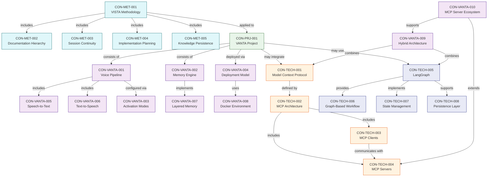
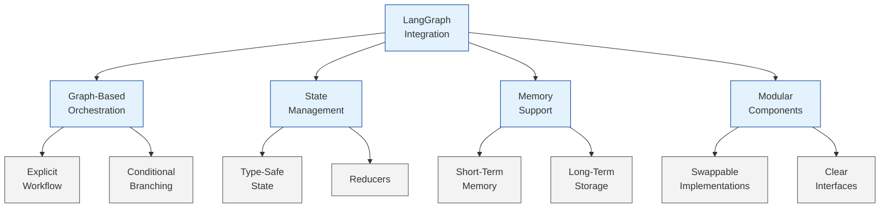
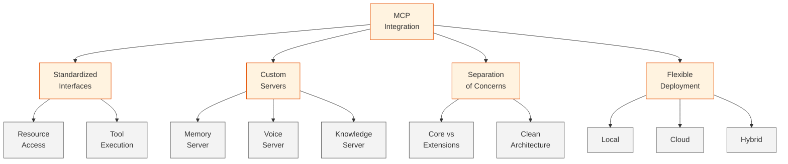
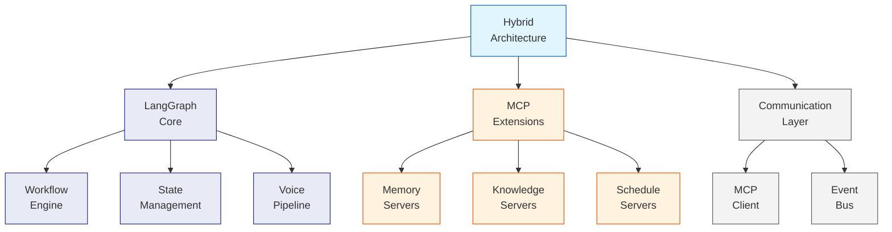

# Knowledge Graph

## Core Concepts

- CON-MET-001: **VISTA Methodology**
  - Definition: Versatile Intelligent System for Technical Acceleration - a comprehensive system for creating and managing hierarchical documentation across multiple sessions
  - Related: CON-MET-002, CON-MET-003, CON-MET-004
  - Documents: DOC-001

- CON-MET-002: **Documentation Hierarchy**
  - Definition: Structured documentation layers for different audience technical levels (Executive, Management, Technical, Development)
  - Related: CON-MET-001
  - Documents: Not yet created

- CON-MET-003: **Session Continuity**
  - Definition: Maintaining perfect knowledge transfer between planning sessions
  - Related: CON-MET-001
  - Documents: Not yet created

- CON-MET-004: **Implementation Planning**
  - Definition: Organizing development into discrete, manageable tasks
  - Related: CON-MET-001
  - Documents: Not yet created

- CON-MET-005: **Knowledge Persistence**
  - Definition: Maintaining SESSION_STATE.md and KNOWLEDGE_GRAPH.md across planning sessions
  - Related: CON-MET-001, CON-MET-003
  - Documents: Not yet created

- CON-PRJ-001: **VANTA Project**
  - Definition: Voice-based Ambient Neural Thought Assistant - project to be designed from scratch using VISTA methodology
  - Related: CON-MET-001, CON-TECH-001
  - Documents: DOC-TECH-VIS-1

- CON-TECH-001: **Model Context Protocol**
  - Definition: An open protocol that standardizes how applications provide context to LLMs, enabling two-way connections between data sources and AI-powered tools
  - Related: CON-TECH-002, CON-TECH-003, CON-TECH-004
  - Documents: DOC-TECH-MCP-1, DOC-RESEARCH-MCP-1, DOC-RESEARCH-MCP-2
  - External Reference: /Users/vigil-313/workplace/MCP_DOCS/

- CON-TECH-002: **MCP Architecture**
  - Definition: The overall system design of MCP showing how clients, servers, and LLMs interact
  - Related: CON-TECH-001, CON-TECH-003, CON-TECH-004
  - Documents: DOC-TECH-MCP-1
  - External Reference: /Users/vigil-313/workplace/MCP_DOCS/Concepts/Core Architecture.md

- CON-TECH-003: **MCP Clients**
  - Definition: Protocol clients that maintain 1:1 connections with MCP servers
  - Related: CON-TECH-001, CON-TECH-002, CON-TECH-004
  - Documents: DOC-TECH-MCP-1
  - External Reference: /Users/vigil-313/workplace/MCP_DOCS/Get Started/Example Clients.md

- CON-TECH-004: **MCP Servers**
  - Definition: Lightweight programs that expose specific capabilities through the Model Context Protocol
  - Related: CON-TECH-001, CON-TECH-002, CON-TECH-003
  - Documents: DOC-TECH-MCP-1, DOC-RESEARCH-MCP-2
  - External Reference: /Users/vigil-313/workplace/MCP_DOCS/Get Started/Example Servers.md

- CON-TECH-005: **LangGraph**
  - Definition: A framework for orchestrating workflows with LLMs, featuring state management and graph-based processing
  - Related: CON-TECH-006, CON-TECH-007, CON-TECH-008
  - Documents: DOC-RESEARCH-LG-1
  - External Reference: /Users/vigil-313/workplace/VANTA-ALPHA/langgraph/

- CON-TECH-006: **Graph-Based Workflow**
  - Definition: Organizing processing flows as directed graphs with nodes and edges for explicit control flow
  - Related: CON-TECH-005, CON-TECH-007
  - Documents: DOC-RESEARCH-LG-1

- CON-TECH-007: **State Management**
  - Definition: Maintaining and transitioning state during processing workflow execution
  - Related: CON-TECH-005, CON-TECH-006
  - Documents: DOC-RESEARCH-LG-1

- CON-TECH-008: **Persistence Layer**
  - Definition: Mechanisms for maintaining state across sessions and recovering from interruptions
  - Related: CON-TECH-005, CON-TECH-007
  - Documents: DOC-RESEARCH-LG-1

- CON-VANTA-001: **Voice Pipeline**
  - Definition: System component that handles audio input/output processing, speech recognition, and speech synthesis
  - Related: CON-VANTA-005, CON-VANTA-006
  - Documents: DOC-TECH-VIS-1

- CON-VANTA-002: **Memory Engine**
  - Definition: System for storing, retrieving, and managing conversation history and knowledge
  - Related: CON-VANTA-007
  - Documents: DOC-TECH-VIS-1

- CON-VANTA-003: **Activation Modes**
  - Definition: Different methods for initiating interaction with VANTA (continuous, wake word, programmatic)
  - Related: CON-VANTA-001
  - Documents: Not yet created

- CON-VANTA-004: **Deployment Model**
  - Definition: Application architecture approach as a background service with optional UI
  - Related: CON-VANTA-008
  - Documents: Not yet created

- CON-VANTA-005: **Speech-to-Text**
  - Definition: Component for converting spoken language to text using Whisper or other engines
  - Related: CON-VANTA-001
  - Documents: Not yet created

- CON-VANTA-006: **Text-to-Speech**
  - Definition: Component for converting text to spoken audio output using potentially CSM or other engines
  - Related: CON-VANTA-001
  - Documents: Not yet created

- CON-VANTA-007: **Layered Memory**
  - Definition: Approach to memory that includes raw logs, summaries, and semantic indices
  - Related: CON-VANTA-002
  - Documents: Not yet created

- CON-VANTA-008: **Docker Environment**
  - Definition: Containerized development and deployment environment for VANTA
  - Related: CON-VANTA-004
  - Documents: Not yet created

- CON-VANTA-009: **Hybrid Architecture**
  - Definition: Combination of LangGraph for orchestration and MCP for extensibility in VANTA architecture
  - Related: CON-TECH-001, CON-TECH-005
  - Documents: DOC-RESEARCH-MCP-1, DOC-RESEARCH-SUM-1

- CON-VANTA-010: **MCP Server Ecosystem**
  - Definition: Collection of specialized MCP servers designed for VANTA functionality
  - Related: CON-TECH-004, CON-VANTA-009
  - Documents: DOC-RESEARCH-MCP-2

## Relationships

## Research Findings

### LangGraph Integration

### MCP Integration

### Hybrid Architecture

## Last Updated
2025-05-16T17:00:00Z | SES-V0-003 | Added LangGraph concepts and research findings with Mermaid visualizations