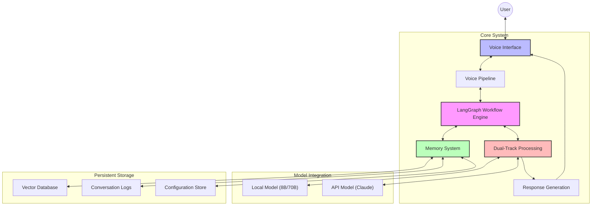
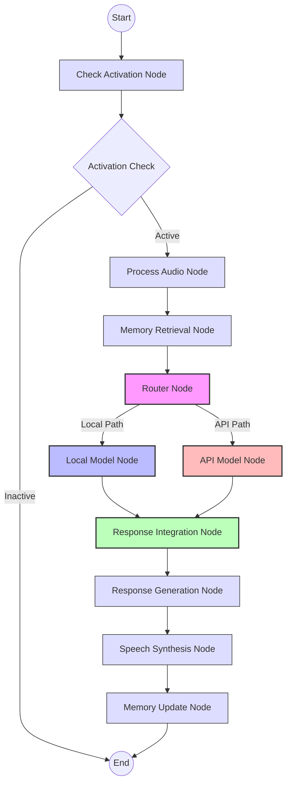
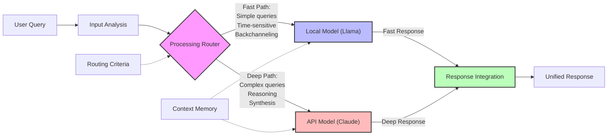
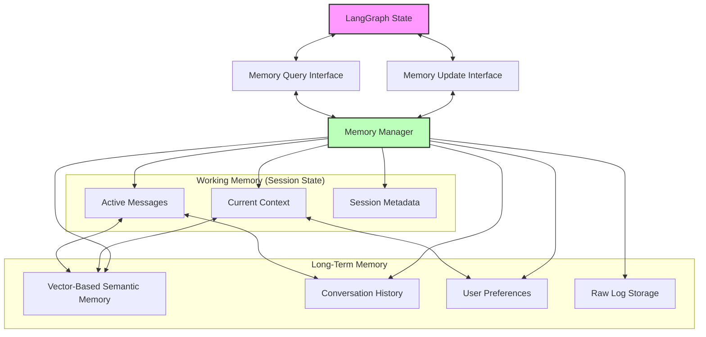

# VANTA

**V**oice-based **A**mbient **N**eural **T**hought **A**ssistant

## Overview

VANTA is a real-time, voice-based AI assistant designed to behave like an ambient presence in your environment. It's a persistent, conversational agent that can listen, respond verbally, maintain memory, and make intelligent decisions about when to speak.

The project explores dual-track AI processing, where simple queries are handled by local language models for speed, while complex queries are routed to cloud APIs for higher quality responses.

## Features

- **Dual-Track Processing**: Routes between local LLM (fast) and cloud API (quality) based on query complexity
- **Memory System**: Stores conversations with semantic understanding and retrieval
- **Voice Pipeline**: Text-to-speech and speech-to-text capabilities
- **Intelligent Routing**: Automatic decision-making about which AI model to use
- **LangGraph Workflow**: Manages conversation flow and state
- **Cross-Session Memory**: Remembers conversations across different sessions

## Current Implementation

VANTA consists of several components in various stages of development:

### Working Components:
- **Text-based conversation** with local models (Llama-3.1-8B/70B)
- **API integration** with Anthropic Claude for complex queries
- **Conversation memory storage** using JSON files and ChromaDB
- **Dual-track routing** that chooses appropriate AI model
- **Basic voice synthesis** (with some parameter issues to fix)

### In Development:
- **Memory integration** with LangGraph workflow (partial conflicts)
- **Always-listening** voice activation
- **Personality system** and adaptive behavior
- **Goal tracking** and reflective advice

## Architecture

VANTA uses a modular architecture with clear separation of concerns:

1. **Voice Pipeline**: Audio input/output processing
2. **Memory Engine**: Conversation storage and semantic retrieval  
3. **Dual-Track Reasoning**: Local LLM + Cloud API with intelligent routing
4. **LangGraph Workflow**: State management and conversation flow
5. **Storage System**: ChromaDB for vectors, JSON for conversations

```
User Input → Router → ┌─ Local Model (Llama, fast)
                      └─ API Model (Claude, quality)
                            ↓
Memory System ← Response Integration ← Processing
```

## Quick Start

### Prerequisites
```bash
pip install langchain-core langgraph anthropic chromadb sentence-transformers llama-cpp-python
```

### Optional: Set up API access
```bash
export ANTHROPIC_API_KEY="your-key-here"
```

### Run VANTA
```bash
cd Development/Implementation/vanta-main/v02
python main_vanta_memory.py
```

## Project Structure

```
VANTA-ALPHA/
├── Development/Implementation/
│   ├── vanta-main/v01/          # Basic dual-track version
│   ├── vanta-main/v02/          # Version with memory integration
│   ├── src/
│   │   ├── vanta_workflow/      # LangGraph workflow nodes
│   │   ├── models/dual_track/   # AI model routing and management
│   │   ├── memory/              # Memory and conversation storage
│   │   └── voice/               # Speech processing pipeline
│   └── models/                  # Downloaded language models (8GB-70GB)
```

## Examples

Simple queries use the local model:
```
User: "Hi"
VANTA: "Hello! How can I help you today?"
[LOCAL model, 1.95s]
```

Complex queries route to the API:
```
User: "Write a creative story about AI learning to paint"
VANTA: [Detailed creative story from Claude API]
[API model, 5.21s]
```

Memory works across sessions:
```
User: "My name is Sarah"
VANTA: "Nice to meet you, Sarah!"
[Later session]
User: "What's my name?"
VANTA: "Your name is Sarah."
[Retrieved from memory]
```

## Current Status

This is an experimental side project for learning about AI assistant architectures. Some parts work well, others need refinement:

**Performance:**
- Local queries: 1-3 seconds
- API queries: 5-20 seconds  
- Memory retrieval: <0.1 seconds
- Routing accuracy: Generally good

**Known Issues:**
- TTS synthesis parameter conflicts
- Memory system integration conflicts with LangGraph
- Voice activation not yet implemented
- Some conversation context loss between dual tracks

See [MEMORY_INTEGRATION_FIX_PLAN.md](Development/Implementation/vanta-main/v02/MEMORY_INTEGRATION_FIX_PLAN.md) for technical details on current development challenges.

## Technical Notes

- Local models run via llama-cpp-python (supports 8B to 70B models)
- Vector storage uses ChromaDB with sentence-transformers embeddings
- Memory system stores conversations as timestamped JSON files
- LangGraph manages conversation state and routing decisions
- Dual-track processing prevents API costs for simple queries

This project explores practical challenges in building conversational AI systems, including model selection, memory management, and maintaining context across different AI providers.

## Appendix: Rudimentary Architecture for V0

The following diagrams illustrate the current system architecture:

### System Overview



### LangGraph Workflow Architecture



### Dual-Track Processing Architecture



### Memory System Architecture


