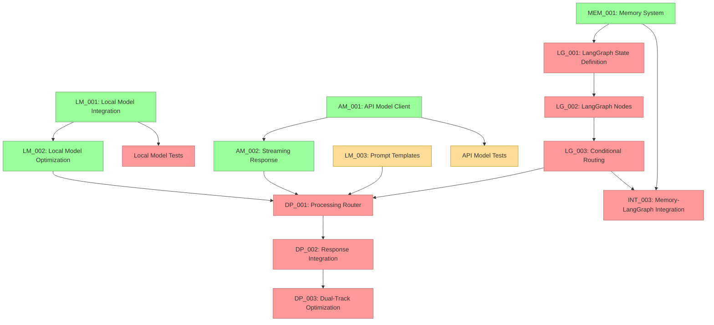

# Current Session State

## Session Information
- Session ID: SES-V0-038
- Previous Session: SES-V0-037
- Timestamp: 2025-05-21T20:30:00Z
- Template Version: v1.0.0

## Knowledge State
This session follows SES-V0-037, where we successfully implemented the Streaming Response Handling (AM_002) task to enhance the API Model Client with sophisticated streaming capabilities.

During this session, we performed a thorough review of the implementation status to align the SESSION_STATE.md with the actual code implementation and the IMPLEMENTATION_PLAN.md. We discovered that while all core components (Voice Pipeline, Local Model, API Model, and Memory System) have been successfully implemented, the LangGraph integration tasks have not yet been started. This is a critical dependency before we can proceed with Memory System integration with LangGraph.

## Session Outcomes
During this session, we have:

1. Performed a comprehensive audit of code implementation vs. implementation plan:
   - Confirmed completion of all Phase 0 (Setup) tasks
   - Confirmed completion of most Phase 1 (Core Components) tasks
   - Identified that Phase 2 (Workflow Integration) tasks haven't been started

2. Updated IMPLEMENTATION_PLAN.md with accurate status information:
   - Updated statuses of all completed tasks
   - Corrected the status of in-progress tasks (LM_003)
   - Identified LangGraph implementation as the current critical path

3. Revised SESSION_STATE.md (this document) to align with project reality:
   - Corrected the critical path and next steps
   - Ensured alignment with the implementation plan
   - Clearly identified the correct sequence of tasks

4. Created plan for the next session:
   - Identified LangGraph State Definition (TASK-LG-001) as the next priority
   - Prepared to create LangGraph task prompts in the next session

## Decision Record
- DEC-038-001: Prioritize LangGraph implementation before Memory-LangGraph integration 
  - Rationale: Cannot integrate Memory with LangGraph without first implementing LangGraph state and nodes
  - Status: 🟢 Approved
  - Notes: This corrects the previous misalignment between SESSION_STATE.md and IMPLEMENTATION_PLAN.md

- DEC-038-002: Create dedicated LangGraph task prompts in Phase2_Workflow directory
  - Rationale: Need proper documentation and requirements for LangGraph implementation tasks
  - Status: 🟢 Approved
  - Notes: Will be the first priority in the next session

## Open Questions
1. What's the best approach for packaging platform-specific dependencies? (carried over)
2. How to handle continuous integration testing for multi-platform validation? (carried over)
3. What level of AMD hardware acceleration should we implement for the Ryzen AI PC? (carried over)
4. What metrics should we establish for cross-platform performance comparison? (carried over)
5. What would be the most reliable approach for two-way audio communication in Docker? (carried over)
6. How to reduce latency in the file-based bridge approach for real-time applications? (carried over)
7. Should we explore alternative transport mechanisms (e.g., websockets) for lower latency? (carried over)
8. How to optimize embedding generation for resource-constrained environments? (carried over)
9. What summarization approach should we use for long conversation histories? (carried over)
10. How to improve the low audio volume captured by the microphone bridge? (carried over)
11. How should we manage the tradeoff between response quality and latency in the dual-track architecture? (carried over)
12. How should we handle model versioning and updates in the model registry? (carried over)
13. What is the optimal way to manage cost tracking for API usage? (carried over)
14. How should we implement fallback between providers when one is unavailable? (carried over)
15. How should we test Metal acceleration on systems where it's not available? (carried over)
16. What's the optimal strategy for managing KV cache with limited VRAM on lower-end systems? (carried over)
17. How should streaming responses be synchronized between the API and Local model in the dual-track architecture? (carried over)
18. What's the best approach for handling stream interruptions and reconnections with API providers? (carried over)
19. How should the system prioritize between local and API model responses in the dual-track processing? (carried over)
20. What's the most efficient way to structure LangGraph state to support the dual-track architecture? (new)
21. How should we handle state serialization/deserialization for complex objects in LangGraph? (new)

## Action Items
*[Previous action items are tracked separately]*

- ACT-031-001: Test the Memory System with large conversation histories
  - Owner: Project Team
  - Status: 🟡 In Progress
  - Deadline: 2025-05-27
  - Notes: Carried over from previous sessions

- ACT-031-003: Implement memory summarization functionality
  - Owner: Project Team
  - Status: 🟡 In Progress
  - Deadline: 2025-06-01
  - Notes: Critical for handling long conversations

- ACT-032-001: Implement Local Model Integration (LM_001)
  - Owner: Project Team
  - Status: 🟢 Completed
  - Deadline: 2025-05-29
  - Notes: Implemented core components for local model integration

- ACT-032-002: Implement API Model Client (AM_001)
  - Owner: Project Team
  - Status: 🟢 Completed
  - Deadline: 2025-05-31
  - Notes: Implemented complete API integration for both Anthropic and OpenAI

- ACT-032-003: Optimize Local Model for performance (LM_002)
  - Owner: Project Team
  - Status: 🟢 Completed
  - Deadline: 2025-06-02
  - Notes: Implemented comprehensive optimization framework with hardware-specific optimizations

- ACT-032-004: Develop prompt templates for Local Models (LM_003)
  - Owner: Project Team
  - Status: 🟡 In Progress (25%)
  - Deadline: 2025-06-03
  - Notes: Continue development of comprehensive templates

- ACT-032-005: Integrate Memory System with LangGraph state
  - Owner: Project Team
  - Status: 🔴 Not Started
  - Deadline: 2025-06-05
  - Notes: Blocked by LangGraph implementation (TASK-LG-001 through TASK-LG-003)

- ACT-033-001: Add quantization level support to Local Model
  - Owner: Project Team
  - Status: 🟢 Completed
  - Deadline: 2025-06-01
  - Notes: Implemented as part of LM_002, with multiple quantization levels

- ACT-033-002: Enhance model registry with version metadata
  - Owner: Project Team
  - Status: 🔴 Not Started
  - Deadline: 2025-06-02
  - Notes: Needed for proper model management

- ACT-033-003: Create integration tests for Local Model
  - Owner: Project Team
  - Status: 🔴 Not Started
  - Deadline: 2025-05-30
  - Notes: Important for ensuring reliability

- ACT-034-001: Implement Dual-Track Response Integration
  - Owner: Project Team
  - Status: 🔴 Not Started
  - Deadline: 2025-06-10
  - Notes: DEPENDENT ON LG-003, LM_002 and AM_002 (now complete)

- ACT-034-002: Add usage tracking and cost monitoring for API models
  - Owner: Project Team
  - Status: 🔴 Not Started
  - Deadline: 2025-06-05
  - Notes: Important for production deployment cost management

- ACT-034-003: Implement provider fallback mechanisms
  - Owner: Project Team
  - Status: 🔴 Not Started
  - Deadline: 2025-06-05
  - Notes: Handle unavailable providers gracefully

- ACT-035-001: Implement Streaming Response Handling for API Model (AM_002)
  - Owner: Project Team
  - Status: 🟢 Completed
  - Deadline: 2025-06-04
  - Notes: Implemented comprehensive streaming framework with event handling and stream control

- ACT-036-001: Test optimization framework across different hardware configurations
  - Owner: Project Team
  - Status: 🔴 Not Started
  - Deadline: 2025-06-05
  - Notes: Ensure optimization works correctly on different systems

- ACT-036-002: Document optimization strategies and configuration options
  - Owner: Project Team
  - Status: 🔴 Not Started
  - Deadline: 2025-06-03
  - Notes: Create user documentation for optimization features

- ACT-037-001: Create integration tests for API Model streaming
  - Owner: Project Team
  - Status: 🟡 In Progress (50%)
  - Deadline: 2025-06-01
  - Notes: Started with basic tests, need to add more comprehensive tests

- ACT-037-002: Document streaming API usage with examples
  - Owner: Project Team
  - Status: 🟡 In Progress (75%) 
  - Deadline: 2025-05-31
  - Notes: Created basic documentation and examples, needs polish

- ACT-038-001: Implement LangGraph State Definition (TASK-LG-001)
  - Owner: Project Team
  - Status: 🔴 Not Started
  - Deadline: 2025-05-24
  - Notes: **HIGH PRIORITY** - Required for all further LangGraph integration

- ACT-038-002: Create LangGraph task prompts for Phase 2 implementation
  - Owner: Project Team
  - Status: 🔴 Not Started
  - Deadline: 2025-05-23
  - Notes: **HIGH PRIORITY** - Create prompts for TASK-LG-001, TASK-LG-002, and TASK-LG-003

## Progress Snapshot
```
┌─ Project Initialization Status ────────────────┐
│                                                │
│  VISTA Documentation Structure         🟢 100% │
│  Analysis of Original VANTA            🟡 50%  │
│  Technical Research                    🟢 100% │
│  MCP Integration Research              🟢 100% │
│  LangGraph Evaluation                  🟢 100% │
│  Educational Content Creation          🔴  0%  │
│  Web Research                          🔴  0%  │
│  Component Design Specifications       🟢 100% │
│  Hybrid Voice Architecture Research    🟢 100% │
│  Implementation Planning               🟢 100% │
│  Environment Configuration             🟢 100% │
│  Implementation Task Templates         🟢 100% │
│                                                │
└────────────────────────────────────────────────┘

┌─ Phase 0 Implementation Status ────────────────┐
│                                                │
│  ENV_002: Docker Environment           🟢 100% │
│  ENV_003: Model Preparation            🟢 100% │
│  ENV_004: Test Framework               🟢 100% │
│  Test Environment Validation           🟢 100% │
│                                                │
└────────────────────────────────────────────────┘

┌─ Phase 1 Core Implementation Status ───────────┐
│                                                │
│  VOICE_001: Audio Infrastructure        🟢 100% │
│  VOICE_002: Voice Activity Detection    🟢 100% │
│  VOICE_003: Speech-to-Text Integration  🟢 100% │
│  VOICE_004: Text-to-Speech Integration  🟢 100% │
│  DEMO_001: Voice Pipeline Demo          🟢 100% │
│  PAL_001: Platform Abstraction Layer    🟢 100% │
│  LM_001: Local Model Integration        🟢 100% │
│  LM_002: Local Model Optimization       🟢 100% │
│  LM_003: Prompt Engineering             🟡 25%  │
│  AM_001: API Model Integration          🟢 100% │
│  AM_002: Streaming Response Handling    🟢 100% │
│  MEM_001: Memory System                 🟢 100% │
│                                                │
└────────────────────────────────────────────────┘

┌─ Phase 2 Workflow Implementation Status ───────┐
│                                                │
│  LG_001: LangGraph State Definition     🔴  0% │
│  LG_002: LangGraph Node Implementation  🔴  0% │
│  LG_003: Conditional Routing            🔴  0% │
│  DP_001: Processing Router              🔴  0% │
│  DP_002: Response Integration System    🔴  0% │
│  DP_003: Dual-Track Optimization        🔴  0% │
│                                                │
└────────────────────────────────────────────────┘
```

## Implementation Dependency Path (Updated)


## Critical Path for Implementation (Updated)
The critical path for completing the dual-track architecture is now:

1. **Implement LangGraph State Definition (TASK-LG-001)** - Now the top priority
2. Implement LangGraph Node Implementation (TASK-LG-002)
3. Implement Conditional Routing (TASK-LG-003)
4. Only then can we implement:
   - Processing Router (TASK-DP-001)
   - Memory System Integration with LangGraph (TASK-INT-003)

## Handoff
Session SES-V0-038 focused on realigning our implementation plan with the actual state of the code. We discovered that while all Phase 1 Core Components have been successfully implemented, we have not yet started the Phase 2 LangGraph implementation tasks, which are prerequisites for the Memory System integration with LangGraph.

### Key Accomplishments
1. **Performed Implementation Audit**: Thoroughly reviewed the implementation status of all tasks
2. **Updated Implementation Plan**: Updated IMPLEMENTATION_PLAN.md with accurate status information
3. **Corrected Critical Path**: Identified LangGraph implementation as the current critical path
4. **Clarified Next Steps**: Created clear action items for the next session

### Current Status
- **Phase 0 Setup**: Fully implemented (100% complete)
- **Phase 1 Core Components**: 
  - Voice Pipeline: Fully implemented (100% complete)
  - Local Model: Integration and optimization complete, prompt engineering in progress (25%)
  - API Model: Fully implemented (100% complete)
  - Memory System: Fully implemented (100% complete)
- **Phase 2 Workflow Integration**:
  - LangGraph Components: Not yet started (0% complete)
  - Dual-Track Processing: Not yet started (0% complete)

### Next Steps
1. **IMMEDIATE**: Create LangGraph task prompts for Phase 2 implementation (TASK-LG-001, TASK-LG-002, TASK-LG-003)
2. **IMMEDIATE**: Implement LangGraph State Definition (TASK-LG-001)
3. **IMPORTANT**: Continue developing prompt templates for Local Models (LM_003)
4. **IMPORTANT**: Complete API Model streaming integration tests
5. **IMPORTANT**: Create integration tests for Local Model

The next session should focus on creating the LangGraph task prompts and beginning the implementation of the LangGraph State Definition (TASK-LG-001), which is the critical path dependency for all further LangGraph integration.

## Last Updated
2025-05-21T20:30:00Z | SES-V0-038 | Implementation Status Realignment