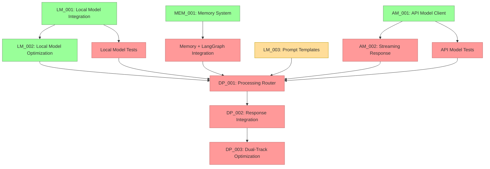

# Current Session State

## Session Information
- Session ID: SES-V0-036
- Previous Session: SES-V0-035
- Timestamp: 2025-05-20T19:30:00Z
- Template Version: v1.0.0

## Knowledge State
This session follows SES-V0-035, where we clarified the implementation sequence for VANTA's dual-track processing architecture. We identified Local Model Optimization (LM_002) as the highest priority task to complete before proceeding with dual-track integration. 

With that priority guidance, this session focused on implementing the LM_002 task to optimize local model performance across different hardware configurations, particularly leveraging Metal acceleration on macOS systems. This implementation is a critical prerequisite for the Processing Router (DP_001) and subsequent dual-track processing components.

## Session Outcomes
During this session, we have:

1. Completed the Local Model Optimization (LM_002) implementation:
   - Created a comprehensive optimization framework with specialized components
   - Implemented automatic hardware detection and configuration optimization
   - Added support for model quantization, Metal acceleration, memory management, and thread optimization
   - Developed a benchmarking system for performance evaluation and comparison

2. Designed and implemented key optimization components:
   - `OptimizationConfig`: Configuration for model optimization parameters
   - `PerformanceMonitor`: Real-time monitoring and reporting of model performance
   - `QuantizationManager`: Managing quantization settings with automatic recommendation
   - `MetalAccelerationManager`: Metal acceleration configuration for macOS
   - `MemoryManager`: Memory usage monitoring and management
   - `ThreadOptimizer`: Thread count and batch size optimization
   - `BenchmarkRunner`: Standardized benchmarking suite for models

3. Integrated optimization components with existing codebase:
   - Updated LlamaModelAdapter to support optimization features
   - Enhanced LocalModelManager with optimization and benchmarking methods
   - Added comprehensive unit tests for optimization components

4. Added new functionality for model performance:
   - Automatic hardware-specific optimization
   - Real-time performance monitoring during inference
   - Standardized benchmarking tools for latency, memory usage, and throughput
   - Comparative benchmarking of different optimization configurations

## Decision Record
- DEC-036-001: Implement a modular optimization framework separating concerns
  - Rationale: Separating different aspects of optimization (quantization, GPU acceleration, threading, memory) allows for more targeted optimizations and better maintainability
  - Status: 🟢 Approved
  - Notes: Implementation follows a clean component-based architecture

- DEC-036-002: Add automatic hardware detection for platform-specific optimizations
  - Rationale: Different hardware (especially Apple Silicon vs. Intel) requires different optimization strategies
  - Status: 🟢 Approved
  - Notes: System automatically detects hardware capabilities and configures accordingly

- DEC-036-003: Implement comprehensive benchmarking to guide optimization decisions
  - Rationale: Objective measurements are essential for understanding performance tradeoffs
  - Status: 🟢 Approved
  - Notes: Benchmarking suite tests latency, memory usage, and throughput with various configurations

## Open Questions
1. What's the best approach for packaging platform-specific dependencies? (carried over)
2. How to handle continuous integration testing for multi-platform validation? (carried over)
3. What level of AMD hardware acceleration should we implement for the Ryzen AI PC? (carried over)
4. What metrics should we establish for cross-platform performance comparison? (carried over)
5. What would be the most reliable approach for two-way audio communication in Docker? (carried over)
6. How to reduce latency in the file-based bridge approach for real-time applications? (carried over)
7. Should we explore alternative transport mechanisms (e.g., websockets) for lower latency? (carried over)
8. How to optimize embedding generation for resource-constrained environments? (carried over)
9. What summarization approach should we use for long conversation histories? (carried over)
10. How to improve the low audio volume captured by the microphone bridge? (carried over)
11. How should we manage the tradeoff between response quality and latency in the dual-track architecture? (carried over)
12. How should we handle model versioning and updates in the model registry? (carried over)
13. What is the optimal way to manage cost tracking for API usage? (carried over)
14. How should we implement fallback between providers when one is unavailable? (carried over)
15. How should we test Metal acceleration on systems where it's not available? (new)
16. What's the optimal strategy for managing KV cache with limited VRAM on lower-end systems? (new)

## Action Items
*[Previous action items are tracked separately]*

- ACT-031-001: Test the Memory System with large conversation histories
  - Owner: Project Team
  - Status: 🟡 In Progress
  - Deadline: 2025-05-27
  - Notes: Carried over from previous sessions

- ACT-031-003: Implement memory summarization functionality
  - Owner: Project Team
  - Status: 🟡 In Progress
  - Deadline: 2025-06-01
  - Notes: Critical for handling long conversations

- ACT-032-001: Implement Local Model Integration (LM_001)
  - Owner: Project Team
  - Status: 🟢 Completed
  - Deadline: 2025-05-29
  - Notes: Implemented core components for local model integration

- ACT-032-002: Implement API Model Client (AM_001)
  - Owner: Project Team
  - Status: 🟢 Completed
  - Deadline: 2025-05-31
  - Notes: Implemented complete API integration for both Anthropic and OpenAI

- ACT-032-003: Optimize Local Model for performance (LM_002)
  - Owner: Project Team
  - Status: 🟢 Completed
  - Deadline: 2025-06-02
  - Notes: Implemented comprehensive optimization framework with hardware-specific optimizations

- ACT-032-004: Develop prompt templates for Local Models (LM_003)
  - Owner: Project Team
  - Status: 🟡 In Progress (25%)
  - Deadline: 2025-06-03
  - Notes: **HIGH PRIORITY** - Continue development of comprehensive templates

- ACT-032-005: Integrate Memory System with LangGraph state
  - Owner: Project Team
  - Status: 🔴 Not Started
  - Deadline: 2025-06-05
  - Notes: **HIGH PRIORITY** - Required for stateful conversation management

- ACT-033-001: Add quantization level support to Local Model
  - Owner: Project Team
  - Status: 🟢 Completed
  - Deadline: 2025-06-01
  - Notes: Implemented as part of LM_002, with multiple quantization levels

- ACT-033-002: Enhance model registry with version metadata
  - Owner: Project Team
  - Status: 🔴 Not Started
  - Deadline: 2025-06-02
  - Notes: Needed for proper model management

- ACT-033-003: Create integration tests for Local Model
  - Owner: Project Team
  - Status: 🔴 Not Started
  - Deadline: 2025-05-30
  - Notes: **MEDIUM PRIORITY** - Important for ensuring reliability

- ACT-034-001: Implement Dual-Track Response Integration
  - Owner: Project Team
  - Status: 🔴 Not Started
  - Deadline: 2025-06-10
  - Notes: DEPENDENT ON LM_002 (now complete), AM_002, and integration tests

- ACT-034-002: Add usage tracking and cost monitoring for API models
  - Owner: Project Team
  - Status: 🔴 Not Started
  - Deadline: 2025-06-05
  - Notes: Important for production deployment cost management

- ACT-034-003: Implement provider fallback mechanisms
  - Owner: Project Team
  - Status: 🔴 Not Started
  - Deadline: 2025-06-05
  - Notes: Handle unavailable providers gracefully

- ACT-035-001: Implement Streaming Response Handling for API Model (AM_002)
  - Owner: Project Team
  - Status: 🔴 Not Started
  - Deadline: 2025-06-04
  - Notes: **HIGH PRIORITY** - Now the next critical prerequisite for Dual-Track Processing

- ACT-036-001: Test optimization framework across different hardware configurations
  - Owner: Project Team
  - Status: 🔴 Not Started
  - Deadline: 2025-06-05
  - Notes: Ensure optimization works correctly on different systems

- ACT-036-002: Document optimization strategies and configuration options
  - Owner: Project Team
  - Status: 🔴 Not Started
  - Deadline: 2025-06-03
  - Notes: Create user documentation for optimization features

## Progress Snapshot
```
┌─ Project Initialization Status ────────────────┐
│                                                │
│  VISTA Documentation Structure         🟢 100% │
│  Analysis of Original VANTA            🟡 50%  │
│  Technical Research                    🟢 100% │
│  MCP Integration Research              🟢 100% │
│  LangGraph Evaluation                  🟢 100% │
│  Educational Content Creation          🔴  0%  │
│  Web Research                          🔴  0%  │
│  Component Design Specifications       🟢 100% │
│  Hybrid Voice Architecture Research    🟢 100% │
│  Implementation Planning               🟢 100% │
│  Environment Configuration             🟢 100% │
│  Implementation Task Templates         🟢 100% │
│                                                │
└────────────────────────────────────────────────┘

┌─ Phase 0 Implementation Status ────────────────┐
│                                                │
│  ENV_002: Docker Environment           🟢 100% │
│  ENV_003: Model Preparation            🟢 100% │
│  ENV_004: Test Framework               🟢 100% │
│  Test Environment Validation           🟢 100% │
│                                                │
└────────────────────────────────────────────────┘

┌─ Phase 1 Core Implementation Status ───────────┐
│                                                │
│  VOICE_001: Audio Infrastructure        🟢 100% │
│  VOICE_002: Voice Activity Detection    🟢 100% │
│  VOICE_003: Speech-to-Text Integration  🟢 100% │
│  VOICE_004: Text-to-Speech Integration  🟢 100% │
│  DEMO_001: Voice Pipeline Demo          🟢 100% │
│  PAL_001: Platform Abstraction Layer    🟢 100% │
│  LM_001: Local Model Integration        🟢 100% │
│  LM_002: Local Model Optimization       🟢 100% │
│  LM_003: Prompt Engineering             🟡 25%  │
│  AM_001: API Model Integration          🟢 100% │
│  AM_002: Streaming Response Handling    🔴  0%  │
│  MEM_001: Memory System                 🟢 100% │
│                                                │
└────────────────────────────────────────────────┘
```

## Next Session Focus Areas
1. **HIGH PRIORITY**: Implement Streaming Response Handling for API Model (AM_002)
2. **HIGH PRIORITY**: Continue developing prompt templates for Local Models (LM_003)
3. **HIGH PRIORITY**: Begin Memory System integration with LangGraph state
4. **MEDIUM PRIORITY**: Create integration tests for Local Model
5. **MEDIUM PRIORITY**: Document optimization strategies and configuration options

## Implementation Dependency Path (Updated)


## Critical Path for Implementation (Updated)
The critical path for completing the dual-track architecture is now:

1. Implement Streaming Response Handling (AM_002) - Now the top priority
2. Integrate Memory System with LangGraph
3. Create integration tests for both models
4. Implement the Processing Router (DP_001)
5. Implement Response Integration (DP_002)
6. Optimize the Dual-Track system (DP_003)

## Handoff
Session SES-V0-036 focused on implementing the Local Model Optimization (LM_002) component, which was identified as a critical dependency for the dual-track processing architecture in the previous session. We have successfully completed this implementation with a comprehensive set of optimization components.

### Key Accomplishments
1. **Completed LM_002 Task**: Successfully implemented the Local Model Optimization framework
2. **Modular Architecture**: Created specialized components for different optimization aspects
3. **Benchmarking System**: Developed comprehensive benchmarking tools for performance evaluation
4. **Hardware Detection**: Implemented automatic hardware detection and optimization

### Current Status
- **Local Model Integration**: Fully implemented (100% complete)
- **Local Model Optimization**: Fully implemented (100% complete)
- **API Model Client**: Fully implemented (100% complete) 
- **Prompt Engineering**: Basic templates implemented (25% progress)
- **Memory System**: Fully implemented, LangGraph integration not yet started
- **Streaming Response**: Not yet started (new top priority)
- **Dual-Track Integration**: Dependent on prior tasks, not yet started

### Next Steps
1. **IMMEDIATE**: Implement Streaming Response Handling for API Model (AM_002)
2. **IMMEDIATE**: Continue developing prompt templates for Local Models (LM_003)
3. **IMMEDIATE**: Begin Memory System integration with LangGraph
4. **IMPORTANT**: Create integration tests for Local Model
5. **IMPORTANT**: Document optimization strategies and configuration options

The next session should focus on implementing the Streaming Response Handling for API Model (AM_002), which is now the critical path dependency for the dual-track processing architecture.

## Last Updated
2025-05-20T19:30:00Z | SES-V0-036 | Local Model Optimization Implementation