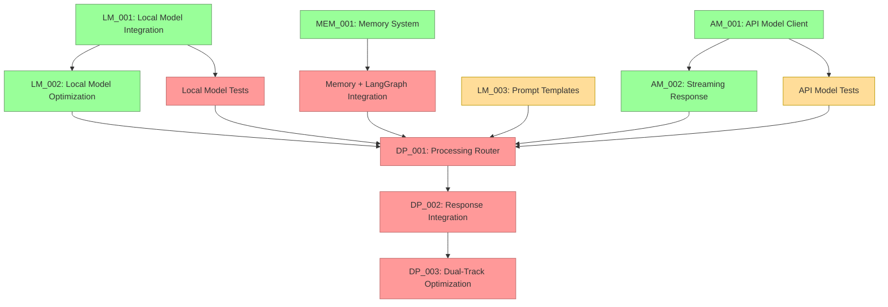

# Current Session State

## Session Information
- Session ID: SES-V0-037
- Previous Session: SES-V0-036
- Timestamp: 2025-05-20T20:30:00Z
- Template Version: v1.0.0

## Knowledge State
This session follows SES-V0-036, where we successfully implemented the Local Model Optimization (LM_002) task to optimize local model performance across different hardware configurations. 

Following the updated critical path identified in the previous session, this session focused on implementing the Streaming Response Handling (AM_002) task. This task enhances the API Model Client with sophisticated streaming capabilities, including stream control, event handling, and performance monitoring. The streaming implementation is a critical prerequisite for the dual-track processing architecture, allowing both local and API models to work together efficiently in real-time.

## Session Outcomes
During this session, we have:

1. Completed the Streaming Response Handling (AM_002) implementation:
   - Created a comprehensive streaming framework with modular components
   - Implemented thread-safe stream state management and control
   - Added real-time token handling with event-based notification
   - Developed performance monitoring and statistics for streaming
   - Implemented stream control (pause, resume, cancel)

2. Designed and implemented key streaming components:
   - `StreamHandler`: Interface for handling streaming events
   - `BufferedStreamHandler`: Collects tokens into a complete response
   - `ConsoleStreamHandler`: Displays tokens on the console in real-time
   - `CallbackStreamHandler`: Executes user-provided callbacks for stream events
   - `StreamManager`: Manages streaming process and state
   - `StreamProcessor`: Processes tokens and dispatches to handlers
   - `StreamConfig`: Configuration for streaming parameters

3. Integrated streaming components with the API Manager:
   - Added `generate_stream_with_handlers` method to APIModelManager
   - Ensured compatibility with both Anthropic and OpenAI providers
   - Created comprehensive unit and integration tests
   - Added example code for various streaming scenarios

4. Added new functionality for streaming responses:
   - Stream control for pausing, resuming, and cancelling streams
   - Real-time token aggregation and event handling
   - Performance monitoring with detailed statistics
   - Concurrent streaming from multiple providers

## Decision Record
- DEC-037-001: Implement a component-based streaming framework 
  - Rationale: Separating stream handling, management, and processing allows for flexible and extensible streaming functionality
  - Status: 🟢 Approved
  - Notes: Implementation follows a clean component-based architecture with well-defined interfaces

- DEC-037-002: Use thread-safe design for streaming components
  - Rationale: Streaming responses need to be managed across threads for responsive UI and concurrent processing
  - Status: 🟢 Approved
  - Notes: All components use proper locking mechanisms to ensure thread safety

- DEC-037-003: Add stream control capabilities (pause, resume, cancel)
  - Rationale: Control over streams allows for more dynamic interactions and resource management
  - Status: 🟢 Approved
  - Notes: Implemented with proper state management and clean APIs

- DEC-037-004: Use event-based notification system for stream events
  - Rationale: Event-based design allows for decoupled components and modular stream processing
  - Status: 🟢 Approved
  - Notes: Follows the observer pattern with well-defined event types

## Open Questions
1. What's the best approach for packaging platform-specific dependencies? (carried over)
2. How to handle continuous integration testing for multi-platform validation? (carried over)
3. What level of AMD hardware acceleration should we implement for the Ryzen AI PC? (carried over)
4. What metrics should we establish for cross-platform performance comparison? (carried over)
5. What would be the most reliable approach for two-way audio communication in Docker? (carried over)
6. How to reduce latency in the file-based bridge approach for real-time applications? (carried over)
7. Should we explore alternative transport mechanisms (e.g., websockets) for lower latency? (carried over)
8. How to optimize embedding generation for resource-constrained environments? (carried over)
9. What summarization approach should we use for long conversation histories? (carried over)
10. How to improve the low audio volume captured by the microphone bridge? (carried over)
11. How should we manage the tradeoff between response quality and latency in the dual-track architecture? (carried over)
12. How should we handle model versioning and updates in the model registry? (carried over)
13. What is the optimal way to manage cost tracking for API usage? (carried over)
14. How should we implement fallback between providers when one is unavailable? (carried over)
15. How should we test Metal acceleration on systems where it's not available? (carried over)
16. What's the optimal strategy for managing KV cache with limited VRAM on lower-end systems? (carried over)
17. How should streaming responses be synchronized between the API and Local model in the dual-track architecture? (new)
18. What's the best approach for handling stream interruptions and reconnections with API providers? (new)
19. How should the system prioritize between local and API model responses in the dual-track processing? (new)

## Action Items
*[Previous action items are tracked separately]*

- ACT-031-001: Test the Memory System with large conversation histories
  - Owner: Project Team
  - Status: 🟡 In Progress
  - Deadline: 2025-05-27
  - Notes: Carried over from previous sessions

- ACT-031-003: Implement memory summarization functionality
  - Owner: Project Team
  - Status: 🟡 In Progress
  - Deadline: 2025-06-01
  - Notes: Critical for handling long conversations

- ACT-032-001: Implement Local Model Integration (LM_001)
  - Owner: Project Team
  - Status: 🟢 Completed
  - Deadline: 2025-05-29
  - Notes: Implemented core components for local model integration

- ACT-032-002: Implement API Model Client (AM_001)
  - Owner: Project Team
  - Status: 🟢 Completed
  - Deadline: 2025-05-31
  - Notes: Implemented complete API integration for both Anthropic and OpenAI

- ACT-032-003: Optimize Local Model for performance (LM_002)
  - Owner: Project Team
  - Status: 🟢 Completed
  - Deadline: 2025-06-02
  - Notes: Implemented comprehensive optimization framework with hardware-specific optimizations

- ACT-032-004: Develop prompt templates for Local Models (LM_003)
  - Owner: Project Team
  - Status: 🟡 In Progress (25%)
  - Deadline: 2025-06-03
  - Notes: **HIGH PRIORITY** - Continue development of comprehensive templates

- ACT-032-005: Integrate Memory System with LangGraph state
  - Owner: Project Team
  - Status: 🔴 Not Started
  - Deadline: 2025-06-05
  - Notes: **HIGH PRIORITY** - Required for stateful conversation management

- ACT-033-001: Add quantization level support to Local Model
  - Owner: Project Team
  - Status: 🟢 Completed
  - Deadline: 2025-06-01
  - Notes: Implemented as part of LM_002, with multiple quantization levels

- ACT-033-002: Enhance model registry with version metadata
  - Owner: Project Team
  - Status: 🔴 Not Started
  - Deadline: 2025-06-02
  - Notes: Needed for proper model management

- ACT-033-003: Create integration tests for Local Model
  - Owner: Project Team
  - Status: 🔴 Not Started
  - Deadline: 2025-05-30
  - Notes: **MEDIUM PRIORITY** - Important for ensuring reliability

- ACT-034-001: Implement Dual-Track Response Integration
  - Owner: Project Team
  - Status: 🔴 Not Started
  - Deadline: 2025-06-10
  - Notes: DEPENDENT ON LM_002 and AM_002 (now complete), and integration tests

- ACT-034-002: Add usage tracking and cost monitoring for API models
  - Owner: Project Team
  - Status: 🔴 Not Started
  - Deadline: 2025-06-05
  - Notes: Important for production deployment cost management

- ACT-034-003: Implement provider fallback mechanisms
  - Owner: Project Team
  - Status: 🔴 Not Started
  - Deadline: 2025-06-05
  - Notes: Handle unavailable providers gracefully

- ACT-035-001: Implement Streaming Response Handling for API Model (AM_002)
  - Owner: Project Team
  - Status: 🟢 Completed
  - Deadline: 2025-06-04
  - Notes: Implemented comprehensive streaming framework with event handling and stream control

- ACT-036-001: Test optimization framework across different hardware configurations
  - Owner: Project Team
  - Status: 🔴 Not Started
  - Deadline: 2025-06-05
  - Notes: Ensure optimization works correctly on different systems

- ACT-036-002: Document optimization strategies and configuration options
  - Owner: Project Team
  - Status: 🔴 Not Started
  - Deadline: 2025-06-03
  - Notes: Create user documentation for optimization features

- ACT-037-001: Create integration tests for API Model streaming
  - Owner: Project Team
  - Status: 🟡 In Progress (50%)
  - Deadline: 2025-06-01
  - Notes: Started with basic tests, need to add more comprehensive tests

- ACT-037-002: Document streaming API usage with examples
  - Owner: Project Team
  - Status: 🟡 In Progress (75%) 
  - Deadline: 2025-05-31
  - Notes: Created basic documentation and examples, needs polish

## Progress Snapshot
```
┌─ Project Initialization Status ────────────────┐
│                                                │
│  VISTA Documentation Structure         🟢 100% │
│  Analysis of Original VANTA            🟡 50%  │
│  Technical Research                    🟢 100% │
│  MCP Integration Research              🟢 100% │
│  LangGraph Evaluation                  🟢 100% │
│  Educational Content Creation          🔴  0%  │
│  Web Research                          🔴  0%  │
│  Component Design Specifications       🟢 100% │
│  Hybrid Voice Architecture Research    🟢 100% │
│  Implementation Planning               🟢 100% │
│  Environment Configuration             🟢 100% │
│  Implementation Task Templates         🟢 100% │
│                                                │
└────────────────────────────────────────────────┘

┌─ Phase 0 Implementation Status ────────────────┐
│                                                │
│  ENV_002: Docker Environment           🟢 100% │
│  ENV_003: Model Preparation            🟢 100% │
│  ENV_004: Test Framework               🟢 100% │
│  Test Environment Validation           🟢 100% │
│                                                │
└────────────────────────────────────────────────┘

┌─ Phase 1 Core Implementation Status ───────────┐
│                                                │
│  VOICE_001: Audio Infrastructure        🟢 100% │
│  VOICE_002: Voice Activity Detection    🟢 100% │
│  VOICE_003: Speech-to-Text Integration  🟢 100% │
│  VOICE_004: Text-to-Speech Integration  🟢 100% │
│  DEMO_001: Voice Pipeline Demo          🟢 100% │
│  PAL_001: Platform Abstraction Layer    🟢 100% │
│  LM_001: Local Model Integration        🟢 100% │
│  LM_002: Local Model Optimization       🟢 100% │
│  LM_003: Prompt Engineering             🟡 25%  │
│  AM_001: API Model Integration          🟢 100% │
│  AM_002: Streaming Response Handling    🟢 100% │
│  MEM_001: Memory System                 🟢 100% │
│                                                │
└────────────────────────────────────────────────┘
```

## Next Session Focus Areas
1. **HIGH PRIORITY**: Begin Memory System integration with LangGraph state
2. **HIGH PRIORITY**: Continue developing prompt templates for Local Models (LM_003)
3. **HIGH PRIORITY**: Create integration tests for Local Model
4. **MEDIUM PRIORITY**: Complete API Model streaming integration tests
5. **MEDIUM PRIORITY**: Prepare for Processing Router (DP_001) implementation

## Implementation Dependency Path (Updated)


## Critical Path for Implementation (Updated)
The critical path for completing the dual-track architecture is now:

1. Integrate Memory System with LangGraph - Now the top priority
2. Complete prompt templates for Local Models (LM_003)
3. Create integration tests for both models
4. Implement the Processing Router (DP_001)
5. Implement Response Integration (DP_002)
6. Optimize the Dual-Track system (DP_003)

## Handoff
Session SES-V0-037 focused on implementing the Streaming Response Handling (AM_002) component, which was identified as the critical path dependency for the dual-track processing architecture in the previous session. We have successfully completed this implementation with a comprehensive streaming framework supporting real-time token processing, event handling, and stream control.

### Key Accomplishments
1. **Completed AM_002 Task**: Successfully implemented the Streaming Response Handling framework
2. **Component-Based Architecture**: Created specialized components for stream handling, management, and processing
3. **Stream Control**: Implemented pause, resume, and cancel operations for streaming responses
4. **Event System**: Developed event-based notification with support for multiple handlers
5. **Thread Safety**: Implemented thread-safe design for concurrent streaming operations
6. **Performance Monitoring**: Added detailed statistics for streaming performance

### Current Status
- **Local Model Integration**: Fully implemented (100% complete)
- **Local Model Optimization**: Fully implemented (100% complete)
- **API Model Client**: Fully implemented (100% complete) 
- **Streaming Response**: Fully implemented (100% complete)
- **Prompt Engineering**: Basic templates implemented (25% progress)
- **Memory System**: Fully implemented, LangGraph integration not yet started
- **API Model Tests**: Basic tests implemented (50% progress)
- **Local Model Tests**: Not yet started
- **Dual-Track Integration**: Dependent on prior tasks, not yet started

### Next Steps
1. **IMMEDIATE**: Begin Memory System integration with LangGraph (new top priority)
2. **IMMEDIATE**: Continue developing prompt templates for Local Models (LM_003)
3. **IMMEDIATE**: Create integration tests for Local Model
4. **IMPORTANT**: Complete API Model streaming integration tests
5. **IMPORTANT**: Prepare for Processing Router (DP_001) implementation

The next session should focus on integrating the Memory System with LangGraph state, which is now the critical path dependency for the dual-track processing architecture.

## Last Updated
2025-05-20T20:30:00Z | SES-V0-037 | Streaming Response Handling Implementation