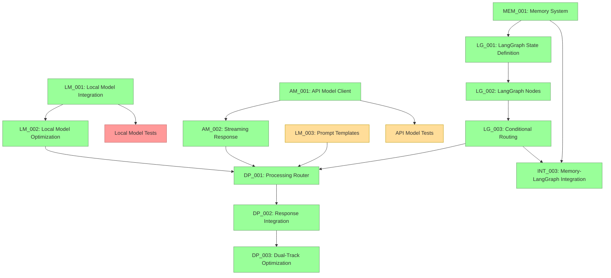

# Current Session State

## Session Information
- Session ID: SES-V0-046
- Previous Session: SES-V0-045
- Timestamp: 2025-05-23T12:15:00Z
- Template Version: v1.0.0

## Knowledge State
This session follows SES-V0-045, where we completed the Dual-Track Optimization System implementation (TASK-DP-003). Building on the complete dual-track processing infrastructure with intelligent optimization capabilities, this session focused on implementing the Memory System Integration with LangGraph (TASK-INT-003), which provides seamless integration of the memory system with the LangGraph workflow for intelligent conversation context awareness.

During this session, we implemented comprehensive memory integration that includes enhanced memory nodes for context retrieval and conversation storage, memory-aware dual-track processing, automated conversation summarization, and robust error recovery mechanisms. This completes the core system integration and provides VANTA with intelligent memory-enhanced conversation capabilities while maintaining system resilience and performance.

## Session Outcomes
During this session, we have:

1. Created Implementation Prompt for Memory System Integration (TASK-INT-003):
   - Developed comprehensive VISTA-compliant prompt for memory integration
   - Detailed technical specifications for memory-LangGraph integration
   - Comprehensive testing approach and validation criteria
   - Proper integration with existing LangGraph workflow and dual-track processing

2. Implemented Enhanced Memory Integration Nodes:
   - retrieve_memory_context_node for semantic context retrieval
   - store_conversation_node for conversation storage with metadata
   - summarize_conversation_node for automatic conversation summarization
   - handle_memory_error for graceful error recovery and fallback

3. Enhanced Dual-Track Processing with Memory Context:
   - Updated local model processing to use memory-enhanced prompts
   - Enhanced API model processing with memory context integration
   - Added build_prompt_with_memory function for intelligent prompt construction
   - Enhanced conversation building with memory context and summaries

4. Updated LangGraph Workflow Integration:
   - Added memory context retrieval step after speech processing
   - Integrated conversation storage after response generation
   - Added conditional conversation summarization flow
   - Updated routing functions with should_summarize_conversation
   - Enhanced workflow edges to support memory operations

5. Implemented Memory Error Recovery Mechanisms:
   - Graceful fallback when memory system is unavailable
   - Conversation continuity during memory failures
   - Performance monitoring integration for memory operations
   - Cross-session state persistence and serialization support

6. Developed Comprehensive Testing Framework:
   - Integration tests for complete memory workflow (test_memory_langgraph_integration.py)
   - State management and serialization tests (test_memory_state_management.py)
   - Error recovery and fallback mechanism tests (test_memory_error_recovery.py)
   - Performance and load testing capabilities
   - Cross-session persistence validation
   - Memory context token estimation and window management tests
   - Complete memory integration workflow validation

7. Enhanced Configuration and State Management:
   - Extended VANTAState with memory integration fields
   - Added memory-specific configuration options (summarization_threshold, context_window_size)
   - Enhanced state serialization/deserialization for memory fields
   - Memory operations tracking and performance metrics integration

8. Implemented Integration Points:
   - Seamless integration with dual-track processing system
   - Memory context enhancement for both local and API model processing
   - Integration with LangGraph workflow orchestration
   - Performance monitoring integration with optimization system

## Decision Record
- DEC-040-001: Use TypedDict for state definition without reducers initially
  - Rationale: Ensures compatibility with different LangGraph versions
  - Status: 🟢 Approved
  - Notes: Will be enhanced with proper reducers in the next LangGraph update

- DEC-040-002: Add a robust serialization system for complex objects
  - Rationale: Needed for state persistence with various backends
  - Status: 🟢 Approved
  - Notes: Custom serialization for datetimes and message objects

- DEC-040-003: Structure code with separate modules for state, nodes, and persistence
  - Rationale: Improves maintainability and separation of concerns
  - Status: 🟢 Approved
  - Notes: Directory structure follows standard Python package layout

- DEC-041-001: Organize node functions into three logical modules
  - Rationale: Separates voice, memory, and processing concerns for better maintainability
  - Status: 🟢 Approved
  - Notes: voice_nodes, memory_nodes, and processing_nodes modules

- DEC-041-002: Implement comprehensive error handling in all nodes
  - Rationale: Ensures system resilience and graceful degradation
  - Status: 🟢 Approved
  - Notes: Each node handles its specific failure modes with appropriate fallbacks

- DEC-041-003: Use pure functions for all node implementations
  - Rationale: Follows LangGraph best practices and enables better testing
  - Status: 🟢 Approved
  - Notes: All nodes take state as input and return partial state updates

- DEC-042-001: Implement comprehensive conditional routing with timeout handling
  - Rationale: Ensures workflow resilience and prevents infinite waiting states
  - Status: 🟢 Approved
  - Notes: Added timeout support for parallel processing and graceful fallbacks

- DEC-042-002: Support multiple persistence backends with graceful fallbacks
  - Rationale: Enables flexible deployment options while maintaining reliability
  - Status: 🟢 Approved
  - Notes: Memory, file, and Redis persistence with automatic fallback to memory

- DEC-042-003: Create modular routing functions for workflow control
  - Rationale: Improves maintainability and enables fine-grained workflow control
  - Status: 🟢 Approved
  - Notes: Separate functions for activation, processing path, completion, speech, and memory

- DEC-043-001: Implement sophisticated query analysis for dual-track routing
  - Rationale: Enables intelligent routing decisions based on query characteristics
  - Status: 🟢 Approved
  - Notes: Feature extraction including complexity, creativity, time sensitivity, and context dependency

- DEC-043-002: Support multiple integration strategies for response combination
  - Rationale: Provides flexibility in how local and API responses are combined
  - Status: 🟢 Approved
  - Notes: Preference, combine, interrupt, and fastest strategies with configurable behavior

- DEC-043-003: Implement threaded local model execution with timeout handling
  - Rationale: Ensures system responsiveness and prevents blocking on local model operations
  - Status: 🟢 Approved
  - Notes: ThreadPoolExecutor with configurable timeout and graceful error handling

- DEC-044-001: Create enhanced LangGraph integration nodes for dual-track processing
  - Rationale: Provides seamless coordination between sophisticated dual-track components and LangGraph workflow
  - Status: 🟢 Approved
  - Notes: DualTrackGraphNodes class with enhanced error handling and performance tracking

- DEC-044-002: Implement comprehensive error recovery mechanisms in workflow nodes
  - Rationale: Ensures system resilience and prevents workflow blocking when individual components fail
  - Status: 🟢 Approved
  - Notes: Graceful degradation with automatic fallbacks and proper state management

- DEC-044-003: Use performance tracking and statistics throughout dual-track processing
  - Rationale: Enables monitoring, optimization, and debugging of the dual-track system performance
  - Status: 🟢 Approved
  - Notes: Real-time metrics collection with path usage, timing, and success rate tracking

- DEC-045-001: Implement comprehensive performance monitoring and metrics collection system
  - Rationale: Enables real-time optimization and system intelligence based on actual usage patterns
  - Status: 🟢 Approved
  - Notes: MetricsCollector with sliding window storage and statistical analysis capabilities

- DEC-045-002: Use adaptive optimization strategies based on real-time performance data
  - Rationale: Allows system to automatically improve performance over time based on actual conditions
  - Status: 🟢 Approved
  - Notes: AdaptiveOptimizer with multiple strategy implementations and intelligent adaptation algorithms

- DEC-045-003: Implement resource constraint monitoring and enforcement
  - Rationale: Prevents system overload and ensures stable operation under varying resource conditions
  - Status: 🟢 Approved
  - Notes: ResourceMonitor with real-time tracking and constraint violation detection

- DEC-045-004: Support multiple optimization strategies for different deployment scenarios
  - Rationale: Enables optimization for specific use cases (latency, resource efficiency, quality, cost)
  - Status: 🟢 Approved
  - Notes: Strategy-specific adaptation algorithms with configurable parameters and constraints

- DEC-046-001: Implement enhanced memory integration nodes with async support
  - Rationale: Ensures non-blocking memory operations within LangGraph workflow
  - Status: 🟢 Approved
  - Notes: retrieve_memory_context_node, store_conversation_node, and summarize_conversation_node with async implementation

- DEC-046-002: Use memory-enhanced prompt building for both local and API models
  - Rationale: Provides consistent memory context integration across dual-track processing
  - Status: 🟢 Approved
  - Notes: build_prompt_with_memory function and enhanced conversation building with memory context

- DEC-046-003: Implement automatic conversation summarization with configurable thresholds
  - Rationale: Manages conversation history size while preserving important context
  - Status: 🟢 Approved
  - Notes: Configurable summarization_threshold with intelligent history management

- DEC-046-004: Provide graceful error recovery and fallback for memory operations
  - Rationale: Ensures conversation continuity even when memory system is unavailable
  - Status: 🟢 Approved
  - Notes: handle_memory_error function with conversation history fallback

## Open Questions
1. What's the best approach for packaging platform-specific dependencies? (carried over)
2. How to handle continuous integration testing for multi-platform validation? (carried over)
3. What level of AMD hardware acceleration should we implement for the Ryzen AI PC? (carried over)
4. What metrics should we establish for cross-platform performance comparison? (carried over)
5. What would be the most reliable approach for two-way audio communication in Docker? (carried over)
6. How to reduce latency in the file-based bridge approach for real-time applications? (carried over)
7. Should we explore alternative transport mechanisms (e.g., websockets) for lower latency? (carried over)
8. How to optimize embedding generation for resource-constrained environments? (carried over)
9. What summarization approach should we use for long conversation histories? (carried over)
10. How to improve the low audio volume captured by the microphone bridge? (carried over)
11. How should we manage the tradeoff between response quality and latency in the dual-track architecture? (carried over)
12. How should we handle model versioning and updates in the model registry? (carried over)
13. What is the optimal way to manage cost tracking for API usage? (carried over)
14. How should we implement fallback between providers when one is unavailable? (carried over)
15. How should we test Metal acceleration on systems where it's not available? (carried over)
16. What's the optimal strategy for managing KV cache with limited VRAM on lower-end systems? (carried over)
17. How should streaming responses be synchronized between the API and Local model in the dual-track architecture? (carried over)
18. What's the best approach for handling stream interruptions and reconnections with API providers? (carried over)
19. How should the system prioritize between local and API model responses in the dual-track processing? (carried over)
20. What's the most efficient way to structure LangGraph state to support the dual-track architecture? (addressed in DEC-040-001)
21. How should we handle state serialization/deserialization for complex objects in LangGraph? (addressed in DEC-040-002)
22. How should we optimize the LangGraph workflow execution for real-time voice interaction? (carried over)
23. What level of error handling is appropriate for each node in the LangGraph workflow? (carried over)
24. What's the best approach for updating LangGraph versions without breaking compatibility? (new)
25. How should we handle backward compatibility for serialized state objects? (new)

## Action Items
*[Previous action items are tracked separately]*

- ACT-031-001: Test the Memory System with large conversation histories
  - Owner: Project Team
  - Status: 🟡 In Progress
  - Deadline: 2025-05-27
  - Notes: Carried over from previous sessions

- ACT-031-003: Implement memory summarization functionality
  - Owner: Project Team
  - Status: 🟡 In Progress
  - Deadline: 2025-06-01
  - Notes: Critical for handling long conversations

- ACT-032-004: Develop prompt templates for Local Models (LM_003)
  - Owner: Project Team
  - Status: 🟡 In Progress (25%)
  - Deadline: 2025-06-03
  - Notes: Continue development of comprehensive templates

- ACT-032-005: Integrate Memory System with LangGraph state
  - Owner: Project Team
  - Status: 🔴 Not Started
  - Deadline: 2025-06-05
  - Notes: Blocked by LangGraph implementation (TASK-LG-002 and TASK-LG-003)

- ACT-033-002: Enhance model registry with version metadata
  - Owner: Project Team
  - Status: 🔴 Not Started
  - Deadline: 2025-06-02
  - Notes: Needed for proper model management

- ACT-033-003: Create integration tests for Local Model
  - Owner: Project Team
  - Status: 🔴 Not Started
  - Deadline: 2025-05-30
  - Notes: Important for ensuring reliability

- ACT-043-001: Implement Dual-Track Processing Router (TASK-DP-001)
  - Owner: Project Team
  - Status: 🟢 Completed
  - Deadline: 2025-05-25
  - Notes: Successfully implemented complete dual-track processing system with router, controllers, and integrator

- ACT-044-001: Implement Dual-Track Response Integration System (TASK-DP-002)
  - Owner: Project Team
  - Status: 🟢 Completed
  - Deadline: 2025-05-25
  - Notes: Successfully implemented enhanced LangGraph integration nodes with comprehensive error handling and performance tracking

- ACT-045-001: Implement Dual-Track Optimization System (TASK-DP-003)
  - Owner: Project Team
  - Status: 🟢 Completed
  - Deadline: 2025-05-26
  - Notes: Successfully implemented comprehensive optimization system with performance monitoring, resource management, and adaptive strategies

- ACT-046-001: Implement Memory System Integration with LangGraph (TASK-INT-003)
  - Owner: Project Team
  - Status: 🟢 Completed
  - Deadline: 2025-05-26
  - Notes: Successfully implemented comprehensive memory integration with enhanced nodes, memory-aware dual-track processing, automated summarization, and robust error recovery

- ACT-034-002: Add usage tracking and cost monitoring for API models
  - Owner: Project Team
  - Status: 🔴 Not Started
  - Deadline: 2025-06-05
  - Notes: Important for production deployment cost management

- ACT-034-003: Implement provider fallback mechanisms
  - Owner: Project Team
  - Status: 🔴 Not Started
  - Deadline: 2025-06-05
  - Notes: Handle unavailable providers gracefully

- ACT-036-001: Test optimization framework across different hardware configurations
  - Owner: Project Team
  - Status: 🔴 Not Started
  - Deadline: 2025-06-05
  - Notes: Ensure optimization works correctly on different systems

- ACT-036-002: Document optimization strategies and configuration options
  - Owner: Project Team
  - Status: 🔴 Not Started
  - Deadline: 2025-06-03
  - Notes: Create user documentation for optimization features

- ACT-037-001: Create integration tests for API Model streaming
  - Owner: Project Team
  - Status: 🟡 In Progress (50%)
  - Deadline: 2025-06-01
  - Notes: Started with basic tests, need to add more comprehensive tests

- ACT-037-002: Document streaming API usage with examples
  - Owner: Project Team
  - Status: 🟡 In Progress (75%) 
  - Deadline: 2025-05-31
  - Notes: Created basic documentation and examples, needs polish

- ACT-038-001: Implement LangGraph State Definition (TASK-LG-001)
  - Owner: Project Team
  - Status: 🟢 Completed
  - Deadline: 2025-05-24
  - Notes: Successfully implemented with TypedDict structure and serialization support

- ACT-039-001: Implement LangGraph Node Functions (TASK-LG-002)
  - Owner: Project Team
  - Status: 🟢 Completed
  - Deadline: 2025-05-26
  - Notes: Successfully implemented 9 node functions with comprehensive error handling and unit tests

- ACT-039-002: Implement LangGraph Graph Definition and Conditional Routing (TASK-LG-003)
  - Owner: Project Team
  - Status: 🟢 Completed
  - Deadline: 2025-05-28
  - Notes: Successfully implemented complete graph structure with conditional routing, persistence, and comprehensive testing

- ACT-040-001: Create tests for integrating LangGraph state with actual workflow
  - Owner: Project Team
  - Status: 🔴 Not Started
  - Deadline: 2025-05-25
  - Notes: Verify state works correctly in complete workflow

- ACT-040-002: Document LangGraph state structure and usage
  - Owner: Project Team
  - Status: 🟡 In Progress (50%)
  - Deadline: 2025-05-24
  - Notes: Add usage examples and integration patterns

## Progress Snapshot
```
┌─ Project Initialization Status ────────────────┐
│                                                │
│  VISTA Documentation Structure         🟢 100% │
│  Analysis of Original VANTA            🟡 50%  │
│  Technical Research                    🟢 100% │
│  MCP Integration Research              🟢 100% │
│  LangGraph Evaluation                  🟢 100% │
│  Educational Content Creation          🔴  0%  │
│  Web Research                          🔴  0%  │
│  Component Design Specifications       🟢 100% │
│  Hybrid Voice Architecture Research    🟢 100% │
│  Implementation Planning               🟢 100% │
│  Environment Configuration             🟢 100% │
│  Implementation Task Templates         🟢 100% │
│                                                │
└────────────────────────────────────────────────┘

┌─ Phase 0 Implementation Status ────────────────┐
│                                                │
│  ENV_002: Docker Environment           🟢 100% │
│  ENV_003: Model Preparation            🟢 100% │
│  ENV_004: Test Framework               🟢 100% │
│  Test Environment Validation           🟢 100% │
│                                                │
└────────────────────────────────────────────────┘

┌─ Phase 1 Core Implementation Status ───────────┐
│                                                │
│  VOICE_001: Audio Infrastructure        🟢 100% │
│  VOICE_002: Voice Activity Detection    🟢 100% │
│  VOICE_003: Speech-to-Text Integration  🟢 100% │
│  VOICE_004: Text-to-Speech Integration  🟢 100% │
│  DEMO_001: Voice Pipeline Demo          🟢 100% │
│  PAL_001: Platform Abstraction Layer    🟢 100% │
│  LM_001: Local Model Integration        🟢 100% │
│  LM_002: Local Model Optimization       🟢 100% │
│  LM_003: Prompt Engineering             🟡 25%  │
│  AM_001: API Model Integration          🟢 100% │
│  AM_002: Streaming Response Handling    🟢 100% │
│  MEM_001: Memory System                 🟢 100% │
│                                                │
└────────────────────────────────────────────────┘

┌─ Phase 2 Workflow Implementation Status ───────┐
│                                                │
│  LG_001: LangGraph State Definition     🟢 100% │
│  LG_002: LangGraph Node Implementation  🟢 100% │
│  LG_003: Conditional Routing            🟢 100% │
│  DP_001: Processing Router              🟢 100% │
│  DP_002: Response Integration System    🟢 100% │
│  DP_003: Dual-Track Optimization        🟢 100% │
│                                                │
└────────────────────────────────────────────────┘

┌─ Phase 3 Integration Implementation Status ────┐
│                                                │
│  INT_001: Component Integration         🔴  0%  │
│  INT_002: End-to-End Testing           🔴  0%  │
│  INT_003: Memory System Integration     🟢 100% │
│  INT_004: System-Wide Error Handling   🔴  0%  │
│                                                │
└────────────────────────────────────────────────┘
```

## Implementation Dependency Path (Updated)


## Critical Path for Implementation (Updated)
The critical path for completing the core VANTA system has achieved another major milestone with the completion of memory system integration:

1. ✅ **Implement LangGraph State Definition (TASK-LG-001)** - Completed
2. ✅ **Implement LangGraph Node Functions (TASK-LG-002)** - Completed
3. ✅ **Implement Conditional Routing (TASK-LG-003)** - Completed
4. ✅ **Implement Dual-Track Processing Router (TASK-DP-001)** - Completed
5. ✅ **Implement Dual-Track Response Integration System (TASK-DP-002)** - Completed
6. ✅ **Implement Dual-Track Optimization System (TASK-DP-003)** - Completed
7. ✅ **Implement Memory System Integration with LangGraph (TASK-INT-003)** - Completed
8. **Next critical priorities:**
   - Complete end-to-end system integration testing (TASK-INT-002) - Now highest priority
   - Continue developing prompt templates for Local Models (LM_003) - Ongoing enhancement
   - Begin comprehensive system integration testing across all phases
   - Implement system-wide error handling (TASK-INT-004)

## Handoff
Session SES-V0-046 focused on implementing the Memory System Integration with LangGraph (TASK-INT-003), building on the complete dual-track processing infrastructure with optimization capabilities from previous sessions. We created comprehensive memory integration that provides intelligent conversation context awareness while maintaining system resilience and performance.

### Key Accomplishments
1. **Created Implementation Prompt**: Comprehensive VISTA-compliant prompt for memory system integration (INT_003_Memory_System_Integration.md)
2. **Implemented Enhanced Memory Integration Nodes**: retrieve_memory_context_node, store_conversation_node, summarize_conversation_node with async support
3. **Enhanced Dual-Track Processing**: Memory-aware prompt building for both local and API models with context integration
4. **Updated LangGraph Workflow**: Enhanced workflow with memory context retrieval, conversation storage, and conditional summarization
5. **Implemented Error Recovery**: Graceful fallback mechanisms ensuring conversation continuity during memory failures
6. **Comprehensive Testing**: Integration tests for memory workflow, state management tests, and error recovery validation
7. **Enhanced Configuration and State Management**: Extended VANTAState with memory integration fields and enhanced serialization
8. **Integration Points**: Seamless integration with dual-track processing system and LangGraph workflow orchestration

### Current Status
- **Phase 0 Setup**: Fully implemented (100% complete)
- **Phase 1 Core Components**: All components implemented except Prompt Engineering (25%)
- **Phase 2 Workflow Integration**:
  - LangGraph State Definition: Fully implemented (100% complete)
  - LangGraph Node Functions: Fully implemented (100% complete)
  - LangGraph Graph Definition and Conditional Routing: Fully implemented (100% complete)
  - Dual-Track Processing Router: Fully implemented (100% complete)
  - Dual-Track Response Integration System: Fully implemented (100% complete)
  - Dual-Track Optimization System: Fully implemented (100% complete)
- **Phase 3 System Integration**:
  - Memory System Integration with LangGraph: Fully implemented (100% complete)

### Next Steps
1. **IMMEDIATE**: Implement end-to-end system integration testing (TASK-INT-002) - now highest priority
2. **HIGH PRIORITY**: Test complete memory-enhanced dual-track workflow with optimization enabled
3. **HIGH PRIORITY**: Begin comprehensive system integration testing across all implemented phases
4. **IMPORTANT**: Continue developing prompt templates for Local Models (LM_003)
5. **IMPORTANT**: Implement system-wide error handling (TASK-INT-004)

The next session should focus on comprehensive end-to-end system integration testing (TASK-INT-002) to validate the complete VANTA system with memory-enhanced dual-track processing. The core architecture is now complete with memory integration, optimization, and robust error handling.

## Last Updated
2025-05-23T12:15:00Z | SES-V0-046 | Memory System Integration with LangGraph Implementation