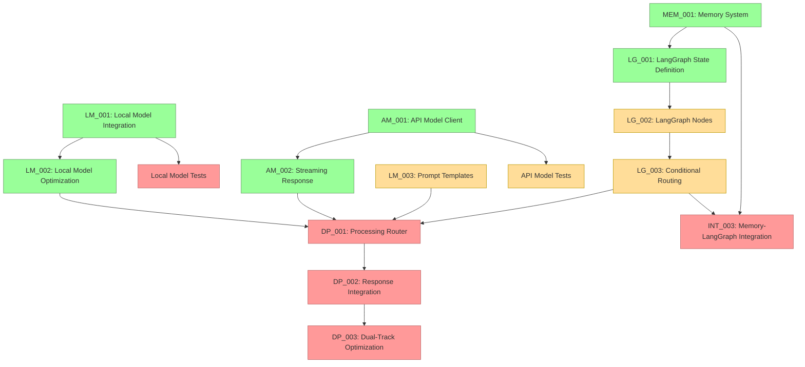

# Current Session State

## Session Information
- Session ID: SES-V0-041
- Previous Session: SES-V0-040
- Timestamp: 2025-05-22T09:15:00Z
- Template Version: v1.0.0

## Knowledge State
This session follows SES-V0-040, where we implemented the foundational LangGraph State Definition (TASK-LG-001). Building on that foundation, this session focused on implementing the complete set of LangGraph node functions (TASK-LG-002), which represent the core processing workflow of the VANTA system.

During this session, we implemented nine comprehensive node functions covering voice processing, memory operations, and dual-track model processing. These nodes form the complete processing pipeline that will be orchestrated by the LangGraph workflow, enabling the dual-track architecture that combines local and API models for optimal performance and quality.

## Session Outcomes
During this session, we have:

1. Implemented the complete LangGraph Node Functions (TASK-LG-002):
   - Created voice processing nodes: check_activation, process_audio, synthesize_speech
   - Created memory processing nodes: retrieve_context, update_memory, prune_memory
   - Created dual-track processing nodes: router_node, local_model_node, api_model_node, integration_node
   - Implemented comprehensive error handling for all node functions
   - Added proper state management and partial state updates

2. Created modular node organization:
   - Organized nodes into logical modules (voice_nodes, memory_nodes, processing_nodes)
   - Implemented proper imports and exports for all node functions
   - Followed VANTA coding conventions with TASK-REF and CONCEPT-REF tags
   - Added comprehensive docstrings for all functions

3. Developed comprehensive unit tests:
   - Created 30+ unit tests covering all node functions
   - Tested normal operation, error handling, and edge cases
   - Added integration tests for complete workflows
   - Implemented proper mocking for external dependencies

4. Established the complete processing workflow:
   - Designed nodes to work together in the dual-track architecture
   - Implemented proper activation flow from listening to speaking
   - Created memory persistence and context retrieval pipeline
   - Built router logic for intelligent processing path selection

## Decision Record
- DEC-040-001: Use TypedDict for state definition without reducers initially
  - Rationale: Ensures compatibility with different LangGraph versions
  - Status: 🟢 Approved
  - Notes: Will be enhanced with proper reducers in the next LangGraph update

- DEC-040-002: Add a robust serialization system for complex objects
  - Rationale: Needed for state persistence with various backends
  - Status: 🟢 Approved
  - Notes: Custom serialization for datetimes and message objects

- DEC-040-003: Structure code with separate modules for state, nodes, and persistence
  - Rationale: Improves maintainability and separation of concerns
  - Status: 🟢 Approved
  - Notes: Directory structure follows standard Python package layout

- DEC-041-001: Organize node functions into three logical modules
  - Rationale: Separates voice, memory, and processing concerns for better maintainability
  - Status: 🟢 Approved
  - Notes: voice_nodes, memory_nodes, and processing_nodes modules

- DEC-041-002: Implement comprehensive error handling in all nodes
  - Rationale: Ensures system resilience and graceful degradation
  - Status: 🟢 Approved
  - Notes: Each node handles its specific failure modes with appropriate fallbacks

- DEC-041-003: Use pure functions for all node implementations
  - Rationale: Follows LangGraph best practices and enables better testing
  - Status: 🟢 Approved
  - Notes: All nodes take state as input and return partial state updates

## Open Questions
1. What's the best approach for packaging platform-specific dependencies? (carried over)
2. How to handle continuous integration testing for multi-platform validation? (carried over)
3. What level of AMD hardware acceleration should we implement for the Ryzen AI PC? (carried over)
4. What metrics should we establish for cross-platform performance comparison? (carried over)
5. What would be the most reliable approach for two-way audio communication in Docker? (carried over)
6. How to reduce latency in the file-based bridge approach for real-time applications? (carried over)
7. Should we explore alternative transport mechanisms (e.g., websockets) for lower latency? (carried over)
8. How to optimize embedding generation for resource-constrained environments? (carried over)
9. What summarization approach should we use for long conversation histories? (carried over)
10. How to improve the low audio volume captured by the microphone bridge? (carried over)
11. How should we manage the tradeoff between response quality and latency in the dual-track architecture? (carried over)
12. How should we handle model versioning and updates in the model registry? (carried over)
13. What is the optimal way to manage cost tracking for API usage? (carried over)
14. How should we implement fallback between providers when one is unavailable? (carried over)
15. How should we test Metal acceleration on systems where it's not available? (carried over)
16. What's the optimal strategy for managing KV cache with limited VRAM on lower-end systems? (carried over)
17. How should streaming responses be synchronized between the API and Local model in the dual-track architecture? (carried over)
18. What's the best approach for handling stream interruptions and reconnections with API providers? (carried over)
19. How should the system prioritize between local and API model responses in the dual-track processing? (carried over)
20. What's the most efficient way to structure LangGraph state to support the dual-track architecture? (addressed in DEC-040-001)
21. How should we handle state serialization/deserialization for complex objects in LangGraph? (addressed in DEC-040-002)
22. How should we optimize the LangGraph workflow execution for real-time voice interaction? (carried over)
23. What level of error handling is appropriate for each node in the LangGraph workflow? (carried over)
24. What's the best approach for updating LangGraph versions without breaking compatibility? (new)
25. How should we handle backward compatibility for serialized state objects? (new)

## Action Items
*[Previous action items are tracked separately]*

- ACT-031-001: Test the Memory System with large conversation histories
  - Owner: Project Team
  - Status: 🟡 In Progress
  - Deadline: 2025-05-27
  - Notes: Carried over from previous sessions

- ACT-031-003: Implement memory summarization functionality
  - Owner: Project Team
  - Status: 🟡 In Progress
  - Deadline: 2025-06-01
  - Notes: Critical for handling long conversations

- ACT-032-004: Develop prompt templates for Local Models (LM_003)
  - Owner: Project Team
  - Status: 🟡 In Progress (25%)
  - Deadline: 2025-06-03
  - Notes: Continue development of comprehensive templates

- ACT-032-005: Integrate Memory System with LangGraph state
  - Owner: Project Team
  - Status: 🔴 Not Started
  - Deadline: 2025-06-05
  - Notes: Blocked by LangGraph implementation (TASK-LG-002 and TASK-LG-003)

- ACT-033-002: Enhance model registry with version metadata
  - Owner: Project Team
  - Status: 🔴 Not Started
  - Deadline: 2025-06-02
  - Notes: Needed for proper model management

- ACT-033-003: Create integration tests for Local Model
  - Owner: Project Team
  - Status: 🔴 Not Started
  - Deadline: 2025-05-30
  - Notes: Important for ensuring reliability

- ACT-034-001: Implement Dual-Track Response Integration
  - Owner: Project Team
  - Status: 🔴 Not Started
  - Deadline: 2025-06-10
  - Notes: DEPENDENT ON LG-003, LM_002 and AM_002 (now complete)

- ACT-034-002: Add usage tracking and cost monitoring for API models
  - Owner: Project Team
  - Status: 🔴 Not Started
  - Deadline: 2025-06-05
  - Notes: Important for production deployment cost management

- ACT-034-003: Implement provider fallback mechanisms
  - Owner: Project Team
  - Status: 🔴 Not Started
  - Deadline: 2025-06-05
  - Notes: Handle unavailable providers gracefully

- ACT-036-001: Test optimization framework across different hardware configurations
  - Owner: Project Team
  - Status: 🔴 Not Started
  - Deadline: 2025-06-05
  - Notes: Ensure optimization works correctly on different systems

- ACT-036-002: Document optimization strategies and configuration options
  - Owner: Project Team
  - Status: 🔴 Not Started
  - Deadline: 2025-06-03
  - Notes: Create user documentation for optimization features

- ACT-037-001: Create integration tests for API Model streaming
  - Owner: Project Team
  - Status: 🟡 In Progress (50%)
  - Deadline: 2025-06-01
  - Notes: Started with basic tests, need to add more comprehensive tests

- ACT-037-002: Document streaming API usage with examples
  - Owner: Project Team
  - Status: 🟡 In Progress (75%) 
  - Deadline: 2025-05-31
  - Notes: Created basic documentation and examples, needs polish

- ACT-038-001: Implement LangGraph State Definition (TASK-LG-001)
  - Owner: Project Team
  - Status: 🟢 Completed
  - Deadline: 2025-05-24
  - Notes: Successfully implemented with TypedDict structure and serialization support

- ACT-039-001: Implement LangGraph Node Functions (TASK-LG-002)
  - Owner: Project Team
  - Status: 🟢 Completed
  - Deadline: 2025-05-26
  - Notes: Successfully implemented 9 node functions with comprehensive error handling and unit tests

- ACT-039-002: Implement LangGraph Graph Definition and Conditional Routing (TASK-LG-003)
  - Owner: Project Team
  - Status: 🔴 Not Started
  - Deadline: 2025-05-28
  - Notes: **HIGH PRIORITY** - Implement graph structure based on TASK-LG-003 prompt

- ACT-040-001: Create tests for integrating LangGraph state with actual workflow
  - Owner: Project Team
  - Status: 🔴 Not Started
  - Deadline: 2025-05-25
  - Notes: Verify state works correctly in complete workflow

- ACT-040-002: Document LangGraph state structure and usage
  - Owner: Project Team
  - Status: 🟡 In Progress (50%)
  - Deadline: 2025-05-24
  - Notes: Add usage examples and integration patterns

## Progress Snapshot
```
┌─ Project Initialization Status ────────────────┐
│                                                │
│  VISTA Documentation Structure         🟢 100% │
│  Analysis of Original VANTA            🟡 50%  │
│  Technical Research                    🟢 100% │
│  MCP Integration Research              🟢 100% │
│  LangGraph Evaluation                  🟢 100% │
│  Educational Content Creation          🔴  0%  │
│  Web Research                          🔴  0%  │
│  Component Design Specifications       🟢 100% │
│  Hybrid Voice Architecture Research    🟢 100% │
│  Implementation Planning               🟢 100% │
│  Environment Configuration             🟢 100% │
│  Implementation Task Templates         🟢 100% │
│                                                │
└────────────────────────────────────────────────┘

┌─ Phase 0 Implementation Status ────────────────┐
│                                                │
│  ENV_002: Docker Environment           🟢 100% │
│  ENV_003: Model Preparation            🟢 100% │
│  ENV_004: Test Framework               🟢 100% │
│  Test Environment Validation           🟢 100% │
│                                                │
└────────────────────────────────────────────────┘

┌─ Phase 1 Core Implementation Status ───────────┐
│                                                │
│  VOICE_001: Audio Infrastructure        🟢 100% │
│  VOICE_002: Voice Activity Detection    🟢 100% │
│  VOICE_003: Speech-to-Text Integration  🟢 100% │
│  VOICE_004: Text-to-Speech Integration  🟢 100% │
│  DEMO_001: Voice Pipeline Demo          🟢 100% │
│  PAL_001: Platform Abstraction Layer    🟢 100% │
│  LM_001: Local Model Integration        🟢 100% │
│  LM_002: Local Model Optimization       🟢 100% │
│  LM_003: Prompt Engineering             🟡 25%  │
│  AM_001: API Model Integration          🟢 100% │
│  AM_002: Streaming Response Handling    🟢 100% │
│  MEM_001: Memory System                 🟢 100% │
│                                                │
└────────────────────────────────────────────────┘

┌─ Phase 2 Workflow Implementation Status ───────┐
│                                                │
│  LG_001: LangGraph State Definition     🟢 100% │
│  LG_002: LangGraph Node Implementation  🟢 100% │
│  LG_003: Conditional Routing            🟡 10%  │
│  DP_001: Processing Router              🔴  0%  │
│  DP_002: Response Integration System    🔴  0%  │
│  DP_003: Dual-Track Optimization        🔴  0%  │
│                                                │
└────────────────────────────────────────────────┘
```

## Implementation Dependency Path (Updated)


## Critical Path for Implementation (Updated)
The critical path for completing the dual-track architecture has progressed with the completion of LG_001:

1. ✅ **Implement LangGraph State Definition (TASK-LG-001)** - Completed
2. **Implement LangGraph Node Functions (TASK-LG-002)** - Next immediate priority
3. **Implement Conditional Routing (TASK-LG-003)** - Following LG-002
4. Only then can we implement:
   - Processing Router (TASK-DP-001)
   - Memory System Integration with LangGraph (TASK-INT-003)

## Handoff
Session SES-V0-041 focused on implementing the complete LangGraph Node Functions (TASK-LG-002), building on the state definition from the previous session. We created a comprehensive set of nine node functions covering the entire VANTA processing workflow.

### Key Accomplishments
1. **Implemented Complete Node Function Set**: Created 9 node functions covering voice, memory, and dual-track processing
2. **Created Modular Organization**: Organized nodes into voice_nodes, memory_nodes, and processing_nodes modules
3. **Added Comprehensive Error Handling**: Implemented robust error handling and graceful degradation in all nodes
4. **Wrote Extensive Unit Tests**: Created 30+ unit tests with integration test workflows
5. **Updated Progress Tracking**: Marked LG_002 as completed (100%)

### Current Status
- **Phase 0 Setup**: Fully implemented (100% complete)
- **Phase 1 Core Components**: All components implemented except Prompt Engineering (25%)
- **Phase 2 Workflow Integration**:
  - LangGraph State Definition: Fully implemented (100% complete)
  - LangGraph Node Functions: Fully implemented (100% complete)
  - Conditional Routing: Implementation not yet started (10% including prompt creation)
  - Dual-Track Processing: Not yet started (0% complete)

### Next Steps
1. **IMMEDIATE**: Begin implementation of LangGraph Graph Definition and Conditional Routing (TASK-LG-003)
2. **IMMEDIATE**: Create graph workflow that orchestrates the implemented nodes
3. **IMPORTANT**: Test complete end-to-end workflow with real components
4. **IMPORTANT**: Begin planning for Dual-Track Processing Router (TASK-DP-001)
5. **IMPORTANT**: Continue developing prompt templates for Local Models (LM_003)

The next session should focus on implementing the LangGraph Graph Definition and Conditional Routing (TASK-LG-003) to orchestrate the node functions we just implemented. This will complete the core LangGraph integration and enable the full dual-track processing workflow.

## Last Updated
2025-05-22T09:15:00Z | SES-V0-041 | LangGraph Node Functions Implementation