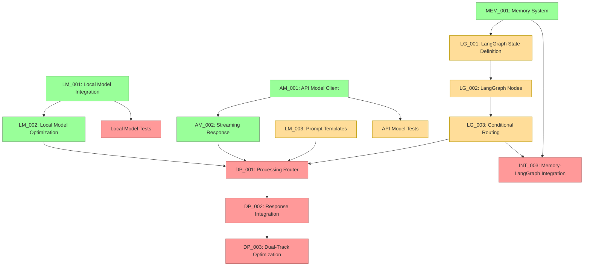

# Current Session State

## Session Information
- Session ID: SES-V0-039
- Previous Session: SES-V0-038
- Timestamp: 2025-05-21T22:30:00Z
- Template Version: v1.0.0

## Knowledge State
This session follows SES-V0-038, where we performed a comprehensive audit of the implementation status and identified LangGraph implementation as the critical path for further progress. We discovered that while all core components (Voice Pipeline, Local Model, API Model, and Memory System) have been successfully implemented, the LangGraph integration tasks had not yet been started.

During this session, we created the foundational prompt documents for the LangGraph implementation tasks. These prompts are essential for guiding the implementation of the LangGraph state definition, node functions, and conditional routing that will form the backbone of VANTA's workflow structure.

## Session Outcomes
During this session, we have:

1. Created comprehensive LangGraph task prompts for Phase 2 implementation:
   - Created LG_001_LangGraph_State_Definition.md prompt for defining the core state structure
   - Created LG_002_LangGraph_Node_Implementation.md prompt for implementing node functions
   - Created LG_003_Conditional_Routing.md prompt for implementing graph structure and routing

2. Established the implementation structure for the LangGraph integration:
   - Defined the VANTAState TypedDict structure with appropriate annotations
   - Specified the necessary node functions for all VANTA components
   - Designed the conditional routing logic for dynamic workflow decisions
   - Created a comprehensive graph structure for the complete VANTA workflow

3. Ensured alignment with existing VANTA components:
   - Integrated with Voice Pipeline (audio processing, STT, TTS)
   - Integrated with Memory System (context retrieval, conversation storage)
   - Integrated with Local and API Models (dual-track processing)
   - Established interfaces for component communication

4. Prepared for implementation of LangGraph components:
   - Created detailed implementation guidance
   - Provided code examples and patterns
   - Established testing strategies
   - Defined validation criteria

## Decision Record
- DEC-039-001: Implement LangGraph with comprehensive state definition
  - Rationale: Need a robust state structure to support all VANTA components
  - Status: 🟢 Approved
  - Notes: State will include messages, audio, memory, config, activation, and processing

- DEC-039-002: Structure LangGraph nodes around functional responsibilities
  - Rationale: Single responsibility principle improves maintainability
  - Status: 🟢 Approved
  - Notes: Each node will focus on a specific aspect of processing

- DEC-039-003: Implement flexible persistence mechanism with multiple backends
  - Rationale: Enable different deployment scenarios with appropriate persistence
  - Status: 🟢 Approved
  - Notes: Support in-memory, file, and Redis backends initially

## Open Questions
1. What's the best approach for packaging platform-specific dependencies? (carried over)
2. How to handle continuous integration testing for multi-platform validation? (carried over)
3. What level of AMD hardware acceleration should we implement for the Ryzen AI PC? (carried over)
4. What metrics should we establish for cross-platform performance comparison? (carried over)
5. What would be the most reliable approach for two-way audio communication in Docker? (carried over)
6. How to reduce latency in the file-based bridge approach for real-time applications? (carried over)
7. Should we explore alternative transport mechanisms (e.g., websockets) for lower latency? (carried over)
8. How to optimize embedding generation for resource-constrained environments? (carried over)
9. What summarization approach should we use for long conversation histories? (carried over)
10. How to improve the low audio volume captured by the microphone bridge? (carried over)
11. How should we manage the tradeoff between response quality and latency in the dual-track architecture? (carried over)
12. How should we handle model versioning and updates in the model registry? (carried over)
13. What is the optimal way to manage cost tracking for API usage? (carried over)
14. How should we implement fallback between providers when one is unavailable? (carried over)
15. How should we test Metal acceleration on systems where it's not available? (carried over)
16. What's the optimal strategy for managing KV cache with limited VRAM on lower-end systems? (carried over)
17. How should streaming responses be synchronized between the API and Local model in the dual-track architecture? (carried over)
18. What's the best approach for handling stream interruptions and reconnections with API providers? (carried over)
19. How should the system prioritize between local and API model responses in the dual-track processing? (carried over)
20. What's the most efficient way to structure LangGraph state to support the dual-track architecture? (carried over)
21. How should we handle state serialization/deserialization for complex objects in LangGraph? (carried over)
22. How should we optimize the LangGraph workflow execution for real-time voice interaction? (new)
23. What level of error handling is appropriate for each node in the LangGraph workflow? (new)

## Action Items
*[Previous action items are tracked separately]*

- ACT-031-001: Test the Memory System with large conversation histories
  - Owner: Project Team
  - Status: 🟡 In Progress
  - Deadline: 2025-05-27
  - Notes: Carried over from previous sessions

- ACT-031-003: Implement memory summarization functionality
  - Owner: Project Team
  - Status: 🟡 In Progress
  - Deadline: 2025-06-01
  - Notes: Critical for handling long conversations

- ACT-032-001: Implement Local Model Integration (LM_001)
  - Owner: Project Team
  - Status: 🟢 Completed
  - Deadline: 2025-05-29
  - Notes: Implemented core components for local model integration

- ACT-032-002: Implement API Model Client (AM_001)
  - Owner: Project Team
  - Status: 🟢 Completed
  - Deadline: 2025-05-31
  - Notes: Implemented complete API integration for both Anthropic and OpenAI

- ACT-032-003: Optimize Local Model for performance (LM_002)
  - Owner: Project Team
  - Status: 🟢 Completed
  - Deadline: 2025-06-02
  - Notes: Implemented comprehensive optimization framework with hardware-specific optimizations

- ACT-032-004: Develop prompt templates for Local Models (LM_003)
  - Owner: Project Team
  - Status: 🟡 In Progress (25%)
  - Deadline: 2025-06-03
  - Notes: Continue development of comprehensive templates

- ACT-032-005: Integrate Memory System with LangGraph state
  - Owner: Project Team
  - Status: 🔴 Not Started
  - Deadline: 2025-06-05
  - Notes: Blocked by LangGraph implementation (TASK-LG-001 through TASK-LG-003)

- ACT-033-001: Add quantization level support to Local Model
  - Owner: Project Team
  - Status: 🟢 Completed
  - Deadline: 2025-06-01
  - Notes: Implemented as part of LM_002, with multiple quantization levels

- ACT-033-002: Enhance model registry with version metadata
  - Owner: Project Team
  - Status: 🔴 Not Started
  - Deadline: 2025-06-02
  - Notes: Needed for proper model management

- ACT-033-003: Create integration tests for Local Model
  - Owner: Project Team
  - Status: 🔴 Not Started
  - Deadline: 2025-05-30
  - Notes: Important for ensuring reliability

- ACT-034-001: Implement Dual-Track Response Integration
  - Owner: Project Team
  - Status: 🔴 Not Started
  - Deadline: 2025-06-10
  - Notes: DEPENDENT ON LG-003, LM_002 and AM_002 (now complete)

- ACT-034-002: Add usage tracking and cost monitoring for API models
  - Owner: Project Team
  - Status: 🔴 Not Started
  - Deadline: 2025-06-05
  - Notes: Important for production deployment cost management

- ACT-034-003: Implement provider fallback mechanisms
  - Owner: Project Team
  - Status: 🔴 Not Started
  - Deadline: 2025-06-05
  - Notes: Handle unavailable providers gracefully

- ACT-035-001: Implement Streaming Response Handling for API Model (AM_002)
  - Owner: Project Team
  - Status: 🟢 Completed
  - Deadline: 2025-06-04
  - Notes: Implemented comprehensive streaming framework with event handling and stream control

- ACT-036-001: Test optimization framework across different hardware configurations
  - Owner: Project Team
  - Status: 🔴 Not Started
  - Deadline: 2025-06-05
  - Notes: Ensure optimization works correctly on different systems

- ACT-036-002: Document optimization strategies and configuration options
  - Owner: Project Team
  - Status: 🔴 Not Started
  - Deadline: 2025-06-03
  - Notes: Create user documentation for optimization features

- ACT-037-001: Create integration tests for API Model streaming
  - Owner: Project Team
  - Status: 🟡 In Progress (50%)
  - Deadline: 2025-06-01
  - Notes: Started with basic tests, need to add more comprehensive tests

- ACT-037-002: Document streaming API usage with examples
  - Owner: Project Team
  - Status: 🟡 In Progress (75%) 
  - Deadline: 2025-05-31
  - Notes: Created basic documentation and examples, needs polish

- ACT-038-001: Implement LangGraph State Definition (TASK-LG-001)
  - Owner: Project Team
  - Status: 🔴 Not Started
  - Deadline: 2025-05-24
  - Notes: **HIGH PRIORITY** - Required for all further LangGraph integration

- ACT-038-002: Create LangGraph task prompts for Phase 2 implementation
  - Owner: Project Team
  - Status: 🟢 Completed
  - Deadline: 2025-05-23
  - Notes: Created comprehensive prompts for TASK-LG-001, TASK-LG-002, and TASK-LG-003

- ACT-039-001: Implement LangGraph Node Functions (TASK-LG-002)
  - Owner: Project Team
  - Status: 🔴 Not Started
  - Deadline: 2025-05-26
  - Notes: **HIGH PRIORITY** - Implement node functions based on TASK-LG-002 prompt

- ACT-039-002: Implement LangGraph Graph Definition and Conditional Routing (TASK-LG-003)
  - Owner: Project Team
  - Status: 🔴 Not Started
  - Deadline: 2025-05-28
  - Notes: **HIGH PRIORITY** - Implement graph structure based on TASK-LG-003 prompt

## Progress Snapshot
```
┌─ Project Initialization Status ────────────────┐
│                                                │
│  VISTA Documentation Structure         🟢 100% │
│  Analysis of Original VANTA            🟡 50%  │
│  Technical Research                    🟢 100% │
│  MCP Integration Research              🟢 100% │
│  LangGraph Evaluation                  🟢 100% │
│  Educational Content Creation          🔴  0%  │
│  Web Research                          🔴  0%  │
│  Component Design Specifications       🟢 100% │
│  Hybrid Voice Architecture Research    🟢 100% │
│  Implementation Planning               🟢 100% │
│  Environment Configuration             🟢 100% │
│  Implementation Task Templates         🟢 100% │
│                                                │
└────────────────────────────────────────────────┘

┌─ Phase 0 Implementation Status ────────────────┐
│                                                │
│  ENV_002: Docker Environment           🟢 100% │
│  ENV_003: Model Preparation            🟢 100% │
│  ENV_004: Test Framework               🟢 100% │
│  Test Environment Validation           🟢 100% │
│                                                │
└────────────────────────────────────────────────┘

┌─ Phase 1 Core Implementation Status ───────────┐
│                                                │
│  VOICE_001: Audio Infrastructure        🟢 100% │
│  VOICE_002: Voice Activity Detection    🟢 100% │
│  VOICE_003: Speech-to-Text Integration  🟢 100% │
│  VOICE_004: Text-to-Speech Integration  🟢 100% │
│  DEMO_001: Voice Pipeline Demo          🟢 100% │
│  PAL_001: Platform Abstraction Layer    🟢 100% │
│  LM_001: Local Model Integration        🟢 100% │
│  LM_002: Local Model Optimization       🟢 100% │
│  LM_003: Prompt Engineering             🟡 25%  │
│  AM_001: API Model Integration          🟢 100% │
│  AM_002: Streaming Response Handling    🟢 100% │
│  MEM_001: Memory System                 🟢 100% │
│                                                │
└────────────────────────────────────────────────┘

┌─ Phase 2 Workflow Implementation Status ───────┐
│                                                │
│  LG_001: LangGraph State Definition     🟡 20% │
│  LG_002: LangGraph Node Implementation  🟡 10% │
│  LG_003: Conditional Routing            🟡 10% │
│  DP_001: Processing Router              🔴  0% │
│  DP_002: Response Integration System    🔴  0% │
│  DP_003: Dual-Track Optimization        🔴  0% │
│                                                │
└────────────────────────────────────────────────┘
```

## Implementation Dependency Path (Updated)


## Critical Path for Implementation (Updated)
The critical path for completing the dual-track architecture remains:

1. **Implement LangGraph State Definition (TASK-LG-001)** - Prompts created, implementation next
2. **Implement LangGraph Node Functions (TASK-LG-002)** - Follow prompt in implementation
3. **Implement Conditional Routing (TASK-LG-003)** - Follow prompt in implementation
4. Only then can we implement:
   - Processing Router (TASK-DP-001)
   - Memory System Integration with LangGraph (TASK-INT-003)

## Handoff
Session SES-V0-039 focused on creating the foundational prompts for LangGraph implementation tasks. We have developed comprehensive implementation guides for the LangGraph state definition, node functions, and conditional routing, which are prerequisites for the Memory System integration with LangGraph and the Dual-Track Processing architecture.

### Key Accomplishments
1. **Created LangGraph State Definition Prompt (LG_001)**: Defined the core state structure for VANTA
2. **Created LangGraph Node Implementation Prompt (LG_002)**: Specified node functions for all components
3. **Created Conditional Routing Prompt (LG_003)**: Designed the graph structure and routing logic
4. **Updated Implementation Progress**: Marked tasks as in-progress with appropriate percentages

### Current Status
- **Phase 0 Setup**: Fully implemented (100% complete)
- **Phase 1 Core Components**: 
  - Voice Pipeline: Fully implemented (100% complete)
  - Local Model: Integration and optimization complete, prompt engineering in progress (25%)
  - API Model: Fully implemented (100% complete)
  - Memory System: Fully implemented (100% complete)
- **Phase 2 Workflow Integration**:
  - LangGraph Components: Prompts created, implementation in progress (10-20%)
  - Dual-Track Processing: Not yet started (0% complete)

### Next Steps
1. **IMMEDIATE**: Implement LangGraph State Definition (TASK-LG-001) following the created prompt
2. **IMMEDIATE**: Begin implementation of LangGraph Node Functions (TASK-LG-002)
3. **IMMEDIATE**: Begin implementation of Conditional Routing (TASK-LG-003)
4. **IMPORTANT**: Continue developing prompt templates for Local Models (LM_003)
5. **IMPORTANT**: Complete API Model streaming integration tests

The next session should focus on actual implementation of the LangGraph components, starting with the VANTAState definition (TASK-LG-001), which is the critical path dependency for all further LangGraph integration.

## Last Updated
2025-05-21T22:30:00Z | SES-V0-039 | LangGraph Implementation Prompts Creation