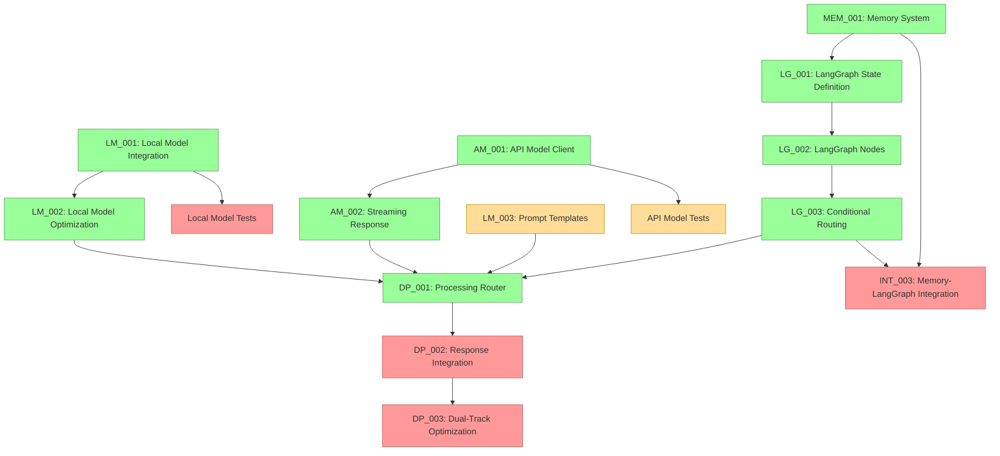

# Current Session State

## Session Information
- Session ID: SES-V0-043
- Previous Session: SES-V0-042
- Timestamp: 2025-05-22T14:15:00Z
- Template Version: v1.0.0

## Knowledge State
This session follows SES-V0-042, where we completed the LangGraph Graph Definition and Conditional Routing implementation (TASK-LG-003). Building on that comprehensive workflow orchestration system, this session focused on implementing the Dual-Track Processing Router (TASK-DP-001), which represents the core intelligence for routing queries between local and API models.

During this session, we implemented the complete dual-track processing system with sophisticated query analysis, intelligent routing logic, local and API model controllers, and response integration capabilities. This represents a critical milestone that unlocks the full dual-track processing capabilities and demonstrates the complete VANTA workflow in action.

## Session Outcomes
During this session, we have:

1. Implemented complete Dual-Track Processing Router (TASK-DP-001):
   - Created sophisticated query analysis with 8+ feature extraction methods
   - Implemented intelligent routing logic with 8 decision rules
   - Built comprehensive configuration system for all dual-track components
   - Added performance tracking and statistics for routing decisions

2. Developed Local Model Controller:
   - Integration with llama.cpp for local inference
   - Threaded execution with timeout handling
   - Optimized prompt construction with context support
   - Resource management and performance monitoring

3. Implemented API Model Controller:
   - Support for both Anthropic and OpenAI APIs
   - Rate limiting and comprehensive error handling
   - Streaming response framework (ready for implementation)
   - Fallback mechanisms between providers

4. Created Response Integrator:
   - Four integration strategies (preference, combine, interrupt, fastest)
   - Semantic similarity calculation for response comparison
   - Natural language transitions for smooth response integration
   - Quality scoring and intelligent selection logic

5. Built comprehensive configuration system:
   - Configurable routing thresholds and weights
   - Integration strategy and interrupt style options
   - Performance and resource management settings
   - Flexible deployment configurations

6. Developed extensive testing suite:
   - 40+ unit tests for router functionality and edge cases
   - Comprehensive integration tests for response integration
   - End-to-end workflow testing with mock components
   - Performance and memory usage validation

## Decision Record
- DEC-040-001: Use TypedDict for state definition without reducers initially
  - Rationale: Ensures compatibility with different LangGraph versions
  - Status: 🟢 Approved
  - Notes: Will be enhanced with proper reducers in the next LangGraph update

- DEC-040-002: Add a robust serialization system for complex objects
  - Rationale: Needed for state persistence with various backends
  - Status: 🟢 Approved
  - Notes: Custom serialization for datetimes and message objects

- DEC-040-003: Structure code with separate modules for state, nodes, and persistence
  - Rationale: Improves maintainability and separation of concerns
  - Status: 🟢 Approved
  - Notes: Directory structure follows standard Python package layout

- DEC-041-001: Organize node functions into three logical modules
  - Rationale: Separates voice, memory, and processing concerns for better maintainability
  - Status: 🟢 Approved
  - Notes: voice_nodes, memory_nodes, and processing_nodes modules

- DEC-041-002: Implement comprehensive error handling in all nodes
  - Rationale: Ensures system resilience and graceful degradation
  - Status: 🟢 Approved
  - Notes: Each node handles its specific failure modes with appropriate fallbacks

- DEC-041-003: Use pure functions for all node implementations
  - Rationale: Follows LangGraph best practices and enables better testing
  - Status: 🟢 Approved
  - Notes: All nodes take state as input and return partial state updates

- DEC-042-001: Implement comprehensive conditional routing with timeout handling
  - Rationale: Ensures workflow resilience and prevents infinite waiting states
  - Status: 🟢 Approved
  - Notes: Added timeout support for parallel processing and graceful fallbacks

- DEC-042-002: Support multiple persistence backends with graceful fallbacks
  - Rationale: Enables flexible deployment options while maintaining reliability
  - Status: 🟢 Approved
  - Notes: Memory, file, and Redis persistence with automatic fallback to memory

- DEC-042-003: Create modular routing functions for workflow control
  - Rationale: Improves maintainability and enables fine-grained workflow control
  - Status: 🟢 Approved
  - Notes: Separate functions for activation, processing path, completion, speech, and memory

- DEC-043-001: Implement sophisticated query analysis for dual-track routing
  - Rationale: Enables intelligent routing decisions based on query characteristics
  - Status: 🟢 Approved
  - Notes: Feature extraction including complexity, creativity, time sensitivity, and context dependency

- DEC-043-002: Support multiple integration strategies for response combination
  - Rationale: Provides flexibility in how local and API responses are combined
  - Status: 🟢 Approved
  - Notes: Preference, combine, interrupt, and fastest strategies with configurable behavior

- DEC-043-003: Implement threaded local model execution with timeout handling
  - Rationale: Ensures system responsiveness and prevents blocking on local model operations
  - Status: 🟢 Approved
  - Notes: ThreadPoolExecutor with configurable timeout and graceful error handling

## Open Questions
1. What's the best approach for packaging platform-specific dependencies? (carried over)
2. How to handle continuous integration testing for multi-platform validation? (carried over)
3. What level of AMD hardware acceleration should we implement for the Ryzen AI PC? (carried over)
4. What metrics should we establish for cross-platform performance comparison? (carried over)
5. What would be the most reliable approach for two-way audio communication in Docker? (carried over)
6. How to reduce latency in the file-based bridge approach for real-time applications? (carried over)
7. Should we explore alternative transport mechanisms (e.g., websockets) for lower latency? (carried over)
8. How to optimize embedding generation for resource-constrained environments? (carried over)
9. What summarization approach should we use for long conversation histories? (carried over)
10. How to improve the low audio volume captured by the microphone bridge? (carried over)
11. How should we manage the tradeoff between response quality and latency in the dual-track architecture? (carried over)
12. How should we handle model versioning and updates in the model registry? (carried over)
13. What is the optimal way to manage cost tracking for API usage? (carried over)
14. How should we implement fallback between providers when one is unavailable? (carried over)
15. How should we test Metal acceleration on systems where it's not available? (carried over)
16. What's the optimal strategy for managing KV cache with limited VRAM on lower-end systems? (carried over)
17. How should streaming responses be synchronized between the API and Local model in the dual-track architecture? (carried over)
18. What's the best approach for handling stream interruptions and reconnections with API providers? (carried over)
19. How should the system prioritize between local and API model responses in the dual-track processing? (carried over)
20. What's the most efficient way to structure LangGraph state to support the dual-track architecture? (addressed in DEC-040-001)
21. How should we handle state serialization/deserialization for complex objects in LangGraph? (addressed in DEC-040-002)
22. How should we optimize the LangGraph workflow execution for real-time voice interaction? (carried over)
23. What level of error handling is appropriate for each node in the LangGraph workflow? (carried over)
24. What's the best approach for updating LangGraph versions without breaking compatibility? (new)
25. How should we handle backward compatibility for serialized state objects? (new)

## Action Items
*[Previous action items are tracked separately]*

- ACT-031-001: Test the Memory System with large conversation histories
  - Owner: Project Team
  - Status: 🟡 In Progress
  - Deadline: 2025-05-27
  - Notes: Carried over from previous sessions

- ACT-031-003: Implement memory summarization functionality
  - Owner: Project Team
  - Status: 🟡 In Progress
  - Deadline: 2025-06-01
  - Notes: Critical for handling long conversations

- ACT-032-004: Develop prompt templates for Local Models (LM_003)
  - Owner: Project Team
  - Status: 🟡 In Progress (25%)
  - Deadline: 2025-06-03
  - Notes: Continue development of comprehensive templates

- ACT-032-005: Integrate Memory System with LangGraph state
  - Owner: Project Team
  - Status: 🔴 Not Started
  - Deadline: 2025-06-05
  - Notes: Blocked by LangGraph implementation (TASK-LG-002 and TASK-LG-003)

- ACT-033-002: Enhance model registry with version metadata
  - Owner: Project Team
  - Status: 🔴 Not Started
  - Deadline: 2025-06-02
  - Notes: Needed for proper model management

- ACT-033-003: Create integration tests for Local Model
  - Owner: Project Team
  - Status: 🔴 Not Started
  - Deadline: 2025-05-30
  - Notes: Important for ensuring reliability

- ACT-043-001: Implement Dual-Track Processing Router (TASK-DP-001)
  - Owner: Project Team
  - Status: 🟢 Completed
  - Deadline: 2025-05-25
  - Notes: Successfully implemented complete dual-track processing system with router, controllers, and integrator

- ACT-034-001: Implement Dual-Track Response Integration System (TASK-DP-002)
  - Owner: Project Team
  - Status: 🔴 Not Started
  - Deadline: 2025-06-10
  - Notes: Now unblocked by completion of DP-001

- ACT-034-002: Add usage tracking and cost monitoring for API models
  - Owner: Project Team
  - Status: 🔴 Not Started
  - Deadline: 2025-06-05
  - Notes: Important for production deployment cost management

- ACT-034-003: Implement provider fallback mechanisms
  - Owner: Project Team
  - Status: 🔴 Not Started
  - Deadline: 2025-06-05
  - Notes: Handle unavailable providers gracefully

- ACT-036-001: Test optimization framework across different hardware configurations
  - Owner: Project Team
  - Status: 🔴 Not Started
  - Deadline: 2025-06-05
  - Notes: Ensure optimization works correctly on different systems

- ACT-036-002: Document optimization strategies and configuration options
  - Owner: Project Team
  - Status: 🔴 Not Started
  - Deadline: 2025-06-03
  - Notes: Create user documentation for optimization features

- ACT-037-001: Create integration tests for API Model streaming
  - Owner: Project Team
  - Status: 🟡 In Progress (50%)
  - Deadline: 2025-06-01
  - Notes: Started with basic tests, need to add more comprehensive tests

- ACT-037-002: Document streaming API usage with examples
  - Owner: Project Team
  - Status: 🟡 In Progress (75%) 
  - Deadline: 2025-05-31
  - Notes: Created basic documentation and examples, needs polish

- ACT-038-001: Implement LangGraph State Definition (TASK-LG-001)
  - Owner: Project Team
  - Status: 🟢 Completed
  - Deadline: 2025-05-24
  - Notes: Successfully implemented with TypedDict structure and serialization support

- ACT-039-001: Implement LangGraph Node Functions (TASK-LG-002)
  - Owner: Project Team
  - Status: 🟢 Completed
  - Deadline: 2025-05-26
  - Notes: Successfully implemented 9 node functions with comprehensive error handling and unit tests

- ACT-039-002: Implement LangGraph Graph Definition and Conditional Routing (TASK-LG-003)
  - Owner: Project Team
  - Status: 🟢 Completed
  - Deadline: 2025-05-28
  - Notes: Successfully implemented complete graph structure with conditional routing, persistence, and comprehensive testing

- ACT-040-001: Create tests for integrating LangGraph state with actual workflow
  - Owner: Project Team
  - Status: 🔴 Not Started
  - Deadline: 2025-05-25
  - Notes: Verify state works correctly in complete workflow

- ACT-040-002: Document LangGraph state structure and usage
  - Owner: Project Team
  - Status: 🟡 In Progress (50%)
  - Deadline: 2025-05-24
  - Notes: Add usage examples and integration patterns

## Progress Snapshot
```
┌─ Project Initialization Status ────────────────┐
│                                                │
│  VISTA Documentation Structure         🟢 100% │
│  Analysis of Original VANTA            🟡 50%  │
│  Technical Research                    🟢 100% │
│  MCP Integration Research              🟢 100% │
│  LangGraph Evaluation                  🟢 100% │
│  Educational Content Creation          🔴  0%  │
│  Web Research                          🔴  0%  │
│  Component Design Specifications       🟢 100% │
│  Hybrid Voice Architecture Research    🟢 100% │
│  Implementation Planning               🟢 100% │
│  Environment Configuration             🟢 100% │
│  Implementation Task Templates         🟢 100% │
│                                                │
└────────────────────────────────────────────────┘

┌─ Phase 0 Implementation Status ────────────────┐
│                                                │
│  ENV_002: Docker Environment           🟢 100% │
│  ENV_003: Model Preparation            🟢 100% │
│  ENV_004: Test Framework               🟢 100% │
│  Test Environment Validation           🟢 100% │
│                                                │
└────────────────────────────────────────────────┘

┌─ Phase 1 Core Implementation Status ───────────┐
│                                                │
│  VOICE_001: Audio Infrastructure        🟢 100% │
│  VOICE_002: Voice Activity Detection    🟢 100% │
│  VOICE_003: Speech-to-Text Integration  🟢 100% │
│  VOICE_004: Text-to-Speech Integration  🟢 100% │
│  DEMO_001: Voice Pipeline Demo          🟢 100% │
│  PAL_001: Platform Abstraction Layer    🟢 100% │
│  LM_001: Local Model Integration        🟢 100% │
│  LM_002: Local Model Optimization       🟢 100% │
│  LM_003: Prompt Engineering             🟡 25%  │
│  AM_001: API Model Integration          🟢 100% │
│  AM_002: Streaming Response Handling    🟢 100% │
│  MEM_001: Memory System                 🟢 100% │
│                                                │
└────────────────────────────────────────────────┘

┌─ Phase 2 Workflow Implementation Status ───────┐
│                                                │
│  LG_001: LangGraph State Definition     🟢 100% │
│  LG_002: LangGraph Node Implementation  🟢 100% │
│  LG_003: Conditional Routing            🟢 100% │
│  DP_001: Processing Router              🟢 100% │
│  DP_002: Response Integration System    🔴  0%  │
│  DP_003: Dual-Track Optimization        🔴  0%  │
│                                                │
└────────────────────────────────────────────────┘
```

## Implementation Dependency Path (Updated)


## Critical Path for Implementation (Updated)
The critical path for completing the dual-track architecture has achieved a major milestone with the completion of the dual-track processing router:

1. ✅ **Implement LangGraph State Definition (TASK-LG-001)** - Completed
2. ✅ **Implement LangGraph Node Functions (TASK-LG-002)** - Completed
3. ✅ **Implement Conditional Routing (TASK-LG-003)** - Completed
4. ✅ **Implement Dual-Track Processing Router (TASK-DP-001)** - Completed
5. **Next critical priorities:**
   - Dual-Track Response Integration System (TASK-DP-002) - Now unblocked and ready for implementation
   - Memory System Integration with LangGraph (TASK-INT-003) - Can proceed in parallel
   - Dual-Track Optimization (TASK-DP-003) - Depends on DP-002

## Handoff
Session SES-V0-043 focused on implementing the complete Dual-Track Processing Router (TASK-DP-001), building on the LangGraph workflow orchestration from the previous session. We created a comprehensive dual-track processing system that enables intelligent routing between local and API models with sophisticated response integration.

### Key Accomplishments
1. **Implemented Dual-Track Processing Router**: Created sophisticated query analysis and intelligent routing logic with 8+ decision rules
2. **Built Local Model Controller**: Integrated llama.cpp with threaded execution and timeout handling
3. **Created API Model Controller**: Support for Anthropic and OpenAI APIs with rate limiting and error handling
4. **Developed Response Integrator**: Four integration strategies with semantic similarity calculation and natural transitions
5. **Comprehensive Configuration System**: Flexible configuration for all dual-track components with sensible defaults
6. **Extensive Testing Suite**: 40+ unit and integration tests covering all functionality and edge cases

### Current Status
- **Phase 0 Setup**: Fully implemented (100% complete)
- **Phase 1 Core Components**: All components implemented except Prompt Engineering (25%)
- **Phase 2 Workflow Integration**:
  - LangGraph State Definition: Fully implemented (100% complete)
  - LangGraph Node Functions: Fully implemented (100% complete)
  - LangGraph Graph Definition and Conditional Routing: Fully implemented (100% complete)
  - Dual-Track Processing Router: Fully implemented (100% complete)
  - Dual-Track Response Integration System: Not yet started (0% complete)

### Next Steps
1. **IMMEDIATE**: Begin implementation of Dual-Track Response Integration System (TASK-DP-002)
2. **IMMEDIATE**: Test complete end-to-end dual-track workflow with real models
3. **HIGH PRIORITY**: Implement Memory System Integration with LangGraph (TASK-INT-003)
4. **IMPORTANT**: Continue developing prompt templates for Local Models (LM_003)
5. **IMPORTANT**: Begin planning for Dual-Track Optimization (TASK-DP-003)

The next session should focus on implementing the Dual-Track Response Integration System (TASK-DP-002) to enable seamless coordination between the dual-track processing router and the LangGraph workflow. This will complete the core dual-track processing capabilities and enable full end-to-end testing.

## Last Updated
2025-05-22T14:15:00Z | SES-V0-043 | Dual-Track Processing Router Implementation