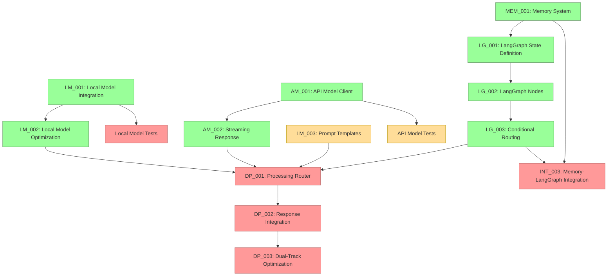

# Current Session State

## Session Information
- Session ID: SES-V0-042
- Previous Session: SES-V0-041
- Timestamp: 2025-05-22T11:30:00Z
- Template Version: v1.0.0

## Knowledge State
This session follows SES-V0-041, where we completed the LangGraph Node Functions implementation (TASK-LG-002). Building on those foundational node functions, this session focused on implementing the complete LangGraph Graph Definition and Conditional Routing (TASK-LG-003), which orchestrates the entire VANTA workflow.

During this session, we implemented the complete graph structure with conditional routing logic, persistence support, and comprehensive testing. This represents the final piece of the core LangGraph integration, enabling the complete dual-track processing workflow with dynamic routing between local and API models based on query characteristics and system state.

## Session Outcomes
During this session, we have:

1. Implemented complete LangGraph Graph Definition and Conditional Routing (TASK-LG-003):
   - Created 5 sophisticated conditional routing functions for workflow control
   - Implemented complete workflow graph connecting all 12 nodes
   - Added support for sequential, parallel, and conditional execution paths
   - Built dynamic routing logic for dual-track processing architecture

2. Created comprehensive conditional routing logic:
   - should_process: Controls workflow activation based on system status
   - determine_processing_path: Routes to local, API, or parallel processing
   - check_processing_complete: Manages synchronization and timeouts
   - should_synthesize_speech: Controls speech synthesis based on response availability
   - should_update_memory: Manages memory updates with conversation state

3. Implemented robust persistence support:
   - Multiple checkpointer backends (memory, file, Redis)
   - Graceful fallback mechanisms for unavailable persistence options
   - Thread-based conversation continuity support
   - Configurable persistence strategies

4. Added graph visualization and management utilities:
   - Graph visualization with graphviz support
   - DOT file generation for workflow documentation
   - Compiled graph creation with configuration support
   - Easy-to-use API for workflow execution

5. Developed comprehensive testing suite:
   - 40+ unit tests for routing functions with edge cases
   - Integration tests for complete workflow scenarios
   - Performance tests for routing efficiency
   - Error handling tests for resilience verification

6. Enhanced LangGraph package organization:
   - Updated package exports for complete API surface
   - Improved module organization with clear separation of concerns
   - Added convenience functions for easy workflow creation
   - Comprehensive documentation and error handling

## Decision Record
- DEC-040-001: Use TypedDict for state definition without reducers initially
  - Rationale: Ensures compatibility with different LangGraph versions
  - Status: 🟢 Approved
  - Notes: Will be enhanced with proper reducers in the next LangGraph update

- DEC-040-002: Add a robust serialization system for complex objects
  - Rationale: Needed for state persistence with various backends
  - Status: 🟢 Approved
  - Notes: Custom serialization for datetimes and message objects

- DEC-040-003: Structure code with separate modules for state, nodes, and persistence
  - Rationale: Improves maintainability and separation of concerns
  - Status: 🟢 Approved
  - Notes: Directory structure follows standard Python package layout

- DEC-041-001: Organize node functions into three logical modules
  - Rationale: Separates voice, memory, and processing concerns for better maintainability
  - Status: 🟢 Approved
  - Notes: voice_nodes, memory_nodes, and processing_nodes modules

- DEC-041-002: Implement comprehensive error handling in all nodes
  - Rationale: Ensures system resilience and graceful degradation
  - Status: 🟢 Approved
  - Notes: Each node handles its specific failure modes with appropriate fallbacks

- DEC-041-003: Use pure functions for all node implementations
  - Rationale: Follows LangGraph best practices and enables better testing
  - Status: 🟢 Approved
  - Notes: All nodes take state as input and return partial state updates

- DEC-042-001: Implement comprehensive conditional routing with timeout handling
  - Rationale: Ensures workflow resilience and prevents infinite waiting states
  - Status: 🟢 Approved
  - Notes: Added timeout support for parallel processing and graceful fallbacks

- DEC-042-002: Support multiple persistence backends with graceful fallbacks
  - Rationale: Enables flexible deployment options while maintaining reliability
  - Status: 🟢 Approved
  - Notes: Memory, file, and Redis persistence with automatic fallback to memory

- DEC-042-003: Create modular routing functions for workflow control
  - Rationale: Improves maintainability and enables fine-grained workflow control
  - Status: 🟢 Approved
  - Notes: Separate functions for activation, processing path, completion, speech, and memory

## Open Questions
1. What's the best approach for packaging platform-specific dependencies? (carried over)
2. How to handle continuous integration testing for multi-platform validation? (carried over)
3. What level of AMD hardware acceleration should we implement for the Ryzen AI PC? (carried over)
4. What metrics should we establish for cross-platform performance comparison? (carried over)
5. What would be the most reliable approach for two-way audio communication in Docker? (carried over)
6. How to reduce latency in the file-based bridge approach for real-time applications? (carried over)
7. Should we explore alternative transport mechanisms (e.g., websockets) for lower latency? (carried over)
8. How to optimize embedding generation for resource-constrained environments? (carried over)
9. What summarization approach should we use for long conversation histories? (carried over)
10. How to improve the low audio volume captured by the microphone bridge? (carried over)
11. How should we manage the tradeoff between response quality and latency in the dual-track architecture? (carried over)
12. How should we handle model versioning and updates in the model registry? (carried over)
13. What is the optimal way to manage cost tracking for API usage? (carried over)
14. How should we implement fallback between providers when one is unavailable? (carried over)
15. How should we test Metal acceleration on systems where it's not available? (carried over)
16. What's the optimal strategy for managing KV cache with limited VRAM on lower-end systems? (carried over)
17. How should streaming responses be synchronized between the API and Local model in the dual-track architecture? (carried over)
18. What's the best approach for handling stream interruptions and reconnections with API providers? (carried over)
19. How should the system prioritize between local and API model responses in the dual-track processing? (carried over)
20. What's the most efficient way to structure LangGraph state to support the dual-track architecture? (addressed in DEC-040-001)
21. How should we handle state serialization/deserialization for complex objects in LangGraph? (addressed in DEC-040-002)
22. How should we optimize the LangGraph workflow execution for real-time voice interaction? (carried over)
23. What level of error handling is appropriate for each node in the LangGraph workflow? (carried over)
24. What's the best approach for updating LangGraph versions without breaking compatibility? (new)
25. How should we handle backward compatibility for serialized state objects? (new)

## Action Items
*[Previous action items are tracked separately]*

- ACT-031-001: Test the Memory System with large conversation histories
  - Owner: Project Team
  - Status: 🟡 In Progress
  - Deadline: 2025-05-27
  - Notes: Carried over from previous sessions

- ACT-031-003: Implement memory summarization functionality
  - Owner: Project Team
  - Status: 🟡 In Progress
  - Deadline: 2025-06-01
  - Notes: Critical for handling long conversations

- ACT-032-004: Develop prompt templates for Local Models (LM_003)
  - Owner: Project Team
  - Status: 🟡 In Progress (25%)
  - Deadline: 2025-06-03
  - Notes: Continue development of comprehensive templates

- ACT-032-005: Integrate Memory System with LangGraph state
  - Owner: Project Team
  - Status: 🔴 Not Started
  - Deadline: 2025-06-05
  - Notes: Blocked by LangGraph implementation (TASK-LG-002 and TASK-LG-003)

- ACT-033-002: Enhance model registry with version metadata
  - Owner: Project Team
  - Status: 🔴 Not Started
  - Deadline: 2025-06-02
  - Notes: Needed for proper model management

- ACT-033-003: Create integration tests for Local Model
  - Owner: Project Team
  - Status: 🔴 Not Started
  - Deadline: 2025-05-30
  - Notes: Important for ensuring reliability

- ACT-034-001: Implement Dual-Track Response Integration
  - Owner: Project Team
  - Status: 🔴 Not Started
  - Deadline: 2025-06-10
  - Notes: DEPENDENT ON LG-003, LM_002 and AM_002 (now complete)

- ACT-034-002: Add usage tracking and cost monitoring for API models
  - Owner: Project Team
  - Status: 🔴 Not Started
  - Deadline: 2025-06-05
  - Notes: Important for production deployment cost management

- ACT-034-003: Implement provider fallback mechanisms
  - Owner: Project Team
  - Status: 🔴 Not Started
  - Deadline: 2025-06-05
  - Notes: Handle unavailable providers gracefully

- ACT-036-001: Test optimization framework across different hardware configurations
  - Owner: Project Team
  - Status: 🔴 Not Started
  - Deadline: 2025-06-05
  - Notes: Ensure optimization works correctly on different systems

- ACT-036-002: Document optimization strategies and configuration options
  - Owner: Project Team
  - Status: 🔴 Not Started
  - Deadline: 2025-06-03
  - Notes: Create user documentation for optimization features

- ACT-037-001: Create integration tests for API Model streaming
  - Owner: Project Team
  - Status: 🟡 In Progress (50%)
  - Deadline: 2025-06-01
  - Notes: Started with basic tests, need to add more comprehensive tests

- ACT-037-002: Document streaming API usage with examples
  - Owner: Project Team
  - Status: 🟡 In Progress (75%) 
  - Deadline: 2025-05-31
  - Notes: Created basic documentation and examples, needs polish

- ACT-038-001: Implement LangGraph State Definition (TASK-LG-001)
  - Owner: Project Team
  - Status: 🟢 Completed
  - Deadline: 2025-05-24
  - Notes: Successfully implemented with TypedDict structure and serialization support

- ACT-039-001: Implement LangGraph Node Functions (TASK-LG-002)
  - Owner: Project Team
  - Status: 🟢 Completed
  - Deadline: 2025-05-26
  - Notes: Successfully implemented 9 node functions with comprehensive error handling and unit tests

- ACT-039-002: Implement LangGraph Graph Definition and Conditional Routing (TASK-LG-003)
  - Owner: Project Team
  - Status: 🟢 Completed
  - Deadline: 2025-05-28
  - Notes: Successfully implemented complete graph structure with conditional routing, persistence, and comprehensive testing

- ACT-040-001: Create tests for integrating LangGraph state with actual workflow
  - Owner: Project Team
  - Status: 🔴 Not Started
  - Deadline: 2025-05-25
  - Notes: Verify state works correctly in complete workflow

- ACT-040-002: Document LangGraph state structure and usage
  - Owner: Project Team
  - Status: 🟡 In Progress (50%)
  - Deadline: 2025-05-24
  - Notes: Add usage examples and integration patterns

## Progress Snapshot
```
┌─ Project Initialization Status ────────────────┐
│                                                │
│  VISTA Documentation Structure         🟢 100% │
│  Analysis of Original VANTA            🟡 50%  │
│  Technical Research                    🟢 100% │
│  MCP Integration Research              🟢 100% │
│  LangGraph Evaluation                  🟢 100% │
│  Educational Content Creation          🔴  0%  │
│  Web Research                          🔴  0%  │
│  Component Design Specifications       🟢 100% │
│  Hybrid Voice Architecture Research    🟢 100% │
│  Implementation Planning               🟢 100% │
│  Environment Configuration             🟢 100% │
│  Implementation Task Templates         🟢 100% │
│                                                │
└────────────────────────────────────────────────┘

┌─ Phase 0 Implementation Status ────────────────┐
│                                                │
│  ENV_002: Docker Environment           🟢 100% │
│  ENV_003: Model Preparation            🟢 100% │
│  ENV_004: Test Framework               🟢 100% │
│  Test Environment Validation           🟢 100% │
│                                                │
└────────────────────────────────────────────────┘

┌─ Phase 1 Core Implementation Status ───────────┐
│                                                │
│  VOICE_001: Audio Infrastructure        🟢 100% │
│  VOICE_002: Voice Activity Detection    🟢 100% │
│  VOICE_003: Speech-to-Text Integration  🟢 100% │
│  VOICE_004: Text-to-Speech Integration  🟢 100% │
│  DEMO_001: Voice Pipeline Demo          🟢 100% │
│  PAL_001: Platform Abstraction Layer    🟢 100% │
│  LM_001: Local Model Integration        🟢 100% │
│  LM_002: Local Model Optimization       🟢 100% │
│  LM_003: Prompt Engineering             🟡 25%  │
│  AM_001: API Model Integration          🟢 100% │
│  AM_002: Streaming Response Handling    🟢 100% │
│  MEM_001: Memory System                 🟢 100% │
│                                                │
└────────────────────────────────────────────────┘

┌─ Phase 2 Workflow Implementation Status ───────┐
│                                                │
│  LG_001: LangGraph State Definition     🟢 100% │
│  LG_002: LangGraph Node Implementation  🟢 100% │
│  LG_003: Conditional Routing            🟢 100% │
│  DP_001: Processing Router              🔴  0%  │
│  DP_002: Response Integration System    🔴  0%  │
│  DP_003: Dual-Track Optimization        🔴  0%  │
│                                                │
└────────────────────────────────────────────────┘
```

## Implementation Dependency Path (Updated)


## Critical Path for Implementation (Updated)
The critical path for completing the dual-track architecture has progressed significantly with the completion of the core LangGraph components:

1. ✅ **Implement LangGraph State Definition (TASK-LG-001)** - Completed
2. ✅ **Implement LangGraph Node Functions (TASK-LG-002)** - Completed
3. ✅ **Implement Conditional Routing (TASK-LG-003)** - Completed
4. **Next critical priorities:**
   - Processing Router (TASK-DP-001) - Now unblocked and can begin implementation
   - Memory System Integration with LangGraph (TASK-INT-003) - Can proceed in parallel
   - Dual-Track Response Integration System (TASK-DP-002) - Depends on DP-001

## Handoff
Session SES-V0-042 focused on implementing the complete LangGraph Graph Definition and Conditional Routing (TASK-LG-003), building on the node functions from the previous session. We created a comprehensive workflow orchestration system that connects all VANTA components through intelligent routing logic.

### Key Accomplishments
1. **Implemented Complete Graph Workflow**: Created comprehensive workflow graph connecting all 12 nodes with conditional routing
2. **Built Sophisticated Routing Logic**: Created 5 conditional routing functions for dynamic workflow control
3. **Added Robust Persistence Support**: Implemented multiple persistence backends with graceful fallbacks
4. **Created Visualization Support**: Added graph visualization and DOT generation capabilities
5. **Developed Comprehensive Testing**: Created 40+ unit and integration tests for routing and graph functionality
6. **Enhanced Package Organization**: Updated LangGraph package with complete API surface and documentation

### Current Status
- **Phase 0 Setup**: Fully implemented (100% complete)
- **Phase 1 Core Components**: All components implemented except Prompt Engineering (25%)
- **Phase 2 Workflow Integration**:
  - LangGraph State Definition: Fully implemented (100% complete)
  - LangGraph Node Functions: Fully implemented (100% complete)
  - LangGraph Graph Definition and Conditional Routing: Fully implemented (100% complete)
  - Dual-Track Processing: Not yet started (0% complete)

### Next Steps
1. **IMMEDIATE**: Begin implementation of Dual-Track Processing Router (TASK-DP-001)
2. **IMMEDIATE**: Test complete end-to-end workflow with real components using the new graph
3. **HIGH PRIORITY**: Implement Memory System Integration with LangGraph (TASK-INT-003)
4. **IMPORTANT**: Continue developing prompt templates for Local Models (LM_003)
5. **IMPORTANT**: Begin planning for Dual-Track Response Integration System (TASK-DP-002)

The next session should focus on implementing the Dual-Track Processing Router (TASK-DP-001) to enable intelligent routing between local and API models. This will unlock the full dual-track processing capabilities and demonstrate the complete VANTA workflow in action.

## Last Updated
2025-05-22T11:30:00Z | SES-V0-042 | LangGraph Graph Definition and Conditional Routing Implementation