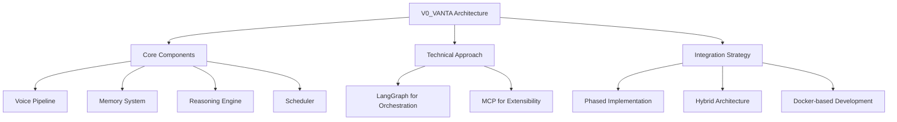
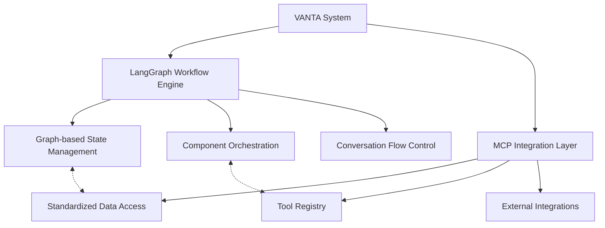
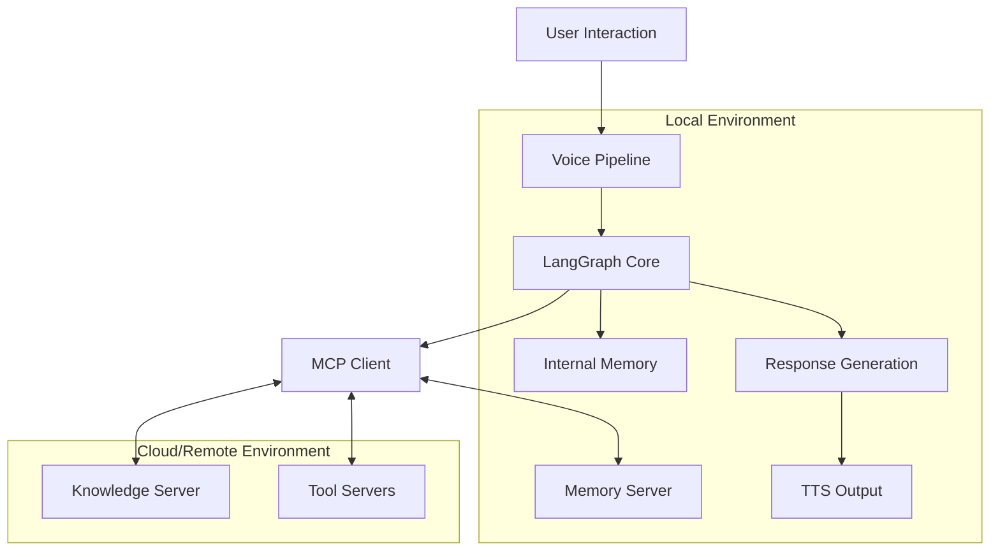
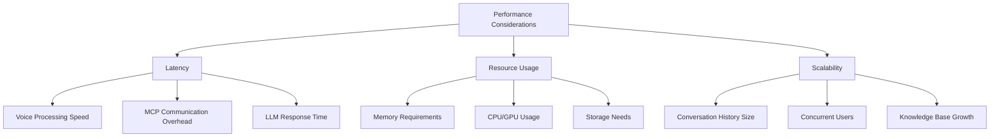

# V0_VANTA Integration Findings Summary
Document ID: [DOC-RESEARCH-SUM-1]

## Overview

This document summarizes our research findings on integrating LangGraph and Model Context Protocol (MCP) into the V0_VANTA architecture. It highlights key benefits, architectural considerations, and recommendations for implementation.

## Key Findings

### LangGraph Benefits

1. **Graph-Based Orchestration**: LangGraph provides a powerful way to structure VANTA's workflow as a directed graph with explicit state transitions.

2. **Built-in Memory Management**: Offers robust support for both short-term and long-term memory with persistence capabilities.

3. **Stateful Processing**: Enables maintaining complex state across conversation turns and sessions.

4. **Flexible Component Design**: Allows for modular components that can be swapped or upgraded independently.

5. **Human-in-the-Loop Capabilities**: Supports breakpoints and inspection for development and debugging.

### MCP Benefits

1. **Standardized Context Access**: Provides a consistent protocol for accessing diverse data sources and tools.

2. **Extensibility**: Makes it easy to add new capabilities without modifying core system components.

3. **Separation of Concerns**: Cleanly separates different functional areas into specialized servers.

4. **Cross-Platform Compatibility**: Enables consistent access across different deployment environments.

5. **Tool Integration**: Provides a standardized approach to defining and executing tools.

## Synergistic Integration

Our research has identified significant advantages in combining LangGraph and MCP:

1. **Complementary Strengths**: LangGraph excels at workflow orchestration and state management, while MCP provides standardized access to external capabilities.

2. **Clean Architecture**: LangGraph can handle the core conversation flow, with MCP providing a consistent interface to external data and services.

3. **Modular Extensibility**: New capabilities can be added via MCP servers without changing the core LangGraph workflow.

4. **Deployment Flexibility**: Allows for hybrid deployments where some components run locally and others in the cloud.

## Recommended Architecture

Based on our research, we recommend a hybrid architecture:

### Core LangGraph Workflow

The central VANTA system should use LangGraph to:

1. **Manage the conversation flow**: Handle the sequence of processing steps from voice input to response.

2. **Maintain short-term memory**: Track the ongoing conversation context.

3. **Coordinate between components**: Orchestrate the flow between voice processing, reasoning, and output.

### MCP Server Ecosystem

Surrounding the core workflow, MCP servers should provide:

1. **Memory Server**: Long-term memory storage and retrieval.

2. **Voice Server**: Alternative speech recognition and synthesis capabilities.

3. **Knowledge Server**: Access to external information sources.

4. **Scheduler Server**: Time-aware capabilities and scheduling.

5. **Personality Server**: Consistent personality traits and adaptation.

## Implementation Recommendations

1. **Phased Development Approach**:
   - Start with core LangGraph workflow
   - Add basic MCP integration for one capability (likely memory)
   - Expand to additional MCP servers as needed

2. **Clear Interface Boundaries**:
   - Define explicit interfaces between LangGraph nodes
   - Standardize MCP server API contracts
   - Document data formats for all exchanges

3. **Docker-based Development Environment**:
   - Containerize all components for consistency
   - Support both development and production deployments
   - Enable testing of different configurations

4. **Strong Memory Architecture**:
   - Implement layered memory with immutable raw logs
   - Use vector storage for semantic retrieval
   - Maintain references between memory layers

5. **Modular Voice Pipeline**:
   - Abstract STT/TTS implementations behind interfaces
   - Support multiple activation modes
   - Include diagnostic tools for audio processing

## Technical Considerations

### Performance Optimization

1. **Voice Pipeline Latency**: Critical for natural interaction; may require optimization.

2. **MCP Overhead**: Adding MCP introduces additional communication steps that may impact responsiveness.

3. **Memory Growth**: Long-term operation will accumulate significant memory; requires management strategy.

### Privacy and Security

1. **Local vs. Remote Processing**: Privacy-sensitive operations should remain local.

2. **Data Encryption**: All persistent data should be encrypted.

3. **User Control**: Provide clear settings for data retention and use.

### Cross-Platform Compatibility

1. **Platform-Specific Optimizations**: Voice processing may require different implementations across platforms.

2. **Consistent Interfaces**: Abstract platform differences behind consistent interfaces.

3. **Containerization**: Use Docker to minimize platform-specific issues.

## Next Steps

Based on our findings, we recommend the following next steps:

1. **Create a Minimal Prototype**: Implement a basic LangGraph workflow with one MCP server integration.

2. **Test Voice Pipeline Performance**: Evaluate real-time performance of the voice processing components.

3. **Design Memory Persistence Strategy**: Develop the detailed design for the layered memory system.

4. **Document Interfaces**: Define and document all component interfaces for future development.

5. **Establish Development Environment**: Set up the Docker-based development environment.

## References

- [DOC-RESEARCH-LG-1] LangGraph Integration with VANTA
- [DOC-RESEARCH-MCP-1] Integrating MCP with LangGraph for VANTA
- [DOC-RESEARCH-MCP-2] VANTA MCP Server Designs
- [DOC-TECH-VIS-1] V0_VANTA Core Vision Document
- [DOC-TECH-MCP-1] Model Context Protocol Reference

## Last Updated

2025-05-16T16:00:00Z | SES-V0-003 | Initial creation