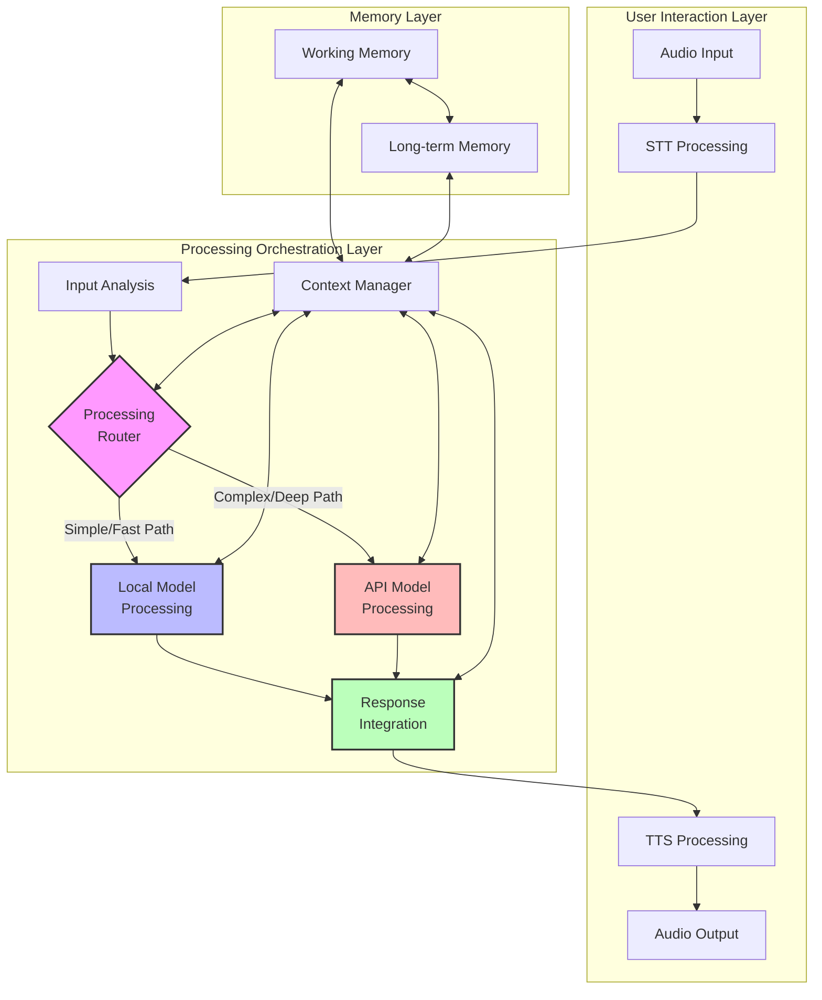
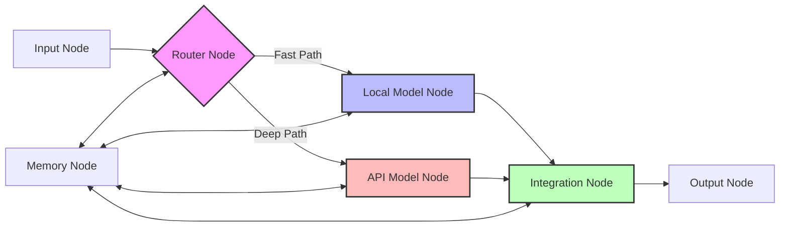

# Dual Processing Architecture [DOC-RESEARCH-HVA-3]

## Overview

This document details the technical implementation of VANTA's dual-processing approach, which combines local and cloud-based language models to achieve natural conversational interactions. This architecture provides both fast responses and high-quality reasoning while operating within the constraints of consumer hardware.

## Architecture Components

## Component Descriptions

### Processing Router [CON-HVA-009]

The Processing Router determines which model (local or API) should handle each aspect of the conversation:

- **Routing Criteria**:
  - Response urgency (immediate vs. thoughtful)
  - Query complexity (simple facts vs. synthesis)
  - Contextual cues (casual chat vs. detailed explanation)
  - Current system load and API quota status

- **Implementation Approach**:
  - Classifier model trained on conversation patterns
  - Heuristic rules for common scenarios
  - Dynamic adjustment based on user interaction patterns

### Local Model Processing [CON-HVA-010]

Fast, lightweight language model running on device:

- **Target Capabilities**:
  - Social acknowledgments and backchanneling
  - Simple factual responses from common knowledge
  - Conversational continuity during API processing
  - Personality consistency and emotional responses

- **Implementation Options**:
  - 7B parameter models optimized for M4 architecture
  - Quantized models (4-bit) for memory efficiency
  - Domain-specific fine-tuning for conversation

### API Model Processing [CON-HVA-011]

Cloud-based language model for complex reasoning:

- **Target Capabilities**:
  - Deep reasoning and novel insights
  - Complex information synthesis
  - Detailed explanations and step-by-step thinking
  - Access to broader knowledge and capabilities

- **Implementation Options**:
  - GPT-4 or Claude APIs with streaming responses
  - Careful prompt engineering for context efficiency
  - Asynchronous processing with callback handling

### Response Integration [CON-HVA-012]

Combines outputs from both processing streams into coherent conversation:

- **Integration Strategies**:
  - Immediate local responses while waiting for API results
  - Graceful interruption when API results arrive
  - Context-aware transitions between response types
  - Seamless handoffs between models during extended conversations

- **Implementation Approach**:
  - Priority queue for managing response timing
  - Natural language transitions between response types
  - Coherence checking to prevent contradictions

## Hardware Considerations [CON-HVA-003]

The architecture is designed to run efficiently on a MacBook Pro M4 with 24GB RAM:

| Component | Resource Requirements | Optimization Strategy |
|-----------|----------------------|------------------------|
| STT (Whisper) | ~2GB RAM, moderate CPU | Batch processing, activity detection |
| Local LLM | 8-10GB RAM, high Neural Engine | 4-bit quantization, model pruning |
| TTS | 2-3GB RAM, moderate CPU | Caching common phrases, voice profiles |
| Memory Systems | 2-4GB RAM, SSD storage | Tiered storage, compression |
| API Processing | Minimal local resources | Request batching, streaming responses |

## Latency Management [CON-HVA-004]

Techniques to minimize perceived latency:

1. **Predictive Processing**: Begin formulating responses before user completes speaking
2. **Progressive Response Generation**: Start speaking before full response is generated
3. **Background Processing**: Perform heavy computation during natural conversation pauses
4. **Response Caching**: Store common responses for immediate retrieval
5. **Attention Management**: Use verbal and prosodic cues to maintain engagement during processing

## Integration with LangGraph

The dual processing architecture can be implemented as a LangGraph workflow:

## Version History

- v0.1.0 - 2025-05-17 - Initial creation [SES-V0-004]