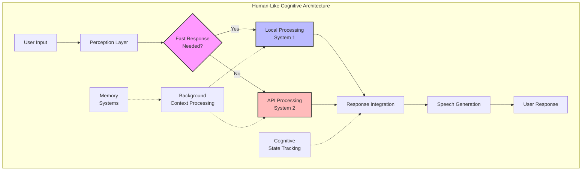

# Hybrid Cognitive Model [DOC-RESEARCH-HVA-2]

## Overview

This document details the cognitive model underlying VANTA's hybrid voice architecture, which aims to simulate human-like conversation patterns through a dual-process approach combining fast local processing and deeper API-based reasoning.

## Human Cognition as Inspiration

The architecture draws from established cognitive science models, particularly Kahneman's System 1 (fast, automatic) and System 2 (slow, deliberative) thinking patterns that characterize human cognition. By simulating these dual processes, VANTA can achieve more natural conversational dynamics.

### System 1 Characteristics (Local Model)
- Rapid, automatic responses
- Pattern recognition and associative memory
- Emotional reactions and social signals
- Backchanneling and conversational maintenance

### System 2 Characteristics (API Model)
- Deeper reasoning and analysis
- Complex information synthesis
- Long-term planning and structured thought
- Novel insight generation ("aha moments")

## Cognitive Simulation Components

## Simulated Cognitive Features

### 1. Dual-Track Thought Process [CON-HVA-001]

The architecture implements parallel processing streams:
- Reactive Stream: Handles immediate responses, backchanneling, and simple queries via local model
- Deliberative Stream: Processes complex reasoning and synthesis via API model

Benefits:
- Reduces perceived latency while maintaining response quality
- Creates natural conversation rhythm with quick acknowledgments during deeper processing
- Supports "epiphanic moments" when API results arrive during ongoing conversation

### 2. Natural Memory Patterns [CON-HVA-006]

The system simulates human memory characteristics:
- Recency and primacy effects for information recall
- Associative memory links between related concepts
- Forgetting curves for less relevant information
- "Top of mind" vs. deep memory access patterns

### 3. Conversational Transitions [CON-HVA-007]

The architecture implements natural speech transitions:
- "Let me think about that..." phrases during processing shifts
- "Oh, I just remembered..." interjections for context recall
- "Actually..." moments for self-correction when new information arrives
- Natural topic shifting with appropriate verbal transitions

### 4. Cognitive Load Simulation [CON-HVA-008]

The system models human-like cognitive resource allocation:
- Response complexity scales with apparent cognitive load
- Processing limitations acknowledged in natural ways ("That's a lot to consider...")
- Prioritization of immediate vs. deep-thinking responses based on conversation context

## Implementation Considerations

The hybrid cognitive model requires:
1. Fine-grained coordination between local and API models
2. Context sharing between processing streams
3. Managing timing of responses to create natural conversational rhythm
4. Response queueing for appropriate interruption and topic shifting

## Version History

- v0.1.0 - 2025-05-17 - Initial creation [SES-V0-004]