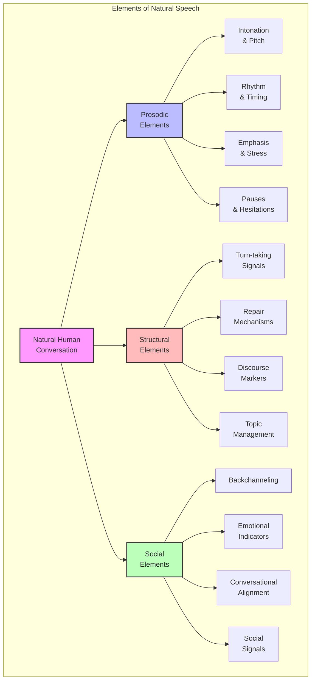
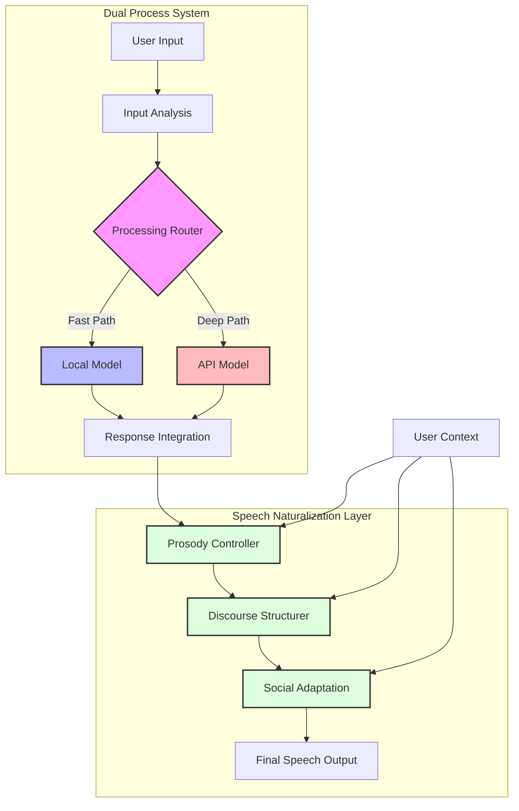

# Speech Naturalization [DOC-RESEARCH-HVA-4]

## Overview

This document details techniques to enhance the natural quality of VANTA's voice interactions, focusing on the prosodic, structural, and social aspects of human conversation. The goal is to create speech patterns that closely mimic human speech dynamics, making interactions feel more authentic and less artificial.

## Human Speech Characteristics

## Prosodic Control [CON-HVA-005]

Natural voice communication employs various prosodic features that convey meaning beyond words:

### 1. Variable Speech Rate

- **Implementation**: Dynamically adjust words-per-minute based on:
  - Content complexity (slower for complex information)
  - Emotional context (faster when excited, slower when thoughtful)
  - User speech patterns (matching the user's pace)
  - Informational density (slowing for important points)

- **Technical Approach**:
  - SSML tags for speech rate control in TTS systems
  - Custom markers in response generation for pace variation
  - Content complexity analyzer to determine appropriate rate

### 2. Natural Pauses and Hesitations

- **Types of Pauses**:
  - Cognitive pauses: "Hmm," "Let me think," during processing
  - Emphasis pauses: Before important information
  - Turn-yielding pauses: Indicating completion of a thought
  - Hesitation markers: "um," "uh," "well," for natural flow

- **Implementation Strategy**:
  - Insert natural pause markers based on response type
  - Use hesitation sounds during API processing waiting periods
  - Implement pause length variability based on context

### 3. Intonation and Emphasis

- **Features**:
  - Pitch variation for questions vs. statements
  - Emphasis on key terms in explanations
  - Emotional inflection matching content
  - Rising intonation for continuity, falling for completion

- **Technical Implementation**:
  - SSML prosody tags for pitch and emphasis control
  - Contextual markers for appropriate intonation patterns
  - Pre-processed emotional tone mapping

## Conversational Structure [CON-HVA-013]

Natural conversation follows structural patterns that can be modeled:

### 1. Turn-Taking Management

- **Signals and Cues**:
  - Implement prosodic cues that indicate turn completion
  - Recognize user's turn-yielding signals
  - Handle interruptions gracefully
  - Maintain appropriate pause length between turns

- **Technical Approach**:
  - End-of-turn detector using prosodic features
  - Interruption handler with graceful recovery
  - Dynamic pause timing based on conversation flow

### 2. Repair Mechanisms

- **Types of Repairs**:
  - Self-correction: "I mean," "rather," "actually"
  - Clarification: "To be more specific," "In other words"
  - Elaboration: "Let me explain further"
  - Backtracking: "Let me start over"

- **Implementation Strategy**:
  - Track confidence in responses
  - Implement correction patterns when API results contradict local model
  - Use repair markers to smooth transitions between thought processes

### 3. Discourse Markers

- **Common Markers**:
  - Topic shifts: "By the way," "Speaking of," "This reminds me"
  - Continuation: "So," "Anyway," "As I was saying"
  - Conclusion: "In summary," "To wrap up"
  - Thought process: "Let me think about this," "If we consider"

- **Technical Approach**:
  - Contextual discourse marker selection
  - State tracking for appropriate marker use
  - Persona-consistent marker patterns

## Social Speech Elements [CON-HVA-014]

Human conversation includes social elements that build rapport:

### 1. Backchanneling

- **Implementation**:
  - Verbal acknowledgments during user speech ("I see," "Mmm-hmm")
  - Contextual backchannels that reflect understanding level
  - Responsive backchannels matching emotional tone

- **Technical Approach**:
  - Low-latency backchanneling using local model during API processing
  - Context-sensitive response selection
  - Varied backchanneling frequency based on conversation dynamics

### 2. Emotional Mirroring

- **Features**:
  - Match speech energy to user's emotional state
  - Appropriate emotional responses to user experiences
  - Gradual emotional transitions rather than abrupt shifts

- **Implementation Strategy**:
  - Emotion detection from speech and content
  - Emotion-appropriate response templates
  - SSML emotional markers for TTS systems

### 3. Conversational Adaptation

- **Adaptation Mechanisms**:
  - Vocabulary matching to user's language level
  - Speaking style adaptation (formal/informal)
  - Topic interest detection and emphasis
  - Cultural reference personalization

- **Technical Approach**:
  - User preference tracking
  - Progressive adaptation over conversation history
  - Style transfer techniques in response generation

## Integration with Dual-Process Architecture

The speech naturalization features are integrated with the dual-process architecture:

## Implementation Considerations

1. **TTS Selection**: Choose TTS systems with strong prosodic control capabilities
2. **Response Generation Process**: Implement a two-stage process - content generation followed by naturalization
3. **Persona Consistency**: Maintain consistent speech patterns that align with VANTA's persona
4. **Evaluation Metrics**: Develop subjective and objective measures for speech naturalness

## Version History

- v0.1.0 - 2025-05-17 - Initial creation [SES-V0-004]