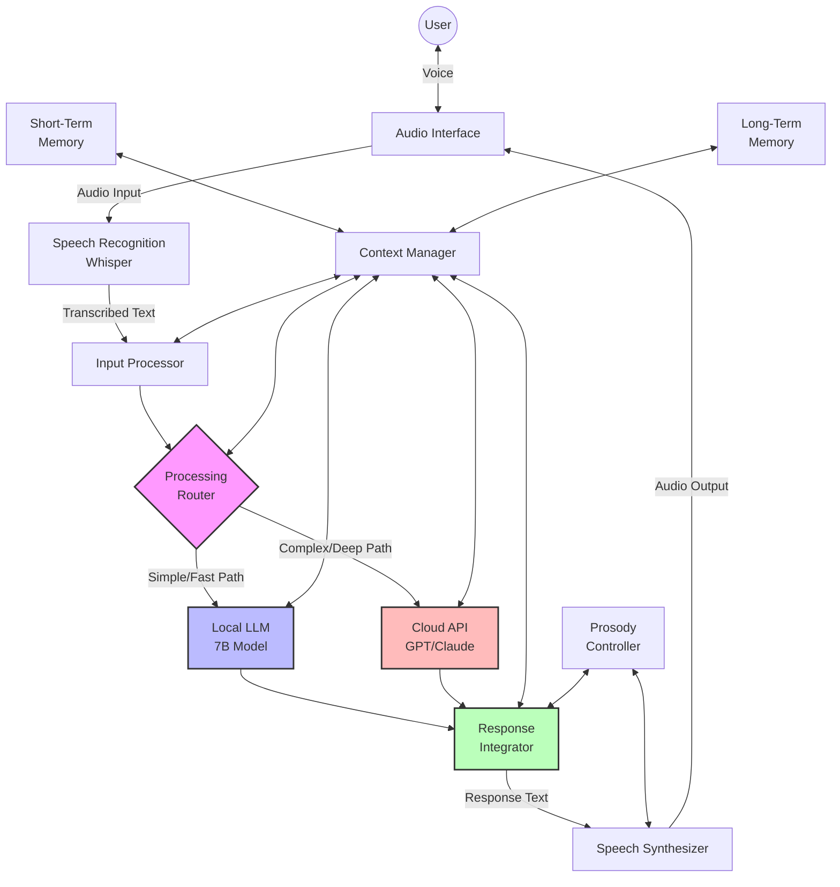
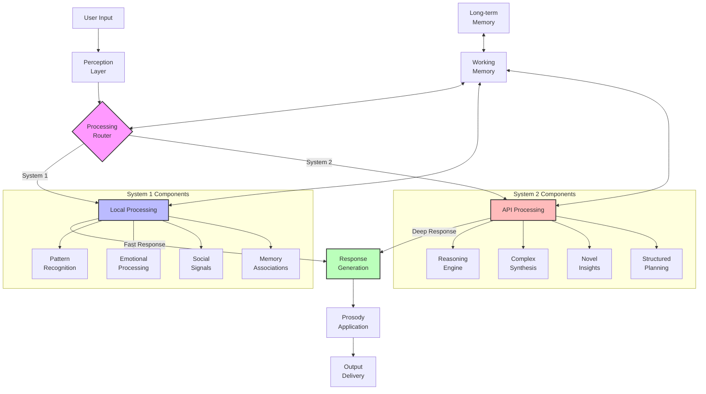
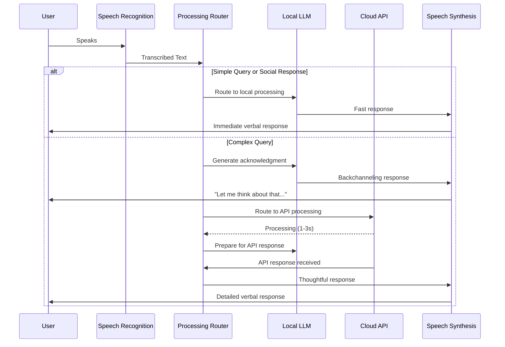
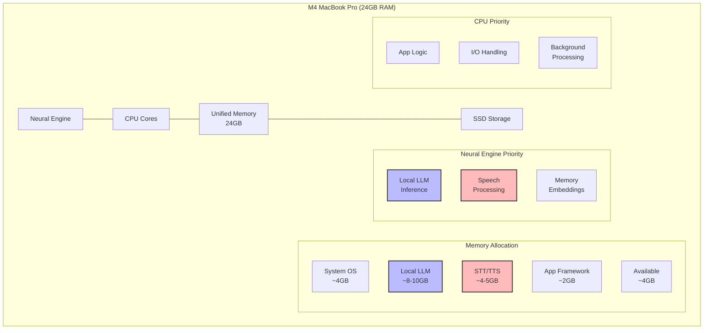
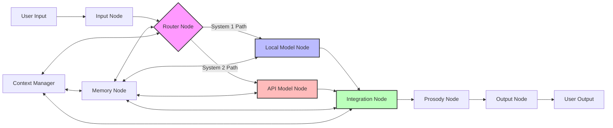

# Hybrid Architecture Diagrams [DOC-RESEARCH-HVA-6]

This document contains visual representations of VANTA's hybrid voice architecture, illustrating the relationships between components and the flow of data through the system.

## System Overview

## Dual-Process Cognitive Model

## Information Flow During Processing

## Hardware Resource Allocation

## LangGraph Implementation

## Version History

- v0.1.0 - 2025-05-17 - Initial creation [SES-V0-004]