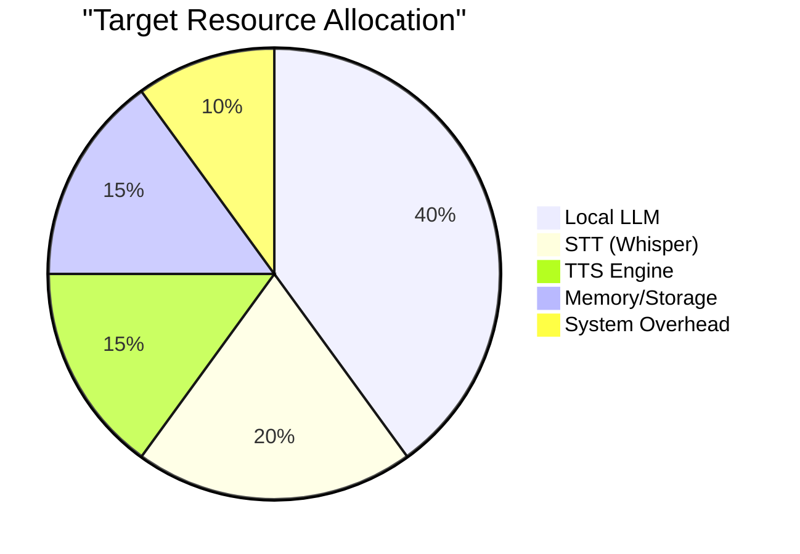

# Implementation Considerations [DOC-RESEARCH-HVA-5]

## Overview

This document outlines practical implementation considerations for VANTA's hybrid voice architecture on the target hardware (MacBook Pro M4 with 24GB RAM). It addresses technical constraints, performance optimization strategies, and development approaches to achieve natural voice interaction.

## Hardware Profile Analysis

The M4 MacBook Pro provides several advantages for this implementation:

- **Neural Engine**: Optimized for ML operations with dedicated hardware
- **Unified Memory**: Fast memory access without transfer overhead
- **Power Efficiency**: Good battery performance for mobile use
- **Native ARM Support**: Available for many ML frameworks

### Resource Allocation Strategy

## Implementation Challenges and Solutions

### 1. Local LLM Performance [CON-HVA-015]

**Challenge**: Running a sufficiently capable LLM locally within memory constraints

**Solutions**:
- Quantized 4-bit models (Llama-2-7B, Mistral-7B) optimized for Metal
- Distilled models specialized for conversational tasks
- Prompt context optimization to reduce memory requirements
- Custom caching layer for frequent response patterns
- Progressive loading of model components based on conversation needs

### 2. API Integration and Latency [CON-HVA-016]

**Challenge**: Managing API latency while maintaining conversational flow

**Solutions**:
- Streaming API responses to begin processing before complete response
- Intelligent request batching to minimize API calls
- Predictive API calling based on conversation patterns
- Fallback mechanisms when API connectivity is interrupted
- Local caching of API responses for similar queries

### 3. Voice Pipeline Optimization [CON-HVA-017]

**Challenge**: Achieving low-latency speech processing with high quality

**Solutions**:
- Whisper small/medium models optimized for M4 architecture
- Voice activity detection to minimize unnecessary processing
- Phrase-level processing rather than waiting for complete utterances
- Adaptive quality settings based on system load
- Multi-threaded pipeline with efficient handoffs

### 4. Memory Management [CON-HVA-018]

**Challenge**: Maintaining conversation context within memory constraints

**Solutions**:
- Tiered memory architecture (active vs. archived conversation)
- Semantic compression of conversation history
- Selective persistence of important context only
- Dynamic memory allocation based on conversation complexity
- Efficient vector storage for semantic retrieval

## Development Approach

The implementation should proceed in phases:

### Phase 1: Core Functionality 🟡

- Basic STT/TTS pipeline integration
- Simple local LLM integration (4-bit quantized 7B model)
- Preliminary API integration with basic fallback
- Minimal conversation memory

### Phase 2: Processing Orchestration 🔴

- Implement router for local/API model selection
- Develop response integration system
- Add basic conversational state tracking
- Implement memory persistence layer

### Phase 3: Speech Naturalization 🔴

- Add prosodic control layer
- Implement backchanneling system
- Develop discourse structuring components
- Add repair mechanisms and transitions

### Phase 4: Advanced Features 🔴

- Emotional adaptation and mirroring
- Conversational style matching
- Expanded memory capabilities
- Performance optimization and tuning

## Development Tools and Frameworks

| Component | Recommended Tools | Alternatives |
|-----------|-------------------|--------------|
| STT | Whisper.cpp, Metal Whisper | MLX Whisper, PyTorch Whisper |
| Local LLM | llama.cpp, MLC LLM | MLX LLM, LangChain |
| TTS | MLX-TTS, Apple TTS | XTTS, Facebook FastSpeech |
| Orchestration | LangGraph | Custom event system, LCEL |
| Memory | Chroma, FAISS | SQLite, Postgres |
| API Integration | LangChain, LlamaIndex | Custom API clients |

## Performance Testing

Establish the following performance baselines:

1. **End-to-end latency**: From user speech to system response
   - Target: < 1.5 seconds for local model responses
   - Target: < 3.0 seconds for API-assisted responses

2. **Memory utilization**: Peak and sustained
   - Target: < 18GB peak memory usage
   - Target: < 12GB sustained memory usage

3. **Battery impact**: Power consumption
   - Target: < 15% battery drain per hour of active use

4. **User satisfaction**: Subjective ratings
   - Naturalness of speech
   - Perceived responsiveness
   - Conversation quality

## Risk Assessment

| Risk | Impact | Mitigation |
|------|--------|------------|
| Local LLM performance insufficient | High | Careful model selection, fallback to API, scope adjustment |
| API costs exceed budget | Medium | Request batching, caching, local processing preference |
| Speech recognition errors | High | Multi-pass recognition, confirmation for critical tasks |
| System resource competition | Medium | Prioritized resource allocation, graceful degradation |
| User adoption barriers | High | Naturalization focus, simplified interaction patterns |

## Version History

- v0.1.0 - 2025-05-17 - Initial creation [SES-V0-004]