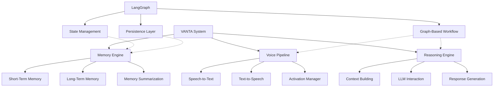
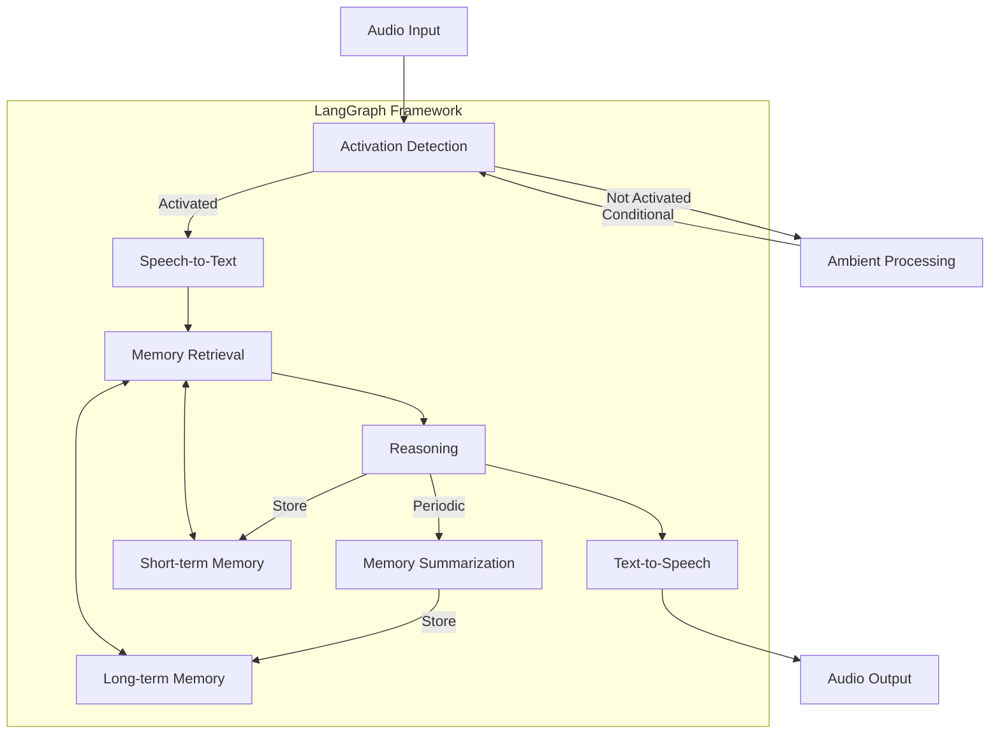

# LangGraph Integration with VANTA
Document ID: [DOC-RESEARCH-LG-1]

## Overview

This document explores how LangGraph can be integrated with the V0_VANTA architecture to provide a robust framework for voice-based ambient assistance. LangGraph offers capabilities that align well with VANTA's core requirements for stateful processing, memory management, and component orchestration.



## Key Benefits of LangGraph for VANTA

### 1. Graph-Based Architecture

LangGraph's directed graph approach provides a clear structure for VANTA's complex processing pipeline:

- **Explicit Component Relationships**: Nodes and edges make the flow of data and control explicit
- **Conditional Branching**: Support for dynamic routing based on state (essential for activation modes)
- **Visualizable Architecture**: The graph structure can be visualized for easier understanding

### 2. State Management

LangGraph provides robust state management capabilities critical for VANTA:

- **Typed State**: TypedDict ensures type safety for complex state objects
- **Reducers**: Built-in support for state composition with add_messages and other reducers
- **Isolated Updates**: Components can update only their relevant portions of state

### 3. Memory and Persistence

LangGraph's memory capabilities align perfectly with VANTA's requirements:

- **Session Persistence**: Built-in support for saving and resuming conversations
- **Memory Checkpointing**: Automatic state persistence with various saver backends
- **Message Management**: Automatic handling of conversation history with tools for trimming and summarization

### 4. Tool Integration

LangGraph's tool integration streamlines VANTA's voice processing needs:

- **Modular Components**: Easy to swap different implementations of STT/TTS
- **Structured Tool Calls**: Standardized approach to tool definition and invocation
- **Error Handling**: Robust error catching and recovery for external tool calls

## Integration Approach

### Voice Pipeline Integration

```python
# LangGraph nodes for voice processing
def process_audio(state: VANTAState):
    """Processes audio input using Whisper for transcription."""
    # Implementation that uses Whisper
    # ...

def synthesize_speech(state: VANTAState):
    """Converts text to speech using CSM."""
    # Implementation that uses CSM
    # ...
```

The voice pipeline can be implemented as LangGraph nodes that handle:
1. Activation detection (wake word, continuous, or scheduled)
2. Audio transcription with Whisper
3. Speech synthesis with CSM

### Memory System Integration

```python
# Memory persistence with LangGraph
checkpointer = InMemorySaver()  # Could also use RedisMemorySaver, etc.
graph = workflow.compile(checkpointer=checkpointer)

# State definition with memory components
class VANTAState(TypedDict):
    messages: Annotated[Sequence[BaseMessage], add_messages]
    memory: Dict  # Structured memory storage
```

The memory system leverages LangGraph's:
1. Checkpoint system for short-term memory
2. State persistence for long-term storage references
3. Message utilities for summarization and context management

### Reasoning Engine Integration

```python
def retrieve_context(state: VANTAState):
    """Retrieves relevant context from the memory system."""
    # Implementation using vector search, etc.
    # ...

def generate_response(state: VANTAState):
    """Generates a response using an LLM with memory context."""
    # Implementation using Claude or another LLM
    # ...
```

The reasoning engine benefits from LangGraph's:
1. Structured state for comprehensive context
2. Tool integration for external APIs
3. Message organization for LLM prompting

## System Architecture with LangGraph



## Implementation Considerations

### 1. State Design

The VANTA state should be structured to include:

- **Messages**: Conversation history with user and assistant messages
- **Audio**: Metadata about audio processing (transcriptions, synthesis info)
- **Memory**: References to both short and long-term memory entries
- **Config**: System configuration including activation modes
- **Activation**: Current system status and mode

### 2. Component Interfaces

LangGraph nodes should align with VANTA's component boundaries:

- **Voice Pipeline Components**: Audio processing, STT, TTS
- **Memory Components**: Storage, retrieval, summarization
- **Reasoning Components**: Context building, LLM interaction, response generation

### 3. Persistence Strategy

A layered approach to persistence is recommended:

- **In-Memory**: For development and testing (InMemorySaver)
- **Redis**: For production deployment (RedisMemorySaver)
- **Database**: For long-term storage of conversation history and user data

## Next Steps

1. **Create a Prototype**: Implement a minimal viable example that demonstrates the core VANTA pipeline using LangGraph
2. **Test Persistence**: Verify state persistence across multiple sessions
3. **Benchmark Performance**: Evaluate real-time performance for voice processing
4. **Explore Integration with MCP**: Determine how Model Context Protocol could complement LangGraph

## References

- [LangGraph Documentation](https://langchain-ai.github.io/langgraph/)
- [DOC-TECH-VIS-1] V0_VANTA Core Vision Document
- [CON-VANTA-001] Voice Pipeline
- [CON-VANTA-002] Memory Engine

## Last Updated

2025-05-16T12:00:00Z | SES-V0-003 | Initial creation