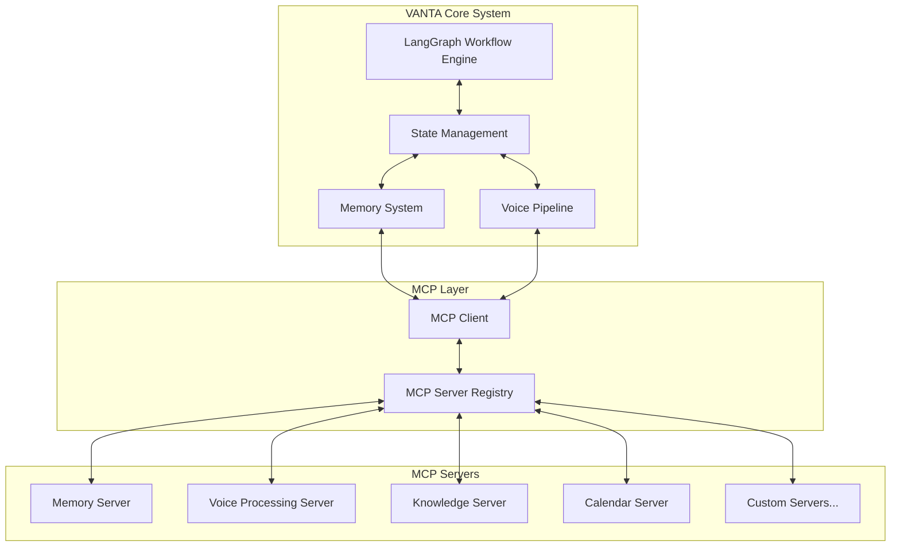
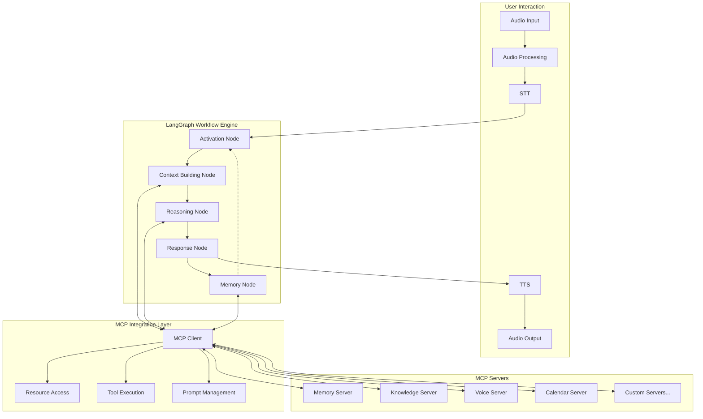
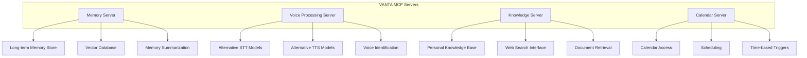
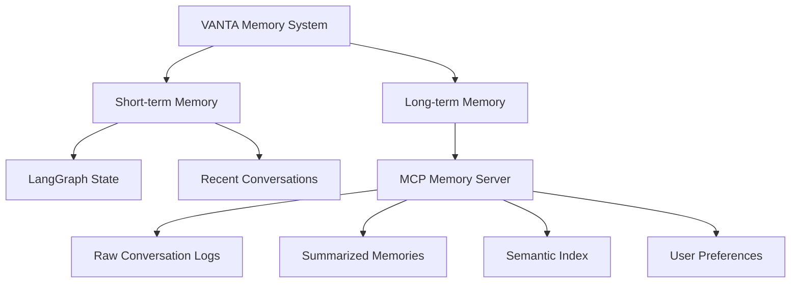
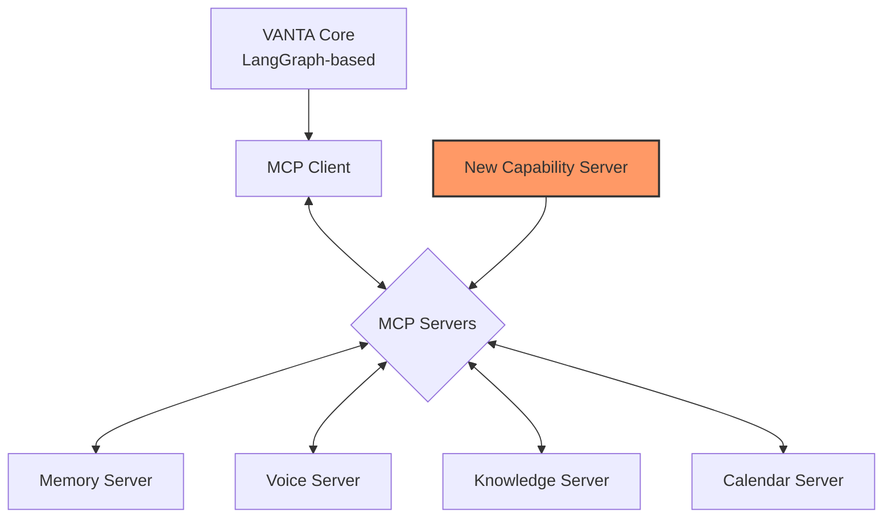
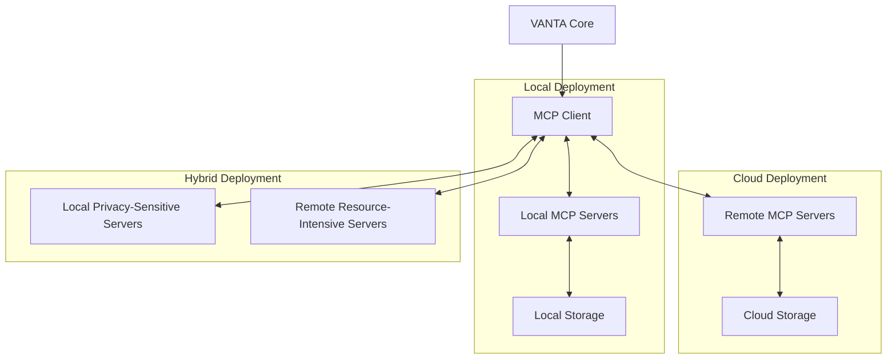
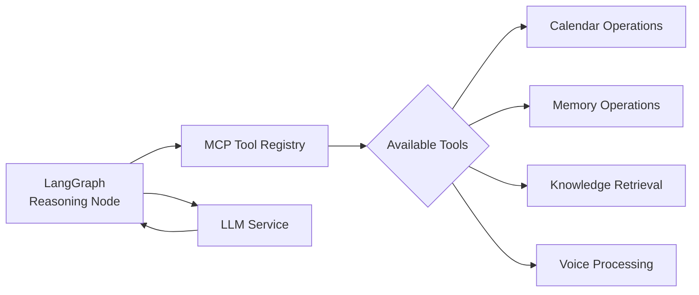
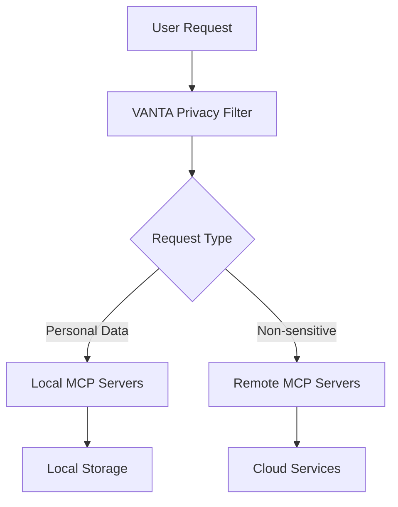

# Integrating MCP with LangGraph for VANTA
Document ID: [DOC-RESEARCH-MCP-1]

## Overview

This document explores how Model Context Protocol (MCP) can integrate with LangGraph to create a robust, extensible architecture for the V0_VANTA project. By combining these technologies, we can leverage the strengths of both frameworks - LangGraph's stateful workflow management and MCP's standardized context sharing capabilities.



## Complementary Strengths

### LangGraph Provides
- **Workflow orchestration**: Managing the flow of execution between components
- **State management**: Tracking the agent's internal state across interactions
- **Short-term memory**: Managing conversation context within a session
- **Graph-based processing**: Organizing components into a directed graph

### MCP Provides
- **Standardized context access**: Common protocol for accessing diverse data sources
- **Tool integration**: Consistent pattern for executing actions through servers
- **Extensibility**: Easy addition of new capabilities through new servers
- **Data abstraction**: Uniform interfaces to heterogeneous data sources

## Integration Architecture

The architecture combines LangGraph's workflow engine with MCP's context protocol:



## Key Integration Points

### 1. MCP Client Node in LangGraph

LangGraph can include a specialized node that acts as an MCP client, providing a bridge between the workflow and external MCP servers:

```python
def mcp_client_node(state: VANTAState):
    """Node that handles MCP client operations."""
    # Extract query or action from state
    query = build_query_from_state(state)
    
    # Use MCP client to access appropriate servers
    mcp_client = get_mcp_client()
    results = mcp_client.query_servers(query)
    
    # Update state with results
    return {
        "memory": {"mcp_results": results},
        "context": {"external_data": extract_context(results)}
    }

# Add to the LangGraph workflow
workflow.add_node("mcp_client", mcp_client_node)
workflow.add_edge("context_building", "mcp_client")
workflow.add_edge("mcp_client", "reasoning")
```

### 2. MCP Servers for VANTA Components

VANTA can leverage specialized MCP servers for specific functionality:



### 3. Memory Architecture with MCP

MCP provides an excellent way to structure VANTA's layered memory approach:



## Implementation Strategy

### 1. Core LangGraph Workflow

The core VANTA system remains a LangGraph workflow, handling:
- Voice pipeline orchestration
- Conversation turn-taking
- Short-term memory management
- Core decision making

### 2. MCP Server Development

Develop custom MCP servers for VANTA-specific needs:

**Memory Server**
```python
class VANTAMemoryServer(MCPServer):
    """MCP server for VANTA's memory system."""
    
    def __init__(self, storage_path):
        super().__init__("memory")
        self.storage_path = storage_path
        self.db = initialize_database(storage_path)
    
    # Resource: Provide conversation history
    @resource("conversations")
    def get_conversations(self, params):
        user_id = params.get("user_id")
        limit = params.get("limit", 10)
        return self.db.get_conversations(user_id, limit)
    
    # Tool: Store new conversation
    @tool("store_conversation")
    def store_conversation(self, conversation_data):
        return self.db.store_conversation(conversation_data)
    
    # Tool: Generate memory summary
    @tool("summarize_memory")
    def summarize_memory(self, memory_ids):
        # Retrieve memories and generate summary
        memories = [self.db.get_memory(id) for id in memory_ids]
        return generate_summary(memories)
```

**Voice Server**
```python
class VANTAVoiceServer(MCPServer):
    """MCP server for VANTA's voice processing capabilities."""
    
    def __init__(self):
        super().__init__("voice")
        self.models = load_voice_models()
    
    # Tool: Convert speech to text
    @tool("transcribe")
    def transcribe(self, audio_data):
        model_name = audio_data.get("model", "whisper")
        return self.models[model_name].transcribe(audio_data["content"])
    
    # Tool: Convert text to speech
    @tool("synthesize")
    def synthesize(self, text_data):
        model_name = text_data.get("model", "csm")
        voice_id = text_data.get("voice_id", "default")
        return self.models[model_name].synthesize(text_data["content"], voice_id)
```

### 3. MCP Client Integration

Integrate the MCP client into the LangGraph workflow:

```python
class MCPClientNode:
    """LangGraph node that interfaces with MCP servers."""
    
    def __init__(self, server_types=None):
        self.mcp_client = MCPClient()
        self.server_types = server_types or ["memory", "voice", "knowledge"]
    
    def __call__(self, state: VANTAState):
        # Determine what servers to query based on state
        query_context = self._build_context(state)
        
        # Query relevant MCP servers
        results = {}
        for server_type in self.server_types:
            server_results = self.mcp_client.query(server_type, query_context)
            results[server_type] = server_results
        
        # Update state with results
        return self._update_state(state, results)
    
    def _build_context(self, state):
        """Build query context from state."""
        # Extract relevant information from state
        return {
            "messages": state["messages"],
            "query": get_last_message_content(state),
            "user_id": state["config"].get("user_id"),
            "timestamp": datetime.now().isoformat()
        }
    
    def _update_state(self, state, results):
        """Update state with MCP results."""
        # Process results and update state accordingly
        updates = {}
        
        if "memory" in results:
            updates["memory"] = {
                "retrieved": results["memory"].get("conversations", []),
                "summaries": results["memory"].get("summaries", [])
            }
        
        if "knowledge" in results:
            updates["context"] = {
                "knowledge": results["knowledge"].get("facts", []),
                "documents": results["knowledge"].get("documents", [])
            }
        
        return updates
```

## Benefits of Integration

### 1. Modularity and Extensibility



By using MCP, new capabilities can be added to VANTA without modifying the core system. Simply develop and connect new MCP servers.

### 2. Flexible Deployment



MCP enables flexible deployment options, allowing some servers to run locally while others run in the cloud, based on privacy, performance, and resource requirements.

### 3. Standardized Tool Access



Tools defined across MCP servers are consistently accessible to the LLM, providing a standardized approach to tool definition and calling.

### 4. Privacy and Security



MCP servers can be configured with specific privacy and security policies, ensuring sensitive data remains local while leveraging cloud services when appropriate.

## Challenges and Considerations

### 1. Performance Overhead

MCP introduces additional communication layers that may impact VANTA's real-time performance. Careful optimization is needed, particularly for voice processing components.

### 2. Custom Voice Integration

MCP does not have built-in voice capabilities, so custom MCP servers will need to be developed to support VANTA's voice pipeline.

### 3. State Synchronization

Maintaining consistency between LangGraph's state and MCP servers requires careful design to avoid conflicts or inconsistencies.

### 4. Deployment Complexity

A hybrid architecture with both LangGraph and MCP increases deployment complexity, requiring clear documentation and management practices.

## Next Steps

1. **Create a Prototype MCP Server**: Develop a minimal viable MCP server for one VANTA component (e.g., memory)
2. **Integrate with LangGraph**: Build a simple LangGraph workflow that interfaces with the MCP server
3. **Benchmark Performance**: Evaluate the performance impact of the MCP layer
4. **Define Server Specifications**: Design specifications for all required MCP servers

## References

- [DOC-TECH-MCP-1] Model Context Protocol Reference
- [DOC-RESEARCH-LG-1] LangGraph Integration with VANTA
- [CON-TECH-001] Model Context Protocol
- [CON-TECH-002] MCP Architecture

## Last Updated

2025-05-16T14:30:00Z | SES-V0-003 | Initial creation