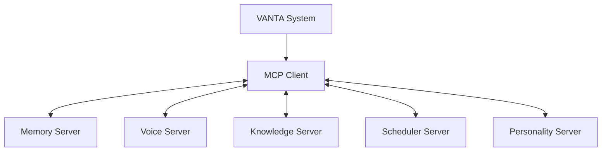
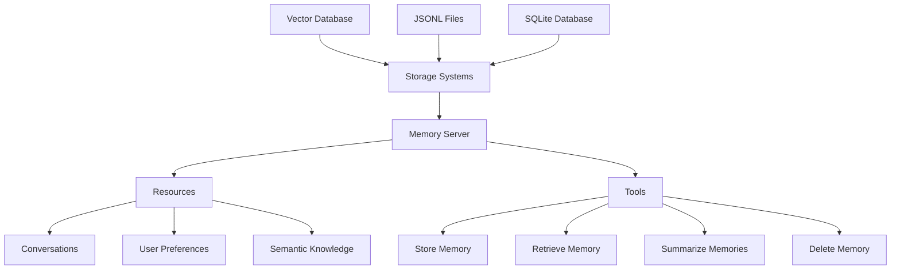
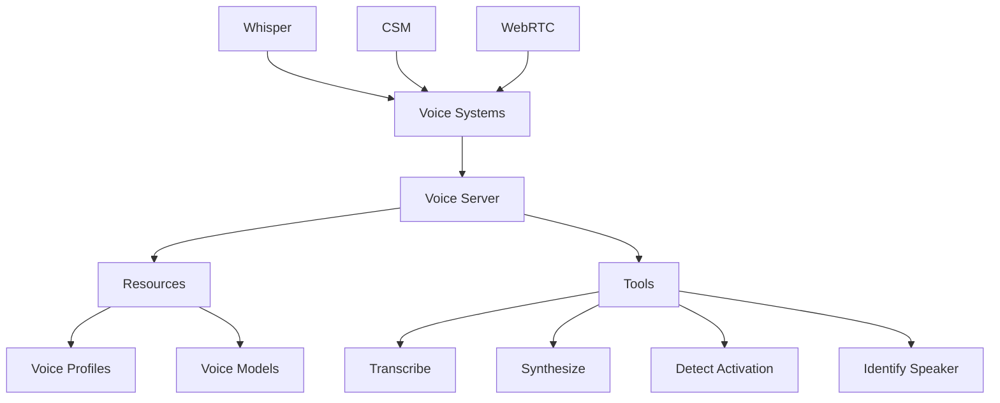
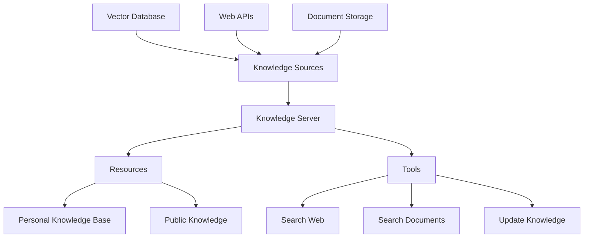
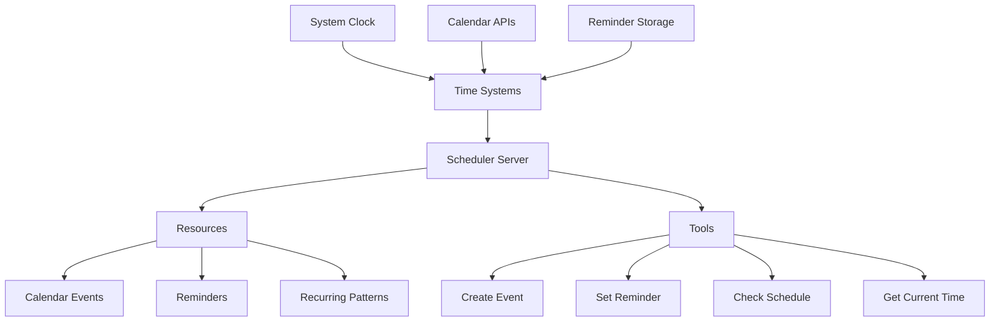
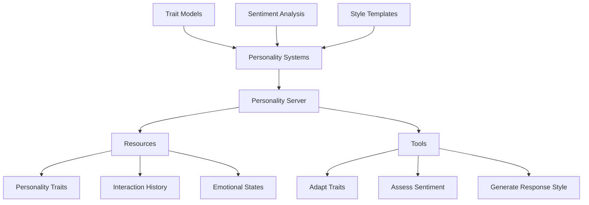
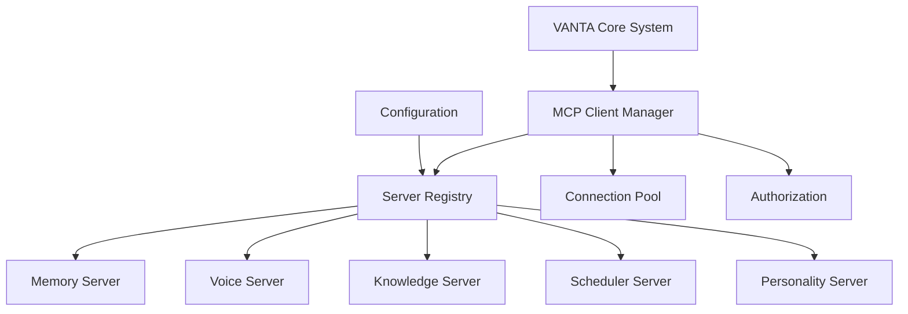
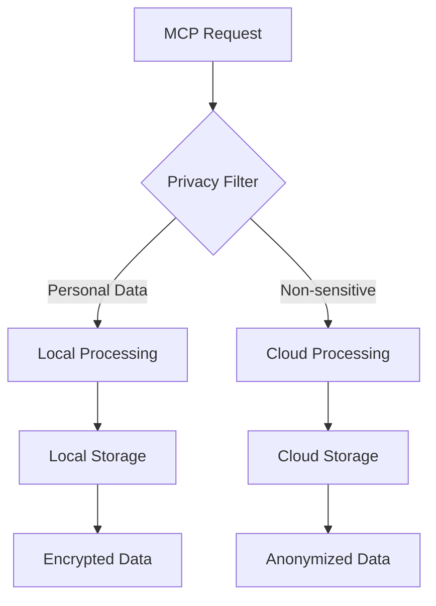

# VANTA MCP Server Designs
Document ID: [DOC-RESEARCH-MCP-2]

## Overview

This document outlines the design specifications for custom MCP servers that would support the V0_VANTA architecture. These servers would enable standardized access to VANTA's core capabilities through the Model Context Protocol.



## Server Types and Capabilities

### 1. Memory Server

The Memory Server would provide access to VANTA's memory architecture, enabling storage and retrieval of conversations, user preferences, and semantic knowledge.



**Key Capabilities:**

- **Resources:**
  - `conversations`: Access to raw conversation logs
  - `preferences`: User preferences and settings
  - `semantic_index`: Semantic search over memories

- **Tools:**
  - `store_memory`: Store new conversations or information
  - `retrieve_similar`: Find semantically similar memories
  - `summarize`: Generate summaries of multiple memories
  - `forget`: Delete or archive old memories

**Implementation Notes:**

```python
# Memory Server Implementation Outline
class VANTAMemoryServer(MCPServer):
    def __init__(self, storage_path):
        super().__init__("memory")
        self.storage = initialize_storage(storage_path)
        self.vector_db = initialize_vector_db(storage_path)
    
    @resource("conversations")
    def get_conversations(self, params):
        # Params might include user_id, timestamp range, etc.
        return self.storage.get_conversations(params)
    
    @resource("preferences")
    def get_preferences(self, params):
        return self.storage.get_preferences(params["user_id"])
    
    @resource("semantic_index")
    def query_semantic_index(self, params):
        # Perform semantic search
        return self.vector_db.search(
            query=params["query"],
            filters=params.get("filters", {}),
            limit=params.get("limit", 5)
        )
    
    @tool("store_memory")
    def store_memory(self, data):
        # Store raw data
        memory_id = self.storage.store(data)
        
        # Update vector index if it's textual
        if "text" in data:
            self.vector_db.add(
                id=memory_id,
                text=data["text"],
                metadata=data.get("metadata", {})
            )
        
        return {"memory_id": memory_id}
    
    @tool("summarize")
    def summarize_memories(self, data):
        # Get memories to summarize
        memory_ids = data["memory_ids"]
        memories = [self.storage.get(id) for id in memory_ids]
        
        # Generate summary
        summary = generate_summary(memories)
        
        # Optionally store the summary
        if data.get("store_summary", False):
            summary_id = self.store_memory({
                "text": summary,
                "metadata": {
                    "type": "summary",
                    "source_ids": memory_ids
                }
            })
            return {"summary": summary, "summary_id": summary_id}
        
        return {"summary": summary}
```

### 2. Voice Server

The Voice Server would encapsulate VANTA's voice processing capabilities, providing standardized access to speech-to-text and text-to-speech functionality.



**Key Capabilities:**

- **Resources:**
  - `voice_profiles`: Access to stored voice characteristics
  - `voice_models`: Available STT and TTS models

- **Tools:**
  - `transcribe`: Convert audio to text using Whisper
  - `synthesize`: Convert text to audio using CSM
  - `detect_activation`: Check for wake words or activation patterns
  - `identify_speaker`: Identify speakers from voice characteristics

**Implementation Notes:**

```python
# Voice Server Implementation Outline
class VANTAVoiceServer(MCPServer):
    def __init__(self):
        super().__init__("voice")
        self.stt_models = initialize_stt_models()
        self.tts_models = initialize_tts_models()
        self.voice_profiles = load_voice_profiles()
    
    @resource("voice_profiles")
    def get_voice_profiles(self, params):
        user_id = params.get("user_id")
        if user_id:
            return self.voice_profiles.get_user_profiles(user_id)
        return self.voice_profiles.get_all_profiles()
    
    @resource("voice_models")
    def get_voice_models(self, params):
        model_type = params.get("type")
        if model_type == "stt":
            return list(self.stt_models.keys())
        elif model_type == "tts":
            return list(self.tts_models.keys())
        return {
            "stt": list(self.stt_models.keys()),
            "tts": list(self.tts_models.keys())
        }
    
    @tool("transcribe")
    def transcribe(self, data):
        audio_data = data["audio"]
        model_name = data.get("model", "whisper")
        
        # Validate model exists
        if model_name not in self.stt_models:
            return {"error": f"Model {model_name} not found"}
        
        # Transcribe audio
        transcription = self.stt_models[model_name].transcribe(audio_data)
        
        return {"text": transcription["text"], "confidence": transcription["confidence"]}
    
    @tool("synthesize")
    def synthesize(self, data):
        text = data["text"]
        model_name = data.get("model", "csm")
        voice_id = data.get("voice_id", "default")
        
        # Validate model exists
        if model_name not in self.tts_models:
            return {"error": f"Model {model_name} not found"}
        
        # Synthesize speech
        audio_data = self.tts_models[model_name].synthesize(text, voice_id)
        
        # Save to temporary file
        file_path = f"/tmp/vanta_speech_{uuid.uuid4()}.wav"
        with open(file_path, "wb") as f:
            f.write(audio_data)
        
        return {"audio_path": file_path, "audio_format": "wav"}
    
    @tool("detect_activation")
    def detect_activation(self, data):
        audio_data = data["audio"]
        mode = data.get("mode", "wake_word")
        
        if mode == "wake_word":
            # Check for wake words
            wake_words = data.get("wake_words", ["hey vanta"])
            detected = detect_wake_words(audio_data, wake_words)
            return {"activated": detected, "confidence": detected["confidence"] if detected else 0}
        
        elif mode == "continuous":
            # Check for speech vs silence
            speech_detected = detect_speech(audio_data)
            return {"activated": speech_detected, "is_speech": speech_detected}
        
        elif mode == "voice_pattern":
            # Check for specific voice patterns
            pattern = data.get("pattern", {})
            match = match_voice_pattern(audio_data, pattern)
            return {"activated": match["matched"], "match_score": match["score"]}
        
        return {"error": f"Unsupported activation mode: {mode}"}
```

### 3. Knowledge Server

The Knowledge Server would provide access to external information sources, allowing VANTA to retrieve and reason with knowledge beyond its conversation history.



**Key Capabilities:**

- **Resources:**
  - `personal_knowledge`: User-specific information and documents
  - `public_knowledge`: General information from trusted sources

- **Tools:**
  - `search_web`: Search the web for information
  - `search_documents`: Search personal documents
  - `add_knowledge`: Add new information to knowledge base

**Implementation Notes:**

```python
# Knowledge Server Implementation Outline
class VANTAKnowledgeServer(MCPServer):
    def __init__(self, storage_path):
        super().__init__("knowledge")
        self.personal_kb = initialize_personal_kb(storage_path)
        self.web_search = initialize_web_search()
        self.document_storage = initialize_document_storage(storage_path)
    
    @resource("personal_knowledge")
    def get_personal_knowledge(self, params):
        user_id = params.get("user_id")
        query = params.get("query")
        
        # Search personal knowledge base
        results = self.personal_kb.search(
            user_id=user_id,
            query=query,
            limit=params.get("limit", 5)
        )
        
        return {"results": results}
    
    @resource("public_knowledge")
    def get_public_knowledge(self, params):
        query = params.get("query")
        
        # Search public knowledge sources
        results = self.public_kb.search(
            query=query,
            limit=params.get("limit", 5)
        )
        
        return {"results": results}
    
    @tool("search_web")
    def search_web(self, data):
        query = data["query"]
        num_results = data.get("num_results", 3)
        
        # Search the web
        search_results = self.web_search.search(query, num_results)
        
        return {"results": search_results}
    
    @tool("search_documents")
    def search_documents(self, data):
        query = data["query"]
        user_id = data["user_id"]
        document_types = data.get("document_types", ["all"])
        
        # Search user documents
        results = self.document_storage.search(
            user_id=user_id,
            query=query,
            document_types=document_types,
            limit=data.get("limit", 5)
        )
        
        return {"results": results}
    
    @tool("add_knowledge")
    def add_knowledge(self, data):
        user_id = data["user_id"]
        content = data["content"]
        metadata = data.get("metadata", {})
        
        # Add to personal knowledge base
        entry_id = self.personal_kb.add(
            user_id=user_id,
            content=content,
            metadata=metadata
        )
        
        return {"entry_id": entry_id}
```

### 4. Scheduler Server

The Scheduler Server would manage VANTA's time-aware capabilities, handling scheduling, reminders, and temporal reasoning.



**Key Capabilities:**

- **Resources:**
  - `calendar`: Access to user calendar events
  - `reminders`: Scheduled reminders and alerts
  - `patterns`: Recurring activity patterns

- **Tools:**
  - `schedule_event`: Create calendar events
  - `set_reminder`: Set time-based reminders
  - `check_availability`: Check schedule availability

**Implementation Notes:**

```python
# Scheduler Server Implementation Outline
class VANTASchedulerServer(MCPServer):
    def __init__(self, storage_path):
        super().__init__("scheduler")
        self.calendar = initialize_calendar()
        self.reminders = initialize_reminders(storage_path)
        self.patterns = initialize_patterns(storage_path)
    
    @resource("calendar")
    def get_calendar(self, params):
        user_id = params.get("user_id")
        start_date = params.get("start_date", datetime.now().date().isoformat())
        end_date = params.get("end_date")
        
        # Get calendar events
        events = self.calendar.get_events(
            user_id=user_id,
            start_date=start_date,
            end_date=end_date
        )
        
        return {"events": events}
    
    @resource("reminders")
    def get_reminders(self, params):
        user_id = params.get("user_id")
        active_only = params.get("active_only", True)
        
        # Get reminders
        reminders = self.reminders.get_reminders(
            user_id=user_id,
            active_only=active_only
        )
        
        return {"reminders": reminders}
    
    @tool("schedule_event")
    def schedule_event(self, data):
        user_id = data["user_id"]
        title = data["title"]
        start_time = data["start_time"]
        end_time = data["end_time"]
        details = data.get("details", "")
        
        # Create calendar event
        event_id = self.calendar.create_event(
            user_id=user_id,
            title=title,
            start_time=start_time,
            end_time=end_time,
            details=details
        )
        
        return {"event_id": event_id}
    
    @tool("set_reminder")
    def set_reminder(self, data):
        user_id = data["user_id"]
        content = data["content"]
        trigger_time = data["trigger_time"]
        
        # Set reminder
        reminder_id = self.reminders.create_reminder(
            user_id=user_id,
            content=content,
            trigger_time=trigger_time
        )
        
        return {"reminder_id": reminder_id}
    
    @tool("check_availability")
    def check_availability(self, data):
        user_id = data["user_id"]
        start_time = data["start_time"]
        end_time = data["end_time"]
        
        # Check calendar availability
        events = self.calendar.get_events(
            user_id=user_id,
            start_date=start_time.split("T")[0],
            end_date=end_time.split("T")[0]
        )
        
        # Check for conflicts
        conflicts = []
        for event in events:
            if (event["start_time"] < end_time and 
                event["end_time"] > start_time):
                conflicts.append(event)
        
        return {
            "available": len(conflicts) == 0,
            "conflicts": conflicts
        }
```

### 5. Personality Server

The Personality Server would manage VANTA's adaptive personality aspects, providing consistent persona characteristics and behavioral patterns.



**Key Capabilities:**

- **Resources:**
  - `personality_traits`: Access to VANTA's personality characteristics
  - `interaction_patterns`: History of interaction patterns with user
  - `emotional_state`: Current emotional state context

- **Tools:**
  - `generate_style`: Generate consistent styling for responses
  - `assess_sentiment`: Analyze sentiment of user interactions
  - `adapt_traits`: Evolve personality traits based on interactions

**Implementation Notes:**

```python
# Personality Server Implementation Outline
class VANTAPersonalityServer(MCPServer):
    def __init__(self, storage_path):
        super().__init__("personality")
        self.traits = initialize_traits(storage_path)
        self.interactions = initialize_interactions(storage_path)
        self.sentiment = initialize_sentiment()
    
    @resource("personality_traits")
    def get_personality_traits(self, params):
        user_id = params.get("user_id")
        
        # Get personality traits for this user
        traits = self.traits.get_traits(user_id)
        
        return {"traits": traits}
    
    @resource("interaction_patterns")
    def get_interaction_patterns(self, params):
        user_id = params.get("user_id")
        
        # Get interaction patterns
        patterns = self.interactions.get_patterns(user_id)
        
        return {"patterns": patterns}
    
    @tool("generate_style")
    def generate_style(self, data):
        user_id = data["user_id"]
        content = data["content"]
        context = data.get("context", {})
        
        # Get personality traits
        traits = self.traits.get_traits(user_id)
        
        # Apply styling based on traits
        styled_content = apply_personality_styling(
            content=content,
            traits=traits,
            context=context
        )
        
        return {"styled_content": styled_content}
    
    @tool("assess_sentiment")
    def assess_sentiment(self, data):
        text = data["text"]
        
        # Analyze sentiment
        sentiment = self.sentiment.analyze(text)
        
        return sentiment
    
    @tool("adapt_traits")
    def adapt_traits(self, data):
        user_id = data["user_id"]
        interaction_data = data["interaction_data"]
        
        # Update traits based on new interaction
        updated_traits = self.traits.update_traits(
            user_id=user_id,
            interaction_data=interaction_data
        )
        
        return {"updated_traits": updated_traits}
```

## MCP Server Deployment and Management



### Deployment Strategy

The MCP servers can be deployed using different strategies based on privacy, performance, and resource requirements:

1. **Local Deployment**
   - Memory and Voice servers typically run locally for privacy
   - Low latency requirements, especially for voice processing

2. **Cloud Deployment**
   - Knowledge server may access cloud resources
   - Scalable for complex operations

3. **Hybrid Deployment**
   - Mix of local and cloud components
   - Privacy-sensitive operations locally, resource-intensive ones in cloud

### Server Management

```python
# MCP Server Manager
class MCPServerManager:
    def __init__(self, config_path):
        self.config = load_config(config_path)
        self.servers = {}
        self.server_registry = {}
    
    def start_servers(self):
        """Start all configured MCP servers."""
        for server_config in self.config["servers"]:
            server_type = server_config["type"]
            server_id = server_config["id"]
            
            # Create server instance
            if server_type == "memory":
                server = VANTAMemoryServer(server_config["storage_path"])
            elif server_type == "voice":
                server = VANTAVoiceServer()
            elif server_type == "knowledge":
                server = VANTAKnowledgeServer(server_config["storage_path"])
            elif server_type == "scheduler":
                server = VANTASchedulerServer(server_config["storage_path"])
            elif server_type == "personality":
                server = VANTAPersonalityServer(server_config["storage_path"])
            else:
                raise ValueError(f"Unknown server type: {server_type}")
            
            # Start server
            server.start(
                host=server_config.get("host", "localhost"),
                port=server_config.get("port", 0)
            )
            
            # Register server
            self.servers[server_id] = server
            self.server_registry[server_id] = {
                "type": server_type,
                "url": server.url,
                "capabilities": server.get_capabilities()
            }
    
    def stop_servers(self):
        """Stop all running MCP servers."""
        for server_id, server in self.servers.items():
            server.stop()
    
    def get_client(self):
        """Get an MCP client connected to all servers."""
        client = MCPClient()
        
        # Connect to all servers
        for server_id, server_info in self.server_registry.items():
            client.connect(server_info["url"])
        
        return client
```

## Security and Privacy Considerations

### Authentication and Authorization

MCP servers should implement robust authentication and authorization mechanisms:

```python
# Example authentication middleware
class MCPAuthMiddleware:
    def __init__(self, server):
        self.server = server
    
    def authenticate(self, request):
        """Authenticate incoming MCP requests."""
        auth_header = request.headers.get("Authorization")
        if not auth_header:
            return False
        
        # Validate auth token
        token = auth_header.split(" ")[1]
        return self.validate_token(token)
    
    def validate_token(self, token):
        """Validate authentication token."""
        # Implementation depends on security requirements
        # Could use JWT, API keys, etc.
        pass
```

### Data Privacy



Servers should implement privacy filters to ensure:
- Personal data remains local whenever possible
- Data in transit and at rest is encrypted
- Privacy preferences are respected
- Data retention policies are enforced

### Audit Logging

```python
# Example audit logging middleware
class MCPAuditMiddleware:
    def __init__(self, server):
        self.server = server
        self.audit_log = initialize_audit_log()
    
    def log_request(self, request, response):
        """Log MCP request and response for audit purposes."""
        log_entry = {
            "timestamp": datetime.now().isoformat(),
            "server_id": self.server.id,
            "request_type": request.type,
            "resource": request.resource,
            "tool": request.tool,
            "user_id": request.get_user_id(),
            "status": response.status,
            # Don't log sensitive data
            "has_sensitive_data": self.check_sensitive_data(request, response)
        }
        
        self.audit_log.add_entry(log_entry)
    
    def check_sensitive_data(self, request, response):
        """Check if request or response contains sensitive data."""
        # Implementation depends on data classification policies
        pass
```

## Next Steps

1. **Prototype Implementation**: Develop a minimal viable implementation of one or more MCP servers
2. **Integration Testing**: Test integration with LangGraph workflow
3. **Performance Benchmarking**: Measure latency and throughput
4. **Security Review**: Conduct security and privacy review

## References

- [DOC-TECH-MCP-1] Model Context Protocol Reference
- [DOC-RESEARCH-MCP-1] Integrating MCP with LangGraph for VANTA
- [CON-TECH-001] Model Context Protocol
- [CON-TECH-002] MCP Architecture

## Last Updated

2025-05-16T15:00:00Z | SES-V0-003 | Initial creation